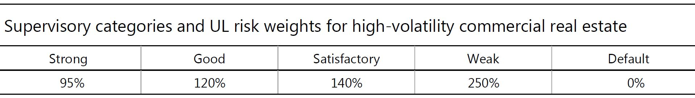
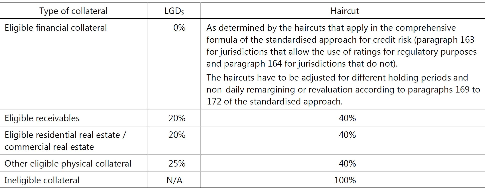
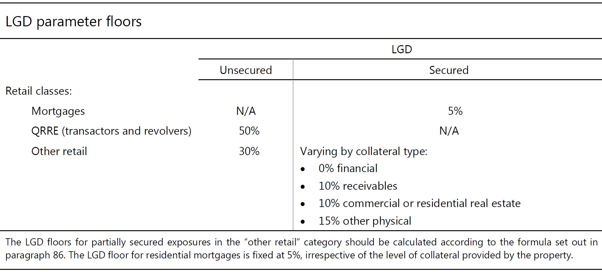

# Internal ratings-based approach for credit risk
## A. Overview
1. This section describes the IRB approach for credit risk. Subject to certain minimum conditions and disclosure requirements, banks that have received supervisory approval to use the IRB approach may rely on their own internal estimates of risk components in determining the capital requirement for a given exposure. The risk components include measures of the probability of default (PD), loss given default (LGD), the exposure at default (EAD), and effective maturity (M). In some cases, banks may be required to use a supervisory value as opposed to an internal estimate for one or more of the risk components.
2. The IRB approach is based on measures of unexpected losses (UL) and expected losses (EL). The risk-weight functions produce capital requirements for the UL portion. Expected losses are treated separately, as outlined in paragraph 43 of the Basel II framework (June 2006)1 and Section G below.
3. In this section, the asset classes are defined first. Adoption of the IRB approach across asset classes is also discussed early in this section. The risk components, each of which is defined later in this section, serve as inputs to the risk-weight functions that have been developed for separate asset classes. For example, there is a risk-weight function for corporate exposures and another one for qualifying revolving retail exposures. The treatment of each asset class begins with a presentation of the relevant risk-weight function(s) followed by the risk components and other relevant factors, such as the treatment of credit risk mitigants. The legal certainty standards for recognising CRM as set out in paragraphs 117 to 205 of the standardised approach apply for both the foundation and advanced IRB approaches. The minimum requirements that banks must satisfy to use the IRB approach are presented at the end of this section starting at Section H, paragraph 154.

1. このセクションでは、信用リスクに関するIRBのアプローチについて述べる。 IRBアプローチを使用する監督上の承認を受けた銀行は、特定の最低条件および開示要件を条件として、リスク要素の自己評価に依存して、特定のエクスポージャーの資本要件を決定する可能性がある。リスク要素には、デフォルト確率（PD）、デフォルト時損失（LGD）、デフォルト時エクスポージャー（EAD）、および有効満期（M）の尺度が含まれる。場合によっては、銀行は、1つ以上のリスク要素の内部見積もりとは対照的に監督上の価値を使用することを要求されることがあります。
2. IRBのアプローチは、予期しない損失（UL）および予想損失（EL）の尺度に基づいている。リスク加重関数は、UL部分の資本要件を生成する。期待損失は、バーゼルⅡの枠組み（2006年6月）1および下記セクションGのパラグラフ43で概説されているように、個別に扱われる。
3. このセクションでは、資産クラスが最初に定義されます。資産クラス全体にわたるIRBアプローチの採用についても、このセクションの早期で論じる。このセクションの後半で定義されるリスク要素は、個別の資産クラス用に開発されたリスク加重関数へのインプットとして役立ちます。例えば、企業エクスポージャーにはリスクウェイト機能があり、適格リバイバルエクスポージャーにはもう一つのリスクウェイト機能があります。各資産クラスの処理は、関連するリスク加重関数（複数可）の後にリスク要素と、信用リスク緩和策の処理などのその他の関連要因の提示から始まります。標準化アプローチのパラグラフ117から205に記載されているCRMを認識するための法的確実性基準は、基礎的IRBアプローチと高度IRBアプローチの両方に適用されます。 IRBアプローチを使用するために銀行が満たさなければならない最低限の要件は、セクションHのパラグラフ154で始まるこのセクションの最後に記載されています。

## B. Mechanics of the IRB approach
4. In Section 1 that follows, the asset classes (eg corporate exposures and retail exposures) eligible for the IRB approach are defined. Section 2 provides a description of the risk components to be used by banks by asset class. Section 3 discusses a bank’s adoption of the IRB approach at the asset class level and the related roll-out requirements. In cases where an IRB treatment is not specified, the risk weight for those other exposures is 100%, except when a 0% risk weight applies under the standardised approach, and the resulting risk-weighted assets are assumed to represent UL only.

4. 以下のセクション1では、IRBアプローチに適格な資産クラス（企業エクスポージャーおよびリテールエクスポージャーなど）が定義されています。 セクション2は、資産クラス別に銀行が使用するリスク要素の記述を提供する。 第3節では、銀行が資産クラス・レベルでのIRBアプローチの採用および関連する公開要件について説明する。 IRBの扱いが規定されていない場合、標準化されたアプローチでリスクウェイト0％が適用される場合を除き、他のエクスポージャーのリスクウェイトは100％であり、結果として生じるリスク加重資産はULのみを表すものとみなされます。

### 1. Categorisation of exposures
5. Under the IRB approach, banks must categorise banking-book exposures into broad classes of assets with different underlying risk characteristics, subject to the definitions set out below. The classes of assets are (a) corporate, (b) sovereign, (c) bank, (d) retail, and (e) equity. Within the corporate asset class, five sub-classes of specialised lending are separately identified. Within the retail asset class, three sub-classes are separately identified. Within the corporate and retail asset classes, a distinct treatment for purchased receivables may also apply provided certain conditions are met. For the equity asset class the IRB approach is not permitted, as outlined further below.

5. IRBのアプローチの下で、銀行は、銀行勘定のエクスポージャーを、下に示す定義に従って、異なるリスク特性を持つ幅広い種類の資産に分類しなければならない。 資産クラスは、（a）企業、（b）ソブリン、（c）銀行、（d）小売、（e）資本である。 企業資産クラスでは、5つのサブクラスの特別貸出が個別に識別されます。 小売資産クラス内では、3つのサブクラスが個別に識別されます。 コーポレートおよびリテールの資産クラスでは、一定の条件が満たされている場合には、購入債権の明確な扱いが適用されることもあります。 エクイティ・アセット・クラスについては、以下に概説するように、IRBのアプローチは認められていない。

6. The classification of exposures in this way is broadly consistent with established bank practice. However, some banks may use different definitions in their internal risk management and measurement systems. While it is not the intention of the Committee to require banks to change the way in which they manage their business and risks, banks are required to apply the appropriate treatment to each exposure for the purposes of deriving their minimum capital requirement. Banks must demonstrate to supervisors that their methodology for assigning exposures to different classes is appropriate and consistent over time.
7. For the treatment of securitisation exposures, see the Committee’s Revisions to the securitisation framework.2
(i) Definition of corporate exposures
8. In general, a corporate exposure is defined as a debt obligation of a corporation, partnership, or proprietorship. Banks are permitted to distinguish separately exposures to small- and medium-sized entities (SME), as defined in paragraph 54.
9. In addition to general corporates, within the corporate asset class, five sub-classes of specialised lending (SL) are identified. Such lending possesses all the following characteristics, either in legal form or economic substance:
• The exposure is typically to an entity (often a special purpose entity (SPE)) which was created specifically to finance and/or operate physical assets;
• The borrowing entity has little or no other material assets or activities, and therefore little or no independent capacity to repay the obligation, apart from the income that it receives from the asset(s) being financed;
• The terms of the obligation give the lender a substantial degree of control over the asset(s) and the income that it generates; and
• As a result of the preceding factors, the primary source of repayment of the obligation is the income generated by the asset(s), rather than the independent capacity of a broader commercial enterprise.
10. The five sub-classes of specialised lending (SL) are project finance, object finance, commodities finance, income-producing real estate, and high-volatility commercial real estate. Each of these sub-classes is defined below.
Project finance
11. Project finance (PF) is a method of funding in which the lender looks primarily to the revenues generated by a single project, both as the source of repayment and as security for the exposure. This type of financing is usually for large, complex and expensive installations that might include, for example, power plants, chemical processing plants, mines, transportation infrastructure, environment, and telecommunications infrastructure. Project finance may take the form of financing of the construction of a new capital installation, or refinancing of an existing installation, with or without improvements.

6. このようなエクスポージャーの分類は、確立された銀行慣行と概ね一致している。しかし、一部の銀行は、内部リスク管理および測定システムにおいて異なる定義を使用することがあります。銀行が業務やリスクの管理方法を変更することを銀行に求めることは委員会の意図ではないが、最低限の資本要件を導出する目的で、銀行は各エクスポージャーに適切な処置を適用する必要がある。銀行は、異なるクラスにエクスポージャーを割り当てるための方法論が、時間の経過とともに適切かつ一貫していることを監督者に実証しなければならない。
7. 証券化エクスポージャーの処理については、証券化枠組みの改訂を参照。
#### （i）企業エクスポージャーの定義
  8. 一般的に、企業エクスポージャーは、法人、パートナーシップ、または所有権の債務として定義される。銀行は、パラグラフ54で定義されているように、個別にエクスポージャーを中小企業（SME）と区別することが認められている。
  9. 一般的な法人に加えて、企業資産クラス内では、5つのサブクラスの専門融資（SL）が特定されている。かかる貸付は、法的形式または経済的実体のいずれかにおいて、以下のすべての特性を有する。
    - エクスポージャーは、通常、物的資産の資金調達および/または運営のために特別に作成されたエンティティ（多くの場合、特別目的事業体（SPE））である。
    - 借入事業体は、その他の重要な資産または活動をほとんどまたは全く持たないため、借入金から返済する独立した能力はほとんどありません。
    - 義務の条件により、貸し手は、資産およびそれが生み出す収益を実質的に支配することができます。そして
    - 上記の要因の結果、債務の返済の主要な源泉は、より広範な商業企業の独立した能力ではなく、資産によって生み出される収益である。
  10. 専門融資（SL）の5つのサブクラスは、プロジェクトファイナンス、オブジェクトファイナンス、コモディティファイナンス、所得生産不動産、および高変動性商業用不動産である。これらのサブクラスのそれぞれを以下に定義します。
##### プロジェクトファイナンス
11. プロジェクト・ファイナンス（PF）は、貸し手が、返済の元本とエクスポージャーの保証の両方として、単一のプロジェクトによって生み出された収益を主に検討する資金調達の方法です。この種の資金調達は、通常、発電所、化学プラント、鉱山、輸送インフラストラクチャ、環境、通信インフラなどの大規模で複雑で高価な設備に適用されます。プロジェクトファイナンスは、新しい資本設備の建設、または既存の設備の借り換えの資金調達の形態をとることができます。

12. In such transactions, the lender is usually paid solely or almost exclusively out of the money generated by the contracts for the facility’s output, such as the electricity sold by a power plant. The borrower is usually an SPE that is not permitted to perform any function other than developing, owning, and operating the installation. The consequence is that repayment depends primarily on the project’s cash flow and on the collateral value of the project’s assets. In contrast, if repayment of the exposure depends primarily on a well-established, diversified, credit-worthy, contractually obligated end user for repayment, it is considered a secured exposure to that end-user.

12. そのような取引では、貸し手は通常、発電所で売却された電力など、施設の生産契約によって生み出された金額の唯一の、またはほぼ独占的な支払いを受ける。 借り手は通常、SPEであり、インストールの開発、所有、運用以外の機能は実行できません。 その結果、返済額は主にプロジェクトのキャッシュフローとプロジェクト資産の担保価値に依存します。 対照的に、エクスポージャーの返済が主に、十分に確立され、多様化し、信用価値があり、契約上義務付けられたエンドユーザーの返済に依存する場合、そのエンドユーザーに対する保護されたエクスポージャーとみなされます。

Object finance
13. Object finance (OF) refers to a method of funding the acquisition of physical assets (eg ships, aircraft, satellites, railcars, and fleets) where the repayment of the exposure is dependent on the cash flows generated by the specific assets that have been financed and pledged or assigned to the lender. A primary source of these cash flows might be rental or lease contracts with one or several third parties. In contrast, if the exposure is to a borrower whose financial condition and debt-servicing capacity enables it to repay the debt without undue reliance on the specifically pledged assets, the exposure should be treated as a collateralised corporate exposure.
Commodities finance
14. Commodities finance (CF) refers to structured short-term lending to finance reserves, inventories, or receivables of exchange-traded commodities (eg crude oil, metals, or crops), where the exposure will be repaid from the proceeds of the sale of the commodity and the borrower has no independent capacity to repay the exposure. This is the case when the borrower has no other activities and no other material assets on its balance sheet. The structured nature of the financing is designed to compensate for the weak credit quality of the borrower. The exposure’s rating reflects its self-liquidating nature and the lender’s skill in structuring the transaction rather than the credit quality of the borrower.
15. The Committee believes that such lending can be distinguished from exposures financing the reserves, inventories, or receivables of other more diversified corporate borrowers. Banks are able to rate the credit quality of the latter type of borrowers based on their broader ongoing operations. In such cases, the value of the commodity serves as a risk mitigant rather than as the primary source of repayment.
Income-producing real estate
16. Income-producing real estate (IPRE) refers to a method of providing funding to real estate (such as, office buildings to let, retail space, multifamily residential buildings, industrial or warehouse space, and hotels) where the prospects for repayment and recovery on the exposure depend primarily on the cash flows generated by the asset. The primary source of these cash flows would generally be lease or rental payments or the sale of the asset. The borrower may be, but is not required to be, an SPE, an operating company focused on real estate construction or holdings, or an operating company with sources of revenue other than real estate. The distinguishing characteristic of IPRE versus other corporate exposures that are collateralised by real estate is the strong positive correlation between the prospects for repayment of the exposure and the prospects for recovery in the event of default, with both depending primarily on the cash flows generated by a property.
High-volatility commercial real estate
17. High-volatility commercial real estate (HVCRE) lending is the financing of commercial real estate that exhibits higher loss rate volatility (ie higher asset correlation) compared to other types of SL. HVCRE includes:
• Commercial real estate exposures secured by properties of types that are categorised by the national supervisor as sharing higher volatilities in portfolio default rates;
• Loans financing any of the land acquisition, development and construction (ADC) phases for properties of those types in such jurisdictions; and
• Loans financing ADC of any other properties where the source of repayment at origination of the exposure is either the future uncertain sale of the property or cash flows whose source of repayment is substantially uncertain (eg the property has not yet been leased to the occupancy
56 Basel III: Finalising post-crisis reforms
rate prevailing in that geographic market for that type of commercial real estate), unless the borrower has substantial equity at risk. Commercial ADC loans exempted from treatment as HVCRE loans on the basis of certainty of repayment of borrower equity are, however, ineligible for the additional reductions for SL exposures described in paragraph 58.
18. Where supervisors categorise certain types of commercial real estate exposures as HVCRE in their jurisdictions, they are required to make public such determinations. Other supervisors need to ensure that such treatment is then applied equally to banks under their supervision when making such HVCRE loans in that jurisdiction.

##### オブジェクトファイナンス
13. オブジェクト・ファイナンス（OF）とは、エクスポージャーの返済が特定の資産によって生み出されたキャッシュ・フローに依存する物理的資産（船舶、航空機、衛星、鉄道車両、艦隊など）の取得に資金を供給する方法をいう。担保に供され、担保に供されているか貸し手に割り当てられている。これらのキャッシュ・フローの主要な源泉は、1つまたは複数の第三者との賃貸またはリース契約である可能性があります。対照的に、エクスポージャーが財務状態と債務返済能力により債務返済が可能な借入人に対するものである場合、借り手は担保付企業のエクスポージャーとして扱われるべきである。
##### コモディティファイナンス
14. コモディティ・ファイナンス（CF）は、売買代金から返済される為替商品（原油、金属、または作物など）の準備金、棚卸資産、または受取債権を調達するための構造化短期貸付を指す借り手には、エクスポージャーを返済する独立した能力はありません。これは、借り手が他の活動がなく、貸借対照表にその他の重要な資産がない場合です。融資の構造化された性質は、借り手の弱い信用度を補うように設計されています。エクスポージャーの格付けは、自己払い戻しの性質と、借り手の信用度よりも取引を構造化する貸し手のスキルを反映している。
15. 当委員会は、このような貸付は、他のより多様化した企業借入人の準備金、棚卸資産、または受取債権を賄うエクスポージャーと区別することができると考えている。銀行は、より広範な進行中の業務に基づいて、後者のタイプの借り手の信用度を評価することができます。そのような場合、商品の価値は、主な返済源ではなくリスク緩和剤として役立ちます。
所得を生む不動産
16. 所得生産用不動産（IPRE）とは、不動産（事務所ビル、小売スペース、多世帯住宅、工業用または倉庫スペース、ホテルなど）に資金を提供する方法で、返済見込みエクスポージャーの回収は、主に資産によって生み出されるキャッシュフローに依存する。これらのキャッシュフローの主要な源泉は、通常、リース料または賃貸料、または資産の売却である。借り手は、SPE、不動産建設または保有に重点を置く事業会社、または不動産以外の収入源を有する事業会社であってもよいが、必須である必要はない。 IPREの特徴と不動産担保付の他の企業エクスポージャーの特徴は、エクスポージャーの返済見通しと債務不履行発生時の回復見通しとの間に強い正の相関関係があります。プロパティ。
高揮発性商業用不動産
17. 高変動性商業用不動産（HVCRE）貸付は、他の種類のSLと比較して損失率の変動性が高い（すなわち資産の相関が高い）商業用不動産の融資である。 HVCREには以下が含まれます：
- ポートフォリオのデフォルト率でより高いボラティリティを共有するとして国家監督当局によって分類されるタイプのプロパティによって保証される商業用不動産エクスポージャー。
- そのような管轄区域における土地の取得、開発、建設（ADC）段階のいずれかの財産の財務に関する融資。そして
- エクスポージャー発生時の返済源が不動産の将来の不確実な売却または返済源が実質的に不確実なキャッシュフロー（例えば、不動産がまだ入居にリースされていない
56バーゼルIII：危機後の改革を終結させる
そのタイプの商業用不動産の地理的市場で一般的な利率）である。しかし、借手資本の返済の確実性に基づいてHVCREローンとして扱われる商業ADCローンは、パラグラフ58で説明されているSLエクスポージャーの追加的な削減には適格ではない。
18. 監督当局が特定の種類の商業用不動産エクスポージャーをHVCREとして管轄区域に分類する場合、監督者はそのような決定を公表する必要がある。他の監督当局は、その管轄区域でそのようなHVCRE融資を行う際に、監督下の銀行に同様の扱いが適用されることを保証する必要があります。

(ii) Definition of sovereign exposures
19. This asset class covers all exposures to counterparties treated as sovereigns under the standardised approach. This includes sovereigns (and their central banks), certain PSEs identified as sovereigns in the standardised approach, MDBs that meet the criteria for a 0% risk weight and referred to in footnote 11 of the standardised approach, and the entities referred to in paragraph 10 of the standardised approach. The treatment of sovereign exposures is unchanged from the Basel II framework (June 2006).
(iii) Definition of bank exposures
20. This asset class covers exposures to banks as defined in paragraph 16 of the standardised approach for credit risk and those securities firms and other financial institutions set out in paragraph 37 of the standardised approach for credit risk that are treated as exposures to banks. Bank exposures also include claims on all domestic PSEs that are not treated as exposures to sovereigns under the standardised approach, and MDBs that do not meet the criteria for a 0% risk weight under the standardised approach (ie MDBs that are not listed in footnote 11 of the standardised approach).
(iv) Definition of retail exposures
21. An exposure is categorised as a retail exposure if it meets all of the following criteria:
Nature of borrower or low value of individual exposures
• Exposures to individuals – such as revolving credits and lines of credit (eg credit cards, overdrafts, and retail facilities secured by financial instruments) as well as personal term loans and leases (eg instalment loans, auto loans and leases, student and educational loans, personal finance, and other exposures with similar characteristics) – are generally eligible for retail treatment regardless of exposure size, although supervisors may wish to establish exposure thresholds to distinguish between retail and corporate exposures.
• Residential mortgage loans3 (including first and subsequent liens, term loans and revolving home equity lines of credit) are eligible for retail treatment regardless of exposure size so long as the credit is:
(i) an exposure to an individual;4 or
(ii) an exposure to associations or cooperatives of individuals that are regulated under national law and exist with the only purpose of granting its members the use of a primary residence in the property securing the loan.
• Loans extended to small businesses and managed as retail exposures are eligible for retail treatment provided the total exposure of the banking group to a small business borrower (on a consolidated basis where applicable) is less than €1 million. Small business loans extended through or guaranteed by an individual are subject to the same exposure threshold.
• It is expected that supervisors provide flexibility in the practical application of such thresholds such that banks are not forced to develop extensive new information systems simply for the purpose of ensuring perfect compliance. It is, however, important for supervisors to ensure that such flexibility (and the implied acceptance of exposure amounts in excess of the thresholds that are not treated as violations) is not being abused.

#### （ii）ソブリンエクスポージャーの定義
19. この資産クラスは、標準化されたアプローチの下でソブリンとして扱われるカウンターパーティーへのエクスポージャーを対象としている。これには、ソブリン（およびその中央銀行）、標準化アプローチでソブリンとして特定された特定のPSE、標準化されたアプローチの脚注11で言及される0％のリスクウェートの基準を満たすMDB、および第10項標準化されたアプローチのソブリンのエクスポージャーの扱いは、バーゼルⅡの枠組み（2006年6月）と変わらない。
#### （ⅲ）銀行エクスポージャーの定義
20. この資産クラスは、信用リスクに関する標準化アプローチのパラグラフ16で定義された銀行へのエクスポージャーと、銀行へのエクスポージャーとして扱われる信用リスクの標準化アプローチのパラグラフ37に記載の証券会社およびその他の金融機関を対象とする。銀行エクスポージャーには、標準化アプローチでソブリンへのエクスポージャーとして扱われていない国内のPSE、および標準化アプローチでリスク・ウェイト0％の基準を満たさないMDB（すなわち、脚注11に記載されていないMDB標準化されたアプローチの）。
#### （iv）小売エクスポージャーの定義
21. 曝露は、以下の基準のすべてを満たす場合、小売曝露に分類される。
借り手の性質または個々のエクスポージャーの価値が低い
- 個人向けエクスポージャー（例えば、クレジットカード、当座貸越、および金融商品で担保された小売施設）ならびに個人向けの長期貸付およびリース（例えば、割賦ローン、自動車ローンおよびリース、学生および教育ローン個人財務およびその他類似の特性を有するエクスポージャー）は、通常、エクスポージャーの大きさにかかわらず、小売業務に適格であるが、小売業者と企業のエクスポージャーを区別するためのエクスポージャー・スレッショルドを設定することが望ましい。
- 住宅モーゲージ・ローン3（初回以降の抵当権、ターム・ローンおよびリボルビング・ホーム・エクイティ・ラインの信用枠を含む）は、信用度が以下の場合、エクスポージャー・サイズに関係なく、
  - （i）個人への暴露;または
  - （ii）国内法に基づいて規制されている個人の団体または協同組合へのエクスポージャー。ローンを保証する不動産のプライマリ・レジデンスの使用を会員に認める唯一の目的で存在する。
- 中小企業向け貸出金（該当する場合には連結ベース）は、100万ユーロ未満であることを条件として、小規模企業向けローンおよび小売エクスポージャーの小売業務への適格性を考慮して管理されている。 個人によって延長された、または保証された中小企業向けローンは、同じエクスポージャー・スレッショルドの対象となります。
- 監督当局は、銀行が完璧なコンプライアンスを保証する目的で広範な新しい情報システムを開発するよう強制されないように、そのような閾値の実際の適用に柔軟性を提供することが期待される。 しかし、監督当局にとって、そのような柔軟性（および違反として扱われない閾値を超えたエクスポージャーの受け入れが濫用されていないこと）を確実にすることが重要です。

Large number of exposures
22. The exposure must be one of a large pool of exposures, which are managed by the bank on a pooled basis.
• Small business exposures below €1 million may be treated as retail exposures if the bank treats such exposures in its internal risk management systems consistently over time and in the same manner as other retail exposures. This requires that such an exposure be originated in a similar manner to other retail exposures. Furthermore, it must not be managed individually in a way comparable to corporate exposures, but rather as part of a portfolio segment or pool of exposures with similar risk characteristics for purposes of risk assessment and quantification. However, this does not preclude retail exposures from being treated individually at some stages of the risk management process. The fact that an exposure is rated individually does not by itself deny the eligibility as a retail exposure.
23. Within the retail asset class category, banks are required to identify separately three sub-classes of exposures: (a) residential mortgage loans, as defined above, (b) qualifying revolving retail exposures, as defined in the following paragraph, and (c) all other retail exposures.

##### 多数のエクスポージャー
22. エクスポージャーは、エクスポージャーの大きなプールの1つでなければならず、エクスポージャーはプールベースで銀行によって管理されます。
- 銀行が内部リスク管理システムでこのようなエクスポージャーを、一貫して他の小売エクスポージャーと同じ方法で処理する場合、100万ユーロ未満の中小企業エクスポージャーはリテールエクスポージャーとして扱うことができます。このようなエクスポージャーは、他の小売エクスポージャーと同様の方法で発生する必要があります。さらに、企業エクスポージャーに匹敵する方法で個別に管理するのではなく、リスクアセスメントおよび定量化の目的で同様のリスク特性を持つポートフォリオセグメントまたはエクスポージャープールの一部として管理する必要があります。しかし、これは、小売エクスポージャーがリスク管理プロセスのいくつかの段階で個別に取り扱われることを排除するものではありません。暴露が個別に評価されるという事実は、それ自体が小売の曝露としての適格性を否定するものではない。

23. 銀行は、以下の3つのサブ・クラスのエクスポージャーを別々に識別することが要求されている。（a）上記で定義された住宅モーゲージ・ローン、（b）以下のパラグラフで定義される適格リボルビング・リテール・エクスポージャー、 c）その他すべての小売エクスポージャー。

(v) Definition of qualifying revolving retail exposures
24. All of the following criteria must be satisfied for a sub-portfolio to be treated as a qualifying revolving retail exposure (QRRE). These criteria must be applied at a sub-portfolio level consistent with the bank’s segmentation of its retail activities generally. Segmentation at the national or country level (or below) should be the general rule.
(a) The exposures are revolving, unsecured, and uncommitted (both contractually and in practice). In this context, revolving exposures are defined as those where customers’ outstanding balances are permitted to fluctuate based on their decisions to borrow and repay, up to a limit established by the bank.
(b) The exposures are to individuals.
(c) The maximum exposure to a single individual in the sub-portfolio is €100,000 or less.
(d) Because the asset correlation assumptions for the QRRE risk-weight function are markedly below those for the other retail risk-weight function at low PD values, banks must demonstrate that the use of the QRRE risk-weight function is constrained to portfolios that have exhibited low volatility of loss rates, relative to their average level of loss rates, especially within the low PD bands. Supervisors will review the relative volatility of loss rates across the QRRE subportfolios, as well as the aggregate QRRE portfolio, and intend to share information on the typical characteristics of QRRE loss rates across jurisdictions.
(e) Data on loss rates for the sub-portfolio must be retained in order to allow analysis of the volatility of loss rates.
58 Basel III: Finalising post-crisis reforms
(f) The supervisor must concur that treatment as a qualifying revolving retail exposure is consistent with the underlying risk characteristics of the sub-portfolio.
25. The QRRE sub-class is split into exposures to transactors and revolvers. A QRRE transactor is an exposure to an obligor that meets the definition set out in paragraph 56 of the standardised approach. That is, the exposure is to an obligor in relation to a facility such as credit card or charge card where the balance has been repaid in full at each scheduled repayment date for the previous 12 months, or the exposure is in relation to an overdraft facility if there have been no drawdowns over the previous 12 months. All exposures that are not QRRE transactors are QRRE revolvers.

#### （v）適格リボルビング・リテール・エクスポージャーの定義
24. 適格リボルビング・リテール・エクスポージャー（QRRE）として扱われるサブポートフォリオについては、以下の基準のすべてが満たされなければならない。これらの基準は、一般的な小売活動の銀行セグメンテーションと整合的なサブポートフォリオ・レベルで適用されなければならない。国レベルまたは国レベル（またはそれ以下）でのセグメンテーションは一般的なルールである必要があります。
- （a）エクスポージャーは、リボルビング、無担保、コミットされていない（契約上も実務上も）。このような状況において、リボルビングエクスポージャーは、顧客の未払残幅が、借り入れおよび返済の決定に基づいて、銀行によって設定された限度まで変動することが許されるものとして定義される。
- （b）被ばくは個人に対するものである。
- （c）サブポートフォリオにおける1人の個人への最大エクスポージャーは€100,000以下です。
- （d）QRREリスクウェート機能の資産相関の仮定は、低いPD値の他のリテールリスクウェイト機能の資産相関仮定よりも著しく低いため、QRREリスクウェート機能の使用は、ポートフォリオに制約されていることを証明しなければならない低PD帯域内での損失率の平均レベルと比較して、損失率の低い変動性を示しています。監督当局は、QRREサブポートフォリオ全体の損失率とQRREポートフォリオ全体の相対的なボラティリティをレビューし、管轄区域にわたるQRRE損失率の典型的な特性に関する情報を共有するつもりである。
- （e）損失率の変動性を分析するために、サブポートフォリオの損失率に関するデータを保持する必要があります。
58バーゼルIII：危機後の改革を終結させる
- （f）監督当局は、対象となるリボルビング・リテールのエクスポージャーとしての取り扱いが、サブ・ポートフォリオの潜在的リスク特性と一致することに同意しなければならない。
QRREサブクラスは、取引者とリボルバーのエクスポージャーに分割されている。 QRRE取引業者は、標準化されたアプローチのパラグラフ56に定められた定義を満たす債務者へのエクスポージャーです。つまり、クレジットカードやチャージカードのように過去12ヶ月間の返済期日ごとに残高が全額返済された場合、または当座貸越の場合はエクスポージャーが債務者に支払われる過去12ヶ月間に引き落としが行われていない場合。 QRREトランザクションではないエクスポージャーはすべてQRREリボルバーです。

(vi) Definition of equity exposures
26. This asset class covers exposures to equities as defined in paragraph 49 of the standardised approach for credit risk.
(vii) Definition of eligible purchased receivables
27. Eligible purchased receivables are divided into retail and corporate receivables as defined below.
Retail receivables
28. Purchased retail receivables, provided the purchasing bank complies with the IRB rules for retail exposures, are eligible for the top-down approach as permitted within the existing standards for retail exposures. The bank must also apply the minimum operational requirements as set forth in Sections F and H.
Corporate receivables
29. In general, for purchased corporate receivables, banks are expected to assess the default risk of individual obligors as specified in Section C.1 (starting with paragraph 52) consistent with the treatment of other corporate exposures. However, the top-down approach may be used, provided that the purchasing bank’s programme for corporate receivables complies with both the criteria for eligible receivables and the minimum operational requirements of this approach. The use of the top-down purchased receivables treatment is limited to situations where it would be an undue burden on a bank to be subjected to the minimum requirements for the IRB approach to corporate exposures that would otherwise apply. Primarily, it is intended for receivables that are purchased for inclusion in asset-backed securitisation structures, but banks may also use this approach, with the approval of national supervisors, for appropriate on-balance sheet exposures that share the same features.
30. Supervisors may deny the use of the top-down approach for purchased corporate receivables depending on the bank’s compliance with minimum requirements. In particular, to be eligible for the proposed ‘top-down’ treatment, purchased corporate receivables must satisfy the following conditions:
• The receivables are purchased from unrelated, third party sellers, and as such the bank has not originated the receivables either directly or indirectly.
Basel III: Finalising post-crisis reforms 59
• The receivables must be generated on an arm’s-length basis between the seller and the obligor. (As such, intercompany accounts receivable and receivables subject to contra-accounts between firms that buy and sell to each other are ineligible.5)
• The purchasing bank has a claim on all proceeds from the pool of receivables or a pro-rata interest in the proceeds.6
• National supervisors must also establish concentration limits above which capital charges must be calculated using the minimum requirements for the bottom-up approach for corporate exposures. Such concentration limits may refer to one or a combination of the following measures: the size of one individual exposure relative to the total pool, the size of the pool of receivables as a percentage of regulatory capital, or the maximum size of an individual exposure in the pool.
31. The existence of full or partial recourse to the seller does not automatically disqualify a bank from adopting this top-down approach, as long as the cash flows from the purchased corporate receivables are the primary protection against default risk as determined by the rules in paragraphs 132 to 135 for purchased receivables and the bank meets the eligibility criteria and operational requirements.

#### （vi）株式エクスポージャーの定義
26. この資産クラスは、信用リスクに関する標準化されたアプローチのパラグラフ49で定義されている株式へのエクスポージャーを対象とする。
#### （vii）適格購入済債権の定義
27. 適格購入債権は、以下に定義するとおり、小売債権および企業債権に分割される。
##### リテール債権
28. 購買銀行が小売エクスポージャーに関するIRB規則を遵守していれば、購入した小売債権は、小売エクスポージャーの既存の基準内で許可されているように、トップダウンアプローチの対象となる。また、銀行は、セクションFおよびHに記載されている最低限の運用要件を適用する必要があります。
##### 法人債権
29. 一般に、購入された企業債権については、他の企業エクスポージャーの処理と整合するC.1項（第52項から始まる）に規定されている個々の債務者のデフォルトリスクを評価することが期待される。しかし、買収銀行の企業向け債権プログラムは、適格債権の基準とこのアプローチの最低運用要件の両方を遵守している限り、トップダウン手法を使用することができます。トップダウンで売却された債権処理の使用は、そうでなければ適用される企業エクスポージャーに対するIRBアプローチの最低要件を課される銀行に過度の負担となる状況に限定されている。主に、資産担保証券化構造に含めるために購入された債権を対象としていますが、銀行は同様の特徴を有する適切なオンバランスシートエクスポージャーについて、国家監督当局の承認を得てこのアプローチを使用することもあります。
30. 監督当局は、銀行が最低限の要件を満たしているかどうかに応じて、購入した企業債権についてトップダウン・アプローチを使用することを拒否することができる。特に、提案された「トップダウン」処理の対象となるためには、購入済みの企業債権は以下の条件を満たす必要があります。
- 債権は無関係な第三者の売り手から購入されるため、直接または間接的に債権を発行していない。
バーゼルIII：危機後の改革の終結59
- 債権は、売り手と債務者の間で、腕の長さに基づいて生成されなければならない。 （したがって、相互に売買する企業間の対価勘定に基づく内部売上債権および未収金は資格がない.5）
- 購入銀行は、債権プールからのすべての収入または収入の比例持分を請求しています。
- 国家監督当局は、企業エクスポージャーのボトムアップアプローチの最低要件を用いて、資本費用を計算する必要がある濃度限度を設定する必要があります。そのような集中制限は、以下の措置の1つまたは組み合わせを指してもよい：総プールに対する1つの個別エクスポージャーのサイズ、規制資本のパーセンテージとしての債権プールのサイズ、または個々のエクスポージャーの最大サイズプール。
31. 売却者に対する完全または部分的遡及義務の存在は、購入した企業債権からのキャッシュフローがデフォルトリスクに対する一次的な保護である限り、銀行がこのトップダウンアプローチを採用することを自動的に不適格にするものではない購入した債権について132〜135パラグラフを発行し、当該銀行は適格基準および業務上の要件を満たしている。

### 2. Foundation and advanced approaches
32. For each of the asset classes covered under the IRB framework, there are three key elements:
• Risk components: estimates of risk parameters provided by banks, some of which are supervisory estimates.
• Risk-weight functions: the means by which risk components are transformed into risk-weighted assets and therefore capital requirements.
• Minimum requirements: the minimum standards that must be met in order for a bank to use the IRB approach for a given asset class.
33. For many of the asset classes, the Committee has made available two broad approaches: a foundation and an advanced approach. Under the foundation approach (F-IRB approach), as a general rule, banks provide their own estimates of PD and rely on supervisory estimates for other risk components. Under the advanced approach (A-IRB approach), banks provide more of their own estimates of PD, LGD and EAD, and their own calculation of M, subject to meeting minimum standards. For both the foundation and advanced approaches, banks must always use the risk-weight functions provided in this Framework for the purpose of deriving capital requirements. The full suite of approaches is described below.
34. For exposures to equities, defined in paragraph 26 above, the IRB approaches are not permitted (see paragraph 42). In addition, the A-IRB approach cannot be used for the following:
(i) Exposures to general corporates belonging to a group with total consolidated annual revenues greater than €500m.
(ii) Exposures in the bank asset class (paragraph 20), and other securities firms and financial institutions (including insurance companies and any other financial institutions in the corporate asset class).
In making the assessment above for the revenue threshold, the amounts must be as reported in the audited financial statements of the corporates or, for corporates that are part of consolidated groups, their consolidated groups (according to the accounting standard applicable to the ultimate parent of the consolidated group). The figures must be based on the average amounts calculated over the prior three years, or on the latest amounts updated every three years by the bank.
(i) Corporate and bank exposures
35. Under the foundation approach, banks must provide their own estimates of PD associated with each of their borrower grades, but must use supervisory estimates for the other relevant risk components. The other risk components are LGD, EAD and M.7
36. Under the advanced approach, banks must calculate the effective maturity (M)8 and provide their own estimates of PD, LGD and EAD.
37. There is an exception to this general rule for the five sub-classes of assets identified as SL.
The SL categories: PF, OF, CF, IPRE and HVCRE
38. Banks that do not meet the requirements for the estimation of PD under the corporate foundation approach for their SL exposures are required to map their internal risk grades to five supervisory categories, each of which is associated with a specific risk weight. This version is termed the ‘supervisory slotting criteria approach’.
39. Banks that meet the requirements for the estimation of PD are able to use the foundation approach to corporate exposures to derive risk weights for all classes of SL exposures except HVCRE. At national discretion, banks meeting the requirements for HVCRE exposure are able to use a foundation approach that is similar in all respects to the corporate approach, with the exception of a separate risk-weight function as described in paragraph 64.
40. Banks that meet the requirements for the estimation of PD, LGD and EAD are able to use the advanced approach to corporate exposures to derive risk weights for all classes of SL exposures except HVCRE. At national discretion, banks meeting these requirements for HVCRE exposure are able to use an advanced approach that is similar in all respects to the corporate approach, with the exception of a separate risk-weight function as described in paragraph 64.

### 2. Foundation and advanced approaches
32. IRBの枠組みに含まれる各資産クラスには、3つの重要な要素があります。
- リスク要素：銀行が提供するリスクパラメータの見積もり。その一部は監督上の見積りである。
- リスクウェイト機能：リスク要素をリスク加重資産、したがって資本要件に変換する手段。
- 最小要件：銀行が特定の資産クラスに対してIRBアプローチを使用するために満たさなければならない最小限の基準。
33. 資産クラスの多くについて、委員会は、基礎的アプローチと先進的アプローチの2つの広いアプローチを利用可能にした。基礎的アプローチ（F-IRBアプローチ）の下では、一般的に、銀行はPDの独自の見積りを提供し、他のリスク要素の監督上の見積りに頼っている。先進的アプローチ（A-IRBアプローチ）では、銀行は最低基準を満たすことを前提として、PD、LGDおよびEADの独自の見積もりとそれ自身のMの計算を提供する。基盤アプローチと先進アプローチの両方について、銀行は、資本要件を導出する目的で、このフレームワークで提供されるリスクウェート機能を常に使用しなければならない。以下に、一連のアプローチについて説明します。
34. 上記26項に定義されている株式へのエクスポージャーについては、IRBアプローチは認められていない（パラグラフ42参照）。さらに、A-IRBアプローチは以下の目的では使用できません。
- （ⅰ）総連結売上高が500百万ユーロを超えるグループに属する一般企業へのエクスポージャー。
- （ⅱ）銀行資産クラス（第20項）およびその他の証券会社および金融機関（保険会社および企業資産クラスの他の金融機関を含む）におけるエクスポージャー。
上記の査定額を収益基準額とする場合、金額は、企業の監査済み財務諸表に記載されているか、または連結グループの一部である企業については、連結グループ（最終的な親会社の会計基準連結グループ）。数値は、過去3年間で計算された平均金額、または銀行が3年ごとに更新した最新の金額に基づいていなければなりません。
#### （ⅰ）企業および銀行エクスポージャー
35. 基礎的アプローチの下では、銀行はそれぞれの借り手の等級に関連するPDの独自の見積もりを提供しなければならないが、他の関連するリスク要素の監督上の見積りを使用しなければならない。その他のリスク要素はLGD、EAD、M.7
36. 先進的なアプローチでは、銀行は有効満期（M）8を計算し、PD、LGDおよびEADの独自の見積りを提供しなければならない。
37. SLとして識別された資産の5つのサブクラスについてのこの一般規則に対する例外がある。
##### SLカテゴリ：PF、OF、CF、IPREおよびHVCRE
38. SLエクスポージャーのための企業基盤アプローチの下でPDの見積りの要件を満たさない銀行は、内部リスクグレードを特定のリスクウェートに関連する5つの監督カテゴリーにマッピングする必要がある。このバージョンは、「監督スロッティング基準アプローチ」と呼ばれています。
39. PDの見積りの要件を満たす銀行は、HVCREを除くすべてのクラスのSLエクスポージャーのリスクウエートを導出するために、企業エクスポージャーに対する基礎アプローチを使用することができる。国の裁量で、HVCREエクスポージャーの要件を満たす銀行は、パラグラフ64で説明した別個のリスクウェート機能を除いて、企業アプローチにすべての点で似ている基礎アプローチを使用することができる。
40. PD、LGDおよびEADの見積り要件を満たす銀行は、HVCREを除くすべてのクラスのSLエクスポージャーのリスクウエートを導出するために、企業エクスポージャーに対する高度なアプローチを使用することができます。国の裁量で、HVCREエクスポージャーに関するこれらの要件を満たす銀行は、パラグラフ64で説明されている別個のリスクウェート機能を除いて、企業アプローチへのあらゆる点で同様の先進的アプローチを使用することができる。

(ii) Retail exposures
41. For retail exposures, banks must provide their own estimates of PD, LGD and EAD. There is no foundation approach for this asset class.
(iii) Equity exposures
42. All equity exposures are subject to the standardised approach set out in paragraph 509 of the standardised approach for credit risk, with the exception of equity investments in funds that are subject to the requirements set out in the standard published by the Basel Committee in December 2013.10
(iv) Eligible purchased receivables
43. The treatment potentially straddles two asset classes. For eligible corporate receivables, both a foundation and advanced approach are available subject to certain operational requirements being met. As noted in paragraph 29, for corporate purchased receivables banks are in general expected to assess the default risk of individual obligors. The bank may use the A-IRB treatment for purchased corporate receivables (paragraphs 134 and 135) only for exposures to individual corporate obligors that are eligible for the A-IRB approach according to paragraph 34. Otherwise, the F-IRB treatment for purchased corporate receivables should be used. For eligible retail receivables, as with the retail asset class, only the A-IRB approach is available.

#### （ii）リテール・エクスポージャー
41. 小売エクスポージャーについては、銀行はPD、LGDおよびEADのそれ自体の見積りを提供しなければならない。この資産クラスには、基礎的なアプローチはありません。
#### （ⅲ）株式エクスポージャー
42. すべての株式エクスポージャーは、12月にバーゼル委員会が公表した基準に定められている資金への株式投資を除いて、信用リスクの標準化アプローチのパラグラフ509に規定された標準化されたアプローチの対象となる2013.10
#### （iv）購入可能債権
この治療法は、2つの資産クラスに跨る可能性がある。適格企業債権については、一定の運用要件が満たされれば、基礎的アプローチと高度なアプローチの両方が利用可能である。 29項に記載されているように、法人購入債権については、銀行は一般的に個々の債務者の債務不履行リスクを評価することが期待されている。銀行は、第34項のA-IRBアプローチの対象となる個々の企業債務者へのエクスポージャーについてのみ、購入した企業債権についてA-IRB処理を使用することができる（パラグラフ134および135）。そうでなければ、購入した企業債権を使用すべきである。適格小売債権については、小売資産クラスと同様に、A-IRBアプローチのみが利用可能である。

3. Adoption of the IRB approach for asset classes
44. Once a bank adopts an IRB approach for part of its holdings within an asset class, it is expected to extend it across all holdings within that asset class. In this context, the relevant assets classes are as follows:
• Banks
• Corporates (excluding specialised lending and purchased receivables)
• Specialised lending
• Corporate purchased receivables
• Qualifying revolving retail exposures
• Retail residential mortgages
• Other retail (excluding purchased receivables)
• Retail purchased receivables
The Committee recognises however, that, for many banks, it may not be practicable for various reasons to implement the IRB approach for an entire asset class across all business units at the same time. Furthermore, once on IRB, data limitations may mean that banks can meet the standards for the use of own estimates of LGD and EAD for some but not all of their exposures within an asset classes at the same time (for example, exposures that are in the same asset class, but are in different business units).
45. As such, supervisors may allow banks to adopt a phased rollout of the IRB approach across an asset class. The phased rollout includes: (i) adoption of IRB across the asset class within the same business unit; (ii) adoption of IRB for the asset class across business units in the same banking group; and (iii) move from the foundation approach to the advanced approach for certain risk components where use of the advanced approach is permitted. However, when a bank adopts an IRB approach for an asset class within a particular business unit, it must apply the IRB approach to all exposures within that asset class in that unit.
46. If a bank intends to adopt an IRB approach to an asset class, it must produce an implementation plan, specifying to what extent and when it intends to roll out the IRB approaches within the asset class and business units. The plan should be realistic, and must be agreed with the supervisor. It should be driven by the practicality and feasibility of moving to the more advanced approaches, and not motivated by a desire to adopt a Pillar 1 approach that minimises its capital charge. During the roll-out period, supervisors will ensure that no capital relief is granted for intra-group transactions which are designed to reduce a banking group’s aggregate capital charge by transferring credit risk among entities on the standardised approach, foundation and advanced IRB approaches. This includes, but is not limited to, asset sales or cross guarantees.
62 Basel III: Finalising post-crisis reforms
47. Some exposures that are immaterial in terms of size and perceived risk profile within their asset class may be exempt from the requirements in the previous two paragraphs, subject to supervisory approval. Capital requirements for such operations will be determined according to the standardised approach, with the national supervisor determining whether a bank should hold more capital under Pillar 2 for such positions.
48. Banks adopting an IRB approach for an asset class are expected to continue to employ an IRB approach for that asset class. A voluntary return to the standardised or foundation approach is permitted only in extraordinary circumstances, such as divestiture of a large fraction of the bank’s credit-related business in that asset class, and must be approved by the supervisor.
49. Given the data limitations associated with SL exposures, a bank may remain on the supervisory slotting criteria approach for one or more of the PF, OF, CF, IPRE or HVCRE sub-classes, and move to the foundation or advanced approach for the other sub-classes. However, a bank should not move to the advanced approach for the HVCRE sub-class without also doing so for material IPRE exposures at the same time.
50. Irrespective of the materiality, exposures to CCPs arising from OTC derivatives, exchange traded derivatives transactions and SFTs must be treated according to the dedicated treatment laid down in Section XI of the counterparty credit risk standards.

### 3.資産クラスに対するIRBアプローチの採用
44. 銀行が資産クラス内での保有分の一部についてIRBアプローチを採用すると、その資産クラス内のすべての保有にまたがって銀行を拡張することが期待される。この場合、関連する資産クラスは次のとおりです。
- 銀行
- コーポレート（特別貸出金および買取債権を除く）
- 専門融資
- 企業買収債権
- 適格リバイバルエクスポージャー
- 住宅モーゲージのリテール
- その他のリテール（購入債権を除く）
- リテール購入債権
しかし、委員会は、多くの銀行にとって、同時にすべての事業部門にわたる資産クラス全体についてIRBアプローチを実施することは様々な理由により実用的でない可能性があることを認識している。さらに、一度IRBを利用すると、データの制限は、同時に資産クラス内でのエクスポージャーの一部ではなく、一部のエクスポージャーについて、LGDとEADの自己評価の基準を満たすことができる可能性があります（例えば、同じ資産クラスですが、異なる事業単位にあります）。
45. そのため、監督当局は、銀行が資産クラスにわたってIRBアプローチの段階的な導入を採用することを許可する可能性がある。段階的公開には、（i）同一事業単位内の資産クラスにわたるIRBの採用、 （ii）同じ銀行グループの事業部門間で資産クラスに対するIRBの採用。 （iii）先進的アプローチの使用が認められている特定のリスク要素の基礎アプローチから先進的アプローチへの移行。しかし、銀行が特定の事業単位内の資産クラスに対してIRBアプローチを採用する場合、その部門の当該資産クラス内のすべてのエクスポージャーにIRBアプローチを適用しなければならない。
46. 銀行が資産クラスに対するIRBアプローチを採用しようとする場合、資産クラスおよび事業単位内でIRBアプローチをどの程度展開する予定であるかを明示する実施計画を作成しなければならない。計画は現実的でなければならず、上司と合意しなければならない。それは、より高度なアプローチに移行する実用性と実現可能性によって推進されるべきであり、資本チャージを最小限に抑えるPillar 1アプローチを採用したいという意欲によって動機付けられてはなりません。ロールアウト期間中、監督当局は、標準化されたアプローチ、基礎および先進的なIRBアプローチで企業間の信用リスクを移転することにより、銀行グループの総資本負担を軽減するように設計されたグループ内取引について、これには、アセットセールスやクロス保証が含まれますが、これに限定されません。
62バーゼルⅢ：危機後の改革を終結させる
47. 資産クラスの中でサイズと知覚されるリスクプロファイルの点で重要ではない一部のエクスポージャーは、監督上の承認を条件として、前2項の要件から免除される場合がある。このような業務のための資本要件は、銀行がそのような地位のために第2柱の下で資本を増やすべきかどうかを国家監督当局が決定する標準化されたアプローチに従って決定される。
48. 資産クラスに対するIRBアプローチを採用している銀行は、その資産クラスに対して引き続きIRBアプローチを採用する予定である。標準化されたアプローチまたは基礎的アプローチへの自発的な復帰は、その資産クラスにおける銀行の信用関連業務の大部分の売却などの特別な状況においてのみ許可され、監督当局の承認を受けなければならない。
49. SLエクスポージャーに関連するデータの制限がある場合、銀行はPF、OF、CF、IPREまたはHVCREサブクラスの1つまたは複数の監督用スロッティング基準アプローチにとどまり、他のサブクラス。しかし、銀行は、HVCREサブクラスの先進的なアプローチに移行してはならず、同時に重要なIPREエクスポージャーを行う必要もありません。
50. 重要性にかかわらず、店頭デリバティブ、為替デリバティブ取引およびSFTから生じるCCPへのエクスポージャーは、カウンターパーティーの信用リスク基準の第XI章に定められた専用の処遇に従って処理されなければならない。

C. Rules for corporate and bank exposures
51. Section C presents the method of calculating the unexpected loss (UL) capital requirements for corporate and bank exposures. As discussed in Section C.1, a single risk-weight function is provided for determining the capital requirement for corporate and bank exposures. Supervisory risk weights are provided for each of the specialised lending sub-classes of corporates, and a separate risk-weight function is also provided for HVCRE. Section C.2 discusses the risk components. The method of calculating expected losses, and for determining the difference between that measure and provisions is described in Section G.
1. Risk-weighted assets for corporate and bank exposures
(i) Formula for derivation of risk-weighted assets for corporate and bank exposures
52. The derivation of risk-weighted assets is dependent on estimates of the PD, LGD, EAD and, in some cases, effective maturity (M), for a given exposure.
53. Throughout this section, PD and LGD are measured as decimals, and EAD is measured as currency (eg euros), except where explicitly noted otherwise. For exposures not in default, the formula for calculating risk-weighted assets is:11, 12

Correlation (R) = 
Maturity adjustment (b) = 
Capital requirement13,14(K) =
Risk-weighted assets (RWA) =
The capital requirement (K) for a defaulted exposure is equal to the greater of zero and the difference between its LGD (described in paragraph 235) and the bank’s best estimate of expected loss (described in paragraph 238). The risk-weighted asset amount for the defaulted exposure is the product of K, 12.5, and the EAD.
A multiplier of 1.25 is applied to the correlation parameter of all exposures to financial institutions meeting the following criteria:
• Regulated financial institutions whose total assets are greater than or equal to USD 100 billion. The most recent audited financial statement of the parent company and consolidated subsidiaries must be used in order to determine asset size. For the purpose of this paragraph, a regulated financial institution is defined as a parent and its subsidiaries where any substantial legal entity in the consolidated group is supervised by a regulator that imposes prudential requirements consistent with international norms. These include, but are not limited to, prudentially regulated Insurance Companies, Broker/Dealers, Banks, Thrifts and Futures Commission Merchants;
• Unregulated financial institutions, regardless of size. Unregulated financial institutions are, for the purposes of this paragraph, legal entities whose main business includes: the management of financial assets, lending, factoring, leasing, provision of credit enhancements, securitisation, investments, financial custody, central counterparty services, proprietary trading and other financial services activities identified by supervisors.
• Correlation (R_FI) =
Illustrative risk weights are shown in Annex 5 of the Basel II framework (June 2006).

## C.企業および銀行エクスポージャーに関する規則
51. セクションCは、企業および銀行のエクスポージャーに関する予期しない損失（以下、「超過損失」という。 C.1項で説明したように、企業エクスポージャーおよび銀行エクスポージャーの資本要件を決定するための単一のリスクウェイト機能が提供される。監督上のリスクウェートは、法人の特定の貸出サブクラスごとに提供され、別個のリスクウェート機能もHVCREに提供される。セクションC.2では、リスク要素について説明します。期待損失を計算し、その措置と措置の差を決定する方法は、セクションGに記載されている。
1.企業および銀行エクスポージャーのリスク加重資産
### （i）企業および銀行エクスポージャーのリスク加重資産の導出式
52. リスク加重資産の導出は、PD、LGD、EAD、場合によっては有効償却（M）の見積もりに依存する。
53. このセクション全体を通して、PDとLGDは小数として測定され、明示的に別段の記載がある場合を除き、EADは通貨（例えばユーロ）として測定される。エクスポージャーがデフォルトでない場合、リスク加重資産の計算式は11,12
$Correlation(R)= 0.12 \cdot \frac{1-e^{-50\cdot PD}}{1-e^{-50}} + 0.24 \cdot (1-\frac{1-e^{-50\cdot PD}}{1-e^{-50}})$ 
$\mathrm{Maturity Adjustment(b)}=[0.11852-0.05478\cdot ln(PD)]^2$
$\mathrm{Capital Requirement(K)}=[LGD\cdotN[\frac{G(PD)}{\sqrt{(1-R)}}+\sqrt{\frac{R}{1-R}}\cdot G(0.999)]-PD\cdot LGD]\cdot \frac{(1+(M-2.5)\cdot b)}{1-1.5\cdot b}$
$\mathrm{Risk Weighted Asset(RWA)} = K \cdot 12.5 \cdot EAD$
不履行のエクスポージャーの所要自己資本（K）は、ゼロとそのLGD（235項に記載）と期待損失の最善の見積り（238項に記載）との差に等しい。デフォルト暴露のリスク加重資産額は、K、12.5、EADの積である。
1.25の乗数が、以下の基準を満たす金融機関に対するすべてのエクスポージャーの相関パラメータに適用されます。
- 総資産が1,000億ドル以上の規制された金融機関。資産規模を決定するためには、親会社および連結子会社の最近監査された財務諸表を使用する必要があります。このパラグラフの目的のために、規制された金融機関は、連結グループの実質的な法人が国際的規範に沿ったプルーデンシャル要件を課する規制当局によって監督されている親会社およびその子会社と定義される。これには、慎重に規制された保険会社、ブローカー/ディーラー、銀行、倹約者、先物手数料商人が含まれますが、これらに限定されません。
- 規制されていない金融機関。規制されていない金融機関は、本項の目的上、金融資産の管理、貸出、ファクタリング、リース、信用補完の提供、証券化、投資、金融監督、中央カウンターパーティー・サービス、監督当局によって特定された他の金融サービス活動。
- $Correlation(R_FI)=1.25\cdot [0.12 \cdot \frac{1-e^{-50\cdot PD}}{1-e^{-50}}+0.24\cdot (1-\frac{1-e^{-50 \cdot PD}}{1-e^{-50}})]$
具体的なリスクウェイトは、バーゼルⅡの枠組みの附属書5（2006年6月）に示されている。

(ii) Firm-size adjustment for small- and medium-sized entities (SME)
54. Under the IRB approach for corporate credits, banks will be permitted to separately distinguish exposures to SME borrowers (defined as corporate exposures where the reported sales for the consolidated group of which the firm is a part is less than €50 million) from those to large firms. A firm-size adjustment (ie 0.04 x (1 – (S – 5) / 45)) is made to the corporate risk weight formula for exposures to SME borrowers. S is expressed as total annual sales in millions of euros with values of S falling in the range of equal to or less than €50 million or greater than or equal to €5 million. Reported sales of less than €5 million will be treated as if they were equivalent to €5 million for the purposes of the firm-size adjustment for SME borrowers.

### （ii）中小企業（SME）の企業規模調整
54. 企業信用のためのIRBのアプローチの下では、銀行は、中小企業の借り手（会社の一部である連結グループの報告売上高が50百万ユーロ未満の企業エクスポージャーと定義される）とエクスポージャーを区別する 大企業に 中小企業の借り手へのエクスポージャーのコーポレートリスクウェイト公式には、企業規模の調整（0.04x（1 - （S-5）/ 45））が行われます。 Sは、Sの値が50百万ユーロ以下または500万ユーロ以上の範囲内にある百万ユーロの総売上高として表される。 報告された売上高5百万ユーロ未満は、中小企業の借り手のための会社規模調整の目的で、5百万ユーロに相当するものとして扱われる。

$Correlation(R) = 0.12\cdot \frac{1-e^{-50\cdot PD}}{1-e^{-50}}+0.24\cdot (1- \frac{1-e^{-50\cdot PD}}{1-e^{-50}})-0.04\cdot (1-\frac{S-5}{45})$

55.Subject to national discretion, supervisors may allow banks, as a failsafe, to substitute total assets of the consolidated group for total sales in calculating the SME threshold and the firm-size adjustment. However, total assets should be used only when total sales are not a meaningful indicator of firm size.
(iii) Risk weights for specialised lending
Risk weights for PF, OF, CF and IPRE
56.Banks that do not meet the requirements for the estimation of PD under the corporate IRB approach will be required to map their internal grades to five supervisory categories, each of which is associated with a specific risk weight. The slotting criteria on which this mapping must be based are provided in Annex 6 of the Basel II framework (June 2006). The risk weights for unexpected losses associated with each supervisory category are:

55. 国家の裁量により、監督当局は、銀行がフェイルセーフとして、中小企業の閾値と企業規模の調整を計算する際に、総売上高について連結グループの総資産を代入することを認めてもよい。 しかし、総資産は、総売上高が企業規模の有意な指標ではない場合にのみ使用されるべきである。
###（iii）特別貸出のリスクウェイト
#### PF、OF、CFおよびIPREのリスクウェイト
56. 企業IRBアプローチの下でPDの見積りの要件を満たさない銀行は、内部格付を特定のリスクウェートに関連する5つの監督カテゴリーにマッピングする必要がある。 このマッピングが基づいていなければならないスロッティング基準は、バーゼルⅡフレームワークの附属書6（2006年6月）に示されている。 各監督部門に関連する予期せぬ損失のリスクウェートは以下のとおりです。

57.Although banks are expected to map their internal ratings to the supervisory categories for specialised lending using the slotting criteria provided in Annex 6 of the Basel II framework (June 2006), each supervisory category broadly corresponds to a range of external credit assessments as outlined below.

57. 銀行は、バーゼルⅡの枠組み（2006年6月）の附属書6に規定されているスロッティング基準を用いて、専門的貸付の監督部門に内部格付をマッピングすることが期待されているが、各監督カテゴリーは概説された 以下。

58. At national discretion, supervisors may allow banks to assign preferential risk weights of 50% to “strong” exposures, and 70% to “good” exposures, provided they have a remaining maturity of less than 2.5 years or the supervisor determines that banks’ underwriting and other risk characteristics are substantially stronger than specified in the slotting criteria for the relevant supervisory risk category.
59. Banks that meet the requirements for the estimation of PD will be able to use the F-IRB approach for the corporate asset class to derive risk weights for SL sub-classes.
60. Banks that meet the requirements for the estimation of PD and LGD and EAD (where relevant) will be able to use the A-IRB approach for the corporate asset class to derive risk weights for SL sub-classes.

58. 国家の裁量では、監督当局は、銀行が「強い」エクスポージャーに対して50％、「良好」エクスポージャーに優先リスクウェイトを割り当てることを認めている。ただし、満期が2。5年未満であるか、 引受けおよびその他のリスク特性は、関連する監督上のリスクカテゴリーのスロッティング基準で規定されているものより大幅に強力である。
59. PDの見積りの要件を満たす銀行は、企業の資産クラスにF-IRB手法を使用して、SLサブクラスのリスクウェートを導出することができる。
60. PDおよびLGDおよびEAD（該当する場合）の見積り要件を満たす銀行は、SLサブクラスのリスクウェートを導出するために、企業資産クラスのためにA-IRBアプローチを使用することができる。

Risk weights for HVCRE
61. Banks that do not meet the requirements for estimation of PD, or whose supervisor has chosen not to implement the foundation or advanced approaches to HVCRE, must map their internal grades to five supervisory categories, each of which is associated with a specific risk weight. The slotting criteria on which this mapping must be based are the same as those for IPRE, as provided in Annex 6 of the Basel II framework (June 2006). The risk weights associated with each supervisory category are:

#### HVCREのリスクウェート
61. PDの見積もりの要件を満たさない銀行、または監督者がHVCREの基礎的アプローチまたは先進的アプローチを実施しないことを選択した銀行は、それぞれの内部格付を特定のリスク加重に関連する5つの監督カテゴリーにマッピングしなければならない 。 このマッピングがベースとしなければならないスロッティング基準は、バーゼルⅡフレームワークの附属書6（2006年6月）に示されているIPREのものと同じである。 各監督カテゴリーに関連するリスクウェートは以下のとおりです。

62. As indicated in paragraph 57, each supervisory category broadly corresponds to a range of external credit assessments.
63. At national discretion, supervisors may allow banks to assign preferential risk weights of 70% to “strong” exposures, and 95% to “good” exposures, provided they have a remaining maturity of less than 2.5 years or the supervisor determines that banks’ underwriting and other risk characteristics are substantially stronger than specified in the slotting criteria for the relevant supervisory risk category.
64. Banks that meet the requirements for the estimation of PD and whose supervisor has chosen to implement a foundation or advanced approach to HVCRE exposures will use the same formula for the derivation of risk weights that is used for other SL exposures, except that they will apply the following asset correlation formula:

65. Banks that do not meet the requirements for estimation of LGD and EAD for HVCRE exposures must use the supervisory parameters for LGD and EAD for corporate exposures.

62. パラグラフ57に示されているように、各監督カテゴリーは、幅広い外部信用アセスメントに対応している。
63. 国の裁量では、監督当局は、銀行が残存満期が2.5年未満であるか監督当局が銀行に決定した場合には、銀行が「強力な」エクスポージャーに対して70％、「良好」エクスポージャーに95％引受けおよびその他のリスク特性は、関連する監督上のリスクカテゴリーのスロッティング基準で規定されているものより大幅に強力である。
64. PDの見積り要件を満たし、監督当局がHVCREエクスポージャーの基礎または先進的アプローチを実施することを選択した銀行は、他のSLエクスポージャーに使用されるリスクウェイトの導出に同じ式を使用する次の資産相関式を適用します。
$Correlation(R)=0.12\cdot \frac{1-e^{-50\cdot PD}}{1-e^{-50}}+0.30\cdot (1- \frac{1-e^{-50\cdot PD}}{1-e^{-50}})$
65. HVCREエクスポージャーのLGDおよびEADの見積り要件を満たさない銀行は、企業エクスポージャーのためにLGDおよびEADの監督パラメータを使用しなければならない。

2. Risk components
66. This section, paragraphs 67 to 115, sets out the calculation of the risk components for corporate and bank exposures. In the case of an exposure that is guaranteed by a sovereign, the floors that apply to the risk components do not apply to that part of the exposure covered by the sovereign guarantee (ie any part of the exposure that is not covered by the guarantee is subject to the relevant floors).
(i) Probability of default (PD)
67. For corporate and bank exposures, the PD is the one-year PD associated with the internal borrower grade to which that exposure is assigned. The PD of borrowers assigned to a default grade(s), consistent with the reference definition of default, is 100%. The minimum requirements for the derivation of the PD estimates associated with each internal borrower grade are outlined in paragraphs 229 to 231.
68. The PD for each exposure that is used as input into the risk weight formula and the calculation of expected loss must not be less than 0.05%.
(ii) Loss given default (LGD)
69. A bank must provide an estimate of the LGD for each corporate and bank exposure. There are two approaches for deriving this estimate: a foundation approach and an advanced approach. As noted in paragraph 34, the advanced approach is not permitted for exposures to certain entities.
66 Basel III: Finalising post-crisis reforms
LGD under the foundation approach
Treatment of unsecured claims and non-recognised collateral
70. Under the foundation approach, senior claims on banks, securities firms and other financial institutions (including insurance companies and any financial institutions in the corporate asset class) that are not secured by recognised collateral will be assigned a 45% LGD. Senior claims on other corporates that are not secured by recognised collateral will be assigned a 40% LGD.
71. All subordinated claims on corporates and banks will be assigned a 75% LGD. A subordinated loan is a facility that is expressly subordinated to another facility. At national discretion, supervisors may choose to employ a wider definition of subordination. This might include economic subordination, such as cases where the facility is unsecured and the bulk of the borrower’s assets are used to secure other exposures.
Collateral under the foundation approach
72. In addition to the eligible financial collateral recognised in the standardised approach, under the foundation IRB approach some other forms of collateral, known as eligible IRB collateral, are also recognised. These include receivables, specified commercial and residential real estate (CRE/RRE), and other physical collateral, where they meet the minimum requirements set out in paragraphs 283 to 299. For eligible financial collateral, the requirements are identical to the operational standards as set out in the credit risk mitigation section of the standardised approach.
Methodology for recognition of eligible collateral under the foundation approach
73. The simple approach to collateral presented in the standardised approach is not available to banks applying the IRB approach.
74. The LGD applicable to a collateralised transaction (LGD*) must be calculated as the exposure weighted average of the LGD applicable to the unsecured part of an exposure (LGDU) and the LGD applicable to the collateralised part of an exposure (LGDS). Specifically:

where:
• E is the current value of the exposure (ie cash lent or securities lent or posted). In the case of securities lent or posted the exposure value has to be increased by applying the appropriate haircuts (HE) according to the comprehensive approach for financial collateral.
• ES is the current value of the collateral received after the application of the haircut applicable for the type of collateral (Hc) and for any currency mismatches between the exposure and the collateral, as specified in paragraphs 75 to 76. ES is capped at the value of ()1EEH⋅+.
•  The terms EU and ES are only used to calculate LGD*. Banks must continue to calculate EAD without taking into account the presence of any collateral, unless otherwise specified.
• LGDU = the LGD applicable for an unsecured exposure, as set out in paragraph 70 to 71.
• LGDS = the LGD applicable to exposures secured by the type of collateral used in the transaction, as specified in paragraph 75.
75. The following table specifies the LGDS and haircuts applicable in the formula set out in paragraph 74:

### 2.リスク要素
66. このセクションの第67項から第115項は、企業および銀行エクスポージャーのリスク要素の計算を規定している。ソブリンによって保証されているエクスポージャーの場合、リスクコンポーネントに適用されるフロアは、ソブリン保証の対象となるエクスポージャーの部分には適用されません（つまり、エクスポージャーのうち保証対象外の部分は関連フロアに従う）。
#### （i）デフォルト確率（PD）
67. 企業および銀行のエクスポージャーの場合、PDは、エクスポージャーが割り当てられている内部借入人グレードに関連する1年間のPDである。債務不履行の基準定義と一致して、債務者のデフォルトの格付けに割り当てられたPDは100％です。各内部借入人グレードに関連するPD推定値の導出の最低要件は、パラグラフ229から231に概説されている。
68. リスクウェイト計算式へのインプットとして使用される各エクスポージャーのPDと期待損失の計算は、0.05％以上でなければならない。
#### （ⅱ）損失償却額（LGD）
69. 銀行は、企業および銀行のエクスポージャーごとにLGDの見積りを提供する必要があります。この見積もりを導出するには、基礎アプローチと先進アプローチという2つのアプローチがあります。パラグラフ34で述べたように、先進的アプローチは特定の事業体へのエクスポージャーには認められていない。
66バーゼルIII：危機後の改革を終結させる
##### LGDの基盤アプローチ
###### 無担保債権および未認識担保の処理
70. 銀行、証券会社、その他の金融機関（保険会社および法人資産クラスの金融機関を含む）に対する優先権主張は、認識された担保によって担保されていないが、45％のLGDが割り当てられる。認識された担保によって担保されていない他の法人のシニア債権には、40％のLGDが割り当てられます。
71. 法人および銀行のすべての劣後債権には75％のLGDが割り当てられる。劣後ローンとは、明示的に別の施設に劣後するファシリティです。国の裁量で、監督当局は従属のより広い定義を採用することを選ぶかもしれない。これには、施設が無担保であり、借り手の資産の大部分が他のエクスポージャーを確保するために使用される場合など、経済的従属が含まれる可能性があります。
###### 基礎アプローチによる担保
72. 標準化アプローチで認識された適格金融担保に加えて、基礎IRBアプローチの下で、適格IRB担保として知られるいくつかの他の形態の担保も認識される。これには、債権、指定商業用不動産（CRE / RRE）、および第283項から第299項に規定されている最低限の要件を満たしているその他の物的担保が含まれる。適格金融担保に関しては、要件は設定された運用基準標準化されたアプローチの信用リスク軽減のセクションでは、
###### 基礎アプローチに基づく適格担保の認識の方法論
73. 標準化されたアプローチで提示された担保に対する単純なアプローチは、IRBアプローチを適用している銀行にとっては利用可能ではない。
74. 担保付取引（$LGD^*$）に適用されるLGDは、暴露の非担保部分（$LGD_U$）および暴露の担保部分に適用されるLGD（$LGD_S$）に適用されるLGDの暴露加重平均として計算されなければならない。具体的には：
$LGD^*=LGD_U\cdot \frac{E_U}{E\cdot(1+H_E)}+LGD_S\cdot\frac{E_S}{E\cdot(1+H_E)}$

ここで：
- $E$はエクスポージャーの現在価値（すなわち、現金貸付または貸付または転記された有価証券）です。貸し付けられたまたは貸し付けられた証券の場合、包括的な金融担保アプローチに従って適切なヘアカット（$H_E$）を適用することにより、エクスポージャー価値を高める必要があります。
- $E_S$は、担保の種類（$H_c$）に適用されるヘアカットの適用後に受け取った担保の現在の価値であり、第75項から第76項に規定されているように、エクスポージャーと担保との間の通貨の不一致に関するものである。ESは、$E\cdot(1+H_E)$の値。
- $E_U=E\cdot(1+H_E)-E_S$: $E_U$と$E_S$という用語は、$LGD^*$の計算にのみ使用されます。銀行は、特に明記しない限り、担保の存在を考慮せずにEADを計算し続ける必要があります。
- $LGD_U$ =第70項から第71項に記載されている、無担保のエクスポージャーに適用されるLGD。
- $LGD_S$ =第75項に規定されている取引に使用された担保の種類によって担保されたエクスポージャーに適用されるLGD。
75. 次の表は、74項に記載されている公式に適用されるLGDSおよびヘアカットを指定しています。

76. When eligible collateral is denominated in a different currency to that of the exposure, the haircut for currency risk is the same haircut that applies in the comprehensive approach (paragraph 165 of the standardised approach).
77. Banks that lend securities or post collateral must calculate capital requirements for both of the following: (i) the credit risk or market risk of the securities, if this remains with the bank; and (ii) the counterparty credit risk arising from the risk that the borrower of the securities may default. For repo-style transactions, banks may recognise a reduction in the counterparty credit risk requirement arising from the effect of a master netting agreement providing that it satisfies the criteria set out in paragraphs 175 and 176 of the standardised approach. The bank must calculate E*, which is the exposure to be used for the counterparty credit risk charge taking account of the risk mitigation of collateral received, using the formula set out in paragraph 178 of the standardised approach. In calculating RWA and EL amounts for the counterparty credit risk arising from the set of transactions covered by the master netting agreement, E* must be used as the EAD of the counterparty and the LGD of the counterparty must be determined using the LGD specified for unsecured exposures, as set out in paragraphs 70 and 71.
Use of models to calculate EAD for counterparty credit risk
78. As an alternative to the use of standard haircuts for the calculation of the counterparty credit risk charge for SFTs set out in paragraph 77, banks may be permitted to use a VaR models approach to reflect price volatility of the exposures and the financial collateral. This approach can take into account the correlation effects between security positions. This approach applies to single SFTs and SFTs covered by netting agreements on a counterparty-by-counterparty basis, both under the condition that the collateral is revalued on a daily basis. This holds for the underlying securities being different and unrelated to securitisations. The master netting agreement must satisfy the criteria set out in paragraph 175 and 176 of the standardised approach. The VaR models approach is available to banks that have received supervisory recognition for an internal market risk model according to paragraph 177 of “Minimum capital requirements for market risk”. Banks which have not received market risk model recognition can separately apply for supervisory recognition to use their internal VaR models for the calculation of potential price volatility for SFTs, provided the model meets the requirements of paragraph 177. Although the market risk standards have changed from a 99% VaR to a 97.5% expected shortfall, the VaR models approach to SFTs retains the use of a 99% VaR to calculate the counterparty credit risk for SFTs. The VaR model needs to capture risk sufficient to pass the backtesting and profit and loss attribution tests of paragraph 183 of “Minimum capital requirements for market risk”. The default risk charge of paragraph 186 is not required in the VaR model for SFTs.
79. The quantitative and qualitative criteria for recognition of internal market risk models for SFTs are in principle the same as in paragraphs 180 and 181 of “Minimum capital requirements for market risk”. The minimum liquidity horizon or the holding period for SFTs is 5-business days for margined repo-style
68 Basel III: Finalising post-crisis reforms
transactions, rather than the 10-business days in paragraph 181 (k). For other transactions eligible for the VaR models approach, the 10-business day holding period will be retained. The minimum holding period should be adjusted upwards for market instruments where such a holding period would be inappropriate given the liquidity of the instrument concerned.
80. The calculation of the exposure E* for banks using their internal model to calculate their counterparty credit risk charge will be the following:
E* = max {0, [(ΣE – ΣC) + VaR output from internal model]}
In calculating capital requirements banks will use the previous business day’s VaR number.

76. 適格担保がエクスポージャーと異なる通貨建てである場合、通貨リスクのヘアカットは包括的なアプローチで適用されるものと同じです（標準化アプローチのパラグラフ165）。
77. 有価証券を貸し付けている担保または担保を差し入れている銀行は、以下の両方のための資本要件を計算しなければならない：（i）有価証券の信用リスクまたは市場リスク。 （ⅱ）有価証券の借入人が債務不履行を起こすリスクから生じるカウンターパーティの信用リスク。レポ・スタイルの取引については、銀行は、標準化アプローチのパラグラフ175および176に規定された基準を満たしていれば、マスター・ネッティング契約の効果から生じるカウンターパーティの信用リスク要件の減少を認識することがある。銀行は、標準化アプローチのパラグラフ178に記載されている式を用いて、受け取った担保のリスク軽減を考慮して、カウンターパーティの信用リスク負担に使用されるエクスポージャーである$E^*$を計算しなければならない。マスターネッティング契約の対象となる一連の取引から生じるカウンターパーティー信用リスクのRWAおよびEL金額の計算において、$E^*$はカウンターパーティーのEADとして使用する必要があり、カウンターパーティーのLGDは、第70項および第71項に記載されているとおり、
カウンターパーティーの信用リスクについてEADを計算するためのモデルの使用
78. 段落77に記載されているSFTのカウンターパーティーの信用リスク費用の計算に標準的なヘアカットを使用する代わりに、銀行はエクスポージャーと金融担保の価格変動を反映するためにVaRモデルアプローチを使用することが認められる。このアプローチは、セキュリティの位置の間の相関効果を考慮に入れることができる。このアプローチは、担保が毎日再評価されるという条件の下で、カウンターパートごとのネッティング契約によってカバーされる単一のSFTおよびSFTに適用されます。これは証券化とは異なる、関連性のない有価証券を保持する。マスター・ネッティング契約は、標準化アプローチのパラグラフ175および176に定められた基準を満たさなければならない。 VaRモデルのアプローチは、「市場リスクの最小資本要件」のパラグラフ177に従って内部市場リスクモデルの監督上の認識を受けた銀行に利用可能である。市場リスクモデルを受けていない銀行は、モデルがパラグラフ177の要件を満たしていれば、内部VaRモデルをSFTの潜在的な価格変動性の計算に使用するための監督上の認識を別途申請することができる。 99％VaRを97.5％の予想不足額に換算すると、VaRモデルはSFTに対するカウンターパーティーの信用リスクを計算するために99％VaRを維持しています。 VaRモデルは、「市場リスクに対する最低資本要件」のパラグラフ183のバックテストおよび損益帰属テストに合格するのに十分なリスクを取得する必要があります。 SFTのVaRモデルでは、パラグラフ186のデフォルトリスク費用は必要ありません。
79. SFTの内部市場リスクモデルの認識のための定量的および定性的基準は、原則として「市場リスクの最小資本要件」のパラグラフ180および181と同じである。 SFTの最低限の流動性の地平線または保有期間は、レポ形式の余裕がある場合は5営業日です
68バーゼルⅢ：危機後の改革を終結させる
第181条（k）の10営業日ではなく、 VaRモデルアプローチの対象となる他の取引については、10営業日の保有期間が保持されます。当該保有期間が当該金融商品の流動性を考慮して適切でない場合には、最低保有期間は市場調達手段に対して上方調整すべきである。
80. 銀行の内部モデルを使用してカウンターパーティの信用リスク費用を計算するためのエクスポージャーE *の計算は、以下のようになります。
$E^* = \mathrm{max}\{0,[(\Sigma_E - \Sigma_C)+$内部モデルから出力されるVaR$]\}$
資本要件の計算では、銀行は前営業日のVaR番号を使用します。

81. Subject to supervisory approval, instead of using the VaR approach, banks may also calculate an effective expected positive exposure for repo-style and other similar SFTs, in accordance with the Internal Model Method set out in the counterparty credit risk standards.
Carve out from the comprehensive approach
82. As in the standardised approach, for transactions where the conditions in paragraph 150 are met, and in addition, the counterparty is a core market participant as specified in paragraph 151, supervisors may choose not to apply the haircuts specified under the comprehensive approach, but instead to apply a zero H. A netting set that contains any transaction that does not meet the requirements in paragraph 150 of the standardised approach is not eligible for this treatment.
Methodology for the treatment of pools of collateral
83. In the case where a bank has obtained multiple types of collateral it may apply the formula set out in paragraph 74 sequentially for each individual type of collateral. In doing so, after each step of recognising one individual type of collateral, the remaining value of the unsecured exposure (EU) will be reduced by the adjusted value of the collateral (ES) recognised in that step. In line with paragraph 74, the total of ES across all collateral types is capped at the value of ()EEH⋅+1. This results in the following formula:

where for each collateral type i:
• LGDSi is the LGD applicable to that form of collateral (as specified in paragraph 75); and
• ESi is the current value of the collateral received after the application of the haircut applicable for the type of collateral (Hc) (as specified in paragraph 75).

81. 監督当局の承認を条件として、銀行はVaRアプローチを使用する代わりに、カウンターパーティーの信用リスク基準に定められた内部モデル方法に従って、レポスタイルおよび他の同様のSFTの有効なポジティブエクスポージャーを計算することもできる。
###### 包括的なアプローチから出発する
82. 標準化されたアプローチと同様に、パラグラフ150の条件が満たされ、さらに取引先がパラグラフ151で指定されたコア市場参加者である取引については、監督当局は包括的アプローチで指定されたヘアカットを適用しないこと、標準化されたアプローチのパラグラフ150の要件を満たさないトランザクションを含むネッティングセットは、この処理に適格ではありません。
###### 担保プールの処理方法
83. 銀行が複数の種類の担保を取得した場合、担保の種類ごとにパラグラフ74に記載された方式を順次適用することができる。その際、担保の1つのタイプを認識する各ステップの後、無担保暴露（$E_U$）の残りの価値は、そのステップで認識された担保（$E_S$）の調整額だけ減額されます。パラグラフ74に沿って、すべての担保タイプにわたるESの合計は、$E\cdot (1+H_E)$の値で上限される。これにより、次の式が得られます。

$LGD^*=LGD_U\cdot \frac{E_U}{E\cdot(1+H_E)}+\Sigma_i LGD_{S_i}\cdot \frac{E_{S_i}}{E\cdot (1+H_E)}$

各担保タイプ$i$について：
- $LGD_{S_i}$は、その形式の担保に適用されるLGDである（パラグラフ75で指定）。 そして
- $E_{S_i}$は、担保の種類（$H_c$）に適用可能なヘアカットを適用した後に受け取った担保の現在価値である（パラグラフ75で指定）。

LGD under the advanced approach
84. Subject to certain additional minimum requirements specified below (and the conditions set out in paragraph 34), supervisors may permit banks to use their own internal estimates of LGD for corporate exposures. LGD must be measured as the loss given default as a percentage of the EAD. Banks eligible for the IRB approach that are unable to meet these additional minimum requirements must utilise the foundation LGD treatment described above.
85. The LGD for each exposure that is used as input into the risk weight formula and the calculation of expected loss must not be less than the parameter floors indicated in the table below:  

###### 先進的なアプローチのLGD
84. 以下に規定する特定の追加最低要件（および第34項に規定された条件）を条件として、監督当局は銀行が企業エクスポージャーについてLGDの内部見積りを使用することを許可することができる。 LGDは、EADのパーセンテージとしての不履行時の損失として測定されなければならない。 これらの追加最低要件を満たすことができないIRBアプローチに適格な銀行は、上記の財団法人LGDの処理を利用しなければならない。
85. リスクウェイト計算式へのインプットとして使用される各エクスポージャーのLGDと期待損失の計算は、以下の表に示されているパラメーターフローより小さくなければならない。

86. The LGD floors for secured exposures in the table above apply when the exposure is fully secured (ie the value of collateral after the application of haircuts exceeds the value of the exposure). The LGD floor for a partially secured exposure is calculated as a weighted average of the unsecured LGD floor for the unsecured portion and the secured LGD floor for the secured portion. That is, the following formula should be used to determine the LGD floor:

where:
• LGDU floor and LGDS floor are the floor values for fully unsecured and fully secured exposures respectively, as specified in the table in paragraph 85.
• The other terms are defined as set out in paragraph 74 and 75.

86. 上記の表の固定されたエクスポージャーのLGDフロアは、エクスポージャーが完全に確保されている場合（すなわち、ヘアカット適用後の担保価値がエクスポージャーの価値を超える場合）に適用されます。 部分的に確保されたエクスポージャーのLGDフロアは、無担保部分の無担保LGDフロアと固定部分の固定LGDフロアの加重平均として計算されます。 つまり、LGDフロアを決定するには、次の式を使用する必要があります。

$Floor = LGD_{U floor}\cdot \frac{E_U}{E\cdot (1+H_E)}+LGD_{S floor}\cdot \frac{E_S}{E\cdot (1+H_E)}$

ここで：
- $LGD_{U floor}$および$LGD_{S floor}$は、85項の表に明記されているように、完全に安全でない完全に固定されたエクスポージャーのフロア値です。
- その他の用語は、パラグラフ74とパラグラフ75に記載されていると定義されている。

87. In cases where a bank has met the conditions to use their own internal estimates of LGD for a pool of unsecured exposures, and takes collateral against one of these exposures, it may not be able to model the effects of the collateral (ie it may not have enough data to model the effect of the collateral on recoveries). In such cases, the bank is permitted to apply the formula set out in paragraph 74 or 83, with the exception that the LGDU term would be the bank’s own internal estimate of the unsecured LGD. To adopt this treatment the collateral must be eligible under the F-IRB and the bank’s estimate of LGDU must not take account of any effects of collateral recoveries.
88. The minimum requirements for the derivation of LGD estimates are outlined in paragraphs 235 to 240.
Treatment of certain repo-style transactions
89. Banks that want to recognise the effects of master netting agreements on repo-style transactions for capital purposes must apply the methodology outlined in paragraph 77 for determining E* for use as the EAD in the calculation of counterparty credit risk. For banks using the advanced approach, own LGD estimates would be permitted for the unsecured equivalent amount (E*) used to calculate counterparty credit risk. In both cases banks, in addition to counterparty credit risk, must also calculate the capital requirements relating to any credit or market risk to which they remain exposed arising from the underlying securities in the master netting agreement.
Treatment of guarantees and credit derivatives
90. There are two approaches for recognition of CRM in the form of guarantees and credit derivatives in the IRB approach: a foundation approach for banks using supervisory values of LGD, and an advanced approach for those banks using their own internal estimates of LGD.
91. Under either approach, CRM in the form of guarantees and credit derivatives must not reflect the effect of double default (see paragraph 254). As such, to the extent that the CRM is recognised by the bank, the adjusted risk weight will not be less than that of a comparable direct exposure to the protection provider. Consistent with the standardised approach, banks may choose not to recognise credit protection if doing so would result in a higher capital requirement.
Recognition under the foundation approach
92. For banks using the foundation approach for LGD, the approach to guarantees and credit derivatives closely follows the treatment under the standardised approach as specified in paragraphs 191 to 205 of the standardised approach. The range of eligible guarantors is the same as under the standardised approach except that companies that are internally rated may also be recognised under the foundation approach. To receive recognition, the requirements outlined in paragraphs 191 to 196 of the standardised approach must be met.
93. Eligible guarantees from eligible guarantors will be recognised as follows:
• For the covered portion of the exposure, a risk weight is derived by taking:
− the risk-weight function appropriate to the type of guarantor, and
− the PD appropriate to the guarantor’s borrower grade.
• The bank may replace the LGD of the underlying transaction with the LGD applicable to the guarantee taking into account seniority and any collateralisation of a guaranteed commitment. For example, when a bank has a subordinated claim on the borrower but the guarantee represents a senior claim on the guarantor this may be reflected by using an LGD applicable for senior exposures (see paragraph 70) instead of an LGD applicable for subordinated exposures.
• In case the bank applies the standardised approach to direct exposures to the guarantor it may only recognise the guarantee by applying the standardised approach to the covered portion of the exposure.
94. The uncovered portion of the exposure is assigned the risk weight associated with the underlying obligor.
95. Where partial coverage exists, or where there is a currency mismatch between the underlying obligation and the credit protection, it is necessary to split the exposure into a covered and an uncovered amount. The treatment in the foundation approach follows that outlined in paragraphs 202 to 204 of the standardised approach, and depends upon whether the cover is proportional or tranched.

87. 銀行が、無担保エクスポージャーのプールに対してLGDの内部見積りを使用する条件を満たし、これらのエクスポージャーの1つに対して担保を徴収する場合、担保の効果をモデル化することはできないかもしれない回収時に担保の影響をモデル化するのに十分なデータがない可能性がある）。そのような場合、LGDU期間は、銀行自身の無担保LGDの内部見積もりとなることを除いて、銀行は第74項または第83項に記載された計算式を適用することができます。この処理を採用するには、担保はF-IRBに適格でなければならず、銀行のLGDUの見積りは担保の回収の影響を考慮してはならない。
88. LGD推定値の導出に必要な最小要件は、パラグラフ235から240で概説されている。
###### 特定のレポ様式取引の処理
89. カウンターパーティーの信用リスクの計算においてE *として使用するE *を決定するために、Repo様式の取引に資本目的でマスターネッティング契約の影響を認識したい銀行は、パラグラフ77で概説された方法論を適用しなければならない。先進的アプローチを採用している銀行については、カウンターパーティの信用リスクを計算するために使用される無担保相当額（E *）に対して、LGDの見積りが許可される。いずれの場合も、銀行は、カウンターパーティの信用リスクに加えて、マスターネッティング契約の根底にある証券から生じるクレジットまたは市場リスクに関する資本要件も計算しなければならない。
###### 保証およびクレジット・デリバティブの取り扱い
90. IRBアプローチにおける保証とクレジット・デリバティブの形でのCRMの認識には、LGDの監督上の価値を用いる銀行のための基礎的アプローチと、LGDの内部的な見積もりを用いた先進的なアプローチがある。
91. いずれのアプローチにおいても、保証の形態のCRMとクレジットデリバティブは、二重債務不履行の影響を反映してはならない（パラグラフ254参照）。そのため、CRMが銀行によって認識される限り、調整されたリスクウェートは、プロテクションプロバイダーに匹敵する直接的エクスポージャーのレーティングウェイトよりも小さくない。標準化されたアプローチと一致して、銀行は信用保護を認識しないことを選ぶかもしれません。
###### 基礎的アプローチによる認識
92. LGDの基礎的アプローチを採用している銀行については、保証およびクレジット・デリバティブへのアプローチは、標準化アプローチのパラグラフ191から205で規定されている標準化アプローチに基づく処理に厳密に従う。資格を有する保証人の範囲は、内部的に評価されている企業も基礎的アプローチの下で認識される場合を除き、標準化されたアプローチと同じである。認定を受けるためには、標準化されたアプローチのパラグラフ191から196で概説されている要件を満たす必要があります。
93. 適格保証人からの適格保証は、次のように認識される。
- エクスポージャーの対象となる部分については、
  - 保証人のタイプに適したリスクウェート機能、および
  - 保証人の借り手のグレードに適したPD。
- 銀行は、優先取引および保証されたコミットメントの担保を考慮に入れて、基本取引のLGDを保証に適用されるLGDに置き換えることができる。例えば、銀行が借り手に劣後債権を有するが、保証が保証人の上級請求を表す場合、劣後エクスポージャーに適用可能なLGDの代わりにシニアエクスポージャー（70項参照）に適用可能なLGDを使用することによって反映される。
- 銀行が保証人への直接的なエクスポージャーに関する標準化されたアプローチを適用する場合、エクスポージャーの対象部分に標準化されたアプローチを適用することによってのみ保証を認識することができる。
94. エクスポージャーのカバーされていない部分には、根底にある債務者に関連するリスクウェイトが割り当てられる。
95. 部分カバレッジが存在する場合、または基礎債務と信用保護との間に通貨の不一致がある場合、エクスポージャーをカバーした金額とカバーしていない金額に分割する必要がある。基礎アプローチの取り扱いは、標準化されたアプローチの第202項から第204項に概説されており、カバーが比例しているかトランジションされているかによって異なる。

Recognition under the advanced approach
96. Banks using the advanced approach for estimating LGDs may reflect the risk-mitigating effect of guarantees and credit derivatives through either adjusting PD or LGD estimates. Whether adjustments are done through PD or LGD, they must be done in a consistent manner for a given guarantee or credit derivative type. In doing so, banks must not include the effect of double default in such adjustments. Thus, the adjusted risk weight must not be less than that of a comparable direct exposure to the protection provider. In case the bank applies the standardised approach to direct exposures to the guarantor it may only recognise the guarantee by applying the standardised approach to the covered portion of the exposure. In case the bank applies the foundation IRB approach to direct exposures to the guarantor it may only recognise the guarantee by determining the risk weight for the comparable direct exposure to the guarantor according to the foundation IRB approach.
97. A bank relying on own-estimates of LGD has the option to adopt the treatment outlined above for banks under the foundation IRB approach (paragraphs 92 to 95), or to make an adjustment to its LGD estimate of the exposure to reflect the presence of the guarantee or credit derivative. Under this option, there are no limits to the range of eligible guarantors although the set of minimum requirements provided in paragraphs 256 and 257 concerning the type of guarantee must be satisfied. For credit derivatives, the
Basel III: Finalising post-crisis reforms 71
requirements of paragraphs 262 and 263 must be satisfied.15 For exposures for which a bank has permission to use its own estimates of LGD, the bank may recognise the risk mitigating effects of first-to-default credit derivatives, but may not recognise the risk mitigating effects of second-to-default or more generally nth-to-default credit derivatives.

###### 高度なアプローチによる認識
96. LGDを評価するための先進的なアプローチを採用している銀行は、PDまたはLGDの見積りの調整を通じて、保証およびクレジット・デリバティブのリスク軽減効果を反映している可能性がある。調整はPDまたはLGDを介して行われるかどうかにかかわらず、一定の保証またはクレジット・デリバティブ・タイプに対して一貫した方法で行わなければなりません。その際、銀行はそのような調整において二重債務不履行の影響を含んではならない。したがって、調整されたリスクウェイトは、プロテクションプロバイダーに匹敵する直接的エクスポージャーのものより小さくてはならない。銀行が保証人に直接的なエクスポージャーに関する標準化されたアプローチを適用する場合、エクスポージャーの対象部分に標準化されたアプローチを適用することによってのみ保証を認識することができる。銀行が保証人への直接的エクスポージャーに基礎IRBアプローチを適用する場合、基礎IRBアプローチに従って保証人に匹敵する直接的エクスポージャーのリスクウェートを決定することによってのみ保証を認識することができる。
97. LGDの自己見積もりに依拠している銀行は、基礎IRBアプローチ（パラグラフ92〜95）の下で銀行に対して上記の処理を採用するか、またはその存在を反映するためにLGDのエクスポージャーの見積りを調整する選択肢を有する保証またはクレジットデリバティブのこのオプションの下では、保証のタイプに関してパラグラフ256および257に規定されている最小要件のセットを満たさなければならないが、適格保証人の範囲には制限はない。クレジット・デリバティブについては、
バーゼルIII：危機後の改革の終結71
第262項および第263項の要件を満たさなければならない15銀行がLGDの自己の見積りを使用する許可を得ているエクスポージャーについては、銀行はファースト・デフォルト債権のリスク軽減効果を認識することがあるが、債務不履行またはより一般的にはn番目からデフォルトのクレジット・デリバティブの影響を緩和する。

(iii) Exposure at default (EAD)
98. The following sections apply to both on and off-balance sheet positions. All exposures are measured gross of specific provisions or partial write-offs. The EAD on drawn amounts should not be less than the sum of: (i) the amount by which a bank’s regulatory capital would be reduced if the exposure were written-off fully; and (ii) any specific provisions and partial write-offs. When the difference between the instrument’s EAD and the sum of (i) and (ii) is positive, this amount is termed a discount. The calculation of risk-weighted assets is independent of any discounts. Under the limited circumstances described in paragraph 147, discounts may be included in the measurement of total eligible provisions for purposes of the EL-provision calculation set out in Section G.
Exposure measurement for on-balance sheet items
99. On-balance sheet netting of loans and deposits will be recognised subject to the same conditions as under paragraph 190 of the standardised approach. Where currency or maturity mismatched on-balance sheet netting exists, the treatment follows the standardised approach, as set out in paragraphs 126 and 128 to 131.
Exposure measurement for off-balance sheet items (with the exception of derivatives)
100. For off-balance sheet items there are two approaches for the estimation of EAD: a foundation approach and an advanced approach. When only the drawn balances of revolving facilities have been securitised, banks must ensure that they continue to hold required capital against the undrawn balances associated with the securitised exposures.
101. In the foundation approach, EAD is calculated as the committed but undrawn amount multiplied by a CCF. In the advanced approach, EAD for undrawn commitments may be calculated as the committed but undrawn amount multiplied by a CCF or derived from direct estimates of total facility EAD.
EAD under the foundation approach
102. The types of instruments and the CCFs applied to them are the same as those in the standardised approach, as set out in paragraphs 78 to 89.
103. The amount to which the CCF is applied is the lower of the value of the unused committed credit line, and the value that reflects any possible constraining of the availability of the facility, such as the existence of a ceiling on the potential lending amount which is related to a borrower’s reported cash flow. If the facility is constrained in this way, the bank must have sufficient line monitoring and management procedures to support this contention.

104. Where a commitment is obtained on another off-balance sheet exposure, banks under the foundation approach are to apply the lower of the applicable CCFs.

### （iii）デフォルト時エクスポージャー（EAD）
98. 以下のセクションは、オンバランスシートとオフバランスシートの両方に適用される。すべてのエクスポージャーは、特定の引当金または部分償却額の総額で測定される。引き出し額に関するEADは、（i）エクスポージャーが完全に消却された場合に銀行の規制資本が減少する金額、 （ii）特定の引当金および部分的な償却額。機器のEADと（i）と（ii）の合計との差が正の場合、この金額を割引といいます。リスク加重資産の計算は、任意の割引とは無関係です。段落147に記載されている限られた状況の下では、セクションGに記載されているEL提供計算の目的で、適格な総額の測定に割引が含まれることがあります。
#### オンバランスシート項目の露出測定
99. 貸出金および預金のオンバランスシート・ネッティングは、標準化アプローチのパラグラフ190と同じ条件に従って認識される。通貨または満期のミスマッチのオンバランスシートネッティングが存在する場合は、パラグラフ126および128〜131に記載されている標準化されたアプローチに従う。
#### オフバランスシート項目のエクスポージャー測定（デリバティブを除く）
100. オフバランスシート項目については、基礎アプローチと先進アプローチの2つのEAD推定方法がある。回転ファシリティの引出し残高のみが証券化されている場合、銀行は証券化エクスポージャーに関連する未払残高に対して必要資本を引き続き保有していることを保証しなければならない。
101. 基礎アプローチでは、EADはコミットされた未延伸額にCCFを乗じたものとして計算されます。先進的なアプローチでは、未実行コミットメントのEADは、コミットされた未延伸金額としてCCFを掛けたもの、または総施設EADの直接的な見積もりに由来するものとして計算することができます。
#### 基礎アプローチのもとでのEAD
102. 第78項から第89項に規定されているように、標準化された方法のものと同じである。
103. CCFが適用される金額は、未使用コミット与信枠の価値と、潜在的貸出額の上限の存在など、施設の可用性の可能性のある制約を反映する値これは借り手の報告されたキャッシュフローに関連しています。施設がこのように制約されている場合、銀行はこの競争をサポートするのに十分な行監視および管理手続きを持たなければならない。

104. 別のオフバランスシートエクスポージャーに関するコミットメントが得られた場合、基礎アプローチの下にある銀行は、該当するCCFのうち低い方を適用する。

EAD under the advanced approach
105. Banks which meet the minimum requirements for use of their own estimates of EAD (see paragraphs 241 to 250) will be allowed for exposures for which A-IRB is permitted (see paragraph 34) to use their own internal estimates of EAD for undrawn revolving commitments16 to extend credit, purchase assets or issue credit substitutes provided the exposure is not subject to a CCF of 100% in the foundation approach (see paragraph 102). Standardised approach CCFs must be used for all other off-balance sheet items (for example, undrawn non-revolving commitments), and must be used where the minimum requirements for own estimates of EAD are not met. The EAD for each exposure that is used as input into the risk weight formula and the calculation of expected loss is subject to a floor that is the sum of: (i) the on balance sheet amount; and (ii) 50% of the off balance sheet exposure using the applicable CCF in the standardised approach.
Exposure measurement for transactions that expose banks to counterparty credit risk
106. Measures of exposure for SFTs and OTC derivatives that expose banks to counterparty credit risk under the IRB approach will be calculated as per the rules set forth in the counterparty credit risk standards.

#### 先進的なアプローチの下でのEAD
105. AADが独自のEAD推定値（第241項から第250項を参照）を使用するための最小要件を満たす銀行は、AraBが許可されていないエクスポージャー（34項参照）資産を購入するか、信用代替物を発行することを条件としている（第102項を参照）。ただし、エクスポージャーは100％のCCFの対象とならない。標準化されたアプローチCCFは、他のすべてのオフバランスシート項目（例えば、未回収の非回転コミットメント）に使用しなければならず、EADの自己評価の最小要件が満たされない場合に使用しなければならない。リスクウェイト計算式への入力として使用される各エクスポージャーのEADおよび期待損失の計算は、以下の合計であるフロアの影響を受けます。（i）貸借対照表上の金額。 （ii）標準化されたアプローチで該当するCCFを使用したオフバランスシートエクスポージャーの50％。
銀行を取引先の信用リスクにさらす取引のエクスポージャー測定
106. 銀行をIRBアプローチの下で相手方の信用リスクにさらすSFTおよびOTCデリバティブに対するエクスポージャーの尺度は、カウンターパーティーの信用リスク基準に定められた規則に従って計算される。

(iv) Effective maturity (M)
107. For banks using the foundation approach for corporate exposures, effective maturity (M) will be 2.5 years except for repo-style transactions where the effective maturity will be 6 months (ie M=0.5). National supervisors may choose to require all banks in their jurisdiction (those using the foundation and advanced approaches) to measure M for each facility using the definition provided below.
108. Banks using any element of the advanced IRB approach are required to measure effective maturity for each facility as defined below. However, national supervisors may allow the effective maturity to be fixed at 2.5 years (the ‘fixed maturity treatment’) for facilities to certain smaller domestic corporate borrowers if the reported sales (ie turnover) as well as total assets for the consolidated group of which the firm is a part of are less than €500 million. The consolidated group has to be a domestic company based in the country where the fixed maturity treatment is applied. If adopted, national supervisors must apply the fixed maturity treatment to all IRB banks using the advanced approach in that country, rather than on a bank-by-bank basis.
109. Except as noted in paragraph 110, the effective maturity (M) is subject to a floor of one year and a cap of 5 years and is defined as follows:
• For an instrument subject to a determined cash flow schedule, effective maturity M is defined as:
Effective maturity (M) = /tttttCFCF⋅ΣΣ
where CFt denotes the cash flows (principal, interest payments and fees) contractually payable by the borrower in period t.
• If a bank is not in a position to calculate the effective maturity of the contracted payments as noted above, it is allowed to use a more conservative measure of M such as that it equals the maximum remaining time (in years) that the borrower is permitted to take to fully discharge its contractual obligation (principal, interest, and fees) under the terms of loan agreement. Normally, this will correspond to the nominal maturity of the instrument.
• For derivatives subject to a master netting agreement, the effective maturity is defined as the weighted average maturity of the transactions within the netting agreement. Further, the notional amount of each transaction should be used for weighting the maturity.
• For revolving exposures, effective maturity must be determined using the maximum contractual termination date of the facility. Banks must not use the repayment date of the current drawing.
110. The one-year floor does not apply to certain short-term exposures, comprising fully or nearly-fully collateralised17 capital market-driven transactions (ie OTC derivatives transactions and margin lending) and repo-style transactions (ie repos/reverse repos and securities lending/borrowing) with an original maturity of less than one year, where the documentation contains daily remargining clauses. For all eligible transactions the documentation must require daily revaluation, and must include provisions that must allow for the prompt liquidation or setoff of the collateral in the event of default or failure to re-margin. The maturity of such transactions must be calculated as the greater of one-day, and the effective maturity (M, consistent with the definition above), except for transactions subject to a master netting agreement, where the floor is determined by the minimum holding period for the transaction type, as required by paragraph 113.
111. The one-year floor also does not apply to the following exposures:
(i) Short-term self-liquidating trade transactions. Import and export letters of credit and similar transactions should be accounted for at their actual remaining maturity.
(ii) Issued as well as confirmed letters of credit that are short term (ie have a maturity below one year) and self-liquidating.

### （iv）有効満期（M）
107. 企業エクスポージャーの基礎アプローチを採用している銀行については、有効満期は6ヶ月（M = 0.5）となるレポ・スタイルの取引を除き、2.5年となる。国家監督当局は、各施設のMを下記の定義を用いて測定するために、管轄内のすべての銀行（基礎および先進的アプローチを使用する銀行）に要求することを選択することができる。
108. 高度IRBアプローチの要素を使用する銀行は、以下に定義される各施設の有効満期を測定する必要がある。ただし、国家監督当局は、報告された売上高（売上高）および連結グループの総資産が一定の場合、国内小企業の特定の小規模借入人に対する施設の有効期間を2.5年固定（「満期固定化」）会社は5億ユーロ未満の一部です。連結グループは、固定満期処理が適用される国に拠点を置く国内企業でなければならない。採択された場合、国家監督当局は、銀行ごとにではなく、その国で先進的なアプローチを用いて全てのIRB銀行に満期固定証券を適用しなければならない。
109. 110項に記載されている場合を除き、有効満期（M）は1年のフロントと5年間の上限があり、以下のように定義される。
- 決定されたキャッシュフロースケジュールの対象となる金融商品については、有効満期Mは以下のように定義される。
$\mathrm{Effective Maturity(M)}=\frac{\Sigma_t t\cdot CF_t} { \Sigma_t CF_t}$ 
ここで、CFtは期間tの借り手が契約上支払うキャッシュフロー（元本、利払いおよび手数料）を示す。
- 銀行が上記の契約された支払いの有効期限を計算する立場にない場合、借り手が残っている最大残り時間（年）と同じように、より控えめなMの尺度を使用することが許される貸出契約の条件に基づいて契約上の義務（元本、利息および手数料）を完全に免除することを許可されています。通常、これは機器の名目上の成熟度に対応します。
- マスターネッティング契約の対象となるデリバティブの場合、実効満期は、ネッティング契約内の取引の加重平均満期として定義される。さらに、各取引の想定元本は、満期を加重するために使用されるべきである。
- リボルビングエクスポージャーについては、施設の最大契約終了日を使用して有効な満期を決定しなければならない。銀行は現在の図面の返済日を使用してはなりません。
110. 1年のフロアは、完全にまたはほぼ完全に担保された資本市場主導の取引（すなわち、店頭デリバティブ取引および証拠金貸付）およびレポ様式取引（すなわち、レポ/リバース・レポ有価証券貸借/借入）であり、満期が1年未満であり、文書には毎日の償還条項が含まれている。すべての適格取引については、文書は日々の再評価を必要とし、債務不履行または再マージンの不履行の場合に担保の迅速な清算または相殺を可能にする必要がある規定を含める必要があります。そのような取引の成熟度は、マスターネッティング契約の対象となる取引を除いて、1日のうち大きい方と有効有効期間（上記の定義と一致するM）として計算されなければならず、フロアは最低保有期間パラグラフ113で要求されるように、取引タイプについて
111. 1年間のフロアは、以下のエクスポージャーにも適用されません。
（i）短期自己清算貿易取引。信用状や類似の取引の輸出入は、実際の残存満期時に会計処理されるべきである。
（ⅱ）短期間（すなわち、満期が1年未満）および自己清算型の信用状を発行した。

112. In addition to the transactions considered in paragraph 110 above, other short-term exposures with an original maturity of less than one year that are not part of a bank’s ongoing financing of an obligor may be eligible for exemption from the one-year floor. After a careful review of the particular circumstances in their jurisdictions, national supervisors should define the types of short-term exposures that might be considered eligible for this treatment. The results of these reviews might, for example, include transactions such as:
• Some capital market-driven transactions and repo-style transactions that might not fall within the scope of paragraph 110;
• Some trade finance transactions that are not exempted by paragraph 111.
• Some exposures arising from settling securities purchases and sales. This could also include overdrafts arising from failed securities settlements provided that such overdrafts do not continue more than a short, fixed number of business days;
• Some exposures arising from cash settlements by wire transfer, including overdrafts arising from failed transfers provided that such overdrafts do not continue more than a short, fixed number of business days;
• Some exposures to banks arising from foreign exchange settlements; and
• Some short-term loans and deposits.
113. For transactions falling within the scope of paragraph 110 subject to a master netting agreement, the effective maturity is defined as the weighted average maturity of the transactions. A floor equal to the minimum holding period for the transaction type set out in paragraph 170 of the standardised approach will apply to the average. Where more than one transaction type is contained in the master netting agreement a floor equal to the highest holding period will apply to the average. Further, the notional amount of each transaction should be used for weighting maturity.
114. Where there is no explicit definition, the effective maturity (M) assigned to all exposures is set at 2.5 years unless otherwise specified in paragraph 107.
Treatment of maturity mismatches
115. The treatment of maturity mismatches under IRB is identical to that in the standardised approach (see paragraphs 126 to 130).

112. 上記110項で検討されている取引に加えて、銀行の債務者の継続的な資金調達の一部ではない元の満期が1年未満のその他の短期エクスポージャーは、1年間のフロアから免除される可能性がある。国の監督当局は、その管轄区域における特定の状況を注意深く見直した後、この治療に適格であると考えられる短期被ばくの種類を定義すべきである。これらのレビューの結果には、たとえば次のようなトランザクションが含まれます。
- 第110項の範囲内に収まらない可能性のある資本市場主導取引およびレポ様取引。
- パラグラフ111で免除されていない貿易金融取引。
- 有価証券の購入および売却による一定のエクスポージャー。これには、短期固定利付日数よりも多くの当座貸越が継続しない場合には、有価証券決済不履行に起因する当座貸越が含まれる可能性があります。
- 電信送金による現金決済に起因する一部のエクスポージャー（短期の固定営業日数を超えて継続することができない場合には、送金が失敗した場合の当座貸越を含む）。
- 外国為替決済に起因する銀行へのエクスポージャー。そして
- 一部の短期借入金および預金。
113. マスター・ネッティング契約の対象となる第110項の適用範囲内の取引については、有効期限は取引の加重平均満期と定義される。標準化されたアプローチのパラグラフ170で設定された取引タイプの最小保有期間に等しいフロアが平均に適用されます。マスター・ネッティング契約に複数の取引タイプが含まれている場合、最も高い保持期間に等しいフロアが平均に適用されます。さらに、各取引の想定元本は満期加重に使用されるべきである。
114. 明示的な定義がない場合、第107項に別途明記されていない限り、すべてのエクスポージャーに割り当てられる有効満期（M）は2.5年に設定される。
#### Maturity Mismatchの取り扱い
115. IRBに基づく成熟度ミスマッチの扱いは、標準化されたアプローチのそれと同一である（パラグラフ126~130参照）。

D. Rules for retail exposures
116. Section D presents in detail the method of calculating the UL capital requirements for retail exposures. Section D.1 provides the risk weight functions. Section D.2 presents the risk components to serve as inputs to the risk-weight functions. The method of calculating expected losses, and for determining the difference between that measure and provisions is described in Section G.
1. Risk-weighted assets for retail exposures
117. There are three separate risk-weight functions for retail exposures, as defined in paragraphs 118 to 120. Risk weights for retail exposures are based on separate assessments of PD and LGD as inputs to the risk-weight functions. None of the three retail risk-weight functions contain the full maturity adjustment component that is present in the risk-weight function for exposures to banks and corporates. Throughout this section, PD and LGD are measured as decimals, and EAD is measured as currency (eg euros).
(i) Retail residential mortgage exposures
118. For exposures defined in paragraph 21 that are not in default and are secured or partly secured18 by residential mortgages, risk weights will be assigned based on the following formula:

The capital requirement (K) for a defaulted exposure is equal to the greater of zero and the difference between its LGD (described in paragraph 235) and the bank’s best estimate of expected loss (described in paragraph 238). The risk-weighted asset amount for the defaulted exposure is the product of K, 12.5 and the EAD.

### D.小売エクスポージャーのための規則
116. セクションDは、小売エクスポージャーに関するUL資本要件の計算方法を詳細に示している。セクションD.1はリスク加重関数を提供する。 D.2節では、リスク加重関数へのインプットとなるリスク要素を提示する。期待損失を計算し、その措置と措置の差を決定する方法は、セクションGに記載されている。
#### 1.小売エクスポージャーのリスク加重資産
117. パラグラフ118から120で定義されているように、小売エクスポージャーには3つの別々のリスクウェート機能がある。小売エクスポージャーのリスクウェイトは、PDとLGDをリスクウェイト機能のインプットとして別々に評価することに基づいている。 3つのリテールリスクウェイト関数のどれも、銀行と企業へのエクスポージャーのためのリスクウェイト関数に存在する完全な満期調整コンポーネントを含んでいない。このセクションでは、PDとLGDは小数点以下として測定され、EADは通貨（ユーロなど）として測定されます。
（i）リテール住宅モーゲージエクスポージャー
118. 既定ではなく、住宅ローンにより担保または部分的に担保されているパラグラフ21で定義されたエクスポージャーについては、以下の式に基づいてリスクウェートを割り当てる。
$\mathrm{Correlation(R)}=0.15$

$\mathrm{Capital Requirement(K)}=[LGD\cdot N[\frac{G(PD)}{\sqrt{(1-R)}}+\sqrt{\frac{R}{1-R}} \cdot G(0.999)]-PD\cdot LGD]$

$\mathrm{Risk-weighted assets}=K\cdot 12.5 \cdot EAD$

不履行のエクスポージャーの所要自己資本（K）は、ゼロとそのLGD（235項に記載）と期待損失の最善の見積り（238項に記載）との差に等しい。 デフォルト暴露のリスク加重資産額は、K、12.5とEADの積である。

(ii) Qualifying revolving retail exposures
119. For qualifying revolving retail exposures as defined in paragraphs 24 and 25 that are not in default, risk weights are defined based on the following formula:

The capital requirement (K) for a defaulted exposure is equal to the greater of zero and the difference between its LGD (described in paragraph 235) and the bank’s best estimate of expected loss (described in paragraph 238). The risk-weighted asset amount for the defaulted exposure is the product of K, 12.5, and the EAD.

####（ii）適格リバイバルエクスポージャー
119. 既定ではないパラグラフ24および25で定義されている適格リボルビング・リテール・エクスポージャーについては、以下の式に基づいてリスク加重を定義する。

$\mathrm{Correlation(R)}=0.04$

$\mathrm{Capital Requirement(K)}=[LGD\cdot N[\frac{G(PD)}{\sqrt{(1-R)}}+\sqrt{\frac{R}{1-R}} \cdot G(0.999)]-PD\cdot LGD]$

$\mathrm{Risk-weighted assets}=K\cdot 12.5 \cdot EAD$

不履行のエクスポージャーの所要自己資本（K）は、ゼロとそのLGD（235項に記載）と期待損失の最善の見積り（238項に記載）との差に等しい。 デフォルト暴露のリスク加重資産額は、K、12.5、EADの積である。

(iii) Other retail exposures
120. For all other retail exposures that are not in default, risk weights are assigned based on the following function, which allows correlation to vary with PD:

The capital requirement (K) for a defaulted exposure is equal to the greater of zero and the difference between its LGD (described in paragraph 235) and the bank’s best estimate of expected loss (described in paragraph 238). The risk-weighted asset amount for the defaulted exposure is the product of K, 12.5, and the EAD.
Illustrative risk weights are shown in Annex 5 of the Basel II framework (June 2006).

#### （iii）その他の小売エクスポージャー
デフォルトではない他のすべての小売エクスポージャーについては、以下の関数に基づいてリスク加重が割り当てられ、PDとの相関が変化する。

$\mathrm{Correlation(R)}=0.03\cdot\frac{1-e^{-35\cdot PD}}{1-e^{-35}}+0.16\cdot (1-\frac{1-e^{-35\cdot PD}}{1-e^{-35}})$

$\mathrm{Capital Requirement(K)}=[LGD\cdot N[\frac{G(PD)}{\sqrt{(1-R)}}+\sqrt{\frac{R}{1-R}} \cdot G(0.999)]-PD\cdot LGD]$

$\mathrm{Risk\ weighted\ assets}=K\cdot 12.5 \cdot EAD$

不履行のエクスポージャーの所要自己資本（K）は、ゼロとそのLGD（235項に記載）と期待損失の最善の見積り（238項に記載）との差に等しい。 デフォルト暴露のリスク加重資産額は、K、12.5、EADの積である。
具体的なリスクウェイトは、バーゼルⅡの枠組みの附属書5（2006年6月）に示されている。

2. Risk components
(i) Probability of default (PD) and loss given default (LGD)
121. For each identified pool of retail exposures, banks are expected to provide an estimate of the PD and LGD associated with the pool, subject to the minimum requirements as set out in Section H. Additionally, the PD for retail exposures is the greater of: (i) the one-year PD associated with the internal borrower grade to which the pool of retail exposures is assigned; and (ii) 0.1% for QRRE revolvers (see paragraph 25 for the definition of QRRE revolvers) and 0.05% for all other exposures. The LGD for each exposure that is used as input into the risk weight formula and the calculation of expected loss must not be less than the parameter floors indicated in the table below:

### 2.リスク要素
#### （i）デフォルトの確率（PD）およびデフォルトの損失（LGD）
121. 特定された小売エクスポージャーのプールごとに、銀行は、セクションHに記載されている最低限の要件に従い、プールに関連するPDおよびLGDの見積りを提供することが期待される。さらに、小売エクスポージャーのPDは、 （i）小売エクスポージャーのプールが割り当てられている内部借り手等級に関連する1年間のPD。 （ii）QRREリボルバーの場合は0.1％（QRREリボルバーの定義についてはパラグラフ25を参照）、他のすべてのエクスポージャーの場合は0.05％。 リスクウェイト計算式へのインプットとして使用される各エクスポージャーのLGDおよび予想損失の計算は、以下の表に示されているパラメータフローより小さくなければならない。

(ii) Recognition of guarantees and credit derivatives
122. Banks may reflect the risk-reducing effects of guarantees and credit derivatives, either in support of an individual obligation or a pool of exposures, through an adjustment of either the PD or LGD estimate, subject to the minimum requirements in paragraphs 252 to 263. Whether adjustments are done through PD or LGD, they must be done in a consistent manner for a given guarantee or credit derivative type. In case the bank applies the standardised approach to direct exposures to the guarantor it must assign the standardised approach risk weight to the covered portion of the exposure.
123. Consistent with the requirements outlined above for corporate and bank exposures, banks must not include the effect of double default in such adjustments. The adjusted risk weight must not be less than that of a comparable direct exposure to the protection provider. Consistent with the standardised approach, banks may choose not to recognise credit protection if doing so would result in a higher capital requirement.
(iii) Exposure at default (EAD)
124. Both on and off-balance sheet retail exposures are measured gross of specific provisions or partial write-offs. The EAD on drawn amounts should not be less than the sum of: (i) the amount by which a bank’s regulatory capital would be reduced if the exposure were written-off fully; and (ii) any specific provisions and partial write-offs. When the difference between the instrument’s EAD and the sum of (i) and (ii) is positive, this amount is termed a discount. The calculation of risk-weighted assets is independent of any discounts. Under the limited circumstances described in paragraph 147, discounts may be included in the measurement of total eligible provisions for purposes of the EL-provision calculation set out in Section G.
125. On-balance sheet netting of loans and deposits of a bank to or from a retail customer will be permitted subject to the same conditions outlined in paragraph 190 of the standardised approach. Banks must use their own estimates of EAD for undrawn revolving commitments to extend credit, purchase assets or issue credit substitutes provided the exposure is not subject to a CCF of 100% in the standardised approach (see paragraph 79 of the standardised approach) and the minimum requirements in paragraphs 241 to 251 are satisfied. Foundation approach CCFs must be used for all other off-balance sheet items (for example, undrawn non-revolving commitments), and must be used where the minimum requirements for own estimates of EAD are not met.
126. For retail exposures with uncertain future drawdown such as credit cards, banks must take into account their history and/or expectation of additional drawings prior to default in their overall calibration
Basel III: Finalising post-crisis reforms 77
of loss estimates. In particular, where a bank does not reflect conversion factors for undrawn lines in its EAD estimates, it must reflect in its LGD estimates the likelihood of additional drawings prior to default. Conversely, if the bank does not incorporate the possibility of additional drawings in its LGD estimates, it must do so in its EAD estimates.
127. When only the drawn balances of revolving retail facilities have been securitised, banks must ensure that they continue to hold required capital against the undrawn balances associated with the securitised exposures using the IRB approach to credit risk for commitments.
128. To the extent that foreign exchange and interest rate commitments exist within a bank’s retail portfolio for IRB purposes, banks are not permitted to provide their internal assessments of credit equivalent amounts. Instead, the rules for the standardised approach continue to apply.

####（ⅱ）保証およびクレジット・デリバティブの認識
122. 銀行は、パラグラフ252から263の最低要件を条件として、PDまたはLGDの見積りの調整を通じて、個人義務またはエクスポージャープールのサポートのいずれかで、保証およびクレジットデリバティブのリスク低減効果を反映することがある調整はPDまたはLGDを介して行われるかどうかは、保証またはクレジット・デリバティブの種類ごとに一貫して行わなければなりません。銀行が保証人への直接エクスポージャーに対する標準化されたアプローチを適用する場合、エクスポージャーの対象部分に標準化アプローチリスクウェートを割り当てる必要があります。
123. 企業および銀行のエクスポージャーに関して上記で概説した要件に沿って、銀行はそのような調整においてダブル・デフォルトの影響を含んではならない。調整されたリスクウェートは、プロテクションプロバイダーに匹敵する直接的エクスポージャーのウェイトより小さくしてはならない。標準化されたアプローチと一致して、銀行は信用保護を認識しないことを選ぶかもしれません。
####（iii）デフォルト時エクスポージャー（EAD）
124. 貸借対照表上の小売エクスポージャーおよびオフバランスシート小売エクスポージャーは、特定の引当金または部分償却額の総額で測定される。引き出し額に関するEADは、（i）エクスポージャーが完全に消却された場合に銀行の規制資本が減少する金額、 （ii）特定の引当金および部分的な償却額。機器のEADと（i）と（ii）の合計との差が正の場合、この金額を割引といいます。リスク加重資産の計算は、任意の割引とは無関係です。段落147に記載されている限られた状況の下では、セクションGに記載されているEL提供計算の目的で、適格な総額の測定に割引が含まれることがあります。
125. 小口顧客に対する銀行の貸出金および預金の貸借対照表上のネット化は、標準化されたアプローチのパラグラフ190で概説されたのと同じ条件のもとで許可される。銀行は、標準化されたアプローチ（標準化されたアプローチのパラグラフ79を参照）において、エクスポージャーが100％のCCFの対象とならない場合には、信用供与、資産の購入または代用代金引換のための未延伸リボルビングコミットメントについて、第241条から第251条までの要件が満たされていること。財団のアプローチCCFsは、他のすべてのオフバランスシート項目（例えば、繰り延べられた非回転コミットメント）に使用されなければならず、EADの自己評価の最低要件が満たされない場合に使用しなければならない。
126. 銀行は、クレジットカードなどの不確実な将来のドローダウンを伴う小売エクスポージャーについては、銀行は、その全体的な較正において不履行になる前に、その履歴および/または追加の図面の予想を考慮しなければならない
バーゼルⅢ：危機後改革の終結
損失見積りの特に、銀行がEAD見積りに未転記行の換算係数を反映していない場合、不履行前の追加図面の可能性をLGDが推測する必要があります。逆に、銀行がLGDの見積りに追加図面の可能性を組み込んでいない場合は、そのEAD見積もりでそれを行わなければならない。
127. 銀行は、リボルビング・リテール施設の引出し残高のみが証券化されている場合には、コミットメントのための信用リスクへのIRBアプローチを用いて証券化エクスポージャーに関連する未払残幅に対して必要な資本を引き続き保有することを確保しなければならない。
128. 銀行はIRB目的のために銀行のリテールポートフォリオ内に外国為替および金利の約束が存在する限り、信用相当額の内部評価を行うことは認められていない。代わりに、標準化されたアプローチのルールが引き続き適用されます。

F. Rules for purchased receivables
129. Section F presents the method of calculating the UL capital requirements for purchased receivables. For such assets, there are IRB capital charges for both default risk and dilution risk. Section F.1 discusses the calculation of risk-weighted assets for default risk. The calculation of risk-weighted assets for dilution risk is provided in Section F.2. The method of calculating expected losses, and for determining the difference between that measure and provisions, is described in Section G.
1. Risk-weighted assets for default risk
130. For receivables belonging unambiguously to one asset class, the IRB risk weight for default risk is based on the risk-weight function applicable to that particular exposure type, as long as the bank can meet the qualification standards for this particular risk-weight function. For example, if banks cannot comply with the standards for qualifying revolving retail exposures (defined in paragraph 24), they should use the risk-weight function for other retail exposures. For hybrid pools containing mixtures of exposure types, if the purchasing bank cannot separate the exposures by type, the risk-weight function producing the highest capital requirements for the exposure types in the receivable pool applies.
(i) Purchased retail receivables
131. For purchased retail receivables, a bank must meet the risk quantification standards for retail exposures but can utilise external and internal reference data to estimate the PDs and LGDs. The estimates for PD and LGD (or EL) must be calculated for the receivables on a stand-alone basis; that is, without regard to any assumption of recourse or guarantees from the seller or other parties.
(ii) Purchased corporate receivables
132. For purchased corporate receivables the purchasing bank is expected to apply the existing IRB risk quantification standards for the bottom-up approach. However, for eligible purchased corporate receivables, and subject to supervisory permission, a bank may employ the following top-down procedure for calculating IRB risk weights for default risk:
• The purchasing bank will estimate the pool’s one-year EL for default risk, expressed in percentage of the exposure amount (ie the total EAD amount to the bank by all obligors in the receivables pool). The estimated EL must be calculated for the receivables on a stand-alone basis; that is, without regard to any assumption of recourse or guarantees from the seller or other parties. The treatment of recourse or guarantees covering default risk (and/or dilution risk) is discussed separately below.
• Given the EL estimate for the pool’s default losses, the risk weight for default risk is determined by the risk-weight function for corporate exposures.19 As described below, the precise calculation of risk weights for default risk depends on the bank’s ability to decompose EL into its PD and LGD components in a reliable manner. Banks can utilise external and internal data to estimate PDs and LGDs. However, the advanced approach will not be available for banks that use the foundation approach for corporate exposures.

## F.買取債権に関する規則
セクションFは、購入した債権のUL資本要件の計算方法を示している。そのような資産については、デフォルトリスクと希釈リスクの両方についてIRBの資本費用が存在します。セクションF.1は、デフォルトリスクのリスク加重資産の計算について論じている。希薄化リスクに関するリスク加重資産の計算は、第F.2節に記載されている。期待損失の算定方法と、その措置と引当金との差異の決定方法については、セクションGに記載されている。
### 1.デフォルトリスクのリスク加重資産
130. 1つの資産クラスに明白に属する債権については、デフォルトリスクのIRBリスクウェートは、この特定のリスクウェイト機能の適格基準を満たすことができる限り、特定のエクスポージャータイプに適用可能なリスクウェイト機能に基づいています。例えば、銀行がリボルビングリテイルエクスポージャーの適格基準（24項で定義）を遵守できない場合、他のリテールエクスポージャーにはリスクウエート機能を使用すべきである。エクスポージャータイプの混合物を含むハイブリッドプールの場合、購入銀行がタイプ別にエクスポージャーを分離できない場合、受領可能プールのエクスポージャータイプの資本要件が最も高いリスクウェイト関数が適用されます。
#### （ⅰ）購入した小売債権
131. 購入された小売債権については、銀行は小売エクスポージャーのリスク定量化基準を満たさなければならないが、PDおよびLGDを推定するために外部および内部参照データを利用することができる。 PDおよびLGD（またはEL）の見積りは、売掛金については単独で計算する必要があります。すなわち、販売者または他の当事者からの償還請求または保証のいかなる仮定も考慮しない。
####（ii）購入した企業債権
132. 買収された企業債権については、購入銀行はボトムアップ・アプローチのための既存のIRBリスク定量化基準を適用する予定である。しかし、適格購入済企業債権については、監督上の許可が必要な場合、銀行はデフォルトリスクに対するIRBリスクウェイトを計算するために以下のトップダウン手順を採用することができます。
- 購入銀行は、エクスポージャー額の割合（すなわち、債権プールのすべての債務者による銀行へのEAD総額）で表される、デフォルトリスクのプールの1年間のELを見積もります。推定ELは、売掛金については単独で計算する必要があります。すなわち、販売者または他の当事者からの償還請求または保証のいかなる仮定も考慮しない。デフォルトリスク（および/または希薄化リスク）をカバーする償還請求または保証の取扱いについては、以下で個別に説明します。
- プールのデフォルト損失のEL見積もりを仮定すると、デフォルトリスクのリスクウェートは、企業エクスポージャーのリスクウェイト関数によって決定されます.19以下に説明するように、デフォルトリスクのリスクウェイトの正確な計算は、 そのPDおよびLGDコンポーネントに信頼性の高い方法で接続します。 銀行は、外部および内部のデータを利用して、PDおよびLGDを推定することができる。 しかし、先進的なアプローチは、企業エクスポージャーのための基盤アプローチを使用する銀行には利用できません。

Foundation IRB treatment
133. If the purchasing bank is unable to decompose EL into its PD and LGD components in a reliable manner, the risk weight is determined from the corporate risk-weight function using the following specifications: if the bank can demonstrate that the exposures are exclusively senior claims to corporate borrowers, an LGD of 40% can be used. PD will be calculated by dividing the EL using this LGD. EAD will be calculated as the outstanding amount minus the capital charge for dilution prior to credit risk mitigation (KDilution). Otherwise, PD is the bank’s estimate of EL; LGD will be 100%; and EAD is the amount outstanding minus KDilution. EAD for a revolving purchase facility is the sum of the current amount of receivables purchased plus 40% of any undrawn purchase commitments minus KDilution. If the purchasing bank is able to estimate PD in a reliable manner, the risk weight is determined from the corporate risk-weight functions according to the specifications for LGD, M and the treatment of guarantees under the foundation approach as given in paragraphs 70 to 83, 89 to 95, and 107.
Advanced IRB treatment
134. If the purchasing bank can estimate either the pool’s default-weighted average loss rates given default (as defined in paragraph 235) or average PD in a reliable manner, the bank may estimate the other parameter based on an estimate of the expected long-run loss rate. The bank may: (i) use an appropriate PD estimate to infer the long-run default-weighted average loss rate given default; or (ii) use a long-run default-weighted average loss rate given default to infer the appropriate PD. In either case, it is important to recognise that the LGD used for the IRB capital calculation for purchased receivables cannot be less than the long-run default-weighted average loss rate given default and must be consistent with the concepts defined in paragraph 235. The risk weight for the purchased receivables will be determined using the bank’s estimated PD and LGD as inputs to the corporate risk-weight function. Similar to the foundation IRB treatment, EAD will be the amount outstanding minus KDilution. EAD for a revolving purchase facility will be the sum of the current amount of receivables purchased plus 40% of any undrawn purchase commitments minus KDilution (thus, banks using the advanced IRB approach will not be permitted to use their internal EAD estimates for undrawn purchase commitments).
135. For drawn amounts, M will equal the pool’s exposure-weighted average effective maturity (as defined in paragraphs 109 to 114). This same value of M will also be used for undrawn amounts under a committed purchase facility provided the facility contains effective covenants, early amortisation triggers, or other features that protect the purchasing bank against a significant deterioration in the quality of the future receivables it is required to purchase over the facility’s term. Absent such effective protections, the M for undrawn amounts will be calculated as the sum of: (a) the longest-dated potential receivable under the purchase agreement; and (b) the remaining maturity of the purchase facility.

#### 基礎IRB治療
133. 購入銀行がELをPDおよびLGDコンポーネントに信頼できる方法で分解できない場合、リスクウェイトは以下の仕様を使用して企業のリスクウェイト機能から決定される。銀行がエクスポージャーが排他的に上位であることを実証できる場合企業借り手に対するクレームは、40％のLGDを使用することができます。 PDは、このLGDを使用してELを分割することによって計算されます。 EADは、未払い金額から、信用リスク軽減前の希薄化のための資本費用（KDilution）を引いたものとして計算される。それ以外の場合、PDは銀行のELの見積もりです。 LGDは100％になります。 EADは未払い金額からKDilutionを差し引いた金額です。リボルビング購入施設のEADは、購入した債権の現在の金額と、未払の購入コミットメントの40％からKDilutionを差し引いた金額の合計です。購買銀行が信頼できる方法でPDを見積もることができる場合、第70項から第83項に規定されているように、LGD、Mの仕様および基礎的アプローチによる保証の扱いに基づいて、企業のリスクウェイト機能からリスクウェイトを決定する、89~95、および107。
#### 高度なIRB治療
134. 購入銀行が債務不履行の場合のデフォルト加重平均損失率（パラグラフ235で定義）または平均PDを信頼性のある方法で見積もることができる場合、銀行は、予想長期金利の見積もりに基づいて、ラン損失率。銀行は、（i）デフォルトで与えられた長期デフォルト加重平均損失率を推測するために適切なPD見積りを使用する。 （ii）長期的なデフォルト加重平均損失率を使用して、適切なPDを推測する。どちらの場合も、購入債権のIRB資本計算に使用されるLGDは、デフォルトでの長期デフォルト加重平均損失率を下回ることはできず、第235項で定義された概念と一致していなければならないことを認識することが重要です。購入した債権のリスクウェイトは、銀行の推定PDとLGDを企業リスクウェイト機能のインプットとして使用して決定されます。基礎IRB処理と同様に、EADは顕著な金額からK希釈を引いたものになります。リボルビング購入施設のEADは、購入した債権の現在の金額と未払済購入約定額の40％にKDilutionを控除した金額の合計になります（したがって、先進IRBアプローチを使用している銀行は未実行購買約定）。
135. 引き出し額については、Mはプールのエクスポージャー加重平均有効期間（パラグラフ109から114で定義されている）と等しい。このMの同じ価値は、その施設に有効な約定、早期償却トリガー、または購入銀行の将来の債権の質の著しい低下から保護するその他の機能が含まれている場合には、コミット済み購入施設の未払額にも使用される施設の期間にわたって購入すること。そのような効果的な保護がない場合、未払額のMは、以下の合計として計算される。（a）購入契約に基づく最長期間の潜在的受取額。 （b）購入施設の残存期間。

2. Risk-weighted assets for dilution risk
136. Dilution refers to the possibility that the receivable amount is reduced through cash or non-cash credits to the receivable’s obligor.20 For both corporate and retail receivables, unless the bank can demonstrate to its supervisor that the dilution risk for the purchasing bank is immaterial, the treatment of dilution risk must be the following: at the level of either the pool as a whole (top-down approach) or the individual receivables making up the pool (bottom-up approach), the purchasing bank will estimate the one-year EL for dilution risk, also expressed in percentage of the receivables amount. Banks can utilise external and internal data to estimate EL. As with the treatments of default risk, this estimate must be computed on a stand-alone basis; that is, under the assumption of no recourse or other support from the seller or third-party guarantors. For the purpose of calculating risk weights for dilution risk, the corporate risk-weight function must be used with the following settings: the PD must be set equal to the estimated EL, and the LGD must be set at 100%. An appropriate maturity treatment applies when determining the capital requirement for dilution risk. If a bank can demonstrate that the dilution risk is appropriately monitored and managed to be resolved within one year, the supervisor may allow the bank to apply a one-year maturity.
137. This treatment will be applied regardless of whether the underlying receivables are corporate or retail exposures, and regardless of whether the risk weights for default risk are computed using the standard IRB treatments or, for corporate receivables, the top-down treatment described above.
3. Treatment of purchase price discounts for receivables
138. In many cases, the purchase price of receivables will reflect a discount (not to be confused with the discount concept defined in paragraphs 98 and 124) that provides first loss protection for default losses, dilution losses or both. To the extent that a portion of such a purchase price discount may be refunded to the seller based on the performance of the receivables, the purchaser may recognise this refundable amount as first-loss protection and hence treat this exposure under the securitisation framework, while the seller providing such a refundable purchase price discount must treat the refundable amount as a first-loss position under the securitisation framework. Non-refundable purchase price discounts for receivables do not affect either the EL-provision calculation in Section G or the calculation of risk-weighted assets.
139. When collateral or partial guarantees obtained on receivables provide first loss protection (collectively referred to as mitigants in this paragraph), and these mitigants cover default losses, dilution losses, or both, they may also be treated as first loss protection under the securitisation framework (see paragraph 51 of the securitisation framework). When the same mitigant covers both default and dilution risk, banks using the Securitisation Internal Ratings-Based Approach (SEC-IRBA) that are able to calculate an exposure-weighted LGD must do so as defined in paragraph 60 of the securitisation framework.

### 2.希薄化リスクに対するリスク加重資産
136. 希薄化とは、債権額が現金または非現金クレジットによって債権者の債務者に還元される可能性をいう.20法人債および小売債権の両方について、その銀行が監督当局に購入銀行の希薄化リスクを示すことができない場合プール全体（トップダウンアプローチ）またはプールを構成する個々の債権（ボトムアップアプローチ）のいずれかのレベルでは、購買銀行はそれを見積もりますまた、希薄化リスクのELも、債権額のパーセンテージで表しています。銀行は外部と内部のデータを利用してELを推計することができます。デフォルトリスクの扱いと同様に、この見積りはスタンドアロンベースで計算する必要があります。つまり、売り手または第三者の保証人からの援助金やその他の支援がないことを前提としています。希釈リスクのリスクウェートを計算する目的で、PDは推定ELと等しく、LGDは100％に設定する必要があります。希薄化リスクの資本要件を決定する際には、適切な満期処理が適用される。希釈リスクが適切に監視され、1年以内に解決されることを銀行が証明できる場合、監督者は銀行に1年の満期を適用させることができる。
137. この処理は、デフォルトリスクのリスクウェイトが標準IRB処理を用いて計算されるか、または企業債権について上で説明されたトップダウン処理を使用して計算されるかにかかわらず、基礎債権が企業債務であるかリテール債券であるかにかかわらず適用される。
### 3.債権の購入価格割引処理
138. 多くの場合、債権の購入価格には、債務不履行損失、希薄損失またはその両方に対する最初の損失保護を提供する割引（パラグラフ98および124で定義された割引概念と混同してはならない）が反映される。このような購入価格割引の一部が売掛金のパフォーマンスに基づいて売り手に払い戻される場合には、購入者はこの払戻可能金額を第1損失保護として認識し、証券化枠組みのもとでこのエクスポージャーを処理する。そのような払い戻し可能な購入価格の割引を提供する売り手は、証券化枠組みのもとで、払い戻し可能額を最初の損失額として扱わなければならない。債権に対する払い戻し不能な購入価格の割引は、セクションGのEL提供計算またはリスク加重資産の計算に影響を与えません。
139. 債権について得られた担保または部分的保証が最初の損失保護を提供する場合（これらを総称して緩和手段と呼ぶ）、これらの緩和策は債務不履行損失、希薄損失、またはその両方をカバーするが、証券化フレームワーク（証券化フレームワークの第51項参照）。同じ軽減策がデフォルトリスクと希釈リスクの両方をカバーする場合、エクスポージャー加重LGDを計算することができる証券化内部格付け手法（SEC-IRBA）を使用する銀行は、証券化フレームワークのパラグラフ60で定義されている通りでなければならない。

4. Recognition of credit risk mitigants
140. Credit risk mitigants will be recognised generally using the same type of framework as set forth in paragraphs 90 to 97.21 In particular, a guarantee provided by the seller or a third party will be treated using the existing IRB rules for guarantees, regardless of whether the guarantee covers default risk, dilution risk, or both.
• If the guarantee covers both the pool’s default risk and dilution risk, the bank will substitute the risk weight for an exposure to the guarantor in place of the pool’s total risk weight for default and dilution risk.
• If the guarantee covers only default risk or dilution risk, but not both, the bank will substitute the risk weight for an exposure to the guarantor in place of the pool’s risk weight for the corresponding risk component (default or dilution). The capital requirement for the other component will then be added.
• If a guarantee covers only a portion of the default and/or dilution risk, the uncovered portion of the default and/or dilution risk will be treated as per the existing CRM rules for proportional or tranched coverage (ie the risk weights of the uncovered risk components will be added to the risk weights of the covered risk components).

### 4.信用リスク緩和策の認識
140. 信用リスク緩和策は、一般に、パラグラフ90から97.21に記載されているのと同じ種類の枠組みを用いて認識される。特に、売り手または第三者によって提供される保証は、現行のIRB規則を用いて処理される保証はデフォルトリスク、希薄化リスク、またはその両方をカバーします。
- 保証がプールのデフォルトリスクと希釈リスクの両方をカバーする場合、銀行は、プールのデフォルトリスクと希釈リスクの合計リスクウェイトの代わりに、保証人へのエクスポージャーのリスクウエイトを代入する。
- 保証がデフォルトリスクまたは希薄化リスクのみをカバーするが、その両方ではない場合、当行は対応するリスクコンポーネントのプールのリスクウェートの代わりに保証人へのエクスポージャーのリスクウエイトを代入する（デフォルトまたは希釈）。他のコンポーネントの資本要件が追加されます。
- 保証がデフォルトリスクおよび/または希薄化リスクの一部のみをカバーする場合、デフォルトおよび/または希薄化リスクのカバーされていない部分は、比例またはトランケートされたカバレッジに対する既存のCRMルールに従って処理されます（すなわち、リスクコンポーネントは、対象となるリスクコンポーネントのリスクウェートに追加されます）。

G. Treatment of expected losses and recognition of provisions
141. Section G discusses the method by which the difference between provisions (eg specific provisions, portfolio-specific general provisions such as country risk provisions or general provisions) and expected losses may be included in or must be deducted from regulatory capital, as outlined in the definition of capital section of the Basel III framework (June 2011).
1. Calculation of expected losses
142. A bank must sum the EL amount (defined as EL multiplied by EAD) associated with its exposures to which the IRB approach is applied (excluding the EL amount associated with securitisation exposures) to obtain a total EL amount. The treatment of EL for securitisation exposures is described in paragraph 37 of the securitisation framework.
(i) Expected loss for exposures other than exposures subject to the supervisory slotting criteria
143. Banks must calculate EL as PD x LGD for corporate, bank, and retail exposures not in default. For corporate, bank, and retail exposures that are in default, banks must use their best estimate of expected loss as defined in paragraph 238 for exposures subject to the advanced approach and for exposures subject to the foundation approach banks must use the supervisory LGD. For exposures subject to the supervisory slotting criteria EL is calculated as described in paragraphs 144 to 146. Securitisation exposures do not contribute to the EL amount, as set out in paragraph 37 of the securitisation framework. 
(ii) Expected loss for specialised lending (SL) exposures subject to the supervisory slotting criteria
144. For SL exposures subject to the supervisory slotting criteria, the EL amount is determined by multiplying 8% by the risk-weighted assets produced from the appropriate risk weights, as specified below, multiplied by EAD.

## G.予想損失の処理および引当金の認識
141. セクションGは、規制の資本から控除するか、または控除しなければならない規定（例えば、特定の規定、カントリーリスク規定または一般規定などのポートフォリオ固有の一般規定）と期待損失の差異を、バーゼルIIIの枠組みの資本セクションの定義（2011年6月）。
### 1.予想損失の計算
142. 銀行は、総EL金額を得るために、IRBアプローチが適用されるエクスポージャー（証券化エクスポージャーに関連するEL金額を除く）に関連するエクスポージャーに関連するEL金額（ELにEADを掛けたものとして定義）を合計しなければならない。証券化エクスポージャーに関するELの取扱いは、証券化枠組みのパラグラフ37に記載されている。
#### （ⅰ）監督上の差し止め基準に従う曝露以外の曝露に対する予想損失
143. 銀行は、デフォルトではない企業、銀行、小売エクスポージャーについて、ELをPD×LGDとして計算しなければならない。債務不履行の企業、銀行および小売エクスポージャーについては、銀行は先進的なアプローチの対象となるエクスポージャーおよび銀行が監督者のLGDを使用すべき基礎アプローチの対象となるエクスポージャーについて、パラグラフ238で定義される期待損失の最善の見積りを使用しなければならない。監査スロッティング基準の対象となるエクスポージャーについては、ELは144〜146項に記載のとおり計算される。証券化フレームワークのパラグラフ37に記載されているように、証券化エクスポージャーはEL金額に寄与しない。
####（ⅱ）監督下のスロッティング基準に従った特別貸付（SL）エクスポージャーの予想損失
144. 監督スロッティング基準に従ったSL暴露の場合、ELの金額は、以下に明記されている適切なリスク加重からEADを掛けたリスク加重資産の8％を乗じて決定される。

Supervisory categories and EL risk weights for non-HVCRE SL exposures
145. The risk weights for SL, other than HVCRE, are as follows:

Where, at national discretion, supervisors allow banks to assign preferential risk weights to non-HVCRE SL exposures falling into the “strong” and “good” supervisory categories as outlined in paragraph 58, the corresponding EL risk weight is 0% for “strong” exposures, and 5% for “good” exposures.

Supervisory categories and EL risk weights for HVCRE
146. The risk weights for HVCRE are as follows:

Even where, at national discretion, supervisors allow banks to assign preferential risk weights to HVCRE exposures falling into the “strong” and “good” supervisory categories as outlined in paragraph 63, the corresponding EL risk weight will remain at 5% for both “strong” and “good” exposures.

##### 非HVCRE SL曝露に対する監督カテゴリーおよびELリスク重み
145. HVCRE以外のSLのリスクウェイトは以下のとおりです。

各国の裁量により、監督当局は、第58項に概説されている「強」および「良好」監督部門に該当する非HVCRE SLエクスポージャーに優先リスクウェートを割り当てることを認めている場合、対応するELリスクウェイトは、 、「良い」曝露では5％であった。

##### HVCREの監督カテゴリーとELリスクの重み
HVCREのリスクウェイトは以下のとおりです。

各国の裁量により、監督当局は、第63項に概説されている「強」および「良好」監督部門に該当するHVCREエクスポージャーに優先的なリスクウェートを割り当てることを認めても、対応するELリスクウェートは、 "と"良い "エクスポージャー。

2. Calculation of provisions
(i) Exposures subject to the IRB approach
147. Total eligible provisions are defined as the sum of all provisions (eg specific provisions, partial write-offs, portfolio-specific general provisions such as country risk provisions or general provisions) that are attributed to exposures treated under the IRB approach. In addition, total eligible provisions may include any discounts on defaulted assets. Specific provisions set aside against securitisation exposures must not be included in total eligible provisions.
(ii) Portion of exposures subject to the standardised approach for credit risk
148. Banks using the standardised approach for a portion of their credit risk exposures (see paragraphs 44 to 48), must determine the portion of general provisions attributed to the standardised or IRB treatment of provisions according to the methods outlined in paragraphs 149 and 150.
149. Banks should generally attribute total general provisions on a pro rata basis according to the proportion of credit risk-weighted assets subject to the standardised and IRB approaches. However, when one approach to determining credit risk-weighted assets (ie standardised or IRB approach) is used exclusively within an entity, general provisions booked within the entity using the standardised approach may be attributed to the standardised treatment. Similarly, general provisions booked within entities using the IRB approach may be attributed to the total eligible provisions as defined in paragraph 147.
150. At national supervisory discretion, banks using both the standardised and IRB approaches may rely on their internal methods for allocating general provisions for recognition in capital under either the standardised or IRB approach, subject to the following conditions. Where the internal allocation method is made available, the national supervisor will establish the standards surrounding their use. Banks will need to obtain prior approval from their supervisors to use an internal allocation method for this purpose.

### 2.引当金計算
#### （ⅰ）IRBのアプローチによるエクスポージャー
147. 総適格条項は、IRBアプローチに基づいて取り扱われるエクスポージャーに起因するすべての引当金（例えば、特定の引当金、部分償却、ポートフォリオ固有の一般引当金、カントリーリスク引当金または一般引当金）の合計として定義される。さらに、適格資格には、デフォルト資産の割引が含まれている場合があります。証券化エクスポージャーを除いて設定された特定の条項は、適格条件の総額に含まれてはならない。
####（ⅱ）信用リスクに関する標準化されたアプローチの対象となるエクスポージャーの部分
148. 信用リスクエクスポージャー（パラグラフ44~48参照）の一部について標準化アプローチを採用している銀行は、パラグラフ149および150に概説された方法に従って、規定の標準化またはIRB処理に起因する一般規定の部分を決定しなければならない。
149. 銀行は、一般に、標準化されたアプローチおよびIRBアプローチの対象となる信用リスク加重資産の割合に応じて、総額の総額を比例配分とみなすべきである。しかしながら、信用リスク加重資産（すなわち、標準化されたアプローチまたはIRBアプローチ）を決定する1つのアプローチが企業内で排他的に使用される場合、標準化されたアプローチを使用して企業内で予約される一般的な規定は、同様に、IRBアプローチを使用している事業体内で計上された一般的な規定は、147項で定義された資格のある総額に起因する可能性がある。
150. 国家監督裁量では、標準化アプローチとIRBアプローチの両方を使用する銀行は、以下の条件のもとで、標準化アプローチまたはIRBアプローチのいずれかで資本の認識のための一般的な引当金を割り当てる内部方法に依拠することがある。内部配分方法が利用可能となった場合、国家監督当局はその使用を取り巻く基準を確立する。銀行は、この目的のために内部配分方法を使用するために監督者から事前の承認を得る必要がある。

