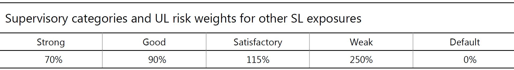
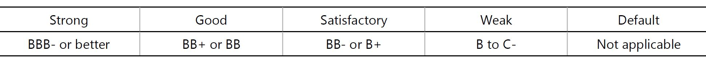
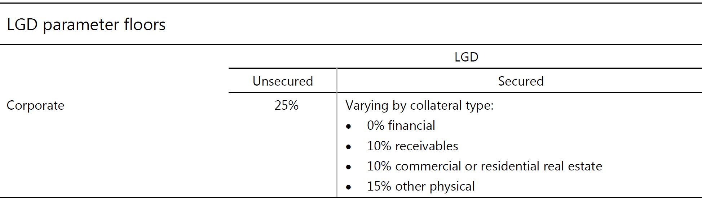
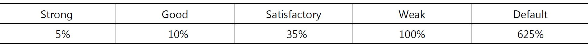
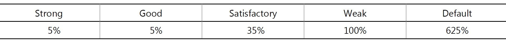

# Internal ratings-based approach for credit risk
## A. Overview
1. This section describes the IRB approach for credit risk. Subject to certain minimum conditions and disclosure requirements, banks that have received supervisory approval to use the IRB approach may rely on their own internal estimates of risk components in determining the capital requirement for a given exposure. The risk components include measures of the probability of default (PD), loss given default (LGD), the exposure at default (EAD), and effective maturity (M). In some cases, banks may be required to use a supervisory value as opposed to an internal estimate for one or more of the risk components.
2. The IRB approach is based on measures of unexpected losses (UL) and expected losses (EL). The risk-weight functions produce capital requirements for the UL portion. Expected losses are treated separately, as outlined in paragraph 43 of the Basel II framework (June 2006)1 and Section G below.
3. In this section, the asset classes are defined first. Adoption of the IRB approach across asset classes is also discussed early in this section. The risk components, each of which is defined later in this section, serve as inputs to the risk-weight functions that have been developed for separate asset classes. For example, there is a risk-weight function for corporate exposures and another one for qualifying revolving retail exposures. The treatment of each asset class begins with a presentation of the relevant risk-weight function(s) followed by the risk components and other relevant factors, such as the treatment of credit risk mitigants. The legal certainty standards for recognising CRM as set out in paragraphs 117 to 205 of the standardised approach apply for both the foundation and advanced IRB approaches. The minimum requirements that banks must satisfy to use the IRB approach are presented at the end of this section starting at Section H, paragraph 154.

1. このセクションでは、信用リスクに関するIRBのアプローチについて述べる。 IRBアプローチを使用する監督上の承認を受けた銀行は、特定の最低条件および開示要件を条件として、リスク要素の自己評価に依存して、特定のエクスポージャーの資本要件を決定する可能性がある。リスク要素には、デフォルト確率（PD）、デフォルト時損失（LGD）、デフォルト時エクスポージャー（EAD）、および有効満期（M）の尺度が含まれる。場合によっては、銀行は、1つ以上のリスク要素の内部見積もりとは対照的に監督上の価値を使用することを要求されることがあります。
2. IRBのアプローチは、予期しない損失（UL）および予想損失（EL）の尺度に基づいている。リスク加重関数は、UL部分の資本要件を生成する。期待損失は、バーゼルⅡの枠組み（2006年6月）1および下記セクションGのパラグラフ43で概説されているように、個別に扱われる。
3. このセクションでは、資産クラスが最初に定義されます。資産クラス全体にわたるIRBアプローチの採用についても、このセクションの早期で論じる。このセクションの後半で定義されるリスク要素は、個別の資産クラス用に開発されたリスク加重関数へのインプットとして役立ちます。例えば、企業エクスポージャーにはリスクウェイト機能があり、適格リバイバルエクスポージャーにはもう一つのリスクウェイト機能があります。各資産クラスの処理は、関連するリスク加重関数（複数可）の後にリスク要素と、信用リスク緩和策の処理などのその他の関連要因の提示から始まります。標準化アプローチのパラグラフ117から205に記載されているCRMを認識するための法的確実性基準は、基礎的IRBアプローチと高度IRBアプローチの両方に適用されます。 IRBアプローチを使用するために銀行が満たさなければならない最低限の要件は、セクションHのパラグラフ154で始まるこのセクションの最後に記載されています。

## B. Mechanics of the IRB approach
4. In Section 1 that follows, the asset classes (eg corporate exposures and retail exposures) eligible for the IRB approach are defined. Section 2 provides a description of the risk components to be used by banks by asset class. Section 3 discusses a bank’s adoption of the IRB approach at the asset class level and the related roll-out requirements. In cases where an IRB treatment is not specified, the risk weight for those other exposures is 100%, except when a 0% risk weight applies under the standardised approach, and the resulting risk-weighted assets are assumed to represent UL only.

4. 以下のセクション1では、IRBアプローチに適格な資産クラス（企業エクスポージャーおよびリテールエクスポージャーなど）が定義されています。 セクション2は、資産クラス別に銀行が使用するリスク要素の記述を提供する。 第3節では、銀行が資産クラス・レベルでのIRBアプローチの採用および関連する公開要件について説明する。 IRBの扱いが規定されていない場合、標準化されたアプローチでリスクウェイト0％が適用される場合を除き、他のエクスポージャーのリスクウェイトは100％であり、結果として生じるリスク加重資産はULのみを表すものとみなされます。

### 1. Categorisation of exposures
5. Under the IRB approach, banks must categorise banking-book exposures into broad classes of assets with different underlying risk characteristics, subject to the definitions set out below. The classes of assets are (a) corporate, (b) sovereign, (c) bank, (d) retail, and (e) equity. Within the corporate asset class, five sub-classes of specialised lending are separately identified. Within the retail asset class, three sub-classes are separately identified. Within the corporate and retail asset classes, a distinct treatment for purchased receivables may also apply provided certain conditions are met. For the equity asset class the IRB approach is not permitted, as outlined further below.

5. IRBのアプローチの下で、銀行は、銀行勘定のエクスポージャーを、下に示す定義に従って、異なるリスク特性を持つ幅広い種類の資産に分類しなければならない。 資産クラスは、（a）企業、（b）ソブリン、（c）銀行、（d）小売、（e）資本である。 企業資産クラスでは、5つのサブクラスの特別貸出が個別に識別されます。 小売資産クラス内では、3つのサブクラスが個別に識別されます。 コーポレートおよびリテールの資産クラスでは、一定の条件が満たされている場合には、購入債権の明確な扱いが適用されることもあります。 エクイティ・アセット・クラスについては、以下に概説するように、IRBのアプローチは認められていない。

6. The classification of exposures in this way is broadly consistent with established bank practice. However, some banks may use different definitions in their internal risk management and measurement systems. While it is not the intention of the Committee to require banks to change the way in which they manage their business and risks, banks are required to apply the appropriate treatment to each exposure for the purposes of deriving their minimum capital requirement. Banks must demonstrate to supervisors that their methodology for assigning exposures to different classes is appropriate and consistent over time.
7. For the treatment of securitisation exposures, see the Committee’s Revisions to the securitisation framework.2
(i) Definition of corporate exposures
8. In general, a corporate exposure is defined as a debt obligation of a corporation, partnership, or proprietorship. Banks are permitted to distinguish separately exposures to small- and medium-sized entities (SME), as defined in paragraph 54.
9. In addition to general corporates, within the corporate asset class, five sub-classes of specialised lending (SL) are identified. Such lending possesses all the following characteristics, either in legal form or economic substance:
• The exposure is typically to an entity (often a special purpose entity (SPE)) which was created specifically to finance and/or operate physical assets;
• The borrowing entity has little or no other material assets or activities, and therefore little or no independent capacity to repay the obligation, apart from the income that it receives from the asset(s) being financed;
• The terms of the obligation give the lender a substantial degree of control over the asset(s) and the income that it generates; and
• As a result of the preceding factors, the primary source of repayment of the obligation is the income generated by the asset(s), rather than the independent capacity of a broader commercial enterprise.
10. The five sub-classes of specialised lending (SL) are project finance, object finance, commodities finance, income-producing real estate, and high-volatility commercial real estate. Each of these sub-classes is defined below.
Project finance
11. Project finance (PF) is a method of funding in which the lender looks primarily to the revenues generated by a single project, both as the source of repayment and as security for the exposure. This type of financing is usually for large, complex and expensive installations that might include, for example, power plants, chemical processing plants, mines, transportation infrastructure, environment, and telecommunications infrastructure. Project finance may take the form of financing of the construction of a new capital installation, or refinancing of an existing installation, with or without improvements.

6. このようなエクスポージャーの分類は、確立された銀行慣行と概ね一致している。しかし、一部の銀行は、内部リスク管理および測定システムにおいて異なる定義を使用することがあります。銀行が業務やリスクの管理方法を変更することを銀行に求めることは委員会の意図ではないが、最低限の資本要件を導出する目的で、銀行は各エクスポージャーに適切な処置を適用する必要がある。銀行は、異なるクラスにエクスポージャーを割り当てるための方法論が、時間の経過とともに適切かつ一貫していることを監督者に実証しなければならない。
7. 証券化エクスポージャーの処理については、証券化枠組みの改訂を参照。
#### （i）企業エクスポージャーの定義
  8. 一般的に、企業エクスポージャーは、法人、パートナーシップ、または所有権の債務として定義される。銀行は、パラグラフ54で定義されているように、個別にエクスポージャーを中小企業（SME）と区別することが認められている。
  9. 一般的な法人に加えて、企業資産クラス内では、5つのサブクラスの専門融資（SL）が特定されている。かかる貸付は、法的形式または経済的実体のいずれかにおいて、以下のすべての特性を有する。
    - エクスポージャーは、通常、物的資産の資金調達および/または運営のために特別に作成されたエンティティ（多くの場合、特別目的事業体（SPE））である。
    - 借入事業体は、その他の重要な資産または活動をほとんどまたは全く持たないため、借入金から返済する独立した能力はほとんどありません。
    - 義務の条件により、貸し手は、資産およびそれが生み出す収益を実質的に支配することができます。そして
    - 上記の要因の結果、債務の返済の主要な源泉は、より広範な商業企業の独立した能力ではなく、資産によって生み出される収益である。
  10. 専門融資（SL）の5つのサブクラスは、プロジェクトファイナンス、オブジェクトファイナンス、コモディティファイナンス、所得生産不動産、および高変動性商業用不動産である。これらのサブクラスのそれぞれを以下に定義します。
##### プロジェクトファイナンス
11. プロジェクト・ファイナンス（PF）は、貸し手が、返済の元本とエクスポージャーの保証の両方として、単一のプロジェクトによって生み出された収益を主に検討する資金調達の方法です。この種の資金調達は、通常、発電所、化学プラント、鉱山、輸送インフラストラクチャ、環境、通信インフラなどの大規模で複雑で高価な設備に適用されます。プロジェクトファイナンスは、新しい資本設備の建設、または既存の設備の借り換えの資金調達の形態をとることができます。

12. In such transactions, the lender is usually paid solely or almost exclusively out of the money generated by the contracts for the facility’s output, such as the electricity sold by a power plant. The borrower is usually an SPE that is not permitted to perform any function other than developing, owning, and operating the installation. The consequence is that repayment depends primarily on the project’s cash flow and on the collateral value of the project’s assets. In contrast, if repayment of the exposure depends primarily on a well-established, diversified, credit-worthy, contractually obligated end user for repayment, it is considered a secured exposure to that end-user.

12. そのような取引では、貸し手は通常、発電所で売却された電力など、施設の生産契約によって生み出された金額の唯一の、またはほぼ独占的な支払いを受ける。 借り手は通常、SPEであり、インストールの開発、所有、運用以外の機能は実行できません。 その結果、返済額は主にプロジェクトのキャッシュフローとプロジェクト資産の担保価値に依存します。 対照的に、エクスポージャーの返済が主に、十分に確立され、多様化し、信用価値があり、契約上義務付けられたエンドユーザーの返済に依存する場合、そのエンドユーザーに対する保護されたエクスポージャーとみなされます。

Object finance
13. Object finance (OF) refers to a method of funding the acquisition of physical assets (eg ships, aircraft, satellites, railcars, and fleets) where the repayment of the exposure is dependent on the cash flows generated by the specific assets that have been financed and pledged or assigned to the lender. A primary source of these cash flows might be rental or lease contracts with one or several third parties. In contrast, if the exposure is to a borrower whose financial condition and debt-servicing capacity enables it to repay the debt without undue reliance on the specifically pledged assets, the exposure should be treated as a collateralised corporate exposure.
Commodities finance
14. Commodities finance (CF) refers to structured short-term lending to finance reserves, inventories, or receivables of exchange-traded commodities (eg crude oil, metals, or crops), where the exposure will be repaid from the proceeds of the sale of the commodity and the borrower has no independent capacity to repay the exposure. This is the case when the borrower has no other activities and no other material assets on its balance sheet. The structured nature of the financing is designed to compensate for the weak credit quality of the borrower. The exposure’s rating reflects its self-liquidating nature and the lender’s skill in structuring the transaction rather than the credit quality of the borrower.
15. The Committee believes that such lending can be distinguished from exposures financing the reserves, inventories, or receivables of other more diversified corporate borrowers. Banks are able to rate the credit quality of the latter type of borrowers based on their broader ongoing operations. In such cases, the value of the commodity serves as a risk mitigant rather than as the primary source of repayment.
Income-producing real estate
16. Income-producing real estate (IPRE) refers to a method of providing funding to real estate (such as, office buildings to let, retail space, multifamily residential buildings, industrial or warehouse space, and hotels) where the prospects for repayment and recovery on the exposure depend primarily on the cash flows generated by the asset. The primary source of these cash flows would generally be lease or rental payments or the sale of the asset. The borrower may be, but is not required to be, an SPE, an operating company focused on real estate construction or holdings, or an operating company with sources of revenue other than real estate. The distinguishing characteristic of IPRE versus other corporate exposures that are collateralised by real estate is the strong positive correlation between the prospects for repayment of the exposure and the prospects for recovery in the event of default, with both depending primarily on the cash flows generated by a property.
High-volatility commercial real estate
17. High-volatility commercial real estate (HVCRE) lending is the financing of commercial real estate that exhibits higher loss rate volatility (ie higher asset correlation) compared to other types of SL. HVCRE includes:
• Commercial real estate exposures secured by properties of types that are categorised by the national supervisor as sharing higher volatilities in portfolio default rates;
• Loans financing any of the land acquisition, development and construction (ADC) phases for properties of those types in such jurisdictions; and
• Loans financing ADC of any other properties where the source of repayment at origination of the exposure is either the future uncertain sale of the property or cash flows whose source of repayment is substantially uncertain (eg the property has not yet been leased to the occupancy
56 Basel III: Finalising post-crisis reforms
rate prevailing in that geographic market for that type of commercial real estate), unless the borrower has substantial equity at risk. Commercial ADC loans exempted from treatment as HVCRE loans on the basis of certainty of repayment of borrower equity are, however, ineligible for the additional reductions for SL exposures described in paragraph 58.
18. Where supervisors categorise certain types of commercial real estate exposures as HVCRE in their jurisdictions, they are required to make public such determinations. Other supervisors need to ensure that such treatment is then applied equally to banks under their supervision when making such HVCRE loans in that jurisdiction.

##### オブジェクトファイナンス
13. オブジェクト・ファイナンス（OF）とは、エクスポージャーの返済が特定の資産によって生み出されたキャッシュ・フローに依存する物理的資産（船舶、航空機、衛星、鉄道車両、艦隊など）の取得に資金を供給する方法をいう。担保に供され、担保に供されているか貸し手に割り当てられている。これらのキャッシュ・フローの主要な源泉は、1つまたは複数の第三者との賃貸またはリース契約である可能性があります。対照的に、エクスポージャーが財務状態と債務返済能力により債務返済が可能な借入人に対するものである場合、借り手は担保付企業のエクスポージャーとして扱われるべきである。
##### コモディティファイナンス
14. コモディティ・ファイナンス（CF）は、売買代金から返済される為替商品（原油、金属、または作物など）の準備金、棚卸資産、または受取債権を調達するための構造化短期貸付を指す借り手には、エクスポージャーを返済する独立した能力はありません。これは、借り手が他の活動がなく、貸借対照表にその他の重要な資産がない場合です。融資の構造化された性質は、借り手の弱い信用度を補うように設計されています。エクスポージャーの格付けは、自己払い戻しの性質と、借り手の信用度よりも取引を構造化する貸し手のスキルを反映している。
15. 当委員会は、このような貸付は、他のより多様化した企業借入人の準備金、棚卸資産、または受取債権を賄うエクスポージャーと区別することができると考えている。銀行は、より広範な進行中の業務に基づいて、後者のタイプの借り手の信用度を評価することができます。そのような場合、商品の価値は、主な返済源ではなくリスク緩和剤として役立ちます。
所得を生む不動産
16. 所得生産用不動産（IPRE）とは、不動産（事務所ビル、小売スペース、多世帯住宅、工業用または倉庫スペース、ホテルなど）に資金を提供する方法で、返済見込みエクスポージャーの回収は、主に資産によって生み出されるキャッシュフローに依存する。これらのキャッシュフローの主要な源泉は、通常、リース料または賃貸料、または資産の売却である。借り手は、SPE、不動産建設または保有に重点を置く事業会社、または不動産以外の収入源を有する事業会社であってもよいが、必須である必要はない。 IPREの特徴と不動産担保付の他の企業エクスポージャーの特徴は、エクスポージャーの返済見通しと債務不履行発生時の回復見通しとの間に強い正の相関関係があります。プロパティ。
高揮発性商業用不動産
17. 高変動性商業用不動産（HVCRE）貸付は、他の種類のSLと比較して損失率の変動性が高い（すなわち資産の相関が高い）商業用不動産の融資である。 HVCREには以下が含まれます：
- ポートフォリオのデフォルト率でより高いボラティリティを共有するとして国家監督当局によって分類されるタイプのプロパティによって保証される商業用不動産エクスポージャー。
- そのような法域における土地の取得、開発、建設（ADC）段階のいずれかの財産の財務に関する融資。そして
- エクスポージャー発生時の返済源が不動産の将来の不確実な売却または返済源が実質的に不確実なキャッシュフロー（例えば、不動産がまだ入居にリースされていない
56バーゼルIII：危機後の改革を終結させる
そのタイプの商業用不動産の地理的市場で一般的な利率）である。しかし、借手資本の返済の確実性に基づいてHVCREローンとして扱われる商業ADCローンは、パラグラフ58で説明されているSLエクスポージャーの追加的な削減には適格ではない。
18. 監督当局が特定の種類の商業用不動産エクスポージャーをHVCREとして法域に分類する場合、監督者はそのような決定を公表する必要がある。他の監督当局は、その法域でそのようなHVCRE融資を行う際に、監督下の銀行に同様の扱いが適用されることを保証する必要があります。

(ii) Definition of sovereign exposures
19. This asset class covers all exposures to counterparties treated as sovereigns under the standardised approach. This includes sovereigns (and their central banks), certain PSEs identified as sovereigns in the standardised approach, MDBs that meet the criteria for a 0% risk weight and referred to in footnote 11 of the standardised approach, and the entities referred to in paragraph 10 of the standardised approach. The treatment of sovereign exposures is unchanged from the Basel II framework (June 2006).
(iii) Definition of bank exposures
20. This asset class covers exposures to banks as defined in paragraph 16 of the standardised approach for credit risk and those securities firms and other financial institutions set out in paragraph 37 of the standardised approach for credit risk that are treated as exposures to banks. Bank exposures also include claims on all domestic PSEs that are not treated as exposures to sovereigns under the standardised approach, and MDBs that do not meet the criteria for a 0% risk weight under the standardised approach (ie MDBs that are not listed in footnote 11 of the standardised approach).
(iv) Definition of retail exposures
21. An exposure is categorised as a retail exposure if it meets all of the following criteria:
Nature of borrower or low value of individual exposures
• Exposures to individuals – such as revolving credits and lines of credit (eg credit cards, overdrafts, and retail facilities secured by financial instruments) as well as personal term loans and leases (eg instalment loans, auto loans and leases, student and educational loans, personal finance, and other exposures with similar characteristics) – are generally eligible for retail treatment regardless of exposure size, although supervisors may wish to establish exposure thresholds to distinguish between retail and corporate exposures.
• Residential mortgage loans3 (including first and subsequent liens, term loans and revolving home equity lines of credit) are eligible for retail treatment regardless of exposure size so long as the credit is:
(i) an exposure to an individual;4 or
(ii) an exposure to associations or cooperatives of individuals that are regulated under national law and exist with the only purpose of granting its members the use of a primary residence in the property securing the loan.
• Loans extended to small businesses and managed as retail exposures are eligible for retail treatment provided the total exposure of the banking group to a small business borrower (on a consolidated basis where applicable) is less than €1 million. Small business loans extended through or guaranteed by an individual are subject to the same exposure threshold.
• It is expected that supervisors provide flexibility in the practical application of such thresholds such that banks are not forced to develop extensive new information systems simply for the purpose of ensuring perfect compliance. It is, however, important for supervisors to ensure that such flexibility (and the implied acceptance of exposure amounts in excess of the thresholds that are not treated as violations) is not being abused.

#### （ii）ソブリンエクスポージャーの定義
19. この資産クラスは、標準化されたアプローチの下でソブリンとして扱われるカウンターパーティーへのエクスポージャーを対象としている。これには、ソブリン（およびその中央銀行）、標準化アプローチでソブリンとして特定された特定のPSE、標準化されたアプローチの脚注11で言及される0％のリスクウェートの基準を満たすMDB、および第10項標準化されたアプローチのソブリンのエクスポージャーの扱いは、バーゼルⅡの枠組み（2006年6月）と変わらない。
#### （ⅲ）銀行エクスポージャーの定義
20. この資産クラスは、信用リスクに関する標準化アプローチのパラグラフ16で定義された銀行へのエクスポージャーと、銀行へのエクスポージャーとして扱われる信用リスクの標準化アプローチのパラグラフ37に記載の証券会社およびその他の金融機関を対象とする。銀行エクスポージャーには、標準化アプローチでソブリンへのエクスポージャーとして扱われていない国内のPSE、および標準化アプローチでリスク・ウェイト0％の基準を満たさないMDB（すなわち、脚注11に記載されていないMDB標準化されたアプローチの）。
#### （iv）小売エクスポージャーの定義
21. 曝露は、以下の基準のすべてを満たす場合、小売曝露に分類される。
借り手の性質または個々のエクスポージャーの価値が低い
- 個人向けエクスポージャー（例えば、クレジットカード、当座貸越、および金融商品で担保された小売施設）ならびに個人向けの長期貸付およびリース（例えば、割賦ローン、自動車ローンおよびリース、学生および教育ローン個人財務およびその他類似の特性を有するエクスポージャー）は、通常、エクスポージャーの大きさにかかわらず、小売業務に適格であるが、小売業者と企業のエクスポージャーを区別するためのエクスポージャー・スレッショルドを設定することが望ましい。
- 住宅モーゲージ・ローン3（初回以降の抵当権、ターム・ローンおよびリボルビング・ホーム・エクイティ・ラインの信用枠を含む）は、信用度が以下の場合、エクスポージャー・サイズに関係なく、
  - （i）個人へのエクスポージャー;または
  - （ii）国内法に基づいて規制されている個人の団体または協同組合へのエクスポージャー。ローンを保証する不動産のプライマリ・レジデンスの使用を会員に認める唯一の目的で存在する。
- 中小企業向け貸出金（該当する場合には連結ベース）は、100万ユーロ未満であることを条件として、小規模企業向けローンおよび小売エクスポージャーの小売業務への適格性を考慮して管理されている。 個人によって延長された、または保証された中小企業向けローンは、同じエクスポージャー・スレッショルドの対象となります。
- 監督当局は、銀行が完璧なコンプライアンスを保証する目的で広範な新しい情報システムを開発するよう強制されないように、そのような閾値の実際の適用に柔軟性を提供することが期待される。 しかし、監督当局にとって、そのような柔軟性（および違反として扱われない閾値を超えたエクスポージャーの受け入れが濫用されていないこと）を確実にすることが重要です。

Large number of exposures
22. The exposure must be one of a large pool of exposures, which are managed by the bank on a pooled basis.
• Small business exposures below €1 million may be treated as retail exposures if the bank treats such exposures in its internal risk management systems consistently over time and in the same manner as other retail exposures. This requires that such an exposure be originated in a similar manner to other retail exposures. Furthermore, it must not be managed individually in a way comparable to corporate exposures, but rather as part of a portfolio segment or pool of exposures with similar risk characteristics for purposes of risk assessment and quantification. However, this does not preclude retail exposures from being treated individually at some stages of the risk management process. The fact that an exposure is rated individually does not by itself deny the eligibility as a retail exposure.
23. Within the retail asset class category, banks are required to identify separately three sub-classes of exposures: (a) residential mortgage loans, as defined above, (b) qualifying revolving retail exposures, as defined in the following paragraph, and (c) all other retail exposures.

##### 多数のエクスポージャー
22. エクスポージャーは、エクスポージャーの大きなプールの1つでなければならず、エクスポージャーはプールベースで銀行によって管理されます。
- 銀行が内部リスク管理システムでこのようなエクスポージャーを、一貫して他の小売エクスポージャーと同じ方法で処理する場合、100万ユーロ未満の中小企業エクスポージャーはリテールエクスポージャーとして扱うことができます。このようなエクスポージャーは、他の小売エクスポージャーと同様の方法で発生する必要があります。さらに、企業エクスポージャーに匹敵する方法で個別に管理するのではなく、リスクアセスメントおよび定量化の目的で同様のリスク特性を持つポートフォリオセグメントまたはエクスポージャープールの一部として管理する必要があります。しかし、これは、小売エクスポージャーがリスク管理プロセスのいくつかの段階で個別に取り扱われることを排除するものではありません。エクスポージャーが個別に評価されるという事実は、それ自体が小売の曝露としての適格性を否定するものではない。

23. 銀行は、以下の3つのサブ・クラスのエクスポージャーを別々に識別することが要求されている。（a）上記で定義された住宅モーゲージ・ローン、（b）以下のパラグラフで定義される適格リボルビング・リテール・エクスポージャー、 c）その他すべての小売エクスポージャー。

(v) Definition of qualifying revolving retail exposures
24. All of the following criteria must be satisfied for a sub-portfolio to be treated as a qualifying revolving retail exposure (QRRE). These criteria must be applied at a sub-portfolio level consistent with the bank’s segmentation of its retail activities generally. Segmentation at the national or country level (or below) should be the general rule.
(a) The exposures are revolving, unsecured, and uncommitted (both contractually and in practice). In this context, revolving exposures are defined as those where customers’ outstanding balances are permitted to fluctuate based on their decisions to borrow and repay, up to a limit established by the bank.
(b) The exposures are to individuals.
(c) The maximum exposure to a single individual in the sub-portfolio is €100,000 or less.
(d) Because the asset correlation assumptions for the QRRE risk-weight function are markedly below those for the other retail risk-weight function at low PD values, banks must demonstrate that the use of the QRRE risk-weight function is constrained to portfolios that have exhibited low volatility of loss rates, relative to their average level of loss rates, especially within the low PD bands. Supervisors will review the relative volatility of loss rates across the QRRE subportfolios, as well as the aggregate QRRE portfolio, and intend to share information on the typical characteristics of QRRE loss rates across jurisdictions.
(e) Data on loss rates for the sub-portfolio must be retained in order to allow analysis of the volatility of loss rates.
58 Basel III: Finalising post-crisis reforms
(f) The supervisor must concur that treatment as a qualifying revolving retail exposure is consistent with the underlying risk characteristics of the sub-portfolio.
25. The QRRE sub-class is split into exposures to transactors and revolvers. A QRRE transactor is an exposure to an obligor that meets the definition set out in paragraph 56 of the standardised approach. That is, the exposure is to an obligor in relation to a facility such as credit card or charge card where the balance has been repaid in full at each scheduled repayment date for the previous 12 months, or the exposure is in relation to an overdraft facility if there have been no drawdowns over the previous 12 months. All exposures that are not QRRE transactors are QRRE revolvers.

#### （v）適格リボルビング・リテール・エクスポージャーの定義
24. 適格リボルビング・リテール・エクスポージャー（QRRE）として扱われるサブポートフォリオについては、以下の基準のすべてが満たされなければならない。これらの基準は、一般的な小売活動の銀行セグメンテーションと整合的なサブポートフォリオ・レベルで適用されなければならない。国レベルまたは国レベル（またはそれ以下）でのセグメンテーションは一般的なルールである必要があります。
- （a）エクスポージャーは、リボルビング、無担保、コミットされていない（契約上も実務上も）。このような状況において、リボルビングエクスポージャーは、顧客の未払残幅が、借り入れおよび返済の決定に基づいて、銀行によって設定された限度まで変動することが許されるものとして定義される。
- （b）被ばくは個人に対するものである。
- （c）サブポートフォリオにおける1人の個人への最大エクスポージャーは€100,000以下です。
- （d）QRREリスクウェート機能の資産相関の仮定は、低いPD値の他のリテールリスクウェイト機能の資産相関仮定よりも著しく低いため、QRREリスクウェート機能の使用は、ポートフォリオに制約されていることを証明しなければならない低PD帯域内での損失率の平均レベルと比較して、損失率の低い変動性を示しています。監督当局は、QRREサブポートフォリオ全体の損失率とQRREポートフォリオ全体の相対的なボラティリティをレビューし、法域にわたるQRRE損失率の典型的な特性に関する情報を共有するつもりである。
- （e）損失率の変動性を分析するために、サブポートフォリオの損失率に関するデータを保持する必要があります。
58バーゼルIII：危機後の改革を終結させる
- （f）監督当局は、対象となるリボルビング・リテールのエクスポージャーとしての取り扱いが、サブ・ポートフォリオの潜在的リスク特性と一致することに同意しなければならない。
QRREサブクラスは、取引者とリボルバーのエクスポージャーに分割されている。 QRRE取引業者は、標準化されたアプローチのパラグラフ56に定められた定義を満たす債務者へのエクスポージャーです。つまり、クレジットカードやチャージカードのように過去12ヶ月間の返済期日ごとに残高が全額返済された場合、または当座貸越の場合はエクスポージャーが債務者に支払われる過去12ヶ月間に引き落としが行われていない場合。 QRREトランザクションではないエクスポージャーはすべてQRREリボルバーです。

(vi) Definition of equity exposures
26. This asset class covers exposures to equities as defined in paragraph 49 of the standardised approach for credit risk.
(vii) Definition of eligible purchased receivables
27. Eligible purchased receivables are divided into retail and corporate receivables as defined below.
Retail receivables
28. Purchased retail receivables, provided the purchasing bank complies with the IRB rules for retail exposures, are eligible for the top-down approach as permitted within the existing standards for retail exposures. The bank must also apply the minimum operational requirements as set forth in Sections F and H.
Corporate receivables
29. In general, for purchased corporate receivables, banks are expected to assess the default risk of individual obligors as specified in Section C.1 (starting with paragraph 52) consistent with the treatment of other corporate exposures. However, the top-down approach may be used, provided that the purchasing bank’s programme for corporate receivables complies with both the criteria for eligible receivables and the minimum operational requirements of this approach. The use of the top-down purchased receivables treatment is limited to situations where it would be an undue burden on a bank to be subjected to the minimum requirements for the IRB approach to corporate exposures that would otherwise apply. Primarily, it is intended for receivables that are purchased for inclusion in asset-backed securitisation structures, but banks may also use this approach, with the approval of national supervisors, for appropriate on-balance sheet exposures that share the same features.
30. Supervisors may deny the use of the top-down approach for purchased corporate receivables depending on the bank’s compliance with minimum requirements. In particular, to be eligible for the proposed ‘top-down’ treatment, purchased corporate receivables must satisfy the following conditions:
• The receivables are purchased from unrelated, third party sellers, and as such the bank has not originated the receivables either directly or indirectly.
Basel III: Finalising post-crisis reforms 59
• The receivables must be generated on an arm’s-length basis between the seller and the obligor. (As such, intercompany accounts receivable and receivables subject to contra-accounts between firms that buy and sell to each other are ineligible.5)
• The purchasing bank has a claim on all proceeds from the pool of receivables or a pro-rata interest in the proceeds.6
• National supervisors must also establish concentration limits above which capital charges must be calculated using the minimum requirements for the bottom-up approach for corporate exposures. Such concentration limits may refer to one or a combination of the following measures: the size of one individual exposure relative to the total pool, the size of the pool of receivables as a percentage of regulatory capital, or the maximum size of an individual exposure in the pool.
31. The existence of full or partial recourse to the seller does not automatically disqualify a bank from adopting this top-down approach, as long as the cash flows from the purchased corporate receivables are the primary protection against default risk as determined by the rules in paragraphs 132 to 135 for purchased receivables and the bank meets the eligibility criteria and operational requirements.

#### （vi）株式エクスポージャーの定義
26. この資産クラスは、信用リスクに関する標準化されたアプローチのパラグラフ49で定義されている株式へのエクスポージャーを対象とする。
#### （vii）適格購入済債権の定義
27. 適格購入債権は、以下に定義するとおり、小売債権および企業債権に分割される。
##### リテール債権
28. 購買銀行が小売エクスポージャーに関するIRB規則を遵守していれば、購入した小売債権は、小売エクスポージャーの既存の基準内で許可されているように、トップダウンアプローチの対象となる。また、銀行は、セクションFおよびHに記載されている最低限の運用要件を適用する必要があります。
##### 法人債権
29. 一般に、購入された企業債権については、他の企業エクスポージャーの処理と整合するC.1項（第52項から始まる）に規定されている個々の債務者のデフォルトリスクを評価することが期待される。しかし、買収銀行の企業向け債権プログラムは、適格債権の基準とこのアプローチの最低運用要件の両方を遵守している限り、トップダウン手法を使用することができます。トップダウンで売却された債権処理の使用は、そうでなければ適用される企業エクスポージャーに対するIRBアプローチの最低要件を課される銀行に過度の負担となる状況に限定されている。主に、資産担保証券化構造に含めるために購入された債権を対象としていますが、銀行は同様の特徴を有する適切なオンバランスシートエクスポージャーについて、国家監督当局の承認を得てこのアプローチを使用することもあります。
30. 監督当局は、銀行が最低限の要件を満たしているかどうかに応じて、購入した企業債権についてトップダウン・アプローチを使用することを拒否することができる。特に、提案された「トップダウン」処理の対象となるためには、購入済みの企業債権は以下の条件を満たす必要があります。
- 債権は無関係な第三者の売り手から購入されるため、直接または間接的に債権を発行していない。
バーゼルIII：危機後の改革の終結59
- 債権は、売り手と債務者の間で、腕の長さに基づいて生成されなければならない。 （したがって、相互に売買する企業間の対価勘定に基づく内部売上債権および未収金は資格がない.5）
- 購入銀行は、債権プールからのすべての収入または収入の比例持分を請求しています。
- 国家監督当局は、企業エクスポージャーのボトムアップアプローチの最低要件を用いて、資本費用を計算する必要がある濃度限度を設定する必要があります。そのような集中制限は、以下の措置の1つまたは組み合わせを指してもよい：総プールに対する1つの個別エクスポージャーのサイズ、規制資本のパーセンテージとしての債権プールのサイズ、または個々のエクスポージャーの最大サイズプール。
31. 売却者に対する完全または部分的遡及義務の存在は、購入した企業債権からのキャッシュフローがデフォルトリスクに対する一次的な保護である限り、銀行がこのトップダウンアプローチを採用することを自動的に不適格にするものではない購入した債権について132〜135パラグラフを発行し、当該銀行は適格基準および業務上の要件を満たしている。

### 2. Foundation and advanced approaches
32. For each of the asset classes covered under the IRB framework, there are three key elements:
• Risk components: estimates of risk parameters provided by banks, some of which are supervisory estimates.
• Risk-weight functions: the means by which risk components are transformed into risk-weighted assets and therefore capital requirements.
• Minimum requirements: the minimum standards that must be met in order for a bank to use the IRB approach for a given asset class.
33. For many of the asset classes, the Committee has made available two broad approaches: a foundation and an advanced approach. Under the foundation approach (F-IRB approach), as a general rule, banks provide their own estimates of PD and rely on supervisory estimates for other risk components. Under the advanced approach (A-IRB approach), banks provide more of their own estimates of PD, LGD and EAD, and their own calculation of M, subject to meeting minimum standards. For both the foundation and advanced approaches, banks must always use the risk-weight functions provided in this Framework for the purpose of deriving capital requirements. The full suite of approaches is described below.
34. For exposures to equities, defined in paragraph 26 above, the IRB approaches are not permitted (see paragraph 42). In addition, the A-IRB approach cannot be used for the following:
(i) Exposures to general corporates belonging to a group with total consolidated annual revenues greater than €500m.
(ii) Exposures in the bank asset class (paragraph 20), and other securities firms and financial institutions (including insurance companies and any other financial institutions in the corporate asset class).
In making the assessment above for the revenue threshold, the amounts must be as reported in the audited financial statements of the corporates or, for corporates that are part of consolidated groups, their consolidated groups (according to the accounting standard applicable to the ultimate parent of the consolidated group). The figures must be based on the average amounts calculated over the prior three years, or on the latest amounts updated every three years by the bank.
(i) Corporate and bank exposures
35. Under the foundation approach, banks must provide their own estimates of PD associated with each of their borrower grades, but must use supervisory estimates for the other relevant risk components. The other risk components are LGD, EAD and M.7
36. Under the advanced approach, banks must calculate the effective maturity (M)8 and provide their own estimates of PD, LGD and EAD.
37. There is an exception to this general rule for the five sub-classes of assets identified as SL.
The SL categories: PF, OF, CF, IPRE and HVCRE
38. Banks that do not meet the requirements for the estimation of PD under the corporate foundation approach for their SL exposures are required to map their internal risk grades to five supervisory categories, each of which is associated with a specific risk weight. This version is termed the ‘supervisory slotting criteria approach’.
39. Banks that meet the requirements for the estimation of PD are able to use the foundation approach to corporate exposures to derive risk weights for all classes of SL exposures except HVCRE. At national discretion, banks meeting the requirements for HVCRE exposure are able to use a foundation approach that is similar in all respects to the corporate approach, with the exception of a separate risk-weight function as described in paragraph 64.
40. Banks that meet the requirements for the estimation of PD, LGD and EAD are able to use the advanced approach to corporate exposures to derive risk weights for all classes of SL exposures except HVCRE. At national discretion, banks meeting these requirements for HVCRE exposure are able to use an advanced approach that is similar in all respects to the corporate approach, with the exception of a separate risk-weight function as described in paragraph 64.

### 2. Foundation and advanced approaches
32. IRBの枠組みに含まれる各資産クラスには、3つの重要な要素があります。
- リスク要素：銀行が提供するリスクパラメータの見積もり。その一部は監督上の見積りである。
- リスクウェイト機能：リスク要素をリスク加重資産、したがって資本要件に変換する手段。
- 最小要件：銀行が特定の資産クラスに対してIRBアプローチを使用するために満たさなければならない最小限の基準。
33. 資産クラスの多くについて、委員会は、基礎的アプローチと先進的アプローチの2つの広いアプローチを利用可能にした。基礎的アプローチ（F-IRBアプローチ）の下では、一般的に、銀行はPDの独自の見積りを提供し、他のリスク要素の監督上の見積りに頼っている。先進的アプローチ（A-IRBアプローチ）では、銀行は最低基準を満たすことを前提として、PD、LGDおよびEADの独自の見積もりとそれ自身のMの計算を提供する。基盤アプローチと先進アプローチの両方について、銀行は、資本要件を導出する目的で、このフレームワークで提供されるリスクウェート機能を常に使用しなければならない。以下に、一連のアプローチについて説明します。
34. 上記26項に定義されている株式へのエクスポージャーについては、IRBアプローチは認められていない（パラグラフ42参照）。さらに、A-IRBアプローチは以下の目的では使用できません。
- （ⅰ）総連結売上高が500百万ユーロを超えるグループに属する一般企業へのエクスポージャー。
- （ⅱ）銀行資産クラス（第20項）およびその他の証券会社および金融機関（保険会社および企業資産クラスの他の金融機関を含む）におけるエクスポージャー。
上記の査定額を収益基準額とする場合、金額は、企業の監査済み財務諸表に記載されているか、または連結グループの一部である企業については、連結グループ（最終的な親会社の会計基準連結グループ）。数値は、過去3年間で計算された平均金額、または銀行が3年ごとに更新した最新の金額に基づいていなければなりません。
#### （ⅰ）企業および銀行エクスポージャー
35. 基礎的アプローチの下では、銀行はそれぞれの借り手の等級に関連するPDの独自の見積もりを提供しなければならないが、他の関連するリスク要素の監督上の見積りを使用しなければならない。その他のリスク要素はLGD、EAD、M.7
36. 先進的なアプローチでは、銀行は有効満期（M）8を計算し、PD、LGDおよびEADの独自の見積りを提供しなければならない。
37. SLとして識別された資産の5つのサブクラスについてのこの一般規則に対する例外がある。
##### SLカテゴリ：PF、OF、CF、IPREおよびHVCRE
38. SLエクスポージャーのための企業基盤アプローチの下でPDの見積りの要件を満たさない銀行は、内部リスクグレードを特定のリスクウェートに関連する5つの監督カテゴリーにマッピングする必要がある。このバージョンは、「監督スロッティング基準アプローチ」と呼ばれています。
39. PDの見積りの要件を満たす銀行は、HVCREを除くすべてのクラスのSLエクスポージャーのリスクウエートを導出するために、企業エクスポージャーに対する基礎アプローチを使用することができる。国の裁量で、HVCREエクスポージャーの要件を満たす銀行は、パラグラフ64で説明した別個のリスクウェート機能を除いて、企業アプローチにすべての点で似ている基礎アプローチを使用することができる。
40. PD、LGDおよびEADの見積り要件を満たす銀行は、HVCREを除くすべてのクラスのSLエクスポージャーのリスクウエートを導出するために、企業エクスポージャーに対する高度なアプローチを使用することができます。国の裁量で、HVCREエクスポージャーに関するこれらの要件を満たす銀行は、パラグラフ64で説明されている別個のリスクウェート機能を除いて、企業アプローチへのあらゆる点で同様の先進的アプローチを使用することができる。

(ii) Retail exposures
41. For retail exposures, banks must provide their own estimates of PD, LGD and EAD. There is no foundation approach for this asset class.
(iii) Equity exposures
42. All equity exposures are subject to the standardised approach set out in paragraph 509 of the standardised approach for credit risk, with the exception of equity investments in funds that are subject to the requirements set out in the standard published by the Basel Committee in December 2013.10
(iv) Eligible purchased receivables
43. The treatment potentially straddles two asset classes. For eligible corporate receivables, both a foundation and advanced approach are available subject to certain operational requirements being met. As noted in paragraph 29, for corporate purchased receivables banks are in general expected to assess the default risk of individual obligors. The bank may use the A-IRB treatment for purchased corporate receivables (paragraphs 134 and 135) only for exposures to individual corporate obligors that are eligible for the A-IRB approach according to paragraph 34. Otherwise, the F-IRB treatment for purchased corporate receivables should be used. For eligible retail receivables, as with the retail asset class, only the A-IRB approach is available.

#### （ii）リテール・エクスポージャー
41. 小売エクスポージャーについては、銀行はPD、LGDおよびEADのそれ自体の見積りを提供しなければならない。この資産クラスには、基礎的なアプローチはありません。
#### （ⅲ）株式エクスポージャー
42. すべての株式エクスポージャーは、12月にバーゼル委員会が公表した基準に定められている資金への株式投資を除いて、信用リスクの標準化アプローチのパラグラフ509に規定された標準化されたアプローチの対象となる2013.10
#### （iv）購入可能債権
この治療法は、2つの資産クラスに跨る可能性がある。適格企業債権については、一定の運用要件が満たされれば、基礎的アプローチと高度なアプローチの両方が利用可能である。 29項に記載されているように、法人購入債権については、銀行は一般的に個々の債務者の債務不履行リスクを評価することが期待されている。銀行は、第34項のA-IRBアプローチの対象となる個々の企業債務者へのエクスポージャーについてのみ、購入した企業債権についてA-IRB処理を使用することができる（パラグラフ134および135）。そうでなければ、購入した企業債権を使用すべきである。適格小売債権については、小売資産クラスと同様に、A-IRBアプローチのみが利用可能である。

3. Adoption of the IRB approach for asset classes
44. Once a bank adopts an IRB approach for part of its holdings within an asset class, it is expected to extend it across all holdings within that asset class. In this context, the relevant assets classes are as follows:
• Banks
• Corporates (excluding specialised lending and purchased receivables)
• Specialised lending
• Corporate purchased receivables
• Qualifying revolving retail exposures
• Retail residential mortgages
• Other retail (excluding purchased receivables)
• Retail purchased receivables
The Committee recognises however, that, for many banks, it may not be practicable for various reasons to implement the IRB approach for an entire asset class across all business units at the same time. Furthermore, once on IRB, data limitations may mean that banks can meet the standards for the use of own estimates of LGD and EAD for some but not all of their exposures within an asset classes at the same time (for example, exposures that are in the same asset class, but are in different business units).
45. As such, supervisors may allow banks to adopt a phased rollout of the IRB approach across an asset class. The phased rollout includes: (i) adoption of IRB across the asset class within the same business unit; (ii) adoption of IRB for the asset class across business units in the same banking group; and (iii) move from the foundation approach to the advanced approach for certain risk components where use of the advanced approach is permitted. However, when a bank adopts an IRB approach for an asset class within a particular business unit, it must apply the IRB approach to all exposures within that asset class in that unit.
46. If a bank intends to adopt an IRB approach to an asset class, it must produce an implementation plan, specifying to what extent and when it intends to roll out the IRB approaches within the asset class and business units. The plan should be realistic, and must be agreed with the supervisor. It should be driven by the practicality and feasibility of moving to the more advanced approaches, and not motivated by a desire to adopt a Pillar 1 approach that minimises its capital charge. During the roll-out period, supervisors will ensure that no capital relief is granted for intra-group transactions which are designed to reduce a banking group’s aggregate capital charge by transferring credit risk among entities on the standardised approach, foundation and advanced IRB approaches. This includes, but is not limited to, asset sales or cross guarantees.
62 Basel III: Finalising post-crisis reforms
47. Some exposures that are immaterial in terms of size and perceived risk profile within their asset class may be exempt from the requirements in the previous two paragraphs, subject to supervisory approval. Capital requirements for such operations will be determined according to the standardised approach, with the national supervisor determining whether a bank should hold more capital under Pillar 2 for such positions.
48. Banks adopting an IRB approach for an asset class are expected to continue to employ an IRB approach for that asset class. A voluntary return to the standardised or foundation approach is permitted only in extraordinary circumstances, such as divestiture of a large fraction of the bank’s credit-related business in that asset class, and must be approved by the supervisor.
49. Given the data limitations associated with SL exposures, a bank may remain on the supervisory slotting criteria approach for one or more of the PF, OF, CF, IPRE or HVCRE sub-classes, and move to the foundation or advanced approach for the other sub-classes. However, a bank should not move to the advanced approach for the HVCRE sub-class without also doing so for material IPRE exposures at the same time.
50. Irrespective of the materiality, exposures to CCPs arising from OTC derivatives, exchange traded derivatives transactions and SFTs must be treated according to the dedicated treatment laid down in Section XI of the counterparty credit risk standards.

### 3.資産クラスに対するIRBアプローチの採用
44. 銀行が資産クラス内での保有分の一部についてIRBアプローチを採用すると、その資産クラス内のすべての保有にまたがって銀行を拡張することが期待される。この場合、関連する資産クラスは次のとおりです。
- 銀行
- コーポレート（特別貸出金および買取債権を除く）
- 専門融資
- 企業買収債権
- 適格リバイバルエクスポージャー
- 住宅モーゲージのリテール
- その他のリテール（購入債権を除く）
- リテール購入債権
しかし、委員会は、多くの銀行にとって、同時にすべての事業部門にわたる資産クラス全体についてIRBアプローチを実施することは様々な理由により実用的でない可能性があることを認識している。さらに、一度IRBを利用すると、データの制限は、同時に資産クラス内でのエクスポージャーの一部ではなく、一部のエクスポージャーについて、LGDとEADの自己評価の基準を満たすことができる可能性があります（例えば、同じ資産クラスですが、異なる事業単位にあります）。
45. そのため、監督当局は、銀行が資産クラスにわたってIRBアプローチの段階的な導入を採用することを許可する可能性がある。段階的公開には、（i）同一事業単位内の資産クラスにわたるIRBの採用、 （ii）同じ銀行グループの事業部門間で資産クラスに対するIRBの採用。 （iii）先進的アプローチの使用が認められている特定のリスク要素の基礎アプローチから先進的アプローチへの移行。しかし、銀行が特定の事業単位内の資産クラスに対してIRBアプローチを採用する場合、その部門の当該資産クラス内のすべてのエクスポージャーにIRBアプローチを適用しなければならない。
46. 銀行が資産クラスに対するIRBアプローチを採用しようとする場合、資産クラスおよび事業単位内でIRBアプローチをどの程度展開する予定であるかを明示する実施計画を作成しなければならない。計画は現実的でなければならず、上司と合意しなければならない。それは、より高度なアプローチに移行する実用性と実現可能性によって推進されるべきであり、資本チャージを最小限に抑えるPillar 1アプローチを採用したいという意欲によって動機付けられてはなりません。ロールアウト期間中、監督当局は、標準化されたアプローチ、基礎および先進的なIRBアプローチで企業間の信用リスクを移転することにより、銀行グループの総資本負担を軽減するように設計されたグループ内取引について、これには、アセットセールスやクロス保証が含まれますが、これに限定されません。
62バーゼルⅢ：危機後の改革を終結させる
47. 資産クラスの中でサイズと知覚されるリスクプロファイルの点で重要ではない一部のエクスポージャーは、監督上の承認を条件として、前2項の要件から免除される場合がある。このような業務のための資本要件は、銀行がそのような地位のために第2柱の下で資本を増やすべきかどうかを国家監督当局が決定する標準化されたアプローチに従って決定される。
48. 資産クラスに対するIRBアプローチを採用している銀行は、その資産クラスに対して引き続きIRBアプローチを採用する予定である。標準化されたアプローチまたは基礎的アプローチへの自発的な復帰は、その資産クラスにおける銀行の信用関連業務の大部分の売却などの特別な状況においてのみ許可され、監督当局の承認を受けなければならない。
49. SLエクスポージャーに関連するデータの制限がある場合、銀行はPF、OF、CF、IPREまたはHVCREサブクラスの1つまたは複数の監督用スロッティング基準アプローチにとどまり、他のサブクラス。しかし、銀行は、HVCREサブクラスの先進的なアプローチに移行してはならず、同時に重要なIPREエクスポージャーを行う必要もありません。
50. 重要性にかかわらず、店頭デリバティブ、為替デリバティブ取引およびSFTから生じるCCPへのエクスポージャーは、カウンターパーティーの信用リスク基準の第XI章に定められた専用の処遇に従って処理されなければならない。

C. Rules for corporate and bank exposures
51. Section C presents the method of calculating the unexpected loss (UL) capital requirements for corporate and bank exposures. As discussed in Section C.1, a single risk-weight function is provided for determining the capital requirement for corporate and bank exposures. Supervisory risk weights are provided for each of the specialised lending sub-classes of corporates, and a separate risk-weight function is also provided for HVCRE. Section C.2 discusses the risk components. The method of calculating expected losses, and for determining the difference between that measure and provisions is described in Section G.
1. Risk-weighted assets for corporate and bank exposures
(i) Formula for derivation of risk-weighted assets for corporate and bank exposures
52. The derivation of risk-weighted assets is dependent on estimates of the PD, LGD, EAD and, in some cases, effective maturity (M), for a given exposure.
53. Throughout this section, PD and LGD are measured as decimals, and EAD is measured as currency (eg euros), except where explicitly noted otherwise. For exposures not in default, the formula for calculating risk-weighted assets is:11, 12

Correlation (R) = 
Maturity adjustment (b) = 
Capital requirement13,14(K) =
Risk-weighted assets (RWA) =
The capital requirement (K) for a defaulted exposure is equal to the greater of zero and the difference between its LGD (described in paragraph 235) and the bank’s best estimate of expected loss (described in paragraph 238). The risk-weighted asset amount for the defaulted exposure is the product of K, 12.5, and the EAD.
A multiplier of 1.25 is applied to the correlation parameter of all exposures to financial institutions meeting the following criteria:
• Regulated financial institutions whose total assets are greater than or equal to USD 100 billion. The most recent audited financial statement of the parent company and consolidated subsidiaries must be used in order to determine asset size. For the purpose of this paragraph, a regulated financial institution is defined as a parent and its subsidiaries where any substantial legal entity in the consolidated group is supervised by a regulator that imposes prudential requirements consistent with international norms. These include, but are not limited to, prudentially regulated Insurance Companies, Broker/Dealers, Banks, Thrifts and Futures Commission Merchants;
• Unregulated financial institutions, regardless of size. Unregulated financial institutions are, for the purposes of this paragraph, legal entities whose main business includes: the management of financial assets, lending, factoring, leasing, provision of credit enhancements, securitisation, investments, financial custody, central counterparty services, proprietary trading and other financial services activities identified by supervisors.
• Correlation (R_FI) =
Illustrative risk weights are shown in Annex 5 of the Basel II framework (June 2006).

## C.企業および銀行エクスポージャーに関する規則
51. セクションCは、企業および銀行のエクスポージャーに関する予期しない損失（以下、「超過損失」という。 C.1項で説明したように、企業エクスポージャーおよび銀行エクスポージャーの資本要件を決定するための単一のリスクウェイト機能が提供される。監督上のリスクウェートは、法人の特定の貸出サブクラスごとに提供され、別個のリスクウェート機能もHVCREに提供される。セクションC.2では、リスク要素について説明します。期待損失を計算し、その措置と措置の差を決定する方法は、セクションGに記載されている。
1.企業および銀行エクスポージャーのリスク加重資産
### （i）企業および銀行エクスポージャーのリスク加重資産の導出式
52. リスク加重資産の導出は、PD、LGD、EAD、場合によっては有効償却（M）の見積もりに依存する。
53. このセクション全体を通して、PDとLGDは小数として測定され、明示的に別段の記載がある場合を除き、EADは通貨（例えばユーロ）として測定される。エクスポージャーがデフォルトでない場合、リスク加重資産の計算式は11,12
$Correlation(R)= 0.12 \cdot \frac{1-e^{-50\cdot PD}}{1-e^{-50}} + 0.24 \cdot (1-\frac{1-e^{-50\cdot PD}}{1-e^{-50}})$ 
$\mathrm{Maturity Adjustment(b)}=[0.11852-0.05478\cdot ln(PD)]^2$
$\mathrm{Capital Requirement(K)}=[LGD\cdotN[\frac{G(PD)}{\sqrt{(1-R)}}+\sqrt{\frac{R}{1-R}}\cdot G(0.999)]-PD\cdot LGD]\cdot \frac{(1+(M-2.5)\cdot b)}{1-1.5\cdot b}$
$\mathrm{Risk Weighted Asset(RWA)} = K \cdot 12.5 \cdot EAD$
不履行のエクスポージャーの所要自己資本（K）は、ゼロとそのLGD（235項に記載）と期待損失の最善の見積り（238項に記載）との差に等しい。デフォルトエクスポージャーのリスク加重資産額は、K、12.5、EADの積である。
1.25の乗数が、以下の基準を満たす金融機関に対するすべてのエクスポージャーの相関パラメータに適用されます。
- 総資産が1,000億ドル以上の規制された金融機関。資産規模を決定するためには、親会社および連結子会社の最近監査された財務諸表を使用する必要があります。このパラグラフの目的のために、規制された金融機関は、連結グループの実質的な法人が国際的規範に沿ったプルーデンシャル要件を課する規制当局によって監督されている親会社およびその子会社と定義される。これには、慎重に規制された保険会社、ブローカー/ディーラー、銀行、倹約者、先物手数料商人が含まれますが、これらに限定されません。
- 規制されていない金融機関。規制されていない金融機関は、本項の目的上、金融資産の管理、貸出、ファクタリング、リース、信用補完の提供、証券化、投資、金融監督、中央カウンターパーティー・サービス、監督当局によって特定された他の金融サービス活動。
- $Correlation(R_FI)=1.25\cdot [0.12 \cdot \frac{1-e^{-50\cdot PD}}{1-e^{-50}}+0.24\cdot (1-\frac{1-e^{-50 \cdot PD}}{1-e^{-50}})]$
具体的なリスクウェイトは、バーゼルⅡの枠組みの附属書5（2006年6月）に示されている。

(ii) Firm-size adjustment for small- and medium-sized entities (SME)
54. Under the IRB approach for corporate credits, banks will be permitted to separately distinguish exposures to SME borrowers (defined as corporate exposures where the reported sales for the consolidated group of which the firm is a part is less than €50 million) from those to large firms. A firm-size adjustment (ie 0.04 x (1 – (S – 5) / 45)) is made to the corporate risk weight formula for exposures to SME borrowers. S is expressed as total annual sales in millions of euros with values of S falling in the range of equal to or less than €50 million or greater than or equal to €5 million. Reported sales of less than €5 million will be treated as if they were equivalent to €5 million for the purposes of the firm-size adjustment for SME borrowers.

### （ii）中小企業（SME）の企業規模調整
54. 企業信用のためのIRBのアプローチの下では、銀行は、中小企業の借り手（会社の一部である連結グループの報告売上高が50百万ユーロ未満の企業エクスポージャーと定義される）とエクスポージャーを区別する 大企業に 中小企業の借り手へのエクスポージャーのコーポレートリスクウェイト公式には、企業規模の調整（0.04x（1 - （S-5）/ 45））が行われます。 Sは、Sの値が50百万ユーロ以下または500万ユーロ以上の範囲内にある百万ユーロの総売上高として表される。 報告された売上高5百万ユーロ未満は、中小企業の借り手のための会社規模調整の目的で、5百万ユーロに相当するものとして扱われる。

$Correlation(R) = 0.12\cdot \frac{1-e^{-50\cdot PD}}{1-e^{-50}}+0.24\cdot (1- \frac{1-e^{-50\cdot PD}}{1-e^{-50}})-0.04\cdot (1-\frac{S-5}{45})$

55.Subject to national discretion, supervisors may allow banks, as a failsafe, to substitute total assets of the consolidated group for total sales in calculating the SME threshold and the firm-size adjustment. However, total assets should be used only when total sales are not a meaningful indicator of firm size.
(iii) Risk weights for specialised lending
Risk weights for PF, OF, CF and IPRE
56.Banks that do not meet the requirements for the estimation of PD under the corporate IRB approach will be required to map their internal grades to five supervisory categories, each of which is associated with a specific risk weight. The slotting criteria on which this mapping must be based are provided in Annex 6 of the Basel II framework (June 2006). The risk weights for unexpected losses associated with each supervisory category are:

55. 国家の裁量により、監督当局は、銀行がフェイルセーフとして、中小企業の閾値と企業規模の調整を計算する際に、総売上高について連結グループの総資産を代入することを認めてもよい。 しかし、総資産は、総売上高が企業規模の有意な指標ではない場合にのみ使用されるべきである。
###（iii）特別貸出のリスクウェイト
#### PF、OF、CFおよびIPREのリスクウェイト
56. 企業IRBアプローチの下でPDの見積りの要件を満たさない銀行は、内部格付を特定のリスクウェートに関連する5つの監督カテゴリーにマッピングする必要がある。 このマッピングが基づいていなければならないスロッティング基準は、バーゼルⅡフレームワークの附属書6（2006年6月）に示されている。 各監督部門に関連する予期せぬ損失のリスクウェートは以下のとおりです。

57.Although banks are expected to map their internal ratings to the supervisory categories for specialised lending using the slotting criteria provided in Annex 6 of the Basel II framework (June 2006), each supervisory category broadly corresponds to a range of external credit assessments as outlined below.

57. 銀行は、バーゼルⅡの枠組み（2006年6月）の附属書6に規定されているスロッティング基準を用いて、専門的貸付の監督部門に内部格付をマッピングすることが期待されているが、各監督カテゴリーは概説された 以下。

58. At national discretion, supervisors may allow banks to assign preferential risk weights of 50% to “strong” exposures, and 70% to “good” exposures, provided they have a remaining maturity of less than 2.5 years or the supervisor determines that banks’ underwriting and other risk characteristics are substantially stronger than specified in the slotting criteria for the relevant supervisory risk category.
59. Banks that meet the requirements for the estimation of PD will be able to use the F-IRB approach for the corporate asset class to derive risk weights for SL sub-classes.
60. Banks that meet the requirements for the estimation of PD and LGD and EAD (where relevant) will be able to use the A-IRB approach for the corporate asset class to derive risk weights for SL sub-classes.

58. 国家の裁量では、監督当局は、銀行が「強い」エクスポージャーに対して50％、「良好」エクスポージャーに優先リスクウェイトを割り当てることを認めている。ただし、満期が2。5年未満であるか、 引受けおよびその他のリスク特性は、関連する監督上のリスクカテゴリーのスロッティング基準で規定されているものより大幅に強力である。
59. PDの見積りの要件を満たす銀行は、企業の資産クラスにF-IRB手法を使用して、SLサブクラスのリスクウェートを導出することができる。
60. PDおよびLGDおよびEAD（該当する場合）の見積り要件を満たす銀行は、SLサブクラスのリスクウェートを導出するために、企業資産クラスのためにA-IRBアプローチを使用することができる。

Risk weights for HVCRE
61. Banks that do not meet the requirements for estimation of PD, or whose supervisor has chosen not to implement the foundation or advanced approaches to HVCRE, must map their internal grades to five supervisory categories, each of which is associated with a specific risk weight. The slotting criteria on which this mapping must be based are the same as those for IPRE, as provided in Annex 6 of the Basel II framework (June 2006). The risk weights associated with each supervisory category are:

#### HVCREのリスクウェート
61. PDの見積もりの要件を満たさない銀行、または監督者がHVCREの基礎的アプローチまたは先進的アプローチを実施しないことを選択した銀行は、それぞれの内部格付を特定のリスク加重に関連する5つの監督カテゴリーにマッピングしなければならない 。 このマッピングがベースとしなければならないスロッティング基準は、バーゼルⅡフレームワークの附属書6（2006年6月）に示されているIPREのものと同じである。 各監督カテゴリーに関連するリスクウェートは以下のとおりです。

62. As indicated in paragraph 57, each supervisory category broadly corresponds to a range of external credit assessments.
63. At national discretion, supervisors may allow banks to assign preferential risk weights of 70% to “strong” exposures, and 95% to “good” exposures, provided they have a remaining maturity of less than 2.5 years or the supervisor determines that banks’ underwriting and other risk characteristics are substantially stronger than specified in the slotting criteria for the relevant supervisory risk category.
64. Banks that meet the requirements for the estimation of PD and whose supervisor has chosen to implement a foundation or advanced approach to HVCRE exposures will use the same formula for the derivation of risk weights that is used for other SL exposures, except that they will apply the following asset correlation formula:

65. Banks that do not meet the requirements for estimation of LGD and EAD for HVCRE exposures must use the supervisory parameters for LGD and EAD for corporate exposures.

62. パラグラフ57に示されているように、各監督カテゴリーは、幅広い外部信用アセスメントに対応している。
63. 国の裁量では、監督当局は、銀行が残存満期が2.5年未満であるか監督当局が銀行に決定した場合には、銀行が「強力な」エクスポージャーに対して70％、「良好」エクスポージャーに95％引受けおよびその他のリスク特性は、関連する監督上のリスクカテゴリーのスロッティング基準で規定されているものより大幅に強力である。
64. PDの見積り要件を満たし、監督当局がHVCREエクスポージャーの基礎または先進的アプローチを実施することを選択した銀行は、他のSLエクスポージャーに使用されるリスクウェイトの導出に同じ式を使用する次の資産相関式を適用します。
$Correlation(R)=0.12\cdot \frac{1-e^{-50\cdot PD}}{1-e^{-50}}+0.30\cdot (1- \frac{1-e^{-50\cdot PD}}{1-e^{-50}})$
65. HVCREエクスポージャーのLGDおよびEADの見積り要件を満たさない銀行は、企業エクスポージャーのためにLGDおよびEADの監督パラメータを使用しなければならない。

2. Risk components
66. This section, paragraphs 67 to 115, sets out the calculation of the risk components for corporate and bank exposures. In the case of an exposure that is guaranteed by a sovereign, the floors that apply to the risk components do not apply to that part of the exposure covered by the sovereign guarantee (ie any part of the exposure that is not covered by the guarantee is subject to the relevant floors).
(i) Probability of default (PD)
67. For corporate and bank exposures, the PD is the one-year PD associated with the internal borrower grade to which that exposure is assigned. The PD of borrowers assigned to a default grade(s), consistent with the reference definition of default, is 100%. The minimum requirements for the derivation of the PD estimates associated with each internal borrower grade are outlined in paragraphs 229 to 231.
68. The PD for each exposure that is used as input into the risk weight formula and the calculation of expected loss must not be less than 0.05%.
(ii) Loss given default (LGD)
69. A bank must provide an estimate of the LGD for each corporate and bank exposure. There are two approaches for deriving this estimate: a foundation approach and an advanced approach. As noted in paragraph 34, the advanced approach is not permitted for exposures to certain entities.
66 Basel III: Finalising post-crisis reforms
LGD under the foundation approach
Treatment of unsecured claims and non-recognised collateral
70. Under the foundation approach, senior claims on banks, securities firms and other financial institutions (including insurance companies and any financial institutions in the corporate asset class) that are not secured by recognised collateral will be assigned a 45% LGD. Senior claims on other corporates that are not secured by recognised collateral will be assigned a 40% LGD.
71. All subordinated claims on corporates and banks will be assigned a 75% LGD. A subordinated loan is a facility that is expressly subordinated to another facility. At national discretion, supervisors may choose to employ a wider definition of subordination. This might include economic subordination, such as cases where the facility is unsecured and the bulk of the borrower’s assets are used to secure other exposures.
Collateral under the foundation approach
72. In addition to the eligible financial collateral recognised in the standardised approach, under the foundation IRB approach some other forms of collateral, known as eligible IRB collateral, are also recognised. These include receivables, specified commercial and residential real estate (CRE/RRE), and other physical collateral, where they meet the minimum requirements set out in paragraphs 283 to 299. For eligible financial collateral, the requirements are identical to the operational standards as set out in the credit risk mitigation section of the standardised approach.
Methodology for recognition of eligible collateral under the foundation approach
73. The simple approach to collateral presented in the standardised approach is not available to banks applying the IRB approach.
74. The LGD applicable to a collateralised transaction (LGD*) must be calculated as the exposure weighted average of the LGD applicable to the unsecured part of an exposure (LGDU) and the LGD applicable to the collateralised part of an exposure (LGDS). Specifically:

where:
• E is the current value of the exposure (ie cash lent or securities lent or posted). In the case of securities lent or posted the exposure value has to be increased by applying the appropriate haircuts (HE) according to the comprehensive approach for financial collateral.
• ES is the current value of the collateral received after the application of the haircut applicable for the type of collateral (Hc) and for any currency mismatches between the exposure and the collateral, as specified in paragraphs 75 to 76. ES is capped at the value of ()1EEH⋅+.
•  The terms EU and ES are only used to calculate LGD*. Banks must continue to calculate EAD without taking into account the presence of any collateral, unless otherwise specified.
• LGDU = the LGD applicable for an unsecured exposure, as set out in paragraph 70 to 71.
• LGDS = the LGD applicable to exposures secured by the type of collateral used in the transaction, as specified in paragraph 75.
75. The following table specifies the LGDS and haircuts applicable in the formula set out in paragraph 74:

### 2.リスク要素
66. このセクションの第67項から第115項は、企業および銀行エクスポージャーのリスク要素の計算を規定している。ソブリンによって保証されているエクスポージャーの場合、リスクコンポーネントに適用されるフロアは、ソブリン保証の対象となるエクスポージャーの部分には適用されません（つまり、エクスポージャーのうち保証対象外の部分は関連フロアに従う）。
#### （i）デフォルト確率（PD）
67. 企業および銀行のエクスポージャーの場合、PDは、エクスポージャーが割り当てられている内部借入人グレードに関連する1年間のPDである。債務不履行の基準定義と一致して、債務者のデフォルトの格付けに割り当てられたPDは100％です。各内部借入人グレードに関連するPD推定値の導出の最低要件は、パラグラフ229から231に概説されている。
68. リスクウェイト計算式へのインプットとして使用される各エクスポージャーのPDと期待損失の計算は、0.05％以上でなければならない。
#### （ⅱ）損失償却額（LGD）
69. 銀行は、企業および銀行のエクスポージャーごとにLGDの見積りを提供する必要があります。この見積もりを導出するには、基礎アプローチと先進アプローチという2つのアプローチがあります。パラグラフ34で述べたように、先進的アプローチは特定の事業体へのエクスポージャーには認められていない。
66バーゼルIII：危機後の改革を終結させる
##### LGDの基盤アプローチ
###### 無担保債権および未認識担保の処理
70. 銀行、証券会社、その他の金融機関（保険会社および法人資産クラスの金融機関を含む）に対する優先権主張は、認識された担保によって担保されていないが、45％のLGDが割り当てられる。認識された担保によって担保されていない他の法人のシニア債権には、40％のLGDが割り当てられます。
71. 法人および銀行のすべての劣後債権には75％のLGDが割り当てられる。劣後ローンとは、明示的に別の施設に劣後するファシリティです。国の裁量で、監督当局は従属のより広い定義を採用することを選ぶかもしれない。これには、施設が無担保であり、借り手の資産の大部分が他のエクスポージャーを確保するために使用される場合など、経済的従属が含まれる可能性があります。
###### 基礎アプローチによる担保
72. 標準化アプローチで認識された適格金融担保に加えて、基礎IRBアプローチの下で、適格IRB担保として知られるいくつかの他の形態の担保も認識される。これには、債権、指定商業用不動産（CRE / RRE）、および第283項から第299項に規定されている最低限の要件を満たしているその他の物的担保が含まれる。適格金融担保に関しては、要件は設定された運用基準標準化されたアプローチの信用リスク軽減のセクションでは、
###### 基礎アプローチに基づく適格担保の認識の方法論
73. 標準化されたアプローチで提示された担保に対する単純なアプローチは、IRBアプローチを適用している銀行にとっては利用可能ではない。
74. 担保付取引（$LGD^*$）に適用されるLGDは、エクスポージャーの非担保部分（$LGD_U$）およびエクスポージャーの担保部分に適用されるLGD（$LGD_S$）に適用されるLGDのエクスポージャー加重平均として計算されなければならない。具体的には：
$LGD^*=LGD_U\cdot \frac{E_U}{E\cdot(1+H_E)}+LGD_S\cdot\frac{E_S}{E\cdot(1+H_E)}$

ここで：
- $E$はエクスポージャーの現在価値（すなわち、現金貸付または貸付または転記された有価証券）です。貸し付けられたまたは貸し付けられた証券の場合、包括的な金融担保アプローチに従って適切なヘアカット（$H_E$）を適用することにより、エクスポージャー価値を高める必要があります。
- $E_S$は、担保の種類（$H_c$）に適用されるヘアカットの適用後に受け取った担保の現在の価値であり、第75項から第76項に規定されているように、エクスポージャーと担保との間の通貨の不一致に関するものである。ESは、$E\cdot(1+H_E)$の値。
- $E_U=E\cdot(1+H_E)-E_S$: $E_U$と$E_S$という用語は、$LGD^*$の計算にのみ使用されます。銀行は、特に明記しない限り、担保の存在を考慮せずにEADを計算し続ける必要があります。
- $LGD_U$ =第70項から第71項に記載されている、無担保のエクスポージャーに適用されるLGD。
- $LGD_S$ =第75項に規定されている取引に使用された担保の種類によって担保されたエクスポージャーに適用されるLGD。
75. 次の表は、74項に記載されている公式に適用されるLGDSおよびヘアカットを指定しています。

76. When eligible collateral is denominated in a different currency to that of the exposure, the haircut for currency risk is the same haircut that applies in the comprehensive approach (paragraph 165 of the standardised approach).
77. Banks that lend securities or post collateral must calculate capital requirements for both of the following: (i) the credit risk or market risk of the securities, if this remains with the bank; and (ii) the counterparty credit risk arising from the risk that the borrower of the securities may default. For repo-style transactions, banks may recognise a reduction in the counterparty credit risk requirement arising from the effect of a master netting agreement providing that it satisfies the criteria set out in paragraphs 175 and 176 of the standardised approach. The bank must calculate E*, which is the exposure to be used for the counterparty credit risk charge taking account of the risk mitigation of collateral received, using the formula set out in paragraph 178 of the standardised approach. In calculating RWA and EL amounts for the counterparty credit risk arising from the set of transactions covered by the master netting agreement, E* must be used as the EAD of the counterparty and the LGD of the counterparty must be determined using the LGD specified for unsecured exposures, as set out in paragraphs 70 and 71.
Use of models to calculate EAD for counterparty credit risk
78. As an alternative to the use of standard haircuts for the calculation of the counterparty credit risk charge for SFTs set out in paragraph 77, banks may be permitted to use a VaR models approach to reflect price volatility of the exposures and the financial collateral. This approach can take into account the correlation effects between security positions. This approach applies to single SFTs and SFTs covered by netting agreements on a counterparty-by-counterparty basis, both under the condition that the collateral is revalued on a daily basis. This holds for the underlying securities being different and unrelated to securitisations. The master netting agreement must satisfy the criteria set out in paragraph 175 and 176 of the standardised approach. The VaR models approach is available to banks that have received supervisory recognition for an internal market risk model according to paragraph 177 of “Minimum capital requirements for market risk”. Banks which have not received market risk model recognition can separately apply for supervisory recognition to use their internal VaR models for the calculation of potential price volatility for SFTs, provided the model meets the requirements of paragraph 177. Although the market risk standards have changed from a 99% VaR to a 97.5% expected shortfall, the VaR models approach to SFTs retains the use of a 99% VaR to calculate the counterparty credit risk for SFTs. The VaR model needs to capture risk sufficient to pass the backtesting and profit and loss attribution tests of paragraph 183 of “Minimum capital requirements for market risk”. The default risk charge of paragraph 186 is not required in the VaR model for SFTs.
79. The quantitative and qualitative criteria for recognition of internal market risk models for SFTs are in principle the same as in paragraphs 180 and 181 of “Minimum capital requirements for market risk”. The minimum liquidity horizon or the holding period for SFTs is 5-business days for margined repo-style
68 Basel III: Finalising post-crisis reforms
transactions, rather than the 10-business days in paragraph 181 (k). For other transactions eligible for the VaR models approach, the 10-business day holding period will be retained. The minimum holding period should be adjusted upwards for market instruments where such a holding period would be inappropriate given the liquidity of the instrument concerned.
80. The calculation of the exposure E* for banks using their internal model to calculate their counterparty credit risk charge will be the following:
E* = max {0, [(ΣE – ΣC) + VaR output from internal model]}
In calculating capital requirements banks will use the previous business day’s VaR number.

76. 適格担保がエクスポージャーと異なる通貨建てである場合、通貨リスクのヘアカットは包括的なアプローチで適用されるものと同じです（標準化アプローチのパラグラフ165）。
77. 有価証券を貸し付けている担保または担保を差し入れている銀行は、以下の両方のための資本要件を計算しなければならない：（i）有価証券の信用リスクまたは市場リスク。 （ⅱ）有価証券の借入人が債務不履行を起こすリスクから生じるカウンターパーティの信用リスク。レポ・スタイルの取引については、銀行は、標準化アプローチのパラグラフ175および176に規定された基準を満たしていれば、マスター・ネッティング契約の効果から生じるカウンターパーティの信用リスク要件の減少を認識することがある。銀行は、標準化アプローチのパラグラフ178に記載されている式を用いて、受け取った担保のリスク軽減を考慮して、カウンターパーティの信用リスク負担に使用されるエクスポージャーである$E^*$を計算しなければならない。マスターネッティング契約の対象となる一連の取引から生じるカウンターパーティー信用リスクのRWAおよびEL金額の計算において、$E^*$はカウンターパーティーのEADとして使用する必要があり、カウンターパーティーのLGDは、第70項および第71項に記載されているとおり、
カウンターパーティーの信用リスクについてEADを計算するためのモデルの使用
78. 段落77に記載されているSFTのカウンターパーティーの信用リスク費用の計算に標準的なヘアカットを使用する代わりに、銀行はエクスポージャーと金融担保の価格変動を反映するためにVaRモデルアプローチを使用することが認められる。このアプローチは、セキュリティの位置の間の相関効果を考慮に入れることができる。このアプローチは、担保が毎日再評価されるという条件の下で、カウンターパートごとのネッティング契約によってカバーされる単一のSFTおよびSFTに適用されます。これは証券化とは異なる、関連性のない有価証券を保持する。マスター・ネッティング契約は、標準化アプローチのパラグラフ175および176に定められた基準を満たさなければならない。 VaRモデルのアプローチは、「市場リスクの最小資本要件」のパラグラフ177に従って内部市場リスクモデルの監督上の認識を受けた銀行に利用可能である。市場リスクモデルを受けていない銀行は、モデルがパラグラフ177の要件を満たしていれば、内部VaRモデルをSFTの潜在的な価格変動性の計算に使用するための監督上の認識を別途申請することができる。 99％VaRを97.5％の予想不足額に換算すると、VaRモデルはSFTに対するカウンターパーティーの信用リスクを計算するために99％VaRを維持しています。 VaRモデルは、「市場リスクに対する最低資本要件」のパラグラフ183のバックテストおよび損益帰属テストに合格するのに十分なリスクを取得する必要があります。 SFTのVaRモデルでは、パラグラフ186のデフォルトリスク費用は必要ありません。
79. SFTの内部市場リスクモデルの認識のための定量的および定性的基準は、原則として「市場リスクの最小資本要件」のパラグラフ180および181と同じである。 SFTの最低限の流動性の地平線または保有期間は、レポ形式の余裕がある場合は5営業日です
68バーゼルⅢ：危機後の改革を終結させる
第181条（k）の10営業日ではなく、 VaRモデルアプローチの対象となる他の取引については、10営業日の保有期間が保持されます。当該保有期間が当該金融商品の流動性を考慮して適切でない場合には、最低保有期間は市場調達手段に対して上方調整すべきである。
80. 銀行の内部モデルを使用してカウンターパーティの信用リスク費用を計算するためのエクスポージャーE *の計算は、以下のようになります。
$E^* = \mathrm{max}\{0,[(\Sigma_E - \Sigma_C)+$内部モデルから出力されるVaR$]\}$
資本要件の計算では、銀行は前営業日のVaR番号を使用します。

81. Subject to supervisory approval, instead of using the VaR approach, banks may also calculate an effective expected positive exposure for repo-style and other similar SFTs, in accordance with the Internal Model Method set out in the counterparty credit risk standards.
Carve out from the comprehensive approach
82. As in the standardised approach, for transactions where the conditions in paragraph 150 are met, and in addition, the counterparty is a core market participant as specified in paragraph 151, supervisors may choose not to apply the haircuts specified under the comprehensive approach, but instead to apply a zero H. A netting set that contains any transaction that does not meet the requirements in paragraph 150 of the standardised approach is not eligible for this treatment.
Methodology for the treatment of pools of collateral
83. In the case where a bank has obtained multiple types of collateral it may apply the formula set out in paragraph 74 sequentially for each individual type of collateral. In doing so, after each step of recognising one individual type of collateral, the remaining value of the unsecured exposure (EU) will be reduced by the adjusted value of the collateral (ES) recognised in that step. In line with paragraph 74, the total of ES across all collateral types is capped at the value of ()EEH⋅+1. This results in the following formula:

where for each collateral type i:
• LGDSi is the LGD applicable to that form of collateral (as specified in paragraph 75); and
• ESi is the current value of the collateral received after the application of the haircut applicable for the type of collateral (Hc) (as specified in paragraph 75).

81. 監督当局の承認を条件として、銀行はVaRアプローチを使用する代わりに、カウンターパーティーの信用リスク基準に定められた内部モデル方法に従って、レポスタイルおよび他の同様のSFTの有効なポジティブエクスポージャーを計算することもできる。
###### 包括的なアプローチから出発する
82. 標準化されたアプローチと同様に、パラグラフ150の条件が満たされ、さらに取引先がパラグラフ151で指定されたコア市場参加者である取引については、監督当局は包括的アプローチで指定されたヘアカットを適用しないこと、標準化されたアプローチのパラグラフ150の要件を満たさないトランザクションを含むネッティングセットは、この処理に適格ではありません。
###### 担保プールの処理方法
83. 銀行が複数の種類の担保を取得した場合、担保の種類ごとにパラグラフ74に記載された方式を順次適用することができる。その際、担保の1つのタイプを認識する各ステップの後、無担保エクスポージャー（$E_U$）の残りの価値は、そのステップで認識された担保（$E_S$）の調整額だけ減額されます。パラグラフ74に沿って、すべての担保タイプにわたるESの合計は、$E\cdot (1+H_E)$の値で上限される。これにより、次の式が得られます。

$LGD^*=LGD_U\cdot \frac{E_U}{E\cdot(1+H_E)}+\Sigma_i LGD_{S_i}\cdot \frac{E_{S_i}}{E\cdot (1+H_E)}$

各担保タイプ$i$について：
- $LGD_{S_i}$は、その形式の担保に適用されるLGDである（パラグラフ75で指定）。 そして
- $E_{S_i}$は、担保の種類（$H_c$）に適用可能なヘアカットを適用した後に受け取った担保の現在価値である（パラグラフ75で指定）。

LGD under the advanced approach
84. Subject to certain additional minimum requirements specified below (and the conditions set out in paragraph 34), supervisors may permit banks to use their own internal estimates of LGD for corporate exposures. LGD must be measured as the loss given default as a percentage of the EAD. Banks eligible for the IRB approach that are unable to meet these additional minimum requirements must utilise the foundation LGD treatment described above.
85. The LGD for each exposure that is used as input into the risk weight formula and the calculation of expected loss must not be less than the parameter floors indicated in the table below:  

###### 先進的なアプローチのLGD
84. 以下に規定する特定の追加最低要件（および第34項に規定された条件）を条件として、監督当局は銀行が企業エクスポージャーについてLGDの内部見積りを使用することを許可することができる。 LGDは、EADのパーセンテージとしての不履行時の損失として測定されなければならない。 これらの追加最低要件を満たすことができないIRBアプローチに適格な銀行は、上記の財団法人LGDの処理を利用しなければならない。
85. リスクウェイト計算式へのインプットとして使用される各エクスポージャーのLGDと期待損失の計算は、以下の表に示されているパラメーターフローより小さくなければならない。

86. The LGD floors for secured exposures in the table above apply when the exposure is fully secured (ie the value of collateral after the application of haircuts exceeds the value of the exposure). The LGD floor for a partially secured exposure is calculated as a weighted average of the unsecured LGD floor for the unsecured portion and the secured LGD floor for the secured portion. That is, the following formula should be used to determine the LGD floor:

where:
• LGDU floor and LGDS floor are the floor values for fully unsecured and fully secured exposures respectively, as specified in the table in paragraph 85.
• The other terms are defined as set out in paragraph 74 and 75.

86. 上記の表の固定されたエクスポージャーのLGDフロアは、エクスポージャーが完全に確保されている場合（すなわち、ヘアカット適用後の担保価値がエクスポージャーの価値を超える場合）に適用されます。 部分的に確保されたエクスポージャーのLGDフロアは、無担保部分の無担保LGDフロアと固定部分の固定LGDフロアの加重平均として計算されます。 つまり、LGDフロアを決定するには、次の式を使用する必要があります。

$Floor = LGD_{U floor}\cdot \frac{E_U}{E\cdot (1+H_E)}+LGD_{S floor}\cdot \frac{E_S}{E\cdot (1+H_E)}$

ここで：
- $LGD_{U floor}$および$LGD_{S floor}$は、85項の表に明記されているように、完全に安全でない完全に固定されたエクスポージャーのフロア値です。
- その他の用語は、パラグラフ74とパラグラフ75に記載されていると定義されている。

87. In cases where a bank has met the conditions to use their own internal estimates of LGD for a pool of unsecured exposures, and takes collateral against one of these exposures, it may not be able to model the effects of the collateral (ie it may not have enough data to model the effect of the collateral on recoveries). In such cases, the bank is permitted to apply the formula set out in paragraph 74 or 83, with the exception that the LGDU term would be the bank’s own internal estimate of the unsecured LGD. To adopt this treatment the collateral must be eligible under the F-IRB and the bank’s estimate of LGDU must not take account of any effects of collateral recoveries.
88. The minimum requirements for the derivation of LGD estimates are outlined in paragraphs 235 to 240.
Treatment of certain repo-style transactions
89. Banks that want to recognise the effects of master netting agreements on repo-style transactions for capital purposes must apply the methodology outlined in paragraph 77 for determining E* for use as the EAD in the calculation of counterparty credit risk. For banks using the advanced approach, own LGD estimates would be permitted for the unsecured equivalent amount (E*) used to calculate counterparty credit risk. In both cases banks, in addition to counterparty credit risk, must also calculate the capital requirements relating to any credit or market risk to which they remain exposed arising from the underlying securities in the master netting agreement.
Treatment of guarantees and credit derivatives
90. There are two approaches for recognition of CRM in the form of guarantees and credit derivatives in the IRB approach: a foundation approach for banks using supervisory values of LGD, and an advanced approach for those banks using their own internal estimates of LGD.
91. Under either approach, CRM in the form of guarantees and credit derivatives must not reflect the effect of double default (see paragraph 254). As such, to the extent that the CRM is recognised by the bank, the adjusted risk weight will not be less than that of a comparable direct exposure to the protection provider. Consistent with the standardised approach, banks may choose not to recognise credit protection if doing so would result in a higher capital requirement.
Recognition under the foundation approach
92. For banks using the foundation approach for LGD, the approach to guarantees and credit derivatives closely follows the treatment under the standardised approach as specified in paragraphs 191 to 205 of the standardised approach. The range of eligible guarantors is the same as under the standardised approach except that companies that are internally rated may also be recognised under the foundation approach. To receive recognition, the requirements outlined in paragraphs 191 to 196 of the standardised approach must be met.
93. Eligible guarantees from eligible guarantors will be recognised as follows:
• For the covered portion of the exposure, a risk weight is derived by taking:
− the risk-weight function appropriate to the type of guarantor, and
− the PD appropriate to the guarantor’s borrower grade.
• The bank may replace the LGD of the underlying transaction with the LGD applicable to the guarantee taking into account seniority and any collateralisation of a guaranteed commitment. For example, when a bank has a subordinated claim on the borrower but the guarantee represents a senior claim on the guarantor this may be reflected by using an LGD applicable for senior exposures (see paragraph 70) instead of an LGD applicable for subordinated exposures.
• In case the bank applies the standardised approach to direct exposures to the guarantor it may only recognise the guarantee by applying the standardised approach to the covered portion of the exposure.
94. The uncovered portion of the exposure is assigned the risk weight associated with the underlying obligor.
95. Where partial coverage exists, or where there is a currency mismatch between the underlying obligation and the credit protection, it is necessary to split the exposure into a covered and an uncovered amount. The treatment in the foundation approach follows that outlined in paragraphs 202 to 204 of the standardised approach, and depends upon whether the cover is proportional or tranched.

87. 銀行が、無担保エクスポージャーのプールに対してLGDの内部見積りを使用する条件を満たし、これらのエクスポージャーの1つに対して担保を徴収する場合、担保の効果をモデル化することはできないかもしれない回収時に担保の影響をモデル化するのに十分なデータがない可能性がある）。そのような場合、LGDU期間は、銀行自身の無担保LGDの内部見積もりとなることを除いて、銀行は第74項または第83項に記載された計算式を適用することができます。この処理を採用するには、担保はF-IRBに適格でなければならず、銀行のLGDUの見積りは担保の回収の影響を考慮してはならない。
88. LGD推定値の導出に必要な最小要件は、パラグラフ235から240で概説されている。
###### 特定のレポ様式取引の処理
89. カウンターパーティーの信用リスクの計算においてE *として使用するE *を決定するために、Repo様式の取引に資本目的でマスターネッティング契約の影響を認識したい銀行は、パラグラフ77で概説された方法論を適用しなければならない。先進的アプローチを採用している銀行については、カウンターパーティの信用リスクを計算するために使用される無担保相当額（E *）に対して、LGDの見積りが許可される。いずれの場合も、銀行は、カウンターパーティの信用リスクに加えて、マスターネッティング契約の根底にある証券から生じるクレジットまたは市場リスクに関する資本要件も計算しなければならない。
###### 保証およびクレジット・デリバティブの取り扱い
90. IRBアプローチにおける保証とクレジット・デリバティブの形でのCRMの認識には、LGDの監督上の価値を用いる銀行のための基礎的アプローチと、LGDの内部的な見積もりを用いた先進的なアプローチがある。
91. いずれのアプローチにおいても、保証の形態のCRMとクレジットデリバティブは、二重債務不履行の影響を反映してはならない（パラグラフ254参照）。そのため、CRMが銀行によって認識される限り、調整されたリスクウェートは、プロテクションプロバイダーに匹敵する直接的エクスポージャーのレーティングウェイトよりも小さくない。標準化されたアプローチと一致して、銀行は信用保護を認識しないことを選ぶかもしれません。
###### 基礎的アプローチによる認識
92. LGDの基礎的アプローチを採用している銀行については、保証およびクレジット・デリバティブへのアプローチは、標準化アプローチのパラグラフ191から205で規定されている標準化アプローチに基づく処理に厳密に従う。資格を有する保証人の範囲は、内部的に評価されている企業も基礎的アプローチの下で認識される場合を除き、標準化されたアプローチと同じである。認定を受けるためには、標準化されたアプローチのパラグラフ191から196で概説されている要件を満たす必要があります。
93. 適格保証人からの適格保証は、次のように認識される。
- エクスポージャーの対象となる部分については、
  - 保証人のタイプに適したリスクウェート機能、および
  - 保証人の借り手のグレードに適したPD。
- 銀行は、優先取引および保証されたコミットメントの担保を考慮に入れて、基本取引のLGDを保証に適用されるLGDに置き換えることができる。例えば、銀行が借り手に劣後債権を有するが、保証が保証人の上級請求を表す場合、劣後エクスポージャーに適用可能なLGDの代わりにシニアエクスポージャー（70項参照）に適用可能なLGDを使用することによって反映される。
- 銀行が保証人への直接的なエクスポージャーに関する標準化されたアプローチを適用する場合、エクスポージャーの対象部分に標準化されたアプローチを適用することによってのみ保証を認識することができる。
94. エクスポージャーのカバーされていない部分には、根底にある債務者に関連するリスクウェイトが割り当てられる。
95. 部分カバレッジが存在する場合、または基礎債務と信用保護との間に通貨の不一致がある場合、エクスポージャーをカバーした金額とカバーしていない金額に分割する必要がある。基礎アプローチの取り扱いは、標準化されたアプローチの第202項から第204項に概説されており、カバーが比例しているかトランジションされているかによって異なる。

Recognition under the advanced approach
96. Banks using the advanced approach for estimating LGDs may reflect the risk-mitigating effect of guarantees and credit derivatives through either adjusting PD or LGD estimates. Whether adjustments are done through PD or LGD, they must be done in a consistent manner for a given guarantee or credit derivative type. In doing so, banks must not include the effect of double default in such adjustments. Thus, the adjusted risk weight must not be less than that of a comparable direct exposure to the protection provider. In case the bank applies the standardised approach to direct exposures to the guarantor it may only recognise the guarantee by applying the standardised approach to the covered portion of the exposure. In case the bank applies the foundation IRB approach to direct exposures to the guarantor it may only recognise the guarantee by determining the risk weight for the comparable direct exposure to the guarantor according to the foundation IRB approach.
97. A bank relying on own-estimates of LGD has the option to adopt the treatment outlined above for banks under the foundation IRB approach (paragraphs 92 to 95), or to make an adjustment to its LGD estimate of the exposure to reflect the presence of the guarantee or credit derivative. Under this option, there are no limits to the range of eligible guarantors although the set of minimum requirements provided in paragraphs 256 and 257 concerning the type of guarantee must be satisfied. For credit derivatives, the
Basel III: Finalising post-crisis reforms 71
requirements of paragraphs 262 and 263 must be satisfied.15 For exposures for which a bank has permission to use its own estimates of LGD, the bank may recognise the risk mitigating effects of first-to-default credit derivatives, but may not recognise the risk mitigating effects of second-to-default or more generally nth-to-default credit derivatives.

###### 高度なアプローチによる認識
96. LGDを評価するための先進的なアプローチを採用している銀行は、PDまたはLGDの見積りの調整を通じて、保証およびクレジット・デリバティブのリスク軽減効果を反映している可能性がある。調整はPDまたはLGDを介して行われるかどうかにかかわらず、一定の保証またはクレジット・デリバティブ・タイプに対して一貫した方法で行わなければなりません。その際、銀行はそのような調整において二重債務不履行の影響を含んではならない。したがって、調整されたリスクウェイトは、プロテクションプロバイダーに匹敵する直接的エクスポージャーのものより小さくてはならない。銀行が保証人に直接的なエクスポージャーに関する標準化されたアプローチを適用する場合、エクスポージャーの対象部分に標準化されたアプローチを適用することによってのみ保証を認識することができる。銀行が保証人への直接的エクスポージャーに基礎IRBアプローチを適用する場合、基礎IRBアプローチに従って保証人に匹敵する直接的エクスポージャーのリスクウェートを決定することによってのみ保証を認識することができる。
97. LGDの自己見積もりに依拠している銀行は、基礎IRBアプローチ（パラグラフ92〜95）の下で銀行に対して上記の処理を採用するか、またはその存在を反映するためにLGDのエクスポージャーの見積りを調整する選択肢を有する保証またはクレジットデリバティブのこのオプションの下では、保証のタイプに関してパラグラフ256および257に規定されている最小要件のセットを満たさなければならないが、適格保証人の範囲には制限はない。クレジット・デリバティブについては、
バーゼルIII：危機後の改革の終結71
第262項および第263項の要件を満たさなければならない15銀行がLGDの自己の見積りを使用する許可を得ているエクスポージャーについては、銀行はファースト・デフォルト債権のリスク軽減効果を認識することがあるが、債務不履行またはより一般的にはn番目からデフォルトのクレジット・デリバティブの影響を緩和する。

(iii) Exposure at default (EAD)
98. The following sections apply to both on and off-balance sheet positions. All exposures are measured gross of specific provisions or partial write-offs. The EAD on drawn amounts should not be less than the sum of: (i) the amount by which a bank’s regulatory capital would be reduced if the exposure were written-off fully; and (ii) any specific provisions and partial write-offs. When the difference between the instrument’s EAD and the sum of (i) and (ii) is positive, this amount is termed a discount. The calculation of risk-weighted assets is independent of any discounts. Under the limited circumstances described in paragraph 147, discounts may be included in the measurement of total eligible provisions for purposes of the EL-provision calculation set out in Section G.
Exposure measurement for on-balance sheet items
99. On-balance sheet netting of loans and deposits will be recognised subject to the same conditions as under paragraph 190 of the standardised approach. Where currency or maturity mismatched on-balance sheet netting exists, the treatment follows the standardised approach, as set out in paragraphs 126 and 128 to 131.
Exposure measurement for off-balance sheet items (with the exception of derivatives)
100. For off-balance sheet items there are two approaches for the estimation of EAD: a foundation approach and an advanced approach. When only the drawn balances of revolving facilities have been securitised, banks must ensure that they continue to hold required capital against the undrawn balances associated with the securitised exposures.
101. In the foundation approach, EAD is calculated as the committed but undrawn amount multiplied by a CCF. In the advanced approach, EAD for undrawn commitments may be calculated as the committed but undrawn amount multiplied by a CCF or derived from direct estimates of total facility EAD.
EAD under the foundation approach
102. The types of instruments and the CCFs applied to them are the same as those in the standardised approach, as set out in paragraphs 78 to 89.
103. The amount to which the CCF is applied is the lower of the value of the unused committed credit line, and the value that reflects any possible constraining of the availability of the facility, such as the existence of a ceiling on the potential lending amount which is related to a borrower’s reported cash flow. If the facility is constrained in this way, the bank must have sufficient line monitoring and management procedures to support this contention.

104. Where a commitment is obtained on another off-balance sheet exposure, banks under the foundation approach are to apply the lower of the applicable CCFs.

### （iii）デフォルト時エクスポージャー（EAD）
98. 以下のセクションは、オンバランスシートとオフバランスシートの両方に適用される。すべてのエクスポージャーは、特定の引当金(provisions)または部分償却額の総額で測定される。引き出し額に関するEADは、（i）エクスポージャーが完全に消却された場合に銀行の規制資本が減少する金額、 （ii）特定の引当金(provisions)および部分的な償却額。機器のEADと（i）と（ii）の合計との差が正の場合、この金額を割引といいます。リスク加重資産の計算は、任意の割引とは無関係です。段落147に記載されている限られた状況の下では、セクションGに記載されているEL提供計算の目的で、適格な総額の測定に割引が含まれることがあります。
#### オンバランスシート項目の露出測定
99. 貸出金および預金のオンバランスシート・ネッティングは、標準化アプローチのパラグラフ190と同じ条件に従って認識される。通貨または満期のミスマッチのオンバランスシートネッティングが存在する場合は、パラグラフ126および128〜131に記載されている標準化されたアプローチに従う。
#### オフバランスシート項目のエクスポージャー測定（デリバティブを除く）
100. オフバランスシート項目については、基礎アプローチと先進アプローチの2つのEAD推定方法がある。回転ファシリティの引出し残高のみが証券化されている場合、銀行は証券化エクスポージャーに関連する未払残高に対して必要資本を引き続き保有していることを保証しなければならない。
101. 基礎アプローチでは、EADはコミットされた未延伸額にCCFを乗じたものとして計算されます。先進的なアプローチでは、未実行コミットメントのEADは、コミットされた未延伸金額としてCCFを掛けたもの、または総施設EADの直接的な見積もりに由来するものとして計算することができます。
#### 基礎アプローチのもとでのEAD
102. 第78項から第89項に規定されているように、標準化された方法のものと同じである。
103. CCFが適用される金額は、未使用コミット与信枠の価値と、潜在的貸出額の上限の存在など、施設の可用性の可能性のある制約を反映する値これは借り手の報告されたキャッシュフローに関連しています。施設がこのように制約されている場合、銀行はこの競争をサポートするのに十分な行監視および管理手続きを持たなければならない。

104. 別のオフバランスシートエクスポージャーに関するコミットメントが得られた場合、基礎アプローチの下にある銀行は、該当するCCFのうち低い方を適用する。

EAD under the advanced approach
105. Banks which meet the minimum requirements for use of their own estimates of EAD (see paragraphs 241 to 250) will be allowed for exposures for which A-IRB is permitted (see paragraph 34) to use their own internal estimates of EAD for undrawn revolving commitments16 to extend credit, purchase assets or issue credit substitutes provided the exposure is not subject to a CCF of 100% in the foundation approach (see paragraph 102). Standardised approach CCFs must be used for all other off-balance sheet items (for example, undrawn non-revolving commitments), and must be used where the minimum requirements for own estimates of EAD are not met. The EAD for each exposure that is used as input into the risk weight formula and the calculation of expected loss is subject to a floor that is the sum of: (i) the on balance sheet amount; and (ii) 50% of the off balance sheet exposure using the applicable CCF in the standardised approach.
Exposure measurement for transactions that expose banks to counterparty credit risk
106. Measures of exposure for SFTs and OTC derivatives that expose banks to counterparty credit risk under the IRB approach will be calculated as per the rules set forth in the counterparty credit risk standards.

#### 先進的なアプローチの下でのEAD
105. AADが独自のEAD推定値（第241項から第250項を参照）を使用するための最小要件を満たす銀行は、AraBが許可されていないエクスポージャー（34項参照）資産を購入するか、信用代替物を発行することを条件としている（第102項を参照）。ただし、エクスポージャーは100％のCCFの対象とならない。標準化されたアプローチCCFは、他のすべてのオフバランスシート項目（例えば、未回収の非回転コミットメント）に使用しなければならず、EADの自己評価の最小要件が満たされない場合に使用しなければならない。リスクウェイト計算式への入力として使用される各エクスポージャーのEADおよび期待損失の計算は、以下の合計であるフロアの影響を受けます。（i）貸借対照表上の金額。 （ii）標準化されたアプローチで該当するCCFを使用したオフバランスシートエクスポージャーの50％。
銀行を取引先の信用リスクにさらす取引のエクスポージャー測定
106. 銀行をIRBアプローチの下で相手方の信用リスクにさらすSFTおよびOTCデリバティブに対するエクスポージャーの尺度は、カウンターパーティーの信用リスク基準に定められた規則に従って計算される。

(iv) Effective maturity (M)
107. For banks using the foundation approach for corporate exposures, effective maturity (M) will be 2.5 years except for repo-style transactions where the effective maturity will be 6 months (ie M=0.5). National supervisors may choose to require all banks in their jurisdiction (those using the foundation and advanced approaches) to measure M for each facility using the definition provided below.
108. Banks using any element of the advanced IRB approach are required to measure effective maturity for each facility as defined below. However, national supervisors may allow the effective maturity to be fixed at 2.5 years (the ‘fixed maturity treatment’) for facilities to certain smaller domestic corporate borrowers if the reported sales (ie turnover) as well as total assets for the consolidated group of which the firm is a part of are less than €500 million. The consolidated group has to be a domestic company based in the country where the fixed maturity treatment is applied. If adopted, national supervisors must apply the fixed maturity treatment to all IRB banks using the advanced approach in that country, rather than on a bank-by-bank basis.
109. Except as noted in paragraph 110, the effective maturity (M) is subject to a floor of one year and a cap of 5 years and is defined as follows:
• For an instrument subject to a determined cash flow schedule, effective maturity M is defined as:
Effective maturity (M) = /tttttCFCF⋅ΣΣ
where CFt denotes the cash flows (principal, interest payments and fees) contractually payable by the borrower in period t.
• If a bank is not in a position to calculate the effective maturity of the contracted payments as noted above, it is allowed to use a more conservative measure of M such as that it equals the maximum remaining time (in years) that the borrower is permitted to take to fully discharge its contractual obligation (principal, interest, and fees) under the terms of loan agreement. Normally, this will correspond to the nominal maturity of the instrument.
• For derivatives subject to a master netting agreement, the effective maturity is defined as the weighted average maturity of the transactions within the netting agreement. Further, the notional amount of each transaction should be used for weighting the maturity.
• For revolving exposures, effective maturity must be determined using the maximum contractual termination date of the facility. Banks must not use the repayment date of the current drawing.
110. The one-year floor does not apply to certain short-term exposures, comprising fully or nearly-fully collateralised17 capital market-driven transactions (ie OTC derivatives transactions and margin lending) and repo-style transactions (ie repos/reverse repos and securities lending/borrowing) with an original maturity of less than one year, where the documentation contains daily remargining clauses. For all eligible transactions the documentation must require daily revaluation, and must include provisions that must allow for the prompt liquidation or setoff of the collateral in the event of default or failure to re-margin. The maturity of such transactions must be calculated as the greater of one-day, and the effective maturity (M, consistent with the definition above), except for transactions subject to a master netting agreement, where the floor is determined by the minimum holding period for the transaction type, as required by paragraph 113.
111. The one-year floor also does not apply to the following exposures:
(i) Short-term self-liquidating trade transactions. Import and export letters of credit and similar transactions should be accounted for at their actual remaining maturity.
(ii) Issued as well as confirmed letters of credit that are short term (ie have a maturity below one year) and self-liquidating.

### （iv）有効満期（M）
107. 企業エクスポージャーの基礎アプローチを採用している銀行については、有効満期は6ヶ月（M = 0.5）となるレポ・スタイルの取引を除き、2.5年となる。国家監督当局は、各施設のMを下記の定義を用いて測定するために、管轄内のすべての銀行（基礎および先進的アプローチを使用する銀行）に要求することを選択することができる。
108. 高度IRBアプローチの要素を使用する銀行は、以下に定義される各施設の有効満期を測定する必要がある。ただし、国家監督当局は、報告された売上高（売上高）および連結グループの総資産が一定の場合、国内小企業の特定の小規模借入人に対する施設の有効期間を2.5年固定（「満期固定化」）会社は5億ユーロ未満の一部です。連結グループは、固定満期処理が適用される国に拠点を置く国内企業でなければならない。採択された場合、国家監督当局は、銀行ごとにではなく、その国で先進的なアプローチを用いて全てのIRB銀行に満期固定証券を適用しなければならない。
109. 110項に記載されている場合を除き、有効満期（M）は1年のフロントと5年間の上限があり、以下のように定義される。
- 決定されたキャッシュフロースケジュールの対象となる金融商品については、有効満期Mは以下のように定義される。
$\mathrm{Effective Maturity(M)}=\frac{\Sigma_t t\cdot CF_t} { \Sigma_t CF_t}$ 
ここで、CFtは期間tの借り手が契約上支払うキャッシュフロー（元本、利払いおよび手数料）を示す。
- 銀行が上記の契約された支払いの有効期限を計算する立場にない場合、借り手が残っている最大残り時間（年）と同じように、より控えめなMの尺度を使用することが許される貸出契約の条件に基づいて契約上の義務（元本、利息および手数料）を完全に免除することを許可されています。通常、これは機器の名目上の成熟度に対応します。
- マスターネッティング契約の対象となるデリバティブの場合、実効満期は、ネッティング契約内の取引の加重平均満期として定義される。さらに、各取引の想定元本は、満期を加重するために使用されるべきである。
- リボルビングエクスポージャーについては、施設の最大契約終了日を使用して有効な満期を決定しなければならない。銀行は現在の図面の返済日を使用してはなりません。
110. 1年のフロアは、完全にまたはほぼ完全に担保された資本市場主導の取引（すなわち、店頭デリバティブ取引および証拠金貸付）およびレポ様式取引（すなわち、レポ/リバース・レポ有価証券貸借/借入）であり、満期が1年未満であり、文書には毎日の償還条項が含まれている。すべての適格取引については、文書は日々の再評価を必要とし、債務不履行または再マージンの不履行の場合に担保の迅速な清算または相殺を可能にする必要がある規定を含める必要があります。そのような取引の成熟度は、マスターネッティング契約の対象となる取引を除いて、1日のうち大きい方と有効有効期間（上記の定義と一致するM）として計算されなければならず、フロアは最低保有期間パラグラフ113で要求されるように、取引タイプについて
111. 1年間のフロアは、以下のエクスポージャーにも適用されません。
（i）短期自己清算貿易取引。信用状や類似の取引の輸出入は、実際の残存満期時に会計処理されるべきである。
（ⅱ）短期間（すなわち、満期が1年未満）および自己清算型の信用状を発行した。

112. In addition to the transactions considered in paragraph 110 above, other short-term exposures with an original maturity of less than one year that are not part of a bank’s ongoing financing of an obligor may be eligible for exemption from the one-year floor. After a careful review of the particular circumstances in their jurisdictions, national supervisors should define the types of short-term exposures that might be considered eligible for this treatment. The results of these reviews might, for example, include transactions such as:
• Some capital market-driven transactions and repo-style transactions that might not fall within the scope of paragraph 110;
• Some trade finance transactions that are not exempted by paragraph 111.
• Some exposures arising from settling securities purchases and sales. This could also include overdrafts arising from failed securities settlements provided that such overdrafts do not continue more than a short, fixed number of business days;
• Some exposures arising from cash settlements by wire transfer, including overdrafts arising from failed transfers provided that such overdrafts do not continue more than a short, fixed number of business days;
• Some exposures to banks arising from foreign exchange settlements; and
• Some short-term loans and deposits.
113. For transactions falling within the scope of paragraph 110 subject to a master netting agreement, the effective maturity is defined as the weighted average maturity of the transactions. A floor equal to the minimum holding period for the transaction type set out in paragraph 170 of the standardised approach will apply to the average. Where more than one transaction type is contained in the master netting agreement a floor equal to the highest holding period will apply to the average. Further, the notional amount of each transaction should be used for weighting maturity.
114. Where there is no explicit definition, the effective maturity (M) assigned to all exposures is set at 2.5 years unless otherwise specified in paragraph 107.
Treatment of maturity mismatches
115. The treatment of maturity mismatches under IRB is identical to that in the standardised approach (see paragraphs 126 to 130).

112. 上記110項で検討されている取引に加えて、銀行の債務者の継続的な資金調達の一部ではない元の満期が1年未満のその他の短期エクスポージャーは、1年間のフロアから免除される可能性がある。国の監督当局は、その法域における特定の状況を注意深く見直した後、この治療に適格であると考えられる短期被ばくの種類を定義すべきである。これらのレビューの結果には、たとえば次のようなトランザクションが含まれます。
- 第110項の範囲内に収まらない可能性のある資本市場主導取引およびレポ様取引。
- パラグラフ111で免除されていない貿易金融取引。
- 有価証券の購入および売却による一定のエクスポージャー。これには、短期固定利付日数よりも多くの当座貸越が継続しない場合には、有価証券決済不履行に起因する当座貸越が含まれる可能性があります。
- 電信送金による現金決済に起因する一部のエクスポージャー（短期の固定営業日数を超えて継続することができない場合には、送金が失敗した場合の当座貸越を含む）。
- 外国為替決済に起因する銀行へのエクスポージャー。そして
- 一部の短期借入金および預金。
113. マスター・ネッティング契約の対象となる第110項の適用範囲内の取引については、有効期限は取引の加重平均満期と定義される。標準化されたアプローチのパラグラフ170で設定された取引タイプの最小保有期間に等しいフロアが平均に適用されます。マスター・ネッティング契約に複数の取引タイプが含まれている場合、最も高い保持期間に等しいフロアが平均に適用されます。さらに、各取引の想定元本は満期加重に使用されるべきである。
114. 明示的な定義がない場合、第107項に別途明記されていない限り、すべてのエクスポージャーに割り当てられる有効満期（M）は2.5年に設定される。
#### Maturity Mismatchの取り扱い
115. IRBに基づく成熟度ミスマッチの扱いは、標準化されたアプローチのそれと同一である（パラグラフ126~130参照）。

D. Rules for retail exposures
116. Section D presents in detail the method of calculating the UL capital requirements for retail exposures. Section D.1 provides the risk weight functions. Section D.2 presents the risk components to serve as inputs to the risk-weight functions. The method of calculating expected losses, and for determining the difference between that measure and provisions is described in Section G.
1. Risk-weighted assets for retail exposures
117. There are three separate risk-weight functions for retail exposures, as defined in paragraphs 118 to 120. Risk weights for retail exposures are based on separate assessments of PD and LGD as inputs to the risk-weight functions. None of the three retail risk-weight functions contain the full maturity adjustment component that is present in the risk-weight function for exposures to banks and corporates. Throughout this section, PD and LGD are measured as decimals, and EAD is measured as currency (eg euros).
(i) Retail residential mortgage exposures
118. For exposures defined in paragraph 21 that are not in default and are secured or partly secured18 by residential mortgages, risk weights will be assigned based on the following formula:

The capital requirement (K) for a defaulted exposure is equal to the greater of zero and the difference between its LGD (described in paragraph 235) and the bank’s best estimate of expected loss (described in paragraph 238). The risk-weighted asset amount for the defaulted exposure is the product of K, 12.5 and the EAD.

### D.小売エクスポージャーのための規則
116. セクションDは、小売エクスポージャーに関するUL資本要件の計算方法を詳細に示している。セクションD.1はリスク加重関数を提供する。 D.2節では、リスク加重関数へのインプットとなるリスク要素を提示する。期待損失を計算し、その措置と措置の差を決定する方法は、セクションGに記載されている。
#### 1.小売エクスポージャーのリスク加重資産
117. パラグラフ118から120で定義されているように、小売エクスポージャーには3つの別々のリスクウェート機能がある。小売エクスポージャーのリスクウェイトは、PDとLGDをリスクウェイト機能のインプットとして別々に評価することに基づいている。 3つのリテールリスクウェイト関数のどれも、銀行と企業へのエクスポージャーのためのリスクウェイト関数に存在する完全な満期調整コンポーネントを含んでいない。このセクションでは、PDとLGDは小数点以下として測定され、EADは通貨（ユーロなど）として測定されます。
（i）リテール住宅モーゲージエクスポージャー
118. 既定ではなく、住宅ローンにより担保または部分的に担保されているパラグラフ21で定義されたエクスポージャーについては、以下の式に基づいてリスクウェートを割り当てる。
$\mathrm{Correlation(R)}=0.15$

$\mathrm{Capital Requirement(K)}=[LGD\cdot N[\frac{G(PD)}{\sqrt{(1-R)}}+\sqrt{\frac{R}{1-R}} \cdot G(0.999)]-PD\cdot LGD]$

$\mathrm{Risk-weighted assets}=K\cdot 12.5 \cdot EAD$

不履行のエクスポージャーの所要自己資本（K）は、ゼロとそのLGD（235項に記載）と期待損失の最善の見積り（238項に記載）との差に等しい。 デフォルトエクスポージャーのリスク加重資産額は、K、12.5とEADの積である。

(ii) Qualifying revolving retail exposures
119. For qualifying revolving retail exposures as defined in paragraphs 24 and 25 that are not in default, risk weights are defined based on the following formula:

The capital requirement (K) for a defaulted exposure is equal to the greater of zero and the difference between its LGD (described in paragraph 235) and the bank’s best estimate of expected loss (described in paragraph 238). The risk-weighted asset amount for the defaulted exposure is the product of K, 12.5, and the EAD.

####（ii）適格リバイバルエクスポージャー
119. 既定ではないパラグラフ24および25で定義されている適格リボルビング・リテール・エクスポージャーについては、以下の式に基づいてリスク加重を定義する。

$\mathrm{Correlation(R)}=0.04$

$\mathrm{Capital Requirement(K)}=[LGD\cdot N[\frac{G(PD)}{\sqrt{(1-R)}}+\sqrt{\frac{R}{1-R}} \cdot G(0.999)]-PD\cdot LGD]$

$\mathrm{Risk-weighted assets}=K\cdot 12.5 \cdot EAD$

不履行のエクスポージャーの所要自己資本（K）は、ゼロとそのLGD（235項に記載）と期待損失の最善の見積り（238項に記載）との差に等しい。 デフォルトエクスポージャーのリスク加重資産額は、K、12.5、EADの積である。

(iii) Other retail exposures
120. For all other retail exposures that are not in default, risk weights are assigned based on the following function, which allows correlation to vary with PD:

The capital requirement (K) for a defaulted exposure is equal to the greater of zero and the difference between its LGD (described in paragraph 235) and the bank’s best estimate of expected loss (described in paragraph 238). The risk-weighted asset amount for the defaulted exposure is the product of K, 12.5, and the EAD.
Illustrative risk weights are shown in Annex 5 of the Basel II framework (June 2006).

#### （iii）その他の小売エクスポージャー
デフォルトではない他のすべての小売エクスポージャーについては、以下の関数に基づいてリスク加重が割り当てられ、PDとの相関が変化する。

$\mathrm{Correlation(R)}=0.03\cdot\frac{1-e^{-35\cdot PD}}{1-e^{-35}}+0.16\cdot (1-\frac{1-e^{-35\cdot PD}}{1-e^{-35}})$

$\mathrm{Capital Requirement(K)}=[LGD\cdot N[\frac{G(PD)}{\sqrt{(1-R)}}+\sqrt{\frac{R}{1-R}} \cdot G(0.999)]-PD\cdot LGD]$

$\mathrm{Risk\ weighted\ assets}=K\cdot 12.5 \cdot EAD$

不履行のエクスポージャーの所要自己資本（K）は、ゼロとそのLGD（235項に記載）と期待損失の最善の見積り（238項に記載）との差に等しい。 デフォルトエクスポージャーのリスク加重資産額は、K、12.5、EADの積である。
具体的なリスクウェイトは、バーゼルⅡの枠組みの附属書5（2006年6月）に示されている。

2. Risk components
(i) Probability of default (PD) and loss given default (LGD)
121. For each identified pool of retail exposures, banks are expected to provide an estimate of the PD and LGD associated with the pool, subject to the minimum requirements as set out in Section H. Additionally, the PD for retail exposures is the greater of: (i) the one-year PD associated with the internal borrower grade to which the pool of retail exposures is assigned; and (ii) 0.1% for QRRE revolvers (see paragraph 25 for the definition of QRRE revolvers) and 0.05% for all other exposures. The LGD for each exposure that is used as input into the risk weight formula and the calculation of expected loss must not be less than the parameter floors indicated in the table below:

### 2.リスク要素
#### （i）デフォルトの確率（PD）およびデフォルトの損失（LGD）
121. 特定された小売エクスポージャーのプールごとに、銀行は、セクションHに記載されている最低限の要件に従い、プールに関連するPDおよびLGDの見積りを提供することが期待される。さらに、小売エクスポージャーのPDは、 （i）小売エクスポージャーのプールが割り当てられている内部借り手等級に関連する1年間のPD。 （ii）QRREリボルバーの場合は0.1％（QRREリボルバーの定義についてはパラグラフ25を参照）、他のすべてのエクスポージャーの場合は0.05％。 リスクウェイト計算式へのインプットとして使用される各エクスポージャーのLGDおよび予想損失の計算は、以下の表に示されているパラメータフローより小さくなければならない。

(ii) Recognition of guarantees and credit derivatives
122. Banks may reflect the risk-reducing effects of guarantees and credit derivatives, either in support of an individual obligation or a pool of exposures, through an adjustment of either the PD or LGD estimate, subject to the minimum requirements in paragraphs 252 to 263. Whether adjustments are done through PD or LGD, they must be done in a consistent manner for a given guarantee or credit derivative type. In case the bank applies the standardised approach to direct exposures to the guarantor it must assign the standardised approach risk weight to the covered portion of the exposure.
123. Consistent with the requirements outlined above for corporate and bank exposures, banks must not include the effect of double default in such adjustments. The adjusted risk weight must not be less than that of a comparable direct exposure to the protection provider. Consistent with the standardised approach, banks may choose not to recognise credit protection if doing so would result in a higher capital requirement.
(iii) Exposure at default (EAD)
124. Both on and off-balance sheet retail exposures are measured gross of specific provisions or partial write-offs. The EAD on drawn amounts should not be less than the sum of: (i) the amount by which a bank’s regulatory capital would be reduced if the exposure were written-off fully; and (ii) any specific provisions and partial write-offs. When the difference between the instrument’s EAD and the sum of (i) and (ii) is positive, this amount is termed a discount. The calculation of risk-weighted assets is independent of any discounts. Under the limited circumstances described in paragraph 147, discounts may be included in the measurement of total eligible provisions for purposes of the EL-provision calculation set out in Section G.
125. On-balance sheet netting of loans and deposits of a bank to or from a retail customer will be permitted subject to the same conditions outlined in paragraph 190 of the standardised approach. Banks must use their own estimates of EAD for undrawn revolving commitments to extend credit, purchase assets or issue credit substitutes provided the exposure is not subject to a CCF of 100% in the standardised approach (see paragraph 79 of the standardised approach) and the minimum requirements in paragraphs 241 to 251 are satisfied. Foundation approach CCFs must be used for all other off-balance sheet items (for example, undrawn non-revolving commitments), and must be used where the minimum requirements for own estimates of EAD are not met.
126. For retail exposures with uncertain future drawdown such as credit cards, banks must take into account their history and/or expectation of additional drawings prior to default in their overall calibration
Basel III: Finalising post-crisis reforms 77
of loss estimates. In particular, where a bank does not reflect conversion factors for undrawn lines in its EAD estimates, it must reflect in its LGD estimates the likelihood of additional drawings prior to default. Conversely, if the bank does not incorporate the possibility of additional drawings in its LGD estimates, it must do so in its EAD estimates.
127. When only the drawn balances of revolving retail facilities have been securitised, banks must ensure that they continue to hold required capital against the undrawn balances associated with the securitised exposures using the IRB approach to credit risk for commitments.
128. To the extent that foreign exchange and interest rate commitments exist within a bank’s retail portfolio for IRB purposes, banks are not permitted to provide their internal assessments of credit equivalent amounts. Instead, the rules for the standardised approach continue to apply.

####（ⅱ）保証およびクレジット・デリバティブの認識
122. 銀行は、パラグラフ252から263の最低要件を条件として、PDまたはLGDの見積りの調整を通じて、個人義務またはエクスポージャープールのサポートのいずれかで、保証およびクレジットデリバティブのリスク低減効果を反映することがある調整はPDまたはLGDを介して行われるかどうかは、保証またはクレジット・デリバティブの種類ごとに一貫して行わなければなりません。銀行が保証人への直接エクスポージャーに対する標準化されたアプローチを適用する場合、エクスポージャーの対象部分に標準化アプローチリスクウェートを割り当てる必要があります。
123. 企業および銀行のエクスポージャーに関して上記で概説した要件に沿って、銀行はそのような調整においてダブル・デフォルトの影響を含んではならない。調整されたリスクウェートは、プロテクションプロバイダーに匹敵する直接的エクスポージャーのウェイトより小さくしてはならない。標準化されたアプローチと一致して、銀行は信用保護を認識しないことを選ぶかもしれません。
####（iii）デフォルト時エクスポージャー（EAD）
124. 貸借対照表上の小売エクスポージャーおよびオフバランスシート小売エクスポージャーは、特定の引当金(provisions)または部分償却額の総額で測定される。引き出し額に関するEADは、（i）エクスポージャーが完全に消却された場合に銀行の規制資本が減少する金額、 （ii）特定の引当金(provisions)および部分的な償却額。機器のEADと（i）と（ii）の合計との差が正の場合、この金額を割引といいます。リスク加重資産の計算は、任意の割引とは無関係です。段落147に記載されている限られた状況の下では、セクションGに記載されているEL提供計算の目的で、適格な総額の測定に割引が含まれることがあります。
125. 小口顧客に対する銀行の貸出金および預金の貸借対照表上のネット化は、標準化されたアプローチのパラグラフ190で概説されたのと同じ条件のもとで許可される。銀行は、標準化されたアプローチ（標準化されたアプローチのパラグラフ79を参照）において、エクスポージャーが100％のCCFの対象とならない場合には、信用供与、資産の購入または代用代金引換のための未延伸リボルビングコミットメントについて、第241条から第251条までの要件が満たされていること。財団のアプローチCCFsは、他のすべてのオフバランスシート項目（例えば、繰り延べられた非回転コミットメント）に使用されなければならず、EADの自己評価の最低要件が満たされない場合に使用しなければならない。
126. 銀行は、クレジットカードなどの不確実な将来のドローダウンを伴う小売エクスポージャーについては、銀行は、その全体的な較正において不履行になる前に、その履歴および/または追加の図面の予想を考慮しなければならない
バーゼルⅢ：危機後改革の終結
損失見積りの特に、銀行がEAD見積りに未転記行の換算係数を反映していない場合、不履行前の追加図面の可能性をLGDが推測する必要があります。逆に、銀行がLGDの見積りに追加図面の可能性を組み込んでいない場合は、そのEAD見積もりでそれを行わなければならない。
127. 銀行は、リボルビング・リテール施設の引出し残高のみが証券化されている場合には、コミットメントのための信用リスクへのIRBアプローチを用いて証券化エクスポージャーに関連する未払残幅に対して必要な資本を引き続き保有することを確保しなければならない。
128. 銀行はIRB目的のために銀行のリテールポートフォリオ内に外国為替および金利の約束が存在する限り、信用相当額の内部評価を行うことは認められていない。代わりに、標準化されたアプローチのルールが引き続き適用されます。

F. Rules for purchased receivables
129. Section F presents the method of calculating the UL capital requirements for purchased receivables. For such assets, there are IRB capital charges for both default risk and dilution risk. Section F.1 discusses the calculation of risk-weighted assets for default risk. The calculation of risk-weighted assets for dilution risk is provided in Section F.2. The method of calculating expected losses, and for determining the difference between that measure and provisions, is described in Section G.
1. Risk-weighted assets for default risk
130. For receivables belonging unambiguously to one asset class, the IRB risk weight for default risk is based on the risk-weight function applicable to that particular exposure type, as long as the bank can meet the qualification standards for this particular risk-weight function. For example, if banks cannot comply with the standards for qualifying revolving retail exposures (defined in paragraph 24), they should use the risk-weight function for other retail exposures. For hybrid pools containing mixtures of exposure types, if the purchasing bank cannot separate the exposures by type, the risk-weight function producing the highest capital requirements for the exposure types in the receivable pool applies.
(i) Purchased retail receivables
131. For purchased retail receivables, a bank must meet the risk quantification standards for retail exposures but can utilise external and internal reference data to estimate the PDs and LGDs. The estimates for PD and LGD (or EL) must be calculated for the receivables on a stand-alone basis; that is, without regard to any assumption of recourse or guarantees from the seller or other parties.
(ii) Purchased corporate receivables
132. For purchased corporate receivables the purchasing bank is expected to apply the existing IRB risk quantification standards for the bottom-up approach. However, for eligible purchased corporate receivables, and subject to supervisory permission, a bank may employ the following top-down procedure for calculating IRB risk weights for default risk:
• The purchasing bank will estimate the pool’s one-year EL for default risk, expressed in percentage of the exposure amount (ie the total EAD amount to the bank by all obligors in the receivables pool). The estimated EL must be calculated for the receivables on a stand-alone basis; that is, without regard to any assumption of recourse or guarantees from the seller or other parties. The treatment of recourse or guarantees covering default risk (and/or dilution risk) is discussed separately below.
• Given the EL estimate for the pool’s default losses, the risk weight for default risk is determined by the risk-weight function for corporate exposures.19 As described below, the precise calculation of risk weights for default risk depends on the bank’s ability to decompose EL into its PD and LGD components in a reliable manner. Banks can utilise external and internal data to estimate PDs and LGDs. However, the advanced approach will not be available for banks that use the foundation approach for corporate exposures.

## F.買取債権に関する規則
セクションFは、購入した債権のUL資本要件の計算方法を示している。そのような資産については、デフォルトリスクと希釈リスクの両方についてIRBの資本費用が存在します。セクションF.1は、デフォルトリスクのリスク加重資産の計算について論じている。希薄化リスクに関するリスク加重資産の計算は、第F.2節に記載されている。期待損失の算定方法と、その措置と引当金(provisions)との差異の決定方法については、セクションGに記載されている。
### 1.デフォルトリスクのリスク加重資産
130. 1つの資産クラスに明白に属する債権については、デフォルトリスクのIRBリスクウェートは、この特定のリスクウェイト機能の適格基準を満たすことができる限り、特定のエクスポージャータイプに適用可能なリスクウェイト機能に基づいています。例えば、銀行がリボルビングリテイルエクスポージャーの適格基準（24項で定義）を遵守できない場合、他のリテールエクスポージャーにはリスクウエート機能を使用すべきである。エクスポージャータイプの混合物を含むハイブリッドプールの場合、購入銀行がタイプ別にエクスポージャーを分離できない場合、受領可能プールのエクスポージャータイプの資本要件が最も高いリスクウェイト関数が適用されます。
#### （ⅰ）購入した小売債権
131. 購入された小売債権については、銀行は小売エクスポージャーのリスク定量化基準を満たさなければならないが、PDおよびLGDを推定するために外部および内部参照データを利用することができる。 PDおよびLGD（またはEL）の見積りは、売掛金については単独で計算する必要があります。すなわち、販売者または他の当事者からの償還請求または保証のいかなる仮定も考慮しない。
####（ii）購入した企業債権
132. 買収された企業債権については、購入銀行はボトムアップ・アプローチのための既存のIRBリスク定量化基準を適用する予定である。しかし、適格購入済企業債権については、監督上の許可が必要な場合、銀行はデフォルトリスクに対するIRBリスクウェイトを計算するために以下のトップダウン手順を採用することができます。
- 購入銀行は、エクスポージャー額の割合（すなわち、債権プールのすべての債務者による銀行へのEAD総額）で表される、デフォルトリスクのプールの1年間のELを見積もります。推定ELは、売掛金については単独で計算する必要があります。すなわち、販売者または他の当事者からの償還請求または保証のいかなる仮定も考慮しない。デフォルトリスク（および/または希薄化リスク）をカバーする償還請求または保証の取扱いについては、以下で個別に説明します。
- プールのデフォルト損失のEL見積もりを仮定すると、デフォルトリスクのリスクウェートは、企業エクスポージャーのリスクウェイト関数によって決定されます.19以下に説明するように、デフォルトリスクのリスクウェイトの正確な計算は、 そのPDおよびLGDコンポーネントに信頼性の高い方法で接続します。 銀行は、外部および内部のデータを利用して、PDおよびLGDを推定することができる。 しかし、先進的なアプローチは、企業エクスポージャーのための基盤アプローチを使用する銀行には利用できません。

Foundation IRB treatment
133. If the purchasing bank is unable to decompose EL into its PD and LGD components in a reliable manner, the risk weight is determined from the corporate risk-weight function using the following specifications: if the bank can demonstrate that the exposures are exclusively senior claims to corporate borrowers, an LGD of 40% can be used. PD will be calculated by dividing the EL using this LGD. EAD will be calculated as the outstanding amount minus the capital charge for dilution prior to credit risk mitigation (KDilution). Otherwise, PD is the bank’s estimate of EL; LGD will be 100%; and EAD is the amount outstanding minus KDilution. EAD for a revolving purchase facility is the sum of the current amount of receivables purchased plus 40% of any undrawn purchase commitments minus KDilution. If the purchasing bank is able to estimate PD in a reliable manner, the risk weight is determined from the corporate risk-weight functions according to the specifications for LGD, M and the treatment of guarantees under the foundation approach as given in paragraphs 70 to 83, 89 to 95, and 107.
Advanced IRB treatment
134. If the purchasing bank can estimate either the pool’s default-weighted average loss rates given default (as defined in paragraph 235) or average PD in a reliable manner, the bank may estimate the other parameter based on an estimate of the expected long-run loss rate. The bank may: (i) use an appropriate PD estimate to infer the long-run default-weighted average loss rate given default; or (ii) use a long-run default-weighted average loss rate given default to infer the appropriate PD. In either case, it is important to recognise that the LGD used for the IRB capital calculation for purchased receivables cannot be less than the long-run default-weighted average loss rate given default and must be consistent with the concepts defined in paragraph 235. The risk weight for the purchased receivables will be determined using the bank’s estimated PD and LGD as inputs to the corporate risk-weight function. Similar to the foundation IRB treatment, EAD will be the amount outstanding minus KDilution. EAD for a revolving purchase facility will be the sum of the current amount of receivables purchased plus 40% of any undrawn purchase commitments minus KDilution (thus, banks using the advanced IRB approach will not be permitted to use their internal EAD estimates for undrawn purchase commitments).
135. For drawn amounts, M will equal the pool’s exposure-weighted average effective maturity (as defined in paragraphs 109 to 114). This same value of M will also be used for undrawn amounts under a committed purchase facility provided the facility contains effective covenants, early amortisation triggers, or other features that protect the purchasing bank against a significant deterioration in the quality of the future receivables it is required to purchase over the facility’s term. Absent such effective protections, the M for undrawn amounts will be calculated as the sum of: (a) the longest-dated potential receivable under the purchase agreement; and (b) the remaining maturity of the purchase facility.

#### 基礎IRB治療
133. 購入銀行がELをPDおよびLGDコンポーネントに信頼できる方法で分解できない場合、リスクウェイトは以下の仕様を使用して企業のリスクウェイト機能から決定される。銀行がエクスポージャーが排他的に上位であることを実証できる場合企業借り手に対するクレームは、40％のLGDを使用することができます。 PDは、このLGDを使用してELを分割することによって計算されます。 EADは、未払い金額から、信用リスク軽減前の希薄化のための資本費用（KDilution）を引いたものとして計算される。それ以外の場合、PDは銀行のELの見積もりです。 LGDは100％になります。 EADは未払い金額からKDilutionを差し引いた金額です。リボルビング購入施設のEADは、購入した債権の現在の金額と、未払の購入コミットメントの40％からKDilutionを差し引いた金額の合計です。購買銀行が信頼できる方法でPDを見積もることができる場合、第70項から第83項に規定されているように、LGD、Mの仕様および基礎的アプローチによる保証の扱いに基づいて、企業のリスクウェイト機能からリスクウェイトを決定する、89~95、および107。
#### 高度なIRB治療
134. 購入銀行が債務不履行の場合のデフォルト加重平均損失率（パラグラフ235で定義）または平均PDを信頼性のある方法で見積もることができる場合、銀行は、予想長期金利の見積もりに基づいて、ラン損失率。銀行は、（i）デフォルトで与えられた長期デフォルト加重平均損失率を推測するために適切なPD見積りを使用する。 （ii）長期的なデフォルト加重平均損失率を使用して、適切なPDを推測する。どちらの場合も、購入債権のIRB資本計算に使用されるLGDは、デフォルトでの長期デフォルト加重平均損失率を下回ることはできず、第235項で定義された概念と一致していなければならないことを認識することが重要です。購入した債権のリスクウェイトは、銀行の推定PDとLGDを企業リスクウェイト機能のインプットとして使用して決定されます。基礎IRB処理と同様に、EADは顕著な金額からK希釈を引いたものになります。リボルビング購入施設のEADは、購入した債権の現在の金額と未払済購入約定額の40％にKDilutionを控除した金額の合計になります（したがって、先進IRBアプローチを使用している銀行は未実行購買約定）。
135. 引き出し額については、Mはプールのエクスポージャー加重平均有効期間（パラグラフ109から114で定義されている）と等しい。このMの同じ価値は、その施設に有効な約定、早期償却トリガー、または購入銀行の将来の債権の質の著しい低下から保護するその他の機能が含まれている場合には、コミット済み購入施設の未払額にも使用される施設の期間にわたって購入すること。そのような効果的な保護がない場合、未払額のMは、以下の合計として計算される。（a）購入契約に基づく最長期間の潜在的受取額。 （b）購入施設の残存期間。

2. Risk-weighted assets for dilution risk
136. Dilution refers to the possibility that the receivable amount is reduced through cash or non-cash credits to the receivable’s obligor.20 For both corporate and retail receivables, unless the bank can demonstrate to its supervisor that the dilution risk for the purchasing bank is immaterial, the treatment of dilution risk must be the following: at the level of either the pool as a whole (top-down approach) or the individual receivables making up the pool (bottom-up approach), the purchasing bank will estimate the one-year EL for dilution risk, also expressed in percentage of the receivables amount. Banks can utilise external and internal data to estimate EL. As with the treatments of default risk, this estimate must be computed on a stand-alone basis; that is, under the assumption of no recourse or other support from the seller or third-party guarantors. For the purpose of calculating risk weights for dilution risk, the corporate risk-weight function must be used with the following settings: the PD must be set equal to the estimated EL, and the LGD must be set at 100%. An appropriate maturity treatment applies when determining the capital requirement for dilution risk. If a bank can demonstrate that the dilution risk is appropriately monitored and managed to be resolved within one year, the supervisor may allow the bank to apply a one-year maturity.
137. This treatment will be applied regardless of whether the underlying receivables are corporate or retail exposures, and regardless of whether the risk weights for default risk are computed using the standard IRB treatments or, for corporate receivables, the top-down treatment described above.
3. Treatment of purchase price discounts for receivables
138. In many cases, the purchase price of receivables will reflect a discount (not to be confused with the discount concept defined in paragraphs 98 and 124) that provides first loss protection for default losses, dilution losses or both. To the extent that a portion of such a purchase price discount may be refunded to the seller based on the performance of the receivables, the purchaser may recognise this refundable amount as first-loss protection and hence treat this exposure under the securitisation framework, while the seller providing such a refundable purchase price discount must treat the refundable amount as a first-loss position under the securitisation framework. Non-refundable purchase price discounts for receivables do not affect either the EL-provision calculation in Section G or the calculation of risk-weighted assets.
139. When collateral or partial guarantees obtained on receivables provide first loss protection (collectively referred to as mitigants in this paragraph), and these mitigants cover default losses, dilution losses, or both, they may also be treated as first loss protection under the securitisation framework (see paragraph 51 of the securitisation framework). When the same mitigant covers both default and dilution risk, banks using the Securitisation Internal Ratings-Based Approach (SEC-IRBA) that are able to calculate an exposure-weighted LGD must do so as defined in paragraph 60 of the securitisation framework.

### 2.希薄化リスクに対するリスク加重資産
136. 希薄化とは、債権額が現金または非現金クレジットによって債権者の債務者に還元される可能性をいう.20法人債および小売債権の両方について、その銀行が監督当局に購入銀行の希薄化リスクを示すことができない場合プール全体（トップダウンアプローチ）またはプールを構成する個々の債権（ボトムアップアプローチ）のいずれかのレベルでは、購買銀行はそれを見積もりますまた、希薄化リスクのELも、債権額のパーセンテージで表しています。銀行は外部と内部のデータを利用してELを推計することができます。デフォルトリスクの扱いと同様に、この見積りはスタンドアロンベースで計算する必要があります。つまり、売り手または第三者の保証人からの援助金やその他の支援がないことを前提としています。希釈リスクのリスクウェートを計算する目的で、PDは推定ELと等しく、LGDは100％に設定する必要があります。希薄化リスクの資本要件を決定する際には、適切な満期処理が適用される。希釈リスクが適切に監視され、1年以内に解決されることを銀行が証明できる場合、監督者は銀行に1年の満期を適用させることができる。
137. この処理は、デフォルトリスクのリスクウェイトが標準IRB処理を用いて計算されるか、または企業債権について上で説明されたトップダウン処理を使用して計算されるかにかかわらず、基礎債権が企業債務であるかリテール債券であるかにかかわらず適用される。
### 3.債権の購入価格割引処理
138. 多くの場合、債権の購入価格には、債務不履行損失、希薄損失またはその両方に対する最初の損失保護を提供する割引（パラグラフ98および124で定義された割引概念と混同してはならない）が反映される。このような購入価格割引の一部が売掛金のパフォーマンスに基づいて売り手に払い戻される場合には、購入者はこの払戻可能金額を第1損失保護として認識し、証券化枠組みのもとでこのエクスポージャーを処理する。そのような払い戻し可能な購入価格の割引を提供する売り手は、証券化枠組みのもとで、払い戻し可能額を最初の損失額として扱わなければならない。債権に対する払い戻し不能な購入価格の割引は、セクションGのEL提供計算またはリスク加重資産の計算に影響を与えません。
139. 債権について得られた担保または部分的保証が最初の損失保護を提供する場合（これらを総称して緩和手段と呼ぶ）、これらの緩和策は債務不履行損失、希薄損失、またはその両方をカバーするが、証券化フレームワーク（証券化フレームワークの第51項参照）。同じ軽減策がデフォルトリスクと希釈リスクの両方をカバーする場合、エクスポージャー加重LGDを計算することができる証券化内部格付け手法（SEC-IRBA）を使用する銀行は、証券化フレームワークのパラグラフ60で定義されている通りでなければならない。

4. Recognition of credit risk mitigants
140. Credit risk mitigants will be recognised generally using the same type of framework as set forth in paragraphs 90 to 97.21 In particular, a guarantee provided by the seller or a third party will be treated using the existing IRB rules for guarantees, regardless of whether the guarantee covers default risk, dilution risk, or both.
• If the guarantee covers both the pool’s default risk and dilution risk, the bank will substitute the risk weight for an exposure to the guarantor in place of the pool’s total risk weight for default and dilution risk.
• If the guarantee covers only default risk or dilution risk, but not both, the bank will substitute the risk weight for an exposure to the guarantor in place of the pool’s risk weight for the corresponding risk component (default or dilution). The capital requirement for the other component will then be added.
• If a guarantee covers only a portion of the default and/or dilution risk, the uncovered portion of the default and/or dilution risk will be treated as per the existing CRM rules for proportional or tranched coverage (ie the risk weights of the uncovered risk components will be added to the risk weights of the covered risk components).

### 4.信用リスク緩和策の認識
140. 信用リスク緩和策は、一般に、パラグラフ90から97.21に記載されているのと同じ種類の枠組みを用いて認識される。特に、売り手または第三者によって提供される保証は、現行のIRB規則を用いて処理される保証はデフォルトリスク、希薄化リスク、またはその両方をカバーします。
- 保証がプールのデフォルトリスクと希釈リスクの両方をカバーする場合、銀行は、プールのデフォルトリスクと希釈リスクの合計リスクウェイトの代わりに、保証人へのエクスポージャーのリスクウエイトを代入する。
- 保証がデフォルトリスクまたは希薄化リスクのみをカバーするが、その両方ではない場合、当行は対応するリスクコンポーネントのプールのリスクウェートの代わりに保証人へのエクスポージャーのリスクウエイトを代入する（デフォルトまたは希釈）。他のコンポーネントの資本要件が追加されます。
- 保証がデフォルトリスクおよび/または希薄化リスクの一部のみをカバーする場合、デフォルトおよび/または希薄化リスクのカバーされていない部分は、比例またはトランケートされたカバレッジに対する既存のCRMルールに従って処理されます（すなわち、リスクコンポーネントは、対象となるリスクコンポーネントのリスクウェートに追加されます）。

G. Treatment of expected losses and recognition of provisions
141. Section G discusses the method by which the difference between provisions (eg specific provisions, portfolio-specific general provisions such as country risk provisions or general provisions) and expected losses may be included in or must be deducted from regulatory capital, as outlined in the definition of capital section of the Basel III framework (June 2011).
1. Calculation of expected losses
142. A bank must sum the EL amount (defined as EL multiplied by EAD) associated with its exposures to which the IRB approach is applied (excluding the EL amount associated with securitisation exposures) to obtain a total EL amount. The treatment of EL for securitisation exposures is described in paragraph 37 of the securitisation framework.
(i) Expected loss for exposures other than exposures subject to the supervisory slotting criteria
143. Banks must calculate EL as PD x LGD for corporate, bank, and retail exposures not in default. For corporate, bank, and retail exposures that are in default, banks must use their best estimate of expected loss as defined in paragraph 238 for exposures subject to the advanced approach and for exposures subject to the foundation approach banks must use the supervisory LGD. For exposures subject to the supervisory slotting criteria EL is calculated as described in paragraphs 144 to 146. Securitisation exposures do not contribute to the EL amount, as set out in paragraph 37 of the securitisation framework. 
(ii) Expected loss for specialised lending (SL) exposures subject to the supervisory slotting criteria
144. For SL exposures subject to the supervisory slotting criteria, the EL amount is determined by multiplying 8% by the risk-weighted assets produced from the appropriate risk weights, as specified below, multiplied by EAD.

## G.予想損失の処理および引当金(provisions)の認識
141. セクションGは、規制の資本から控除するか、または控除しなければならない規定（例えば、特定の規定、カントリーリスク規定または一般規定などのポートフォリオ固有の一般規定）と期待損失の差異を、バーゼルIIIの枠組みの資本セクションの定義（2011年6月）。
### 1.予想損失の計算
142. 銀行は、総EL金額を得るために、IRBアプローチが適用されるエクスポージャー（証券化エクスポージャーに関連するEL金額を除く）に関連するエクスポージャーに関連するEL金額（ELにEADを掛けたものとして定義）を合計しなければならない。証券化エクスポージャーに関するELの取扱いは、証券化枠組みのパラグラフ37に記載されている。
#### （ⅰ）監督上の差し止め基準に従う曝露以外の曝露に対する予想損失
143. 銀行は、デフォルトではない企業、銀行、小売エクスポージャーについて、ELをPD×LGDとして計算しなければならない。債務不履行の企業、銀行および小売エクスポージャーについては、銀行は先進的なアプローチの対象となるエクスポージャーおよび銀行が監督者のLGDを使用すべき基礎アプローチの対象となるエクスポージャーについて、パラグラフ238で定義される期待損失の最善の見積りを使用しなければならない。監査スロッティング基準の対象となるエクスポージャーについては、ELは144〜146項に記載のとおり計算される。証券化フレームワークのパラグラフ37に記載されているように、証券化エクスポージャーはEL金額に寄与しない。
####（ⅱ）監督下のスロッティング基準に従った特別貸付（SL）エクスポージャーの予想損失
144. 監督スロッティング基準に従ったSLエクスポージャーの場合、ELの金額は、以下に明記されている適切なリスク加重からEADを掛けたリスク加重資産の8％を乗じて決定される。

Supervisory categories and EL risk weights for non-HVCRE SL exposures
145. The risk weights for SL, other than HVCRE, are as follows:

Where, at national discretion, supervisors allow banks to assign preferential risk weights to non-HVCRE SL exposures falling into the “strong” and “good” supervisory categories as outlined in paragraph 58, the corresponding EL risk weight is 0% for “strong” exposures, and 5% for “good” exposures.

Supervisory categories and EL risk weights for HVCRE
146. The risk weights for HVCRE are as follows:

Even where, at national discretion, supervisors allow banks to assign preferential risk weights to HVCRE exposures falling into the “strong” and “good” supervisory categories as outlined in paragraph 63, the corresponding EL risk weight will remain at 5% for both “strong” and “good” exposures.

##### 非HVCRE SL曝露に対する監督カテゴリーおよびELリスク重み
145. HVCRE以外のSLのリスクウェイトは以下のとおりです。

各国の裁量により、監督当局は、第58項に概説されている「強」および「良好」監督部門に該当する非HVCRE SLエクスポージャーに優先リスクウェートを割り当てることを認めている場合、対応するELリスクウェイトは、 、「良い」曝露では5％であった。

##### HVCREの監督カテゴリーとELリスクの重み
HVCREのリスクウェイトは以下のとおりです。

各国の裁量により、監督当局は、第63項に概説されている「強」および「良好」監督部門に該当するHVCREエクスポージャーに優先的なリスクウェートを割り当てることを認めても、対応するELリスクウェートは、 "と"良い "エクスポージャー。

2. Calculation of provisions
(i) Exposures subject to the IRB approach
147. Total eligible provisions are defined as the sum of all provisions (eg specific provisions, partial write-offs, portfolio-specific general provisions such as country risk provisions or general provisions) that are attributed to exposures treated under the IRB approach. In addition, total eligible provisions may include any discounts on defaulted assets. Specific provisions set aside against securitisation exposures must not be included in total eligible provisions.
(ii) Portion of exposures subject to the standardised approach for credit risk
148. Banks using the standardised approach for a portion of their credit risk exposures (see paragraphs 44 to 48), must determine the portion of general provisions attributed to the standardised or IRB treatment of provisions according to the methods outlined in paragraphs 149 and 150.
149. Banks should generally attribute total general provisions on a pro rata basis according to the proportion of credit risk-weighted assets subject to the standardised and IRB approaches. However, when one approach to determining credit risk-weighted assets (ie standardised or IRB approach) is used exclusively within an entity, general provisions booked within the entity using the standardised approach may be attributed to the standardised treatment. Similarly, general provisions booked within entities using the IRB approach may be attributed to the total eligible provisions as defined in paragraph 147.
150. At national supervisory discretion, banks using both the standardised and IRB approaches may rely on their internal methods for allocating general provisions for recognition in capital under either the standardised or IRB approach, subject to the following conditions. Where the internal allocation method is made available, the national supervisor will establish the standards surrounding their use. Banks will need to obtain prior approval from their supervisors to use an internal allocation method for this purpose.

### 2.引当金(provisions)計算
#### （ⅰ）IRBのアプローチによるエクスポージャー
147. 総適格条項は、IRBアプローチに基づいて取り扱われるエクスポージャーに起因するすべての引当金(provisions)（例えば、特定の引当金(provisions)、部分償却、ポートフォリオ固有の一般引当金(provisions)、カントリーリスク引当金(provisions)または一般引当金(provisions)）の合計として定義される。さらに、適格資格には、デフォルト資産の割引が含まれている場合があります。証券化エクスポージャーを除いて設定された特定の条項は、適格条件の総額に含まれてはならない。
####（ⅱ）信用リスクに関する標準化されたアプローチの対象となるエクスポージャーの部分
148. 信用リスクエクスポージャー（パラグラフ44~48参照）の一部について標準化アプローチを採用している銀行は、パラグラフ149および150に概説された方法に従って、規定の標準化またはIRB処理に起因する一般規定の部分を決定しなければならない。
149. 銀行は、一般に、標準化されたアプローチおよびIRBアプローチの対象となる信用リスク加重資産の割合に応じて、総額の総額を比例配分とみなすべきである。しかしながら、信用リスク加重資産（すなわち、標準化されたアプローチまたはIRBアプローチ）を決定する1つのアプローチが企業内で排他的に使用される場合、標準化されたアプローチを使用して企業内で予約される一般的な規定は、同様に、IRBアプローチを使用している事業体内で計上された一般的な規定は、147項で定義された資格のある総額に起因する可能性がある。
150. 国家監督裁量では、標準化アプローチとIRBアプローチの両方を使用する銀行は、以下の条件のもとで、標準化アプローチまたはIRBアプローチのいずれかで資本の認識のための一般的な引当金(provisions)を割り当てる内部方法に依拠することがある。内部配分方法が利用可能となった場合、国家監督当局はその使用を取り巻く基準を確立する。銀行は、この目的のために内部配分方法を使用するために監督者から事前の承認を得る必要がある。

3. Treatment of EL and provisions
151. As specified in paragraphs 61 and 73 of the Basel III framework (June 2011), banks using the IRB approach must compare the total amount of total eligible provisions (as defined in paragraph 147) with the total EL amount as calculated within the IRB approach (as defined in paragraph 142). In addition, paragraph 60 of the Basel III framework (June 2011) outlines the treatment for that portion of a bank that is subject to the standardised approach for credit risk when the bank uses both the standardised and IRB approaches.
152. Where the calculated EL amount is lower than the total eligible provisions of the bank, its supervisors must consider whether the EL fully reflects the conditions in the market in which it operates before allowing the difference to be included in Tier 2 capital. If specific provisions exceed the EL amount on defaulted assets this assessment also needs to be made before using the difference to offset the EL amount on non-defaulted assets.
153. The treatment of EL and provisions related to securitisation exposures is outlined in paragraph 37 of the securitisation framework.

### 3. ELおよび引当金(provisions)の扱い
151. バーゼルⅢの枠組み（2011年6月）のパラグラフ61および73に規定されているように、IRBアプローチを採用している銀行は、（147項で定義されている）適格総額の合計額を、IRBアプローチ（パラグラフ142で定義されている）。さらに、バーゼルIIIの枠組み（2011年6月）の第60項は、銀行が標準化アプローチとIRBアプローチの両方を使用している場合に、信用リスクの標準化されたアプローチの対象となる銀行の部分の取り扱いを概説している。
152. 計算されたEL金額が銀行の適格規定の総額を下回る場合、監督当局は、Tier 2資本に差額を含めることを許可する前に、ELがその市場における条件を完全に反映しているかどうかを検討しなければならない。特定の規定が不履行資産のEL金額を上回る場合、相殺されていない資産のEL金額を相殺するために差額を使用する前に、この評価を行う必要があります。
153. 証券化エクスポージャーに関するELおよび引当金(provisions)の取扱いは、証券化枠組みのパラグラフ37に概説されている。

H. Minimum requirements for IRB approach
154. Section H presents the minimum requirements for entry and on-going use of the IRB approach. The minimum requirements are set out in 12 separate sections concerning: (a) composition of minimum requirements; (b) compliance with minimum requirements; (c) rating system design; (d) risk rating system operations; (e) corporate governance and oversight; (f) use of internal ratings; (g) risk quantification; (h) validation of internal estimates; (i) supervisory LGD and EAD estimates; (j) requirements for recognition of leasing; (k) calculation of capital charges for equity exposures; and (l) disclosure requirements. It may be helpful to note that the minimum requirements cut across asset classes. Therefore, more than one asset class may be discussed within the context of a given minimum requirement.
1. Composition of minimum requirements
155. To be eligible for the IRB approach a bank must demonstrate to its supervisor that it meets certain minimum requirements at the outset and on an ongoing basis. Many of these requirements are in the form of objectives that a qualifying bank’s risk rating systems must fulfil. The focus is on banks’ abilities to rank order and quantify risk in a consistent, reliable and valid fashion.
156. The overarching principle behind these requirements is that rating and risk estimation systems and processes provide for a meaningful assessment of borrower and transaction characteristics; a meaningful differentiation of risk; and reasonably accurate and consistent quantitative estimates of risk. Furthermore, the systems and processes must be consistent with internal use of these estimates. The Committee recognises that differences in markets, rating methodologies, banking products, and practices require banks and supervisors to customise their operational procedures. It is not the Committee’s intention to dictate the form or operational detail of banks’ risk management policies and practices. Each supervisor will develop detailed review procedures to ensure that banks’ systems and controls are adequate to serve as the basis for the IRB approach.
157. The minimum requirements set out in this document apply to all asset classes unless noted otherwise. The standards related to the process of assigning exposures to borrower or facility grades (and
Basel III: Finalising post-crisis reforms 83
the related oversight, validation, etc) apply equally to the process of assigning retail exposures to pools of homogenous exposures, unless noted otherwise.
158. The minimum requirements set out in this document apply to both foundation and advanced approaches unless noted otherwise. Generally, all IRB banks must produce their own estimates of PD22 and must adhere to the overall requirements for rating system design, operations, controls, and corporate governance, as well as the requisite requirements for estimation and validation of PD measures. Banks wishing to use their own estimates of LGD and EAD must also meet the incremental minimum requirements for these risk factors included in paragraphs 235 to 263.

### H. IRBアプローチの最小要件
154. セクションHは、IRBアプローチの進入および継続的使用のための最低要件を提示する。最小要件は、以下の12の個別のセクションで設定されている。（a）最小要件の構成。 （b）最小要件の遵守。 （c）評価システム設計。 （d）リスク評価システムの運用。 （e）コーポレートガバナンスおよび監督（f）内部格付けの使用。 （g）リスク定量化。 （h）内部見積りの検証。 （i）監督当局のLGDおよびEADの見積もり。 （j）リースの認識に関する要件。 （k）株式エクスポージャーの資本費用の計算。 （l）開示要件。最低限の要件が資産クラス全体で削減されていることに注意してください。したがって、所与の最小要件の文脈内で、複数の資産クラスについて議論することができる。
#### 1.最小要件の構成
155. IRBアプローチの資格を得るためには、銀行は監督当局に対し、当初および最低限の最低要件を満たしていることを実証しなければならない。これらの要件の多くは、対象となる銀行のリスク・レーティング・システムが満たさなければならない目標の形である。その焦点は、注文をランク付けし、一貫性があり、信頼性があり、有効な方法でリスクを定量化する銀行の能力にあります。
156. これらの要件の背後にある最も重要な原則は、評価およびリスク評価システムおよびプロセスが借り手および取引特性の有意義な評価を提供することである。リスクの有意な差別化。合理的に正確で一貫した定量的なリスク推定値を提供する。さらに、システムとプロセスは、これらの見積りの内部使用と整合していなければなりません。当委員会は、市場、格付け手法、銀行商品および慣行の違いにより、銀行および監督当局は業務手順をカスタマイズする必要があることを認識している。銀行のリスク管理方針および慣行の形式または運用上の詳細を指示するのは委員会の意図ではない。各監督当局は、銀行のシステムおよび統制がIRBのアプローチの基礎として機能するのに十分なものであることを確実にするための詳細な審査手続を策定する。
157. 本書に記載されている最低限の要件は、特段の記載がない限り、すべての資産クラスに適用されます。エクスポージャーを借り手または施設のグレードに割り当てるプロセスに関連する基準（および
バーゼルⅢ：危機後改革の終結83
関連する監督、妥当性確認など）は、別段の記載がない限り、同種のエクスポージャーのプールに小売エクスポージャーを割り当てるプロセスにも等しく適用される。
158. この文書に記載されている最低限の要件は、特に明記しない限り、基礎と先進のアプローチの両方に適用されます。一般的に、すべてのIRB銀行はPD22の独自の見積もりを作成しなければならず、格付制度の設計、運用、統制、コーポレートガバナンスの全体的な要件、ならびにPD指標の見積もりおよび検証のための必要条件を遵守しなければならない。 LGDおよびEADの独自の見積りを使用することを希望する銀行は、パラグラフ235から263に含まれるこれらのリスク要因の増分最小要件を満たさなければならない。

2. Compliance with minimum requirements
159. To be eligible for an IRB approach, a bank must demonstrate to its supervisor that it meets the IRB requirements in this document, at the outset and on an ongoing basis. Banks’ overall credit risk management practices must also be consistent with the evolving sound practice guidelines issued by the Committee and national supervisors.
160. There may be circumstances when a bank is not in complete compliance with all the minimum requirements. Where this is the case, the bank must produce a plan for a timely return to compliance, and seek approval from its supervisor, or the bank must demonstrate that the effect of such non-compliance is immaterial in terms of the risk posed to the institution. Failure to produce an acceptable plan or satisfactorily implement the plan or to demonstrate immateriality will lead supervisors to reconsider the bank’s eligibility for the IRB approach. Furthermore, for the duration of any non-compliance, supervisors will consider the need for the bank to hold additional capital under Pillar 2 or take other appropriate supervisory action.
3. Rating system design
161. The term “rating system” comprises all of the methods, processes, controls, and data collection and IT systems that support the assessment of credit risk, the assignment of internal risk ratings, and the quantification of default and loss estimates.
162. Within each asset class, a bank may utilise multiple rating methodologies/systems. For example, a bank may have customised rating systems for specific industries or market segments (eg middle market, and large corporate). If a bank chooses to use multiple systems, the rationale for assigning a borrower to a rating system must be documented and applied in a manner that best reflects the level of risk of the borrower. Banks must not allocate borrowers across rating systems inappropriately to minimise regulatory capital requirements (ie cherry-picking by choice of rating system). Banks must demonstrate that each system used for IRB purposes is in compliance with the minimum requirements at the outset and on an ongoing basis.
(i) Rating dimensions
Standards for corporate and bank exposures
163. A qualifying IRB rating system must have two separate and distinct dimensions: (i) the risk of borrower default; and (ii) transaction-specific factors.
164. The first dimension must be oriented to the risk of borrower default. Separate exposures to the same borrower must be assigned to the same borrower grade, irrespective of any differences in the nature of each specific transaction. There are two exceptions to this. Firstly, in the case of country transfer risk, where a bank may assign different borrower grades depending on whether the facility is denominated in local or foreign currency. Secondly, when the treatment of associated guarantees to a facility may be reflected in an adjusted borrower grade. In either case, separate exposures may result in multiple grades for the same borrower. A bank must articulate in its credit policy the relationship between borrower grades in terms of the level of risk each grade implies. Perceived and measured risk must increase as credit quality declines from one grade to the next. The policy must articulate the risk of each grade in terms of both a description of the probability of default risk typical for borrowers assigned the grade and the criteria used to distinguish that level of credit risk.
165. The second dimension must reflect transaction-specific factors, such as collateral, seniority, product type, etc. For exposures subject to the foundation IRB approach, this requirement can be fulfilled by the existence of a facility dimension, which reflects both borrower and transaction-specific factors. For example, a rating dimension that reflects EL by incorporating both borrower strength (PD) and loss severity (LGD) considerations would qualify. Likewise a rating system that exclusively reflects LGD would qualify. Where a rating dimension reflects EL and does not separately quantify LGD, the supervisory estimates of LGD must be used.
166. For banks using the advanced approach, facility ratings must reflect exclusively LGD. These ratings can reflect any and all factors that can influence LGD including, but not limited to, the type of collateral, product, industry, and purpose. Borrower characteristics may be included as LGD rating criteria only to the extent they are predictive of LGD. Banks may alter the factors that influence facility grades across segments of the portfolio as long as they can satisfy their supervisor that it improves the relevance and precision of their estimates.

#### 2.最小要件の遵守
159. IRBのアプローチを受けるためには、銀行は監督当局に対し、本書のIRB要件を当初から、継続的に満たしていることを証明しなければならない。銀行の総合的な信用リスク管理慣行は、委員会および国家監督当局によって発行された健全な慣習ガイドラインと一貫していなければならない。
160. 銀行が最低限の要件をすべて遵守していない場合があります。この場合、銀行はコンプライアンスへのタイムリーな復帰のための計画を作成し、監督当局からの承認を求めなければならない、あるいは、銀行は、そのような違反の影響が、 。許容可能な計画を作成しなかったり、計画を満足に実行したり、重要性を実証しなかったりすると、監督当局は銀行のIRBアプローチの適格性を再考するだろう。さらに、コンプライアンス違反の期間中、監督当局は、銀行がピラー2の下で追加の資本を保有する必要性、またはその他の適切な監督措置をとる必要性を考慮する。
#### 3.評価システム設計
161. 「格付けシステム」という用語は、信用リスクの評価、内部リスク格付けの割り当て、デフォルトおよび損失見積もりの​​定量化を支援する方法、プロセス、コントロール、およびデータ収集およびITシステムのすべてを含む。
各資産クラスにおいて、銀行は複数の格付手法/システムを利用することができる。例えば、銀行は、特定の産業または市場セグメント（例えば、中間市場および大企業）に対する格付けシステムをカスタマイズすることができる。銀行が複数のシステムを使用することを選択した場合、借り手を格付けシステムに割り当てる根拠は、借り手のリスクのレベルを最も反映した形で文書化し適用する必要があります。銀行は規制資本要件を最小限に抑えるために格付けシステム間で借り手を不当に配分してはならない（すなわち、レーティングシステムの選択によるチェリーピッキング）。銀行は、IRBの目的に使用される各システムが、当初および最低限の要件を満たしていることを証明しなければなりません。
#####（i）定格寸法
企業および銀行エクスポージャーの基準
163. 適格IRB格付けシステムには、2つの別個の明確な次元がなければならない：（i）借り手の債務不履行のリスク。 （ii）取引固有の要因。
164. 最初の次元は、借り手のデフォルトのリスクに向ける必要があります。特定の取引の性質の違いにかかわらず、同じ借り手に対する個別のエクスポージャーを同じ借入人グレードに割り当てる必要があります。これには2つの例外があります。第一に、銀行が現地通貨または外国通貨で建てられているかどうかに応じて異なる借り手の等級を割り当てることができる、国移転リスクの場合。第2に、施設に対する関連する保証の取扱いが調整された借り手の等級に反映される場合。いずれの場合も、別個のエクスポージャーが同じ借り手に対して複数の成績をもたらす可能性があります。銀行は、借り手の成績と各成績のリスク水準との関係を信用方針に明記しなければなりません。認知され、測定されたリスクは、信用の質があるグレードから次のグレードに低下するにつれて増加しなければならない。この方針は、グレードに割り当てられた借り手にとって典型的なデフォルトリスクの確率と、そのレベルの信用リスクを区別するために使用される基準の両方について、各グレードのリスクを明確にする必要があります。
165. 第2の次元は、担保、年功、商品タイプなどの取引固有の要因を反映していなければならない。基礎IRBアプローチの対象となるエクスポージャーについては、借り手と借り手の両方を反映するファシリティディメンションの存在によってこの要件を満たすことができるトランザクション固有の要因。例えば、借り手の強さ（PD）と損失の重大性（LGD）の両方の考慮事項を組み込むことによってELを反映する格付けディメンションが適格となる。同様に、LGDを独占的に反映する格付けシステムも適格となる。評価ディメンションがELを反映し、LGDを別個に定量化しない場合、LGDの監督上の見積りを使用しなければならない。
166. 先進的なアプローチを採用している銀行にとっては、設備格付けはLGDのみを反映しなければならない。これらの格付は、担保の種類、製品、業界および目的を含むが、これに限定されないLGDに影響を与える可能性のあるすべての要因を反映する可能性がある。借入人の特徴は、LGDの格付け基準として、LGDを予測する程度にのみ含めることができる。銀行は、監督者を満足させることができれば、見積もりの​​関連性と精度を向上させる限り、ポートフォリオのセグメント間で施設の成績に影響を与える要因を変更する可能性があります。

167. Banks using the supervisory slotting criteria are exempt from this two-dimensional requirement for these exposures. Given the interdependence between borrower/transaction characteristics in exposures subject to the supervisory slotting approaches, banks may satisfy the requirements under this heading through a single rating dimension that reflects EL by incorporating both borrower strength (PD) and loss severity (LGD) considerations. This exemption does not apply to banks using the general corporate foundation or advanced approach for the SL sub-class.

168. Rating systems for retail exposures must be oriented to both borrower and transaction risk, and must capture all relevant borrower and transaction characteristics. Banks must assign each exposure that falls within the definition of retail for IRB purposes into a particular pool. Banks must demonstrate that this process provides for a meaningful differentiation of risk, provides for a grouping of sufficiently homogenous exposures, and allows for accurate and consistent estimation of loss characteristics at pool level.
169. For each pool, banks must estimate PD, LGD, and EAD. Multiple pools may share identical PD, LGD and EAD estimates. At a minimum, banks should consider the following risk drivers when assigning exposures to a pool:
• Borrower risk characteristics (eg borrower type, demographics such as age/occupation);
• Transaction risk characteristics, including product and/or collateral types (eg loan to value measures, seasoning,23 guarantees; and seniority (first vs. second lien)). Banks must explicitly address cross-collateral provisions where present.
• Delinquency of exposure: Banks are expected to separately identify exposures that are delinquent and those that are not.

167. 監視スロッティング基準を使用している銀行は、これらのエクスポージャーのこの2次元的要件から免除される。銀行は、監督上のスロッティング・アプローチの対象となるエクスポージャーにおける借り手/取引特性の相互依存性を考慮して、借り手の強さ（PD）と損失の重大性（LGD）の両方の考慮事項を組み込むことによってELを反映する単一の格付けディメンションを通じてこの見出しの要件を満たすことができる。この免除は、SLサブクラスの一般的な企業基盤または先進的アプローチを使用する銀行には適用されません。

168. 小売エクスポージャーの格付けシステムは、借り手と取引のリスクの両方に対応する必要があり、関連するすべての借り手と取引の特性を把握する必要があります。銀行は、IRB目的の小売りの定義に該当する各エクスポージャーを特定のプールに割り当てる必要があります。銀行は、このプロセスがリスクの有意差を提供し、十分均等なエクスポージャーのグループ分けを提供し、プールレベルでの損失特性の正確かつ一貫した評価を可能にすることを証明しなければならない。
各プールについて、銀行はPD、LGD、およびEADを見積もらなければならない。複数のプールは、同一のPD、LGDおよびEADの見積もりを共有してもよい。プールにエクスポージャーを割り当てる際、最低限、銀行は以下のリスク要因を考慮する必要があります。
- 借り手のリスク特性（例えば、借り手のタイプ、年齢/職業などの人口統計）。
- 商品および/または担保のタイプ（ローン・バリュー・バリュー、シーズニング、保証、年功（第1順位vs.第2順位））などの取引リスク特性。銀行は、存在する場合には相互担保の規定に明示的に対処しなければならない。
- エクスポージャーの延滞：銀行は、延滞しているエクスポージャーとそうでないエクスポージャーを個別に識別することが予想される。

(ii) Rating structure
Standards for corporate and bank exposures
170. A bank must have a meaningful distribution of exposures across grades with no excessive concentrations, on both its borrower-rating and its facility-rating scales.
171. To meet this objective, a bank must have a minimum of seven borrower grades for non-defaulted borrowers and one for those that have defaulted. Banks with lending activities focused on a particular market segment may satisfy this requirement with the minimum number of grades.
172. A borrower grade is defined as an assessment of borrower risk on the basis of a specified and distinct set of rating criteria, from which estimates of PD are derived. The grade definition must include both a description of the degree of default risk typical for borrowers assigned the grade and the criteria used to distinguish that level of credit risk. Furthermore, “+” or “-” modifiers to alpha or numeric grades will only qualify as distinct grades if the bank has developed complete rating descriptions and criteria for their assignment, and separately quantifies PDs for these modified grades.
173. Banks with loan portfolios concentrated in a particular market segment and range of default risk must have enough grades within that range to avoid undue concentrations of borrowers in particular grades. Significant concentrations within a single grade or grades must be supported by convincing empirical evidence that the grade or grades cover reasonably narrow PD bands and that the default risk posed by all borrowers in a grade fall within that band.
174. There is no specific minimum number of facility grades for banks using the advanced approach for estimating LGD. A bank must have a sufficient number of facility grades to avoid grouping facilities with widely varying LGDs into a single grade. The criteria used to define facility grades must be grounded in empirical evidence.
175. Banks using the supervisory slotting criteria must have at least four grades for non-defaulted borrowers, and one for defaulted borrowers. The requirements for SL exposures that qualify for the corporate foundation and advanced approaches are the same as those for general corporate exposures.
Standards for retail exposures
176. For each pool identified, the bank must be able to provide quantitative measures of loss characteristics (PD, LGD, and EAD) for that pool. The level of differentiation for IRB purposes must ensure that the number of exposures in a given pool is sufficient so as to allow for meaningful quantification and validation of the loss characteristics at the pool level. There must be a meaningful distribution of borrowers and exposures across pools. A single pool must not include an undue concentration of the bank’s total retail exposure.
(iii) Rating criteria
177. A bank must have specific rating definitions, processes and criteria for assigning exposures to grades within a rating system. The rating definitions and criteria must be both plausible and intuitive and must result in a meaningful differentiation of risk.
• The grade descriptions and criteria must be sufficiently detailed to allow those charged with assigning ratings to consistently assign the same grade to borrowers or facilities posing similar risk. This consistency should exist across lines of business, departments and geographic locations. If rating criteria and procedures differ for different types of borrowers or facilities, the bank must monitor for possible inconsistency, and must alter rating criteria to improve consistency when appropriate.
• Written rating definitions must be clear and detailed enough to allow third parties to understand the assignment of ratings, such as internal audit or an equally independent function and supervisors, to replicate rating assignments and evaluate the appropriateness of the grade/pool assignments.
• The criteria must also be consistent with the bank’s internal lending standards and its policies for handling troubled borrowers and facilities.

#####（ii）レーティング構造
###### 企業および銀行エクスポージャーの基準
170. 銀行は、借り手格付と施設格付けの両方の尺度において、過度の集中を伴わずにグレード間で有意なエクスポージャーの分布を持たなければならない。
この目的を達成するためには、銀行は、債務不履行が生じていない借り手に対しては最低7つの借り手格付を、デフォルトしていない借り手には最低7つの借り手格付けを持たなければならない。特定の市場セグメントに焦点を当てた貸出活動を行っている銀行は、最低限の成績でこの要件を満たすことができます。
172. 借り手等級は、PDの推定値を導出する特定の明確な格付け基準に基づいて、借り手リスクの評価と定義される。グレード定義には、グレードに割り当てられた借り手にとって典型的なデフォルトリスクの度合いと、そのレベルの信用リスクを区別するために使用される基準の両方を含める必要があります。さらに、アルファまたは数値のグレードに対する「+」または「 - 」修飾子は、銀行が完全な格付の記述およびその基準を開発し、これらのグレードのPDを個別に定量化する場合にのみ、格付けが格付けされます。
173. 融資ポートフォリオが特定の市場セグメントに集中し、デフォルトリスクの範囲がある銀行は、特定のグレードの借り手の過度の集中を避けるために、その範囲内で十分な成績を持っていなければならない。グレードまたはグレードが合理的に狭いPDバンドをカバーしていること、およびそのグレード内のすべての借り手が負うデフォルトリスクがそのバンドに該当するという経験的証拠を確信することによって、1つのグレードまたはグレード内の重要な濃度をサポートする必要があります。
174. LGDを評価するための先進的なアプローチを用いて銀行に特定の最低限の施設格付けはない。銀行は、広く変化するLGDを備えた施設を1つの等級に分類するのを避けるために、十分な数の施設等級を持たなければならない。施設等級を定義する基準は、経験的な証拠に基づいていなければならない。
175. 監督用スロッティング基準を使用している銀行は、デフォルトされていない借り手と、デフォルト債務者に対して少なくとも4つの等級を持っていなければならない。企業基盤と高度なアプローチに適格なSLエクスポージャーの要件は、一般企業のエクスポージャーの要件と同じです。
###### 小売エクスポージャーの基準
176. 識別された各プールについて、銀行はそのプールの損失特性（PD、LGD、およびEAD）の定量的尺度を提供できなければならない。 IRBの目的のための差別化のレベルは、特定のプールにおけるエクスポージャーの数が、プールレベルでの損失特性の有意義な定量化および検証を可能にするのに十分であることを保証しなければならない。プール全体にわたる借り手とエクスポージャーの有意義な分配が必要です。単一のプールには、銀行の合計小売エクスポージャーの過度の集中が含まれてはならない。
#####（iii）評価基準
177. 銀行は、格付けシステム内の成績にエクスポージャーを割り当てるための特定の格付定義、プロセスおよび基準を持たなければならない。格付けの定義と基準は、もっともらしく、直観的でなければならず、リスクを有意に区別する必要があります。
•格付けの記述および基準は、格付を付与することにより請求された者が、同等のリスクを負っている借り手または施設に同じ格付けを一貫して割り当てることができるように、十分詳細に記述されなければならない。この一貫性は、一連のビジネス、部門、地理的な場所に存在する必要があります。格付基準と手続が借り手や施設の種類によって異なる場合、銀行は矛盾の可能性を監視し、適切な場合には一貫性を高めるために格付基準を変更しなければならない。
•書面による格付けの定義は、第三者が内部監査または同等に独立した機能や監督者のような格付けの割り当てを理解し、格付け割り当てを複製し、格付け/プール割り当ての妥当性を評価するのに十分なほど明確で詳細でなければならない。
•基準はまた、銀行の内部貸出基準および問題のある借り手および施設を取り扱うための方針と一貫していなければならない。

178. To ensure that banks are consistently taking into account available information, they must use all relevant and material information in assigning ratings to borrowers and facilities. Information must be current. The less information a bank has, the more conservative must be its assignments of exposures to borrower and facility grades or pools. An external rating can be the primary factor determining an internal rating assignment; however, the bank must ensure that it considers other relevant information.
Exposures subject to the supervisory slotting approach
179. Banks using the supervisory slotting criteria must assign exposures to their internal rating grades based on their own criteria, systems and processes, subject to compliance with the requisite minimum requirements. Banks must then map these internal rating grades into the five supervisory rating categories. Tables 1 to 4 in Annex 6 of the Basel II framework (June 2006) provide, for each sub-class of SL exposures, the general assessment factors and characteristics exhibited by the exposures that fall under each of the supervisory categories. Each lending activity has a unique table describing the assessment factors and characteristics.
180. The Committee recognises that the criteria that banks use to assign exposures to internal grades will not perfectly align with criteria that define the supervisory categories; however, banks must demonstrate that their mapping process has resulted in an alignment of grades which is consistent with the preponderance of the characteristics in the respective supervisory category. Banks should take special care to ensure that any overrides of their internal criteria do not render the mapping process ineffective.
(iv) Rating assignment horizon
181. Although the time horizon used in PD estimation is one year (as described in paragraph 215), banks are expected to use a longer time horizon in assigning ratings.
182. A borrower rating must represent the bank’s assessment of the borrower’s ability and willingness to contractually perform despite adverse economic conditions or the occurrence of unexpected events. The range of economic conditions that are considered when making assessments must be consistent with current conditions and those that are likely to occur over a business cycle within the respective industry/geographic region. Rating systems should be designed in such a way that idiosyncratic or industry-specific changes are a driver of migrations from one category to another, and business cycle effects may also be a driver.
183. PD estimates for borrowers that are highly leveraged or for borrowers whose assets are predominantly traded assets must reflect the performance of the underlying assets based on periods of stressed volatilities.
184. Given the difficulties in forecasting future events and the influence they will have on a particular borrower’s financial condition, a bank must take a conservative view of projected information. Furthermore, where limited data are available, a bank must adopt a conservative bias to its analysis.

178. 利用可能な情報を常に考慮に入れていくためには、借り手と施設に格付けを付ける上で関連性のある重要な情報をすべて使用しなければならない。情報は最新のものでなければなりません。銀行の情報が少ないほど、借り手や施設の等級やプールへのエクスポージャーの割り当てがより慎重でなければなりません。外部格付は、内部格付割当を決定する主要要因となり得る。しかし、銀行は他の関連情報を確実に考慮しなければならない。
###### 監督当局によるスロッティングアプローチの対象となるエクスポージャー
179. 監視スロッティング基準を使用する銀行は、必要最低限​​の要件を満たしていれば、自己の基準、システムおよびプロセスに基づいて内部格付グレードにエクスポージャーを割り当てる必要があります。銀行はこれらの内部格付けの格付けを5つの監督格付けカテゴリーにマッピングしなければならない。バーゼルⅡの枠組み（2006年6月）の附属書6の表1〜表4は、SL曝露の各サブクラスについて、各監督部門に該当するエクスポージャーが示す一般的な評価要因と特徴を示している。各貸出活動には、評価要因および特性を説明するユニークな表があります。
180. 当委員会は、内部格付にエクスポージャーを割り当てるために銀行が使用する基準は、監督部門を定義する基準と完全に一致しないことを認識している。しかし、銀行は、それぞれの監督部門における特性の優位性と一致する格付けの整合を結果としてもたらしていることを銀行が証明しなければならない。銀行は、内部基準を上書きしてもマッピングプロセスを無効にしないように特別な注意を払う必要があります。
##### （iv）評価譲渡の地平線
181. PD推定に使用される時間枠は1年である（215節で説明されているように）が、銀行は格付けを決定するのにより長い時間軸を用いることが期待される。
182. 借り手の格付けは、不利な経済状況や予期せぬ事象の発生にもかかわらず、借り手の能力と契約上の意欲の銀行の評価を表すものでなければならない。アセスメントを行う際に考慮される経済条件の範囲は、現在の状況、および各業界/地域内のビジネスサイクルにわたって発生する可能性のある条件と一致していなければなりません。格付けシステムは、独特な変化や業種別の変化があるカテゴリから別のカテゴリへの移行の原動力となるように設計され、ビジネスサイクル効果もまたドライバーになる可能性があります。
183. 高度にレバレッジされた借り手または資産が主に取引される資産である借り手のPD見積りは、ストレス時のボラティリティの期間に基づいて原資産のパフォーマンスを反映しなければならない。
184. 将来の出来事を予測することが困難であり、特定の借り手の財政状態に及ぼす影響を考慮すると、銀行は予測される情報を慎重に見なければならない。さらに、限られたデータが入手可能な場合、銀行はその分析に控えめなバイアスをとらなければならない。

(v) Use of models
185. The requirements in this section apply to statistical models and other mechanical methods used to assign borrower or facility ratings or in estimation of PDs, LGDs, or EADs. Credit scoring models and other mechanical rating procedures generally use only a subset of available information. Although mechanical rating procedures may sometimes avoid some of the idiosyncratic errors made by rating systems in which human judgement plays a large role, mechanical use of limited information also is a source of rating errors. Credit scoring models and other mechanical procedures are permissible as the primary or partial basis of rating assignments, and may play a role in the estimation of loss characteristics. Sufficient human judgement and human oversight is necessary to ensure that all relevant and material information, including that which is outside the scope of the model, is also taken into consideration, and that the model is used appropriately.
• The burden is on the bank to satisfy its supervisor that a model or procedure has good predictive power and that regulatory capital requirements will not be distorted as a result of its use. The variables that are input to the model must form a reasonable set of predictors. The model must be accurate on average across the range of borrowers or facilities to which the bank is exposed and there must be no known material biases.
• The bank must have in place a process for vetting data inputs into a statistical default or loss prediction model which includes an assessment of the accuracy, completeness and appropriateness of the data specific to the assignment of an approved rating.
• The bank must demonstrate that the data used to build the model are representative of the population of the bank’s actual borrowers or facilities.
• When combining model results with human judgement, the judgement must take into account all relevant and material information not considered by the model. The bank must have written guidance describing how human judgement and model results are to be combined.
• The bank must have procedures for human review of model-based rating assignments. Such procedures should focus on finding and limiting errors associated with known model weaknesses and must also include credible ongoing efforts to improve the model’s performance.
• The bank must have a regular cycle of model validation that includes monitoring of model performance and stability; review of model relationships; and testing of model outputs against outcomes.
(vi) Documentation of rating system design
186. Banks must document in writing their rating systems’ design and operational details. The documentation must evidence banks’ compliance with the minimum standards, and must address topics such as portfolio differentiation, rating criteria, responsibilities of parties that rate borrowers and facilities, definition of what constitutes a rating exception, parties that have authority to approve exceptions, frequency of rating reviews, and management oversight of the rating process. A bank must document the rationale for its choice of internal rating criteria and must be able to provide analyses demonstrating that rating criteria and procedures are likely to result in ratings that meaningfully differentiate risk. Rating criteria and procedures must be periodically reviewed to determine whether they remain fully applicable to the current portfolio and to external conditions. In addition, a bank must document a history of major changes in the risk rating process, and such documentation must support identification of changes made to the risk rating process subsequent to the last supervisory review. The organisation of rating assignment, including the internal control structure, must also be documented.
187. Banks must document the specific definitions of default and loss used internally and demonstrate consistency with the reference definitions set out in paragraphs 220 to 228.
88 Basel III: Finalising post-crisis reforms
188. If the bank employs statistical models in the rating process, the bank must document their methodologies. This material must:
• Provide a detailed outline of the theory, assumptions and/or mathematical and empirical basis of the assignment of estimates to grades, individual obligors, exposures, or pools, and the data source(s) used to estimate the model;
• Establish a rigorous statistical process (including out-of-time and out-of-sample performance tests) for validating the model; and
• Indicate any circumstances under which the model does not work effectively.
189. Use of a model obtained from a third-party vendor that claims proprietary technology is not a justification for exemption from documentation or any other of the requirements for internal rating systems. The burden is on the model’s vendor and the bank to satisfy supervisors.

#####（ⅴ）モデルの使用
185. このセクションの要件は、借り手または施設の格付けを割り当てるために使用される統計モデルおよびその他の機械的方法、またはPD、LGD、またはEADの推定に適用されます。クレジットスコアリングモデルおよび他の機械的格付け手順は、一般に利用可能な情報のサブセットのみを使用する。機械的な格付け手続は、人間の判断が大きな役割を果たす格付けシステムによってもたらされる特有の誤りの一部を回避することがあるが、限られた情報を機械的に使用することも格付けの誤りの原因となる。クレジットスコアリングモデルおよびその他の機械的手続きは、格付け課題の主要なまたは部分的な基盤として許容され、損失特性の評価において役割を果たす可能性がある。モデルの範囲外であるものを含むすべての関連性のある重要な情報も考慮に入れ、モデルが適切に使用されるように、十分な人間の判断と人間の監視が必要です。
- 監督当局にモデルや手続きが良い予測力を持ち、規制資本要件がその使用の結果として歪まないことを銀行に負担すること。モデルに入力される変数は、妥当な予測変数のセットを形成しなければなりません。モデルは、銀行が公開されている借り手または施設の範囲全体にわたって平均して正確でなければならず、既知の重要な偏りがない必要があります。
- 銀行は、データ入力を統計的デフォルトまたは損失予測モデルに査定するためのプロセスを確立していなければならず、承認された格付けの割り当てに固有のデータの正確性、完全性および妥当性の評価が含まれていなければならない。
- 銀行は、モデルを構築するために使用されたデータが銀行の実際の借り手または施設の人口を代表することを証明しなければならない。
- モデル結果と人の判断を組み合わせる場合、その判断はモデルによって考慮されていないすべての関連性のある重要な情報を考慮する必要があります。銀行は、人間の判断とモデル結果をどのように組み合わせるべきかを記述したガイダンスを書かなければならない。
- 銀行は、モデルベースの格付け割当の人的レビューのための手続きを持っていなければならない。このような手順は、既知のモデルの弱点に関連するエラーを見つけて制限することに焦点を当てるべきであり、モデルのパフォーマンスを改善するための信頼できる継続的な取り組みも含まなければなりません。
- 銀行は、モデルのパフォーマンスと安定性の監視を含むモデル検証の定期的なサイクルを持つ必要があります。モデル関係の再検討。アウトカムに対するモデル出力のテスト。
#####（vi）評価システム設計の文書化
186. 銀行は、格付けシステムの設計および運用の詳細を書面で文書化しなければならない。証書は銀行が最低基準を遵守していることを証明しなければならず、ポートフォリオの差別化、格付基準、借り手と施設を評価する当事者の責任、格付例外を構成するものの定義、例外を承認する権限を持つ当事者、レーティングレビューの管理、レーティングプロセスの管理監督などが含まれます。銀行は、内部格付基準の選択肢の根拠を文書化し、評価基準および手続きがリスクを有意義に区別する格付けをもたらす可能性が高いことを示す分析を提供できなければならない。格付基準および手続は、現在のポートフォリオおよび外部条件に完全に適用できるかどうかを定期的に見直さなければならない。さらに、銀行はリスク格付プロセスの大きな変化の履歴を記録しなければならず、そのような証拠資料は最後の監督審査に引き続きリスク格付けプロセスに対する変更の識別を裏付けるものでなければならない。内部統制構造を含む格付けの構成も文書化しなければならない。
187. 銀行は、内部的に使用される債務不履行および損失の特定の定義を文書化し、パラグラフ220から228に記載された参照定義との一貫性を実証しなければならない。
188. バーゼルⅢ：危機後の改革を終結させる
銀行が格付プロセスにおいて統計モデルを採用する場合、銀行はその手法を文書化しなければならない。この資料は、
グレード、個々の債務者、エクスポージャー、プール、およびモデルの見積りに使用されるデータソースへの見積りの割り当てに関する理論、前提条件、および/または数学的および経験的根拠の詳細な概要を提供する。
- モデルを検証するための厳密な統計処理（時間外およびサンプル外のパフォーマンステストを含む）を確立する。そして
- モデルが効果的に機能しない状況を示します。
189. 独自の技術を主張する第三者ベンダーから入手したモデルを使用することは、内部定格システムに関する文書化またはその他の要件の免除の正当性ではない。その負担は、モデルのベンダーと銀行が監督者を満足させることにあります。

#### 4. Risk rating system operations
##### (i) Coverage of ratings
190. For corporate, and bank exposures, each borrower and all recognised guarantors must be assigned a rating and each exposure must be associated with a facility rating as part of the loan approval process. Similarly, for retail, each exposure must be assigned to a pool as part of the loan approval process.
191. Each separate legal entity to which the bank is exposed must be separately rated. A bank must have policies acceptable to its supervisor regarding the treatment of individual entities in a connected group including circumstances under which the same rating may or may not be assigned to some or all related entities. Those policies must include a process for the identification of specific wrong way risk for each legal entity to which the bank is exposed. Transactions with counterparties where specific wrong way risk has been identified need to be treated differently when calculating the EAD for such exposures (see paragraph 58 of the counterparty credit risk standards).
##### (ii) Integrity of rating process
Standards for corporate and bank exposures
192. Rating assignments and periodic rating reviews must be completed or approved by a party that does not directly stand to benefit from the extension of credit. Independence of the rating assignment process can be achieved through a range of practices that will be carefully reviewed by supervisors. These operational processes must be documented in the bank’s procedures and incorporated into bank policies. Credit policies and underwriting procedures must reinforce and foster the independence of the rating process.
193. Borrowers and facilities must have their ratings refreshed at least on an annual basis. Certain credits, especially higher risk borrowers or problem exposures, must be subject to more frequent review. In addition, banks must initiate a new rating if material information on the borrower or facility comes to light.
194. The bank must have an effective process to obtain and update relevant and material information on the borrower’s financial condition, and on facility characteristics that affect LGDs and EADs (such as the condition of collateral). Upon receipt, the bank needs to have a procedure to update the borrower’s rating in a timely fashion.

#### 4.リスク評価システムの運用
#####（i）格付対象範囲
190. 企業および銀行のエクスポージャーについては、各借り手および認識されたすべての保証人に格付を付与し、ローン承認プロセスの一環として各エクスポージャーを施設格付けに関連付ける必要があります。同様に、小売では、ローン承認プロセスの一環として、各エクスポージャーをプールに割り当てる必要があります。
191. 銀行が晒されている個別の法人は、別々に評価されなければならない。銀行は、連結されたグループ内の個々の事業体の取扱いに関して、その格付けが関連する事業体の一部または全部に割り当てられる場合とそうでない場合があるなど、上司が受け入れ可能な方針を持たなければならない。これらの方針には、銀行がさらされている法人ごとに特定の間違った方向のリスクを特定するプロセスが含まれていなければなりません。特定の間違いリスクが特定されているカウンターパーティーとの取引は、そのエクスポージャーについてEADを計算する際には異なる扱いを受ける必要があります（カウンターパーティーの信用リスク基準のパラグラフ58参照）。
#####（ii）格付けプロセスの完全性
企業および銀行エクスポージャーの基準
192. 格付けの割当および定期的な格付けの見直しは、信用の拡大から利益を得るために直接立っていない当事者によって完了または承認されなければならない。格付プロセスの独立性は、監督当局が慎重に検討する一連のプラクティスを通じて達成することができる。これらの業務プロセスは、銀行の手続きで文書化され、銀行の方針に組み込まれなければならない。信用政策および引受手続は、格付プロセスの独立性を強化し、育成する必要があります。
193. 借り手および施設は、少なくとも年に一度は格付けを更新する必要があります。特定のクレジット、特にリスクの高い借り手や問題のエクスポージャーは、より頻繁にレビューされる必要があります。さらに、借り手または施設に関する重要な情報が明らかになった場合、銀行は新しい格付を開始しなければならない。
194. 銀行は、借り手の財政状態およびLGDおよびEADに影響を与える設備の特性（担保の条件など）に関する関連情報および重要な情報を取得および更新する有効なプロセスを有していなければならない。受領後、銀行は適時に借り手の格付けを更新する手続きを取る必要があります。

###### Standards for retail exposures
195. A bank must review the loss characteristics and delinquency status of each identified risk pool on at least an annual basis. It must also review the status of individual borrowers within each pool as a means of ensuring that exposures continue to be assigned to the correct pool. This requirement may be satisfied by review of a representative sample of exposures in the pool.
(iii) Overrides
196. For rating assignments based on expert judgement, banks must clearly articulate the situations in which bank officers may override the outputs of the rating process, including how and to what extent such overrides can be used and by whom. For model-based ratings, the bank must have guidelines and processes for monitoring cases where human judgement has overridden the model’s rating, variables were excluded or inputs were altered. These guidelines must include identifying personnel that are responsible for approving these overrides. Banks must identify overrides and separately track their performance.
(iv) Data maintenance
197. A bank must collect and store data on key borrower and facility characteristics to provide effective support to its internal credit risk measurement and management process, to enable the bank to meet the other requirements in this document, and to serve as a basis for supervisory reporting. These data should be sufficiently detailed to allow retrospective re-allocation of obligors and facilities to grades, for example if increasing sophistication of the internal rating system suggests that finer segregation of portfolios can be achieved. Furthermore, banks must collect and retain data on aspects of their internal ratings as required under Pillar 3 of this Framework.
For corporate and bank exposures
198. Banks must maintain rating histories on borrowers and recognised guarantors, including the rating since the borrower/guarantor was assigned an internal grade, the dates the ratings were assigned, the methodology and key data used to derive the rating and the person/model responsible. The identity of borrowers and facilities that default, and the timing and circumstances of such defaults, must be retained. Banks must also retain data on the PDs and realised default rates associated with rating grades and ratings migration in order to track the predictive power of the borrower rating system.
199. Banks using the advanced IRB approach must also collect and store a complete history of data on the LGD and EAD estimates associated with each facility and the key data used to derive the estimate and the person/model responsible. Banks must also collect data on the estimated and realised LGDs and EADs associated with each defaulted facility. Banks that reflect the credit risk mitigating effects of guarantees/credit derivatives through LGD must retain data on the LGD of the facility before and after evaluation of the effects of the guarantee/credit derivative. Information about the components of loss or recovery for each defaulted exposure must be retained, such as amounts recovered, source of recovery (eg collateral, liquidation proceeds and guarantees), time period required for recovery, and administrative costs.
200. Banks under the foundation approach which utilise supervisory estimates are encouraged to retain the relevant data (ie data on loss and recovery experience for corporate exposures under the foundation approach, data on realised losses for banks using the supervisory slotting criteria).

###### 小売エクスポージャーの基準
195. 銀行は、少なくとも年1回、識別された各リスクプールの損失特性および延滞状況をレビューする必要があります。また、エクスポージャーが引き続き正しいプールに割り当てられることを保証する手段として、各プール内の個々の借り手のステータスを確認する必要があります。この要件は、プール内の代表的なエクスポージャーサンプルをレビューすることによって満たされ得る。
#####（iii）オーバーライド
196. 専門家の判断に基づいて格付けを割り当てる場合、銀行は格付けプロセスのアウトプットを上回る可能性のある状況を明確に明示しなければならない。モデルベースの格付については、銀行は、人の判断がモデルの格付けを上書きし、変数が除外されたり、入力が変更された場合を監視するためのガイドラインとプロセスを持たなければならない。このガイドラインには、これらの上書きを承認する担当者の特定が含まれていなければなりません。銀行はオーバーライドを特定し、そのパフォーマンスを個別に追跡する必要があります。
#####（iv）データ保守
197. 銀行は、内部借入リスクの測定および管理プロセスを効果的に支援し、銀行が本書の他の要件を満たし、監督の基礎となることを可能にするために、重要な借入人および施設の特性に関するデータを収集して保管しなければならない報告。これらのデータは、内部格付け制度の高度化がポートフォリオのより細かな分離を達成できることを示唆している場合など、債務者および施設の格付への回顧的な再配分を可能にするよう十分に詳細化されなければならない。さらに、銀行は、この枠組みの第3柱の下で要求されるように、内部格付けの側面に関するデータを収集し、保持しなければならない。
###### 企業および銀行のエクスポージャー
198. 銀行は、借り手/保証人に内部格付け、格付けが割り当てられた日付、格付けを引き出すために使用された方法論および重要なデータ、および責任ある人/モデルが割り当てられてから格付けを含む借り手および認識された保証人の格付け履歴を維持しなければならない。債務不履行の借り手および施設の識別、ならびにそのような債務不履行のタイミングおよび状況は保持されなければならない。銀行はまた、借り手格付けシステムの予測力を追跡するために、格付グレードおよび格付け移行に関連するデフォルト・レートをPD上に保持しなければならない。
199. 高度なIRBアプローチを使用する銀行は、各施設に関連するLGDおよびEADの見積もりに関する完全なデータの履歴と、見積りを導出するために使用される重要なデータおよび責任者/モデルを収集して保管する必要があります。銀行はまた、各不履行施設に関連する推定され実現されたLGDおよびEADに関するデータを収集しなければならない。保証/クレジット・デリバティブの信用リスク軽減効果をLGDを通じて反映している銀行は、保証/クレジット・デリバティブの影響を評価する前と後に、施設のLGDにデータを保持しなければならない。回収された金額、回収源（担保、清算金、保証など）、回収に要した期間、行政コストなど、各債務不履行の損失または回収の構成要素に関する情報を保持する必要があります。
200. 監督上の見積りを利用する基礎アプローチの下にある銀行は、関連するデータ（すなわち、基盤アプローチの下での企業エクスポージャーの損失および回収経験に関するデータ、監督下のスロッティング基準を用いた銀行の実現損失に関するデータ）を保持することが奨励される。

For retail exposures
201. Banks must retain data used in the process of allocating exposures to pools, including data on borrower and transaction risk characteristics used either directly or through use of a model, as well as data on delinquency. Banks must also retain data on the estimated PDs, LGDs and EADs, associated with pools
90 Basel III: Finalising post-crisis reforms
of exposures. For defaulted exposures, banks must retain the data on the pools to which the exposure was assigned over the year prior to default and the realised outcomes on LGD and EAD.
(v) Stress tests used in assessment of capital adequacy
202. An IRB bank must have in place sound stress testing processes for use in the assessment of capital adequacy. Stress testing must involve identifying possible events or future changes in economic conditions that could have unfavourable effects on a bank’s credit exposures and assessment of the bank’s ability to withstand such changes. Examples of scenarios that could be used are (i) economic or industry downturns; (ii) market-risk events; and (iii) liquidity conditions.
203. In addition to the more general tests described above, the bank must perform a credit risk stress test to assess the effect of certain specific conditions on its IRB regulatory capital requirements. The test to be employed would be one chosen by the bank, subject to supervisory review. The test to be employed must be meaningful and reasonably conservative. Individual banks may develop different approaches to undertaking this stress test requirement, depending on their circumstances. For this purpose, the objective is not to require banks to consider worst-case scenarios. The bank’s stress test in this context should, however, consider at least the effect of mild recession scenarios. In this case, one example might be to use two consecutive quarters of zero growth to assess the effect on the bank’s PDs, LGDs and EADs, taking account – on a conservative basis – of the bank’s international diversification.
204. Whatever method is used, the bank must include a consideration of the following sources of information. First, a bank’s own data should allow estimation of the ratings migration of at least some of its exposures. Second, banks should consider information about the impact of smaller deterioration in the credit environment on a bank’s ratings, giving some information on the likely effect of bigger, stress circumstances. Third, banks should evaluate evidence of ratings migration in external ratings. This would include the bank broadly matching its buckets to rating categories.
205. National supervisors may wish to issue guidance to their banks on how the tests to be used for this purpose should be designed, bearing in mind conditions in their jurisdiction. The results of the stress test may indicate no difference in the capital calculated under the IRB rules described in this section of this Framework if the bank already uses such an approach for its internal rating purposes. Where a bank operates in several markets, it does not need to test for such conditions in all of those markets, but a bank should stress portfolios containing the vast majority of its total exposures.
5. Corporate governance and oversight
(i) Corporate governance
206. All material aspects of the rating and estimation processes must be approved by the bank’s board of directors or a designated committee thereof and senior management.24 These parties must possess a general understanding of the bank’s risk rating system and detailed comprehension of its associated management reports. Senior management must provide notice to the board of directors or a designated committee thereof of material changes or exceptions from established policies that will materially impact the operations of the bank’s rating system.

###### 小売業のエクスポージャー
201. 銀行は、借り手に関するデータと、直接またはモデルの使用を通じて使用される取引リスク特性ならびに延滞データを含む、エクスポージャーをプールに配分する過程で使用されるデータを保持しなければならない。銀行はまた、プールに関連する推定PD、LGDおよびEADに関するデータを保持しなければならない
90バーゼルIII：危機後の改革を終結させる
曝露のデフォルトのエクスポージャーについては、銀行は、デフォルト前の1年間にエクスポージャーが割り当てられたプールおよびLGDおよびEADの実現結果にデータを保持しなければならない。
#####（ⅴ）自己資本比率の評価に用いられるストレステスト
202. IRB銀行は、自己資本比率の評価に使用するための健全なストレステストプロセスを実施していなければならない。ストレステストには、銀行の信用エクスポージャーに悪影響を及ぼす可能性のある事象や将来の経済状況の変化や、そのような変化に耐える銀行の能力の評価を特定する必要があります。使用可能なシナリオの例としては、（i）経済的または産業的不況、 （ii）市場リスク事象; （iii）流動性条件。
203. 上記のより一般的なテストに加えて、IRBの規制資本要件に対する特定の条件の影響を評価するために、信用リスクストレステストを実施しなければならない。採用される試験は、銀行が選択したもので、監督上の見直しの対象となる。採用されるテストは有意義かつ合理的に保守的でなければならない。個々の銀行は、状況に応じて、このストレステスト要件を実施するための異なるアプローチを開発する可能性があります。この目的のために、目的は、銀行に最悪のシナリオを考慮させることではない。しかし、この文脈における銀行のストレステストは、少なくとも軽度の景気後退シナリオの影響を考慮する必要がある。このケースでは、2つの連続的なゼロ成長を使用して、銀行の国際分散化の控えめな基準を考慮して、銀行のPD、LGDおよびEADへの影響を評価することがあります。
204. どのような方法を用いても、銀行は以下の情報源を考慮する必要がある。第一に、銀行自身のデータは、少なくともエクスポージャーのいくつかのレーティング・マイグレーションの見積りを可能にすべきである。第2に、銀行は、信用環境の悪化による銀行の格付けへの影響についての情報を考慮し、より大きなストレス状況の可能性のある影響についての情報を提供すべきである。第3に、銀行は外部格付けにおける格付け移行の証拠を評価すべきである。これには、バケットを格付けカテゴリーに広くマッチさせることが含まれます。
205. 各国の監督当局は、法域の状況を念頭に置いて、この目的のために使用される試験がどのように設計されるべきかについて、銀行に指針を出すことを望むかもしれない。ストレステストの結果は、銀行がすでに内部格付けの目的でこのアプローチを使用している場合、この枠組みのこのセクションで説明されているIRB規則の下で計算された資本に差異がないことを示している可能性があります。銀行がいくつかの市場で事業を行っている場合、それらの市場のすべてでこうした条件をテストする必要はありませんが、銀行は総エクスポージャーの大半を含むポートフォリオを強調すべきです。
#### 5.コーポレート・ガバナンスと監督
#####（ⅰ）コーポレートガバナンス
206. 格付けおよび見積りプロセスの重要な側面は、銀行の取締役会またはその指定委員会および上級管理職によって承認されなければならない.24これらの当事者は、銀行のリスク評価システムおよびその関連する経営陣の詳細な理解レポート。上級管理職は、取締役会またはその指定委員会に対し、当行の格付制度の運営に重大な影響を及ぼす確立された方針の重大な変更または例外を通知しなければならない。

207. Senior management also must have a good understanding of the rating system’s design and operation, and must approve material differences between established procedure and actual practice. Management must also ensure, on an ongoing basis, that the rating system is operating properly. Management and staff in the credit control function must meet regularly to discuss the performance of the rating process, areas needing improvement, and the status of efforts to improve previously identified deficiencies.
208. Internal ratings must be an essential part of the reporting to these parties. Reporting must include risk profile by grade, migration across grades, estimation of the relevant parameters per grade, and comparison of realised default rates (and LGDs and EADs for banks on advanced approaches) against expectations. Reporting frequencies may vary with the significance and type of information and the level of the recipient.
#####(ii) Credit risk control
209. Banks must have independent credit risk control units that are responsible for the design or selection, implementation and performance of their internal rating systems. The unit(s) must be functionally independent from the personnel and management functions responsible for originating exposures. Areas of responsibility must include:
• Testing and monitoring internal grades;
• Production and analysis of summary reports from the bank’s rating system, to include historical default data sorted by rating at the time of default and one year prior to default, grade migration analyses, and monitoring of trends in key rating criteria;
• Implementing procedures to verify that rating definitions are consistently applied across departments and geographic areas;
• Reviewing and documenting any changes to the rating process, including the reasons for the changes; and
• Reviewing the rating criteria to evaluate if they remain predictive of risk. Changes to the rating process, criteria or individual rating parameters must be documented and retained for supervisors to review.
210. A credit risk control unit must actively participate in the development, selection, implementation and validation of rating models. It must assume oversight and supervision responsibilities for any models used in the rating process, and ultimate responsibility for the ongoing review and alterations to rating models.
#####(iii) Internal and external audit
211. Internal audit or an equally independent function must review at least annually the bank’s rating system and its operations, including the operations of the credit function and the estimation of PDs, LGDs and EADs. Areas of review include adherence to all applicable minimum requirements. Internal audit must document its findings.
6. Use of internal ratings
212. Internal ratings and default and loss estimates must play an essential role in the credit approval, risk management, internal capital allocations, and corporate governance functions of banks using the IRB approach. Ratings systems and estimates designed and implemented exclusively for the purpose of qualifying for the IRB approach and used only to provide IRB inputs are not acceptable. It is recognised that banks will not necessarily be using exactly the same estimates for both IRB and all internal purposes.
92 Basel III: Finalising post-crisis reforms
For example, pricing models are likely to use PDs and LGDs relevant to the life of the asset. Where there are such differences, a bank must document them and demonstrate their reasonableness to the supervisor.
213. A bank must have a credible track record in the use of internal ratings information. Thus, the bank must demonstrate that it has been using a rating system that was broadly in line with the minimum requirements articulated in this document for at least the three years prior to qualification. A bank using the advanced IRB approach must demonstrate that it has been estimating and employing LGDs and EADs in a manner that is broadly consistent with the minimum requirements for use of own estimates of LGDs and EADs for at least the three years prior to qualification. Improvements to a bank’s rating system will not render a bank non-compliant with the three-year requirement.

207. 上級管理職は、格付けシステムの設計と運用を十分に理解していなければならず、確立された手順と実際の実践との間の重要な差異を承認しなければならない。また、経営陣は、格付制度が適切に運用されていることを継続的に確認する必要があります。格付けプロセスの実績、改善が必要な分野、および以前に特定された欠陥を改善するための取り組みの状況について、定期的に会合しなければならない。
208. 内部格付は、これらの当事者への報告に不可欠な部分でなければならない。報告には、グレードごとのリスクプロファイル、グレード間の移行、グレードごとの関連パラメータの見積もり、および期待されているものに対する実現デフォルト率（および先進アプローチによる銀行のLGDとEAD）の比較が含まれていなければなりません。報告頻度は、情報の重要性と種類、および受取人のレベルによって異なる場合があります。
#####（ⅱ）信用リスク管理
209. 銀行は、内部格付システムの設計または選択、実施および業績を担う独立した信用リスク管理部門を有していなければならない。ユニットは、発病の原因となる人員および管理機能から機能的に独立していなければならない。責任分野には以下が含まれなければならない：
- 内部成績のテストと監視。
- 債務不履行時の格付け、債務不履行の1年前の格付け、格付け移行分析、主要な格付け基準の動向を監視する履歴デフォルトデータを含む、銀行の格付けシステムからの要約レポートの作成と分析。
- 評価定義が部門および地域間で一貫して適用されていることを検証する手順を実施する。
- 変更の理由を含む格付けプロセスの変更をレビューし、文書化する。そして
- リスクを予知し続けるかどうかを評価する評価基準をレビューする。評価プロセス、基準または個々の評価パラメータの変更は、監督者が検討するために文書化し、保持する必要があります。
210. 信用リスク管理部門は、格付けモデルの開発、選択、実施、検証に積極的に参加しなければならない。評価プロセスで使用されるすべてのモデル、および評価モデルに対する継続的なレビューおよび変更の最終的な責任については、監督および監督の責任を負う必要があります。
#####（ⅲ）内部監査と外部監査
211. 内部監査又は同等の独立した機能は、信用機能の運用及びPD、LGD及びEADの見積りを含む、銀行の格付けシステム及びその運用を少なくとも年一回レビューしなければならない。審査の分野には、適用可能なすべての最小要件への遵守が含まれます。内部監査は、その結果を文書化しなければならない。
#### 6.内部格付けの利用
212. 内部格付およびデフォルトおよび損失見積りは、IRBアプローチを用いた銀行の与信承認、リスク管理、内部資本配分、コーポレート・ガバナンス機能に不可欠な役割を果たす必要があります。 IRBアプローチの適格性の目的でのみ設計され、実施された評価システムおよび見積りは、IRB入力の提供にのみ使用されるものではありません。銀行は必ずしもIRBと内部目的の両方で正確に同じ見積りを使用するとは限らないことが認識されている。
92バーゼルⅢ：危機後の改革を終結させる
例えば、価格モデルは、資産の存続期間に関連するPDおよびLGDを使用する可能性が高い。そのような違いがある場合、銀行はそれらを文書化し、監督者に合理性を証明しなければならない。
213. 銀行は、内部格付け情報の使用において信頼できる実績を有していなければならない。したがって、銀行は、資格認定前の少なくとも3年間、この文書で明記された最低要件にほぼ沿った格付けシステムを使用していることを証明しなければならない。先進的なIRBアプローチを採用している銀行は、LGDとEADの見積もりと採用を、資格認定前の少なくとも3年間、LGDとEADの自己評価の最小要件とほぼ一致する方法で実施していることを証明しなければならない。銀行の格付け制度の改善によって、3年の要件に準拠しない銀行になることはありません。

7. Risk quantification
(i) Overall requirements for estimation
Structure and intent
214. This section addresses the broad standards for own-estimates of PD, LGD, and EAD. Generally, all banks using the IRB approaches must estimate a PD25 for each internal borrower grade for corporate and bank exposures or for each pool in the case of retail exposures.
215. PD estimates must be a long-run average of one-year default rates for borrowers in the grade, with the exception of retail exposures as set out in paragraph 233 and 234. Requirements specific to PD estimation are provided in paragraphs 229 to 234. Banks on the advanced approach must estimate an appropriate LGD (as defined in paragraphs 235 to 240) for each of its facilities (or retail pools). For exposures subject to the advanced approach, banks must also estimate an appropriate long-run default-weighted average EAD for each of its facilities as defined in paragraphs 241 and 242. Requirements specific to EAD estimation appear in paragraphs 241 to 251. For corporate and bank exposures, banks that do not meet the requirements for own-estimates of EAD or LGD, above, must use the supervisory estimates of these parameters. Standards for use of such estimates are set out in paragraphs 280 to 297.
216. Internal estimates of PD, LGD, and EAD must incorporate all relevant, material and available data, information and methods. A bank may utilise internal data and data from external sources (including pooled data). Where internal or external data is used, the bank must demonstrate that its estimates are representative of long run experience.
217. Estimates must be grounded in historical experience and empirical evidence, and not based purely on subjective or judgmental considerations. Any changes in lending practice or the process for pursuing recoveries over the observation period must be taken into account. A bank’s estimates must promptly reflect the implications of technical advances and new data and other information, as it becomes available. Banks must review their estimates on a yearly basis or more frequently.
218. The population of exposures represented in the data used for estimation, and lending standards in use when the data were generated, and other relevant characteristics should be closely matched to or at least comparable with those of the bank’s exposures and standards. The bank must also demonstrate that economic or market conditions that underlie the data are relevant to current and foreseeable conditions. For estimates of LGD and EAD, banks must take into account paragraphs 235 to 251. The number of exposures in the sample and the data period used for quantification must be sufficient to provide the bank with confidence in the accuracy and robustness of its estimates. The estimation technique must perform well in out-of-sample tests.

#### 7.リスクの定量化
#####（i）見積もりの​​全体要件
######構造と意図
このセクションでは、PD、LGD、およびEADの自己評価の広範な基準について述べる。一般に、IRBアプローチを使用するすべての銀行は、法人エクスポージャーまたは銀行エクスポージャー、または小売エクスポージャーの場合は各プールの内部借入人グレードごとにPD25を見積もっていなければなりません。
215. PD推定値は、233項および234項に記載されている小売エクスポージャーを除いて、そのグレードにおける借り手の1年間のデフォルト率の長期平均でなければならない。PD推定に特有の要件は、パラグラフ229〜234先進的なアプローチの銀行は、施設（または小売プール）ごとに適切なLGD（パラグラフ235〜240で定義されている）を推定しなければならない。先進的アプローチの対象となるエクスポージャーについては、銀行は、第241項および第242項で定義されている各施設について、適切な長期的デフォルト加重平均EADを見積もらなければならない。EAD推定に固有の要件は、パラグラフ241から251に記載されている。上記のEADまたはLGDの自己評価の要件を満たさない銀行は、これらのパラメータの監督上の見積りを使用しなければならない。そのような見積もりの​​使用基準はパラグラフ280から297に記載されている。
216. PD、LGD、およびEADの内部推定には、すべての関連性のある重要かつ利用可能なデータ、情報および方法が組み込まれていなければならない。銀行は、内部データおよび外部ソースからのデータ（プールされたデータを含む）を利用することができる。内部データまたは外部データが使用される場合、銀行はその見積りが長期的な経験を代表するものであることを証明しなければならない。
217. 推定値は、歴史的経験と経験的証拠に基づいていなければならず、主観的または判断的考察のみに基づくものではない。融資実務の変更または観察期間にわたる回収を求めるプロセスを考慮する必要があります。銀行の見積もりは、技術的進歩と新しいデータおよびその他の情報が利用可能になると、それが即座に反映されなければならない。銀行は毎年、またはより頻繁に見積りを見直さなければならない。
218. データの生成に使用される見積もりおよび貸出基準に使用されるエクスポージャーの人口およびその他の関連特性は、銀行のエクスポージャーおよびスタンダードのものと緊密に一致するか、少なくとも同等でなければならない。銀行はまた、データの基礎となる経済的または市場的条件が、現在および予見可能な条件に関連していることを証明しなければならない。 LGDとEADの見積もりについては、銀行は第235項から第251項を考慮しなければならない。標本におけるエクスポージャーの数と定量化に使用されるデータ期間は、見積もりの​​精度と堅牢性に自信を持たせるには十分でなければならない。推定手法は、サンプル外のテストでは十分に機能しなければなりません。

219. In general, estimates of PDs, LGDs, and EADs are likely to involve unpredictable errors. In order to avoid over-optimism, a bank must add to its estimates a margin of conservatism that is related to the likely range of errors. Where methods and data are less satisfactory and the likely range of errors is larger, the margin of conservatism must be larger. Supervisors may allow some flexibility in application of the required standards for data that are collected prior to the date of implementation of this Framework. However, in such cases banks must demonstrate to their supervisors that appropriate adjustments have been made to achieve broad equivalence to the data without such flexibility. Data collected beyond the date of implementation must conform to the minimum standards unless otherwise stated.
(ii) Definition of default
220. A default is considered to have occurred with regard to a particular obligor when either or both of the two following events have taken place.
• The bank considers that the obligor is unlikely to pay its credit obligations to the banking group in full, without recourse by the bank to actions such as realising security (if held).
• The obligor is past due more than 90 days on any material credit obligation to the banking group.26 Overdrafts will be considered as being past due once the customer has breached an advised limit or been advised of a limit smaller than current outstandings.
221. The elements to be taken as indications of unlikeliness to pay include:
• The bank puts the credit obligation on non-accrued status.
• The bank makes a charge-off or account-specific provision resulting from a significant perceived decline in credit quality subsequent to the bank taking on the exposure.
• The bank sells the credit obligation at a material credit-related economic loss.
• The bank consents to a distressed restructuring of the credit obligation where this is likely to result in a diminished financial obligation caused by the material forgiveness, or postponement, of principal, interest or (where relevant) fees.
• The bank has filed for the obligor’s bankruptcy or a similar order in respect of the obligor’s credit obligation to the banking group.
• The obligor has sought or has been placed in bankruptcy or similar protection where this would avoid or delay repayment of the credit obligation to the banking group.
222. National supervisors will provide appropriate guidance as to how these elements must be implemented and monitored.
223. For retail exposures, the definition of default can be applied at the level of a particular facility, rather than at the level of the obligor. As such, default by a borrower on one obligation does not require a bank to treat all other obligations to the banking group as defaulted.
224. A bank must record actual defaults on IRB exposure classes using this reference definition. A bank must also use the reference definition for its estimation of PDs, and (where relevant) LGDs and EADs. In arriving at these estimations, a bank may use external data available to it that is not itself consistent with that definition, subject to the requirements set out in paragraph 230. However, in such cases, banks must demonstrate to their supervisors that appropriate adjustments to the data have been made to achieve broad equivalence with the reference definition. This same condition would apply to any internal data used up to implementation of this Framework. Internal data (including that pooled by banks) used in such estimates beyond the date of implementation of this Framework must be consistent with the reference definition.
225. If the bank considers that a previously defaulted exposure’s status is such that no trigger of the reference definition any longer applies, the bank must rate the borrower and estimate LGD as they would for a non-defaulted facility. Should the reference definition subsequently be triggered, a second default would be deemed to have occurred.

219. 一般に、PD、LGD、およびEADの推定には、予測不可能な誤差が含まれる可能性が高い。過度の楽観主義を避けるために、銀行は見積もりに誤差の可能性の高い範囲に関連する保守主義のマージンを加えなければならない。方法とデータがあまり満足できず、エラーの可能性のある範囲が大きい場合、保守主義のマージンはより大きくなければならない。監督当局は、このフレームワークの実施日より前に収集されたデータに必要な基準を適用する際にある程度の柔軟性を可能にすることがある。しかし、そのような場合、銀行は、そのような柔軟性がなくても、データに幅広く等価性を持たせるために適切な調整が行われたことを監督当局に示す必要があります。実施日以降に収集されたデータは、特に明記されていない限り、最低基準に準拠している必要があります。
#####（ii）デフォルトの定義
220. 以下の2つの事象のいずれかまたは両方が発生した場合、特定の債務者に関して債務不履行が生じたとみなされる。
- 銀行は、銀行が担保の実現（保有している場合）の実現などの措置を取らずに、債務者が銀行グループに与信債務を全額支払う可能性は低いと考えている。
- 債務者は、銀行グループに対する重大な信用義務について90日以上延滞している26.当座貸越は、顧客が勧告された限度を破るか、現在の残高よりも小さい限度額を通知された時点で延滞とみなされる。
221. 支払う可能性が低いことの兆候とみなされる要素には、
- 銀行は、信用義務を未払残戻状態に置く。
- 当行は、エクスポージャーを取った後、信用の質が著しく低下したことに起因して、貸倒引当金(provisions)または口座別の引当金(provisions)を計上する。
- 当行は、重要な信用関連の経済損失により信用義務を売却する。
- 銀行は、信用義務の不安定な再編に同意する。この場合、元本、利息、（関連する場合には）手数料の重大な赦免または延期に起因する財務上の義務が低下する可能性が高い。
- 銀行は、債務者の信用義務に関して、債務者の破産または同様の命令を銀行グループに提出した。
- 債務者は、銀行グループに対する与信債務の返済を回避または遅延させるような破産または類似の保護を求めているか、または拘束されている。
222. 国家監督当局は、これらの要素をどのように実施し、監視しなければならないかについて適切な指針を提供する。
223. 小売エクスポージャーについては、債務不履行の定義は、債務者のレベルではなく、特定の施設のレベルで適用することができる。そのため、借り手による債務不履行は、債務不履行となった銀行グループに対するその他すべての義務を処理するために銀行を必要としません。
224. 銀行は、この参照定義を使用して、IRBエクスポージャークラスに実際のデフォルトを記録しなければならない。また、銀行は、PD、および（該当する場合）LGDおよびEADの見積もりに参照定義を使用する必要があります。これらの見積もりに達するにあたり、銀行は利用可能な外部データを使用することができるが、これは第230項に規定された要件を前提として、その定義と一貫していない。しかし、そのような場合、銀行は監督当局に対して、データは参照定義と幅広く等価になるように作成されています。この同じ条件は、このフレームワークの実装までに使用された内部データに適用されます。かかるフレームワークの実施日以降のかかる見積りで使用される内部データ（銀行によってプールされたデータを含む）は、参照定義と一致していなければならない。
225. 銀行が、以前にデフォルトされたエクスポージャーのステータスが基準定義のトリガーがもはや適用されない状況であると考える場合、銀行は借り手を格付けし、LGDをデフォルト以外のファシリティの場合と同様に見積もる必要があります。その後、参照定義がトリガーされると、第2のデフォルトが発生したとみなされる。

(iii) Re-ageing
226. The bank must have clearly articulated and documented policies in respect of the counting of days past due, in particular in respect of the re-ageing of the facilities and the granting of extensions, deferrals, renewals and rewrites to existing accounts. At a minimum, the re-ageing policy must include: (a) approval authorities and reporting requirements; (b) minimum age of a facility before it is eligible for re-ageing; (c) delinquency levels of facilities that are eligible for re-ageing; (d) maximum number of re-ageings per facility; and (e) a reassessment of the borrower’s capacity to repay. These policies must be applied consistently over time, and must support the ‘use test’ (ie if a bank treats a re-aged exposure in a similar fashion to other delinquent exposures more than the past-due cut off point, this exposure must be recorded as in default for IRB purposes).
(iv) Treatment of overdrafts
227. Authorised overdrafts must be subject to a credit limit set by the bank and brought to the knowledge of the client. Any break of this limit must be monitored; if the account were not brought under the limit after 90 to 180 days (subject to the applicable past-due trigger), it would be considered as defaulted. Non-authorised overdrafts will be associated with a zero limit for IRB purposes. Thus, days past due commence once any credit is granted to an unauthorised customer; if such credit were not repaid within 90 to 180 days, the exposure would be considered in default. Banks must have in place rigorous internal policies for assessing the creditworthiness of customers who are offered overdraft accounts.
(v) Definition of loss for all asset classes
228. The definition of loss used in estimating LGD is economic loss. When measuring economic loss, all relevant factors should be taken into account. This must include material discount effects and material direct and indirect costs associated with collecting on the exposure. Banks must not simply measure the loss recorded in accounting records, although they must be able to compare accounting and economic losses. The bank’s own workout and collection expertise significantly influences their recovery rates and must be reflected in their LGD estimates, but adjustments to estimates for such expertise must be conservative until the bank has sufficient internal empirical evidence of the impact of its expertise.

#####（iii）Re-ageing
226. 銀行は、特に施設の再熟成、既存の口座への延長、繰り延べ、更新および書き換えの付与に関して、延滞日数の計算に関して明確かつ明確に文書化された方針を持っていなければならない。最低限、再高齢化政策には以下が含まれなければならない：（a）承認当局および報告要件。 （b）再老化の対象となる前の施設の最低年齢; （c）再老化に適格である施設の延滞水準、 （d）1施設あたりの再加齢の最大回数。 （e）借り手の返済能力の再評価。これらの方針は、時間の経過とともに一貫して適用されなければならず、「使用テスト」をサポートしなければならない（すなわち、銀行が期限切れの他のエクスポージャーと同様の方法でリ・エージング・エクスポージャーを過去のカットオフ・ポイントよりも多く扱う場合、 IRB目的のためにデフォルトで記録されている）。
#####（iv）当座貸越契約の処理
227. 承認された当座貸越は、銀行によって設定された信用限度に服し、顧客の知識に持ち込まなければならない。この限界のいかなる破損も監視されなければならない。口座が90日から180日後に限度を超えない場合（適用される過去期限引き金を条件として）、債務不履行とみなされます。許可されていない当座貸越は、IRB目的のためにゼロ制限に関連付けられます。したがって、承認されていない顧客にクレジットが付与されると、期限を過ぎてからの日数は、かかるクレジットが90日から180日以内に返済されなかった場合、エクスポージャーはデフォルトで考慮される。銀行は、当座貸越勘定が提供される顧客の信用力を評価するための厳格な社内ポリシーを備えていなければならない。
#####（ⅴ）すべての資産クラスの損失の定義
228. LGDの見積りに使用される損失の定義は、経済的損失です。経済的損失を測定する場合は、関連するすべての要素を考慮する必要があります。これには、マテリアルディスカウント効果およびエクスポージャーの回収に関連する重要な直接および間接費用が含まれていなければなりません。銀行は会計記録に記録された損失を単純に測定してはならないが、会計上および経済上の損失を比較できる必要がある。銀行自身のワークアウトおよび回収の専門知識は、回収率に大きく影響し、LGDの見積りに反映されなければならないが、専門知識の影響に関する十分な内部経験的証拠が銀行に残るまで、

(vi) Requirements specific to PD estimation
Corporate and bank exposures
229. Banks must use information and techniques that take appropriate account of the long-run experience when estimating the average PD for each rating grade. For example, banks may use one or more of the three specific techniques set out below: internal default experience, mapping to external data, and statistical default models.
230. Banks may have a primary technique and use others as a point of comparison and potential adjustment. Supervisors will not be satisfied by mechanical application of a technique without supporting analysis. Banks must recognise the importance of judgmental considerations in combining results of techniques and in making adjustments for limitations of techniques and information A bank may use data on internal default experience for the estimation of PD. 
• A bank must demonstrate in its analysis that the estimates are reflective of underwriting standards and of any differences in the rating system that generated the data and the current rating system. Where only limited data are available, or where underwriting standards or rating systems have changed, the bank must add a greater margin of conservatism in its estimate of PD. The use of pooled data across institutions may also be recognised. A bank must demonstrate that the internal rating systems and criteria of other banks in the pool are comparable with its own.
• Banks may associate or map their internal grades to the scale used by an external credit assessment institution or similar institution and then attribute the default rate observed for the external institution’s grades to the bank’s grades. Mappings must be based on a comparison of internal rating criteria to the criteria used by the external institution and on a comparison of the internal and external ratings of any common borrowers. Biases or inconsistencies in the mapping approach or underlying data must be avoided. The external institution’s criteria underlying the data used for quantification must be oriented to the risk of the borrower and not reflect transaction characteristics. The bank’s analysis must include a comparison of the default definitions used, subject to the requirements in paragraph 220 to 225. The bank must document the basis for the mapping.
• A bank is allowed to use a simple average of default-probability estimates for individual borrowers in a given grade, where such estimates are drawn from statistical default prediction models. The bank’s use of default probability models for this purpose must meet the standards specified in paragraph 185.
For all methods above, banks must estimate a PD for each rating grade based on the observed historical average one-year default rate that is a simple average based on number of obligors (count weighted). Weighting approaches, such as EAD weighting, are not permitted.
231. Irrespective of whether a bank is using external, internal, or pooled data sources, or a combination of the three, for its PD estimation, the length of the underlying historical observation period used must be at least five years for at least one source. If the available observation period spans a longer period for any source, and this data are relevant and material, this longer period must be used. The data should include a representative mix of good and bad years.

#####（vi）PD推定に固有の要件
######法人および銀行エクスポージャー
229. 銀行は、各格付けグレードの平均PDを見積もる際に、長期的な経験を適切に考慮した情報と手法を使用しなければならない。例えば、銀行は、内部デフォルト経験、外部データへのマッピング、および統計的デフォルトモデルの3つの特定の技術の1つ以上を使用することができる。
230. 銀行は一次的な手法を持ち、比較や潜在的な調整のポイントとして他の手法を使用することがある。監督者は、分析を支援せずに技術を機械的に適用することによって満足されることはない。銀行は、技術の結果を組み合わせ、技術や情報の限界を調整する際の判断上の配慮の重要性を認識しなければならない。銀行は、PDの見積もりに内部デフォルト経験に関するデータを使用することがある。
- 銀行は、その分析において、引受基準と、データを生成した格付けシステムと現在の格付けシステムとの差異を反映していることを証明しなければならない。限られたデータしか入手できない場合、または引受基準または格付けシステムが変更された場合、銀行はPDの見積りに大きな保守主義を加える必要があります。施設間でプールされたデータの使用も認められるかもしれない。銀行は、プール内の他の銀行の内部格付けシステムおよび基準が、自らの格付けシステムに匹敵するものであることを証明しなければならない。
- 銀行は、内部格付を外部信用評価機関または同様の機関が使用する尺度に関連付けまたはマッピングし、外部機関の格付について観察されたデフォルト率を銀行の格付けに帰属させることができる。マッピングは、内部格付け基準と外部機関が使用する基準との比較、および共通借入人の内部格付けおよび外部格付けの比較に基づいていなければならない。マッピングアプローチや基礎となるデータの偏りや矛盾を避ける必要があります。定量化に使用されるデータの基礎となる外部機関の基準は、借り手のリスクに向いていなければならず、取引特性を反映していなければなりません。銀行の分析には、第220項から第225項の要件に従い、使用されるデフォルト定義の比較が含まれていなければならない。銀行はマッピングの基礎を文書化しなければならない。
- 銀行は、所与の等級内の個々の借り手に対して、統計的デフォルト予測モデルから得られた推定値を用いて、単純確率平均確率確率平均を用いることができる。この目的のための銀行のデフォルト確率モデルの使用は、パラグラフ185で指定された基準を満たさなければならない。
上記のすべての方法について、銀行は、観察された過去の平均1年デフォルト率（債務者の数に基づく単純平均）に基づいて、各格付けグレードについてPDを見積もらなければなりません。 EAD重み付けなどの重み付け手法は許可されていません。
231. 銀行が外部、内部、またはプールされたデータソースを使用しているか、または3つの組み合わせを使用しているかにかかわらず、PD見積もりに使用される基礎となる過去の観測期間の長さは、少なくとも1つのソース。利用可能な観測期間が任意の発生源に対してより長い期間にわたり、このデータが関連性があり、重要である場合、このより長い期間を使用しなければならない。データには、良い年と悪い年の代表的な組み合わせが含まれている必要があります。

Retail exposures
232. Given the bank-specific basis of assigning exposures to pools, banks must regard internal data as the primary source of information for estimating loss characteristics. Banks are permitted to use external data or statistical models for quantification provided a strong link can be demonstrated between: (a) the bank’s process of assigning exposures to a pool and the process used by the external data source; and (b) between the bank’s internal risk profile and the composition of the external data. In all cases banks must use all relevant and material data sources as points of comparison.
233. One method for deriving long-run average estimates of PD and default-weighted average loss rates given default (as defined in paragraph 235) for retail would be based on an estimate of the expected long-run loss rate. A bank may (i) use an appropriate PD estimate to infer the long-run default-weighted average loss rate given default, or (ii) use a long-run default-weighted average loss rate given default to infer the appropriate PD. In either case, it is important to recognise that the LGD used for the IRB capital calculation cannot be less than the long-run default-weighted average loss rate given default and must be consistent with the concepts defined in paragraph 235.
234. Irrespective of whether banks are using external, internal, pooled data sources, or a combination of the three, for their estimation of loss characteristics, the length of the underlying historical observation period used must be at least five years. If the available observation spans a longer period for any source, and these data are relevant, this longer period must be used. The data should include a representative mix
96 Basel III: Finalising post-crisis reforms
of good and bad years of the economic cycle relevant for the portfolio. The PD should be based on the observed historical average one-year default rate.
(vii) Requirements specific to own-LGD estimates
Standards for all asset classes
235. A bank must estimate an LGD for each facility that aims to reflect economic downturn conditions where necessary to capture the relevant risks. This LGD cannot be less than the long-run default-weighted average loss rate given default calculated based on the average economic loss of all observed defaults within the data source for that type of facility. In addition, a bank must take into account the potential for the LGD of the facility to be higher than the default-weighted average during a period when credit losses are substantially higher than average. For certain types of exposures, loss severities may not exhibit such cyclical variability and LGD estimates may not differ materially from the long-run default-weighted average. However, for other exposures, this cyclical variability in loss severities may be important and banks will need to incorporate it into their LGD estimates. For this purpose, banks may make reference to the averages of loss severities observed during periods of high credit losses, forecasts based on appropriately conservative assumptions, or other similar methods. Appropriate estimates of LGD during periods of high credit losses might be formed using either internal and/or external data. Supervisors will continue to monitor and encourage the development of appropriate approaches to this issue.
236. In its analysis, the bank must consider the extent of any dependence between the risk of the borrower and that of the collateral or collateral provider. Cases where there is a significant degree of dependence must be addressed in a conservative manner. Any currency mismatch between the underlying obligation and the collateral must also be considered and treated conservatively in the bank’s assessment of LGD.
237. LGD estimates must be grounded in historical recovery rates and, when applicable, must not solely be based on the collateral’s estimated market value. This requirement recognises the potential inability of banks to gain both control of their collateral and liquidate it expeditiously. To the extent that LGD estimates take into account the existence of collateral, banks must establish internal requirements for collateral management, operational procedures, legal certainty and risk management process that are generally consistent with those required for the foundation IRB approach.
238. Recognising the principle that realised losses can at times systematically exceed expected levels, the LGD assigned to a defaulted asset should reflect the possibility that the bank would have to recognise additional, unexpected losses during the recovery period. For each defaulted asset, the bank must also construct its best estimate of the expected loss on that asset based on current economic circumstances and facility status. The amount, if any, by which the LGD on a defaulted asset exceeds the bank’s best estimate of expected loss on the asset represents the capital requirement for that asset, and should be set by the bank on a risk-sensitive basis in accordance with paragraphs 53 and 118 to 120. Instances where the best estimate of expected loss on a defaulted asset is less than the sum of specific provisions and partial charge-offs on that asset will attract supervisory scrutiny and must be justified by the bank.

###### リテールのエクスポージャー
232. 銀行は、エクスポージャーをプールに割り当てるという銀行固有の基準が与えられた場合、損失特性を見積もるための情報源として、内部データを主な情報源と見なさなければならない。銀行は、以下の間の強力な関係性が示されていることを条件として、定量化のために外部データまたは統計モデルを使用することが許可される。（a）プールにエクスポージャーを割り当てる銀行のプロセスと外部データソースによって使用されるプロセスとの関係性 （b）銀行の内部リスク・プロファイルと外部データの構成との関係性。いずれの場合も、銀行はすべての関連した重要なデータソースを比較のポイントとして使用する必要があります。
233. 小売業の不履行（パラグラフ235で定義されている）を行ったPDおよびデフォルト加重平均損失率の長期平均見積りを導出するための1つの方法は、予想される長期失効率​​の見積りに基づいている。銀行は、（i）適切なPD見積りを使用して、デフォルトでの長期デフォルト加重平均損失率を推測するか、または（ii）適切なPDを推測するために長期デフォルト加重平均損失率をデフォルトとして使用することができます。どちらの場合でも、IRB資本計算に使用されるLGDは、デフォルトで与えられた長期デフォルト加重平均損失率を下回ることはできず、パラグラフ235で定義された概念と一致しなければならないことを認識することが重要です。
234. 銀行が外部、内部、プールされたデータソースを使用しているのか、それとも3つを組み合わせて使用​​しているのかにかかわらず、損失特性の推定には、使用される基礎となる過去の観測期間の長さは少なくとも5年でなければならない。利用可能な観測が任意の発生源に対してより長い期間にわたり、これらのデータが関連する場合、このより長い期間を使用しなければならない。データには、代表的なミックス
96バーゼルIII：危機後の改革を終結させる
ポートフォリオに関連する景気循環の良い年と悪い年のPDは、観察された歴史的平均1年デフォルト率に基づいていなければならない。
#####（vii）自己LGDの見積りに固有の要件
######すべての資産クラスの基準
235. 銀行は、関連するリスクを捉えるために必要な場合に景気低迷状態を反映することを目指す各施設のLGDを見積もらなければならない。このLGDは、そのタイプの施設のデータソース内のすべての観測されたデフォルトの経済的損失の平均に基づいて計算された、デフォルトで与えられた長期デフォルト加重平均損失率を下回ることはできません。さらに、信用損失が実質的に平均よりも高い期間に、ファシリティのLGDがデフォルト加重平均よりも高い可能性を考慮する必要があります。特定の種類のエクスポージャーについては、損失の重大性はそのような周期的な変動性を示さず、LGDの見積りは長期的なデフォルト加重平均と大きく異なることはない。しかし、他のエクスポージャーについては、この重大な損失の重大性の変動は重要であり、銀行はLGDの見積りにそれを組み込む必要がある。この目的のために、銀行は、高い信用損失の期間に観察された損失の重大性の平均、適切に保守的な仮定に基づく予測、または他の同様の方法を参照することができる。高い信用損失の期間中のLGDの適切な推定値は、内部および/または外部データを使用して形成される可能性がある。監督当局は引き続き、この問題に対する適切なアプローチの開発を監視し、奨励する。
236. その分析において、銀行は、借り手のリスクと担保または担保プロバイダーのリスクとの間の依存の程度を考慮する必要があります。重要な程度の依存がある場合は、控えめなやり方で対処しなければならない。根底にある義務と担保との間の通貨の不一致も考慮しなければならず、銀行のLGD評価において控えめに扱われなければならない。
237. LGDの見積りは、過去の回収率に基づいて行われなければならず、適用可能であれば、担保の見積市場価値のみに基づいて行われてはならない。この要件は、銀行が担保の管理と迅速な清算の両方を得ることができない可能性を認識している。 LGDの見積もりが担保の存在を考慮する限り、銀行は、基礎IRBアプローチに必要とされる担保管理、業務手順、法的確実性およびリスク管理プロセスのための内部要件を確立する必要があります。

Additional standards for corporate exposures
239. Estimates of LGD must be based on a minimum data observation period that should ideally cover at least one complete economic cycle but must in any case be no shorter than a period of seven years for at least one source. If the available observation period spans a longer period for any source, and the data are relevant, this longer period must be used.
Additional standards for retail exposures
240. The minimum data observation period for LGD estimates for retail exposures is five years. The less data a bank has, the more conservative it must be in its estimation.
Basel III: Finalising post-crisis reforms 97
(viii) Requirements specific to own-EAD estimates
Standards for all asset classes
241. EAD for an on-balance sheet or off-balance sheet item is defined as the expected gross exposure of the facility upon default of the obligor. For on-balance sheet items, banks must estimate EAD at no less than the current drawn amount, subject to recognising the effects of on-balance sheet netting as specified in the foundation approach. The minimum requirements for the recognition of netting are the same as those under the foundation approach. The additional minimum requirements for internal estimation of EAD under the advanced approach, therefore, focus on the estimation of EAD for off-balance sheet items (excluding transactions that expose banks to counterparty credit risk as set out in the counterparty credit risk standards). Banks using the advanced approach must have established procedures in place for the estimation of EAD for off-balance sheet items. These must specify the estimates of EAD to be used for each facility type. Banks’ estimates of EAD should reflect the possibility of additional drawings by the borrower up to and after the time a default event is triggered. Where estimates of EAD differ by facility type, the delineation of these facilities must be clear and unambiguous.
242. Under the advanced approach, banks must assign an estimate of EAD for each eligible facility. It must be an estimate of the long-run default-weighted average EAD for similar facilities and borrowers over a sufficiently long period of time, but with a margin of conservatism appropriate to the likely range of errors in the estimate. If a positive correlation can reasonably be expected between the default frequency and the magnitude of EAD, the EAD estimate must incorporate a larger margin of conservatism. Moreover, for exposures for which EAD estimates are volatile over the economic cycle, the bank must use EAD estimates that are appropriate for an economic downturn, if these are more conservative than the long-run average. For banks that have been able to develop their own EAD models, this could be achieved by considering the cyclical nature, if any, of the drivers of such models. Other banks may have sufficient internal data to examine the impact of previous recession(s). However, some banks may only have the option of making conservative use of external data. Moreover, where a bank bases its estimates on alternative measures of central tendency (such as the median or a higher percentile estimate) or only on ‘downturn’ data, it should explicitly confirm that the basic downturn requirement of the framework is met, ie the bank’s estimates do not fall below a (conservative) estimate of the long-run default-weighted average EAD for similar facilities.
243. The criteria by which estimates of EAD are derived must be plausible and intuitive, and represent what the bank believes to be the material drivers of EAD. The choices must be supported by credible internal analysis by the bank. The bank must be able to provide a breakdown of its EAD experience by the factors it sees as the drivers of EAD. A bank must use all relevant and material information in its derivation of EAD estimates. Across facility types, a bank must review its estimates of EAD when material new information comes to light and at least on an annual basis.
244. Due consideration must be paid by the bank to its specific policies and strategies adopted in respect of account monitoring and payment processing. The bank must also consider its ability and willingness to prevent further drawings in circumstances short of payment default, such as covenant violations or other technical default events. Banks must also have adequate systems and procedures in place to monitor facility amounts, current outstandings against committed lines and changes in outstandings per borrower and per grade. The bank must be able to monitor outstanding balances on a daily basis.
245. Banks’ EAD estimates must be developed using a 12-month fixed-horizon approach; ie for each observation in the reference data set, default outcomes must be linked to relevant obligor and facility characteristics twelve months prior to default.

###### 企業のエクスポージャーに関する追加基準
239. LGDの見積りは、少なくとも1つの完全な経済サイクルを理想的にカバーすべき最小データ観測期間に基づいていなければならないが、いずれにしても少なくとも1つの情報源については7年間以上でなければならない。利用可能な観測期間が任意の発生源に対してより長い期間にわたり、データが関連する場合、このより長い期間を使用しなければならない。
###### 小売エクスポージャーに関する追加標準
240. 小売エクスポージャーに関するLGDの見積りの最小データ観測期間は5年間です。銀行のデータが少ないほど、推計にはより慎重なものでなければなりません。
バーゼルIII：危機後の改革の終結97
##### （viii）自己EAD見積りに固有の要件
######すべての資産クラスの基準
241. オンバランスシートまたはオフバランスシート項目のEADは、債務者の債務不履行時の施設の予想総エクスポージャーとして定義される。オンバランスシート項目については、銀行は、基礎アプローチで指定されたオンバランスシートネットの効果を認識することを条件に、現在の引き出し額以上でEADを見積もらなければならない。ネッティングの認識のための最小限の要件は、基礎的アプローチの要件と同じである。したがって、先進的アプローチにおけるEADの内部評価のための追加的な最低要件は、オフバランスシート項目（カウンターパーティの信用リスク基準に示されているように銀行を取引先の信用リスクにさらす取引を除く）についてのEADの見積りに焦点を当てる。先進的アプローチを採用している銀行は、オフバランスシート項目のEADを推定するための手続きを確立していなければならない。これらは、各施設タイプに使用されるEADの見積もりを指定する必要があります。銀行のEADの見積もりには、借り手によるデフォルトのイベントが発生した時点以降の追加図面の可能性が反映されている必要があります。施設タイプによってEADの見積もりが異なる場合、これらの施設の描写は明確かつ明確でなければならない。
242. 高度なアプローチの下では、銀行は適格施設ごとにEADの見積りを割り当てなければならない。類似の施設および借り手に対する長期デフォルト加重平均EADの推定値は十分に長期間であるが、見積もり誤差の可能性のある範囲に適切な保守主義のマージンを持たなければならない。デフォルトの頻度とEADの大きさの間に肯定的な相関が合理的に期待できる場合、EADの推定にはより大きなマージンを組み込む必要があります。さらに、EADの見積りが景気循環の中で変動するエクスポージャーについては、長期的な平均よりも慎重であれば、景気後退に適したEAD見積もりを使用しなければならない。独自のEADモデルを開発できた銀行にとって、これは、そのようなモデルの運転手の循環的な性質があれば、それを考慮することによって達成することができる。他の銀行は、前回の景気後退の影響を調べるのに十分な内部データを持っているかもしれない。しかし、銀行によっては、外部データを慎重に使用するオプションしかない場合もあります。さらに、銀行が中央傾向（中央値や高いパーセンタイルの見積りなど）の代替措置や「景気下降」データのみに基づいて見積もっている場合、基本的な景気低迷の要件が満たされていること、銀行の見積もりは、類似施設の長期デフォルト加重平均EADの（控えめな）見積りを下回らない。
243. EADの推定値が導き出される基準は、妥当で直観的でなければならず、銀行がEADの重要な推進要因であると信じているものでなければならない。選択肢は、銀行による信頼できる内部分析によって支持されなければならない。 EADのドライバーと見なされる要因によって、EADエクスペリエンスの内訳を提供できる必要があります。銀行は、EAD見積りの派生において、すべての関連した重要な情報を使用しなければならない。施設タイプ間で、重要な新しい情報が明らかになった場合、少なくとも年に1度、EADの見積りを見直さなければならない。
244. 当行は、口座の監視と支払い処理に関して採用された特定の方針と戦略に十分な配慮をしなければならない。また、契約違反やその他の技術的不履行事由などの支払い不履行に至らない状況では、引き続き図面を防止する能力と意欲を考慮しなければならない。銀行は、施設の金額、コミットされた行に対する現在の残高、借り手およびグレードごとの残高の変化を監視するための適切なシステムと手続きを備えていなければならない。銀行は毎日残高を監視することができなければなりません。
245. 銀行のEAD見積りは、12ヶ月間の固定期間アプローチを用いて開発されなければならない。基準データセットの各観測について、債務不履行の結果の12ヶ月前に関連する債務者および施設の特性にデフォルトの結果を関連付ける必要があります。

246. As set out in paragraph 218, banks’ EAD estimates should be based on reference data that reflect the obligor, facility and bank management practice characteristics of the exposures to which the estimates
98 Basel III: Finalising post-crisis reforms
are applied. Consistent with this principle, EAD estimates applied to particular exposures should not be based on data that comingle the effects of disparate characteristics or data from exposures that exhibit different characteristics (eg same broad product grouping but different customers that are managed differently by the bank). The estimates should be based on appropriately homogenous segments. Alternatively, the estimates should be based on an estimation approach that effectively disentangles the impact of the different characteristics exhibited within the relevant dataset. Practices that generally do not comply with this principle include use of estimates based or partly based on:
• SME/midmarket data being applied to large corporate obligors.
• Data from commitments with ‘small’ unused limit availability being applied to facilities with ‘large’ unused limit availability.
• Data from obligors already identified as problematic at reference date being applied to current obligors with no known issues (eg customers at reference date who were already delinquent, watchlisted by the bank, subject to recent bank-initiated limit reductions, blocked from further drawdowns or subject to other types of collections activity).
• Data that has been affected by changes in obligors’ mix of borrowing and other credit-related products over the observation period unless that data has been effectively mitigated for such changes, eg by adjusting the data to remove the effects of the changes in the product mix. Supervisors should expect banks to demonstrate a detailed understanding of the impact of changes in customer product mix on EAD reference data sets (and associated EAD estimates) and that the impact is immaterial or has been effectively mitigated within each bank’s estimation process. Banks’ analyses in this regard should be actively challenged by supervisors. Effective mitigation would not include: setting floors to CCF/EAD observations; use of obligor-level estimates that do not fully cover the relevant product transformation options or inappropriately combine products with very different characteristics (eg revolving and non-revolving products); adjusting only ‘material’ observations affected by product transformation; generally excluding observations affected by product profile transformation (thereby potentially distorting the representativeness of the remaining data).

246. 第218項に記載されているように、銀行のEAD見積りは、債務者、施設および銀行経営慣行の特性を反映する参照データに基づいていなければならない
98バーゼルⅢ：危機後の改革を終結させる
適用される。この原則と一致して、特定のエクスポージャーに適用されるEAD見積もりは、異なる特性（例えば、幅広い製品グループであるが、銀行によって異なる管理をしている異なる顧客）とは異なるエクスポージャーからの異なる特性またはデータの影響に遭遇するデータに基づくべきではない。見積もりは、適切に均質なセグメントに基づいている必要があります。あるいは、推定は、関連するデータセット内に示される異なる特性の影響を効果的に解消する推定アプローチに基づくべきである。一般にこの原則に準拠していないプラクティスには、以下に基づいた、または部分的に基づく見積りの使用が含まれます。
- 中小企業/中堅企業のデータが大企業の債務者に適用されている。
- 未使用限度の可用性が「未使用」の施設に適用される「未使用」の可用性が低いコミットメントからのデータ。
- 基準日現在問題のある債務者からのデータは、既知の問題のない現在の債務者に適用される（例えば、延滞していた顧客、銀行がウォッチリストに記載したもの、最近の銀行による限度額の引き下げ、他のタイプの収集アクティビティの影響を受けます）。
- 債務者が観察期間中に借入金およびその他の信用関連商品を混在させることによる影響を受けたデータ。例えば、データの調整などにより、変更が効果的に軽減されていない場合ミックス。監督当局は、EAD参照データセット（およびそれに関連するEAD見積り）に対する顧客製品ミックスの変化の影響を詳細に理解し、各銀行の見積りプロセスにおいてその影響が重要でないか効果的に緩和されていることを期待するべきである。この点に関する銀行の分析は、監督当局によって積極的に挑戦されるべきである。効果的な緩和には、床をCCF / EAD観測に設定すること、関連する製品変換オプションを完全にカバーしていない、または非常に異なる特性を有する製品（例えば、回転および非回転製品）を不適切に組み合わせた債務者レベルの見積りの使用。製品変換の影響を受ける「物質的」観測のみを調整する。一般にプロダクトプロファイル変換の影響を受ける観察を排除する（それにより、残りのデータの表現力を潜在的に歪める）。

247. A well-known feature of the commonly used undrawn limit factor (ULF) approach27 to estimating CCFs is the region of instability associated with facilities close to being fully drawn at reference date. Banks should ensure that their EAD estimates are effectively quarantined from the potential effects of this region of instability.
• An acceptable approach could include using an estimation method other than the ULF approach that avoids the instability issue by not using potentially small undrawn limits that could approach zero in the denominator or, as appropriate, switching to a method other than the ULF as the region of instability is approached, eg a limit factor, balance factor or additional utilisation factor approach.28 Note that, consistent with paragraph 246, including limit utilisation as a driver in EAD models could quarantine much of the relevant portfolio from this issue but, in the absence of other actions, leaves open how to develop appropriate EAD estimates to be applied to exposures within the region of instability.
• Common but ineffective approaches to mitigating this issue include capping and flooring reference data (eg observed CCFs at 100 per cent and zero respectively) or omitting observations that are judged to be affected.
248. EAD reference data must not be capped to the principal amount outstanding or facility limits. Accrued interest, other due payments and limit excesses should be included in EAD reference data.
249. For transactions that expose banks to counterparty credit risk, estimates of EAD must fulfil the requirements set forth in the counterparty credit risk standards.
Additional standards for corporate exposures
250. Estimates of EAD must be based on a time period that must ideally cover a complete economic cycle but must in any case be no shorter than a period of seven years. If the available observation period spans a longer period for any source, and the data are relevant, this longer period must be used. EAD estimates must be calculated using a default-weighted average and not a time-weighted average.
Additional standards for retail exposures
251. The minimum data observation period for EAD estimates for retail exposures is five years. The less data a bank has, the more conservative it must be in its estimation. A bank need not give equal importance to historic data if it can demonstrate to its supervisor that more recent data are a better predictor of drawdowns.
(ix) Minimum requirements for assessing effect of guarantees and credit derivatives
Standards for corporate exposures where own estimates of LGD are used and standards for retail exposures
Guarantees
252. When a bank uses its own estimates of LGD, it may reflect the risk-mitigating effect of guarantees through an adjustment to PD or LGD estimates. The option to adjust LGDs is available only to those banks that have been approved to use their own internal estimates of LGD. For retail exposures, where guarantees exist, either in support of an individual obligation or a pool of exposures, a bank may reflect the risk-reducing effect either through its estimates of PD or LGD, provided this is done consistently. In adopting one or the other technique, a bank must adopt a consistent approach, both across types of guarantees and over time.
253. In all cases, both the borrower and all recognised guarantors must be assigned a borrower rating at the outset and on an ongoing basis. A bank must follow all minimum requirements for assigning borrower ratings set out in this document, including the regular monitoring of the guarantor’s condition and ability and willingness to honour its obligations. Consistent with the requirements in paragraphs 198 and 199, a bank must retain all relevant information on the borrower absent the guarantee and the guarantor. In the case of retail guarantees, these requirements also apply to the assignment of an exposure to a pool, and the estimation of PD.
254. In no case can the bank assign the guaranteed exposure an adjusted PD or LGD such that the adjusted risk weight would be lower than that of a comparable, direct exposure to the guarantor. Neither criteria nor rating processes are permitted to consider possible favourable effects of imperfect expected correlation between default events for the borrower and guarantor for purposes of regulatory minimum capital requirements. As such, the adjusted risk weight must not reflect the risk mitigation of “double default.”

247. CCFを推定するために一般的に使用されている未延伸限界係数（ULF）アプローチ27のよく知られた特徴は、基準日に完全に引き出されることに近い施設に関連する不安定性の領域である。銀行は、EADの見積もりが、この不安定領域の潜在的影響から効果的に隔離されることを確実にすべきである。
- 許容可能なアプローチには、分母にゼロに近づく可能性のある未定義の限界を使用しないことによって不安定性の問題を回避するULFアプローチ以外の推定方法を使用するか、または必要に応じて地域としてULF以外の方法に切り替える限界係数、均衡係数または追加利用率アプローチなどの不安定性が近づいている28. EADモデルの運転者としての限界利用を含む246項と一致して、この問題から関連するポートフォリオの多くを隔離することができるが、不安定領域内の曝露に適用される適切なEAD推定値を開発する方法を公開している。
- この問題を緩和するための一般的ではあるが非効率的なアプローチには、基準データ（例えば、観測されたCCFをそれぞれ100％と0とする）のキャッピングとフローリング、または影響を受けると判断される観測の省略が含まれる。
248. EAD参照データは、元本残高または施設の限度に上限を設定してはならない。 EAD参照データには、未払利息、その他の支払期日および限度超過額を含める必要があります。
249. 銀行を取引先の信用リスクにさらす取引については、EADの見積りは、取引先の信用リスク基準に定められた要件を満たさなければならない。
企業のエクスポージャーに関する追加基準
250. EADの見積りは、理想的には完全な経済サイクルをカバーしなければならない期間に基づいていなければならないが、いかなる場合にも7年の期間より短くなければならない。利用可能な観測期間が任意の発生源に対してより長い期間にわたり、データが関連する場合、このより長い期間を使用しなければならない。 EAD推定値は、時間加重平均ではなくデフォルト加重平均を使用して計算する必要があります。
###### 小売エクスポージャーに関する追加標準
251. 小売エクスポージャーに関するEAD推定の最小データ観測期間は5年間である。銀行のデータが少ないほど、推計にはより慎重なものでなければなりません。銀行は、監督当局に、より最近のデータが債務削減のよりよい予測因子であることを実証できる場合、過去のデータを同等に重要なものとする必要はない。
#####（ix）保証及びクレジット・デリバティブの評価効果の最低要件
######LGDの自己評価が使用される企業エクスポージャーの基準および小売エクスポージャーの基準
保証
252. 銀行がLGDのそれ自体の見積りを使用する場合、PDまたはLGDの見積りの調整による保証のリスク軽減効果を反映している可能性がある。 LGDを調整するオプションは、LGDの内部見積りを使用することが承認された銀行に対してのみ利用可能です。個々の義務またはエクスポージャーのプールのいずれかを保証するための保証が存在する小売エクスポージャーについては、銀行はPDまたはLGDの見積りを通じてリスク削減効果を反映することがあります。 1つまたは他の手法を採用するにあたって、銀行は一貫したアプローチを採用する必要があります。
253. すべての場合において、借り手および認識されたすべての保証人には、当初および継続的に借り手格付けを割り当てる必要があります。銀行は、保証人の状態の定期的なモニタリングと義務を尊重する意思と能力を含む、本書に記載されている借り手の格付けを割り当てるための最低限の要件に従わなければなりません。銀行は、パラグラフ198および199の要件に沿って、保証および保証人がいない借り手に関するすべての関連情報を保持しなければならない。小売保証の場合、これらの要件は、プールへのエクスポージャーの割当およびPDの推定にも適用されます。
254. いかなる場合においても、調整されたリスクウェイトが保証人に匹敵する直接的エクスポージャーのリスクウェイトよりも低くなるような、調整されたPDまたはLGDを保証エクスポージャーに割り当てることはできない。基準や格付プロセスでは、最低限の資本要件のために、借り手と保証人の債務不履行事象間の不完全な予想相関の可​​能性のある有利な影響を考慮することはできません。したがって、調整後のリスクウェイトは、「ダブルデフォルト」のリスク軽減を反映してはならない。

255. In case the bank applies the standardised approach to direct exposures to the guarantor, the guarantee may only be recognised by treating the covered portion of the exposure as a direct exposure to the guarantor under the standardised approach. Similarly, in case the bank applies the F-IRB approach to direct exposures to the guarantor, the guarantee may only be recognised by applying the F-IRB approach to the covered portion of the exposure. Alternatively, banks may choose to not recognise the effect of guarantees on their exposures.
Eligible guarantors and guarantees
256. There are no restrictions on the types of eligible guarantors. The bank must, however, have clearly specified criteria for the types of guarantors it will recognise for regulatory capital purposes.
257. The guarantee must be evidenced in writing, non-cancellable on the part of the guarantor, in force until the debt is satisfied in full (to the extent of the amount and tenor of the guarantee) and legally enforceable against the guarantor in a jurisdiction where the guarantor has assets to attach and enforce a judgement. The guarantee must also be unconditional; there should be no clause in the protection contract outside the direct control of the bank that could prevent the protection provider from being obliged to pay out in a timely manner in the event that the original counterparty fails to make the payment(s) due. However, as an exception for the purposes of own estimates of EAD under the A-IRB, guarantees that only cover loss remaining after the bank has first pursued the original obligor for payment and has completed the workout process may be recognised.
258. In case of guarantees where the bank applies the standardised approach to the covered portion of the exposure, the scope of guarantors and the minimum requirements as under the standardised approach apply.
Adjustment criteria
259. A bank must have clearly specified criteria for adjusting borrower grades or LGD estimates (or in the case of retail and eligible purchased receivables, the process of allocating exposures to pools) to reflect the impact of guarantees for regulatory capital purposes. These criteria must be as detailed as the criteria for assigning exposures to grades consistent with paragraphs 177 and 178, and must follow all minimum requirements for assigning borrower or facility ratings set out in this document.
260. The criteria must be plausible and intuitive, and must address the guarantor’s ability and willingness to perform under the guarantee. The criteria must also address the likely timing of any payments and the degree to which the guarantor’s ability to perform under the guarantee is correlated with the borrower’s ability to repay. The bank’s criteria must also consider the extent to which residual risk to the borrower remains, for example a currency mismatch between the guarantee and the underlying exposure.
261. In adjusting borrower grades or LGD estimates (or in the case of retail and eligible purchased receivables, the process of allocating exposures to pools), banks must take all relevant available information into account.
Credit derivatives
262. The minimum requirements for guarantees are relevant also for single-name credit derivatives. Additional considerations arise in respect of asset mismatches. The criteria used for assigning adjusted borrower grades or LGD estimates (or pools) for exposures hedged with credit derivatives must require that the asset on which the protection is based (the reference asset) cannot be different from the underlying asset, unless the conditions outlined in the foundation approach are met.
263. In addition, the criteria must address the payout structure of the credit derivative and conservatively assess the impact this has on the level and timing of recoveries. The bank must also consider the extent to which other forms of residual risk remain.

255. 銀行が保証人への直接的エクスポージャーに関する標準化アプローチを適用する場合、保証の対象となる部分は、標準化されたアプローチによる保証人への直接的エクスポージャーとして扱うことによってのみ認識される。同様に、銀行がF-IRBアプローチを保証人に直接的なエクスポージャーに適用する場合、F-IRBのアプローチを適用して保証を認めることができます。あるいは、銀行は、エクスポージャーに対する保証の影響を認識しないことを選択するかもしれない。
###### 適格保証人および保証人
256. 適格保証人の種類に制限はありません。しかし、規制当局の資本目的で認められる保証人の種類については、銀行は明確な基準を設定しなければならない。
257. 保証は、債務が完全に満たされるまで（保証の額および範囲内で）保証人に対して法的に強制されるまで、保証人の書面で証明され、取消不能であることが証明されなければならない裁判所は、保証人が訴訟を提起し、執行する資産を有している。保証は無条件でなければなりません。元の取引相手が支払期日を過ぎた場合に保護業者が適時に払い戻すことを義務づけられないようにすることができる、銀行の直接管理外の保護契約には条項が存在してはならない。しかし、A-IRBに基づくEADの見積もりを目的とした例外として、銀行が最初に支払いのための最初の債務者を追求し、ワークアウトプロセスを完了した後に残っているカバーロスのみが認識される可能性がある。
258. 銀行がエクスポージャーの対象範囲に標準化されたアプローチを適用する保証の場合、保証人の範囲と標準化されたアプローチの下での最低要件が適用される。
調整基準
259. 銀行は、規制資本目的の保証の影響を反映するために、借り手の格付けまたはLGDの見積りを調整する明確な基準を明確に定めておく必要があります（小売および適格購入債権の場合、プールにエクスポージャーを割り当てるプロセス）。これらの基準は、パラグラフ177および178に適合する格付けにエクスポージャーを割り当てるための基準と同じくらい細かくなければならず、本書に記載されている借り手または施設の格付けを割り当てるための最小限の要件に従わなければならない。
260. 基準は、妥当で直感的でなければならず、保証人の能力とその保証のもとで実行する意思に対処しなければならない。基準はまた、支払いの可能性のあるタイミングと、保証に基づいて実行する保証人の能力が借り手の返済能力と相関する度合いにも対処しなければならない。銀行の基準は、借り手への残存リスクがどの程度残っているか、例えば保証と基礎となるエクスポージャーとの間の通貨の不一致も考慮する必要があります。
261. 銀行は、借り手の格付けまたはLGDの見積り（または小売および適格購入債権の場合、エクスポージャーをプールに配分するプロセス）を調整する際に、関連するすべての利用可能な情報を考慮する必要があります。
###### クレジットデリバティブ
262. 保証の最低要件は、単一名のクレジット・デリバティブについても同様である。資産の不一致に関する追加の考慮事項が生じる。クレジット・デリバティブでヘッジされたエクスポージャーの調整借り手格付けまたはLGD見積り（またはプール）の割当基準は、以下の基礎的アプローチが満たされる。
263. さらに、基準は、信用デリバティブの支払い構造に対処し、回復のレベルと時期に及ぼす影響を慎重に評価しなければならない。銀行はまた、他の形態の残存リスクが残っている程度を考慮しなければならない。

For banks using foundation LGD estimates
264. The minimum requirements outlined in paragraphs 252 to 263 apply to banks using the foundation LGD estimates with the following exceptions:
(i) The bank is not able to use an ‘LGD-adjustment’ option; and
(ii) The range of eligible guarantees and guarantors is limited to those outlined in paragraph 92.
(x) Requirements specific to estimating PD and LGD (or EL) for qualifying purchased receivables
265. The following minimum requirements for risk quantification must be satisfied for any purchased receivables (corporate or retail) making use of the top-down treatment of default risk and/or the IRB treatments of dilution risk.
266. The purchasing bank will be required to group the receivables into sufficiently homogeneous pools so that accurate and consistent estimates of PD and LGD (or EL) for default losses and EL estimates of dilution losses can be determined. In general, the risk bucketing process will reflect the seller’s underwriting practices and the heterogeneity of its customers. In addition, methods and data for estimating PD, LGD, and EL must comply with the existing risk quantification standards for retail exposures. In particular, quantification should reflect all information available to the purchasing bank regarding the quality of the underlying receivables, including data for similar pools provided by the seller, by the purchasing bank, or by external sources. The purchasing bank must determine whether the data provided by the seller are consistent with expectations agreed upon by both parties concerning, for example, the type, volume and on-going quality of receivables purchased. Where this is not the case, the purchasing bank is expected to obtain and rely upon more relevant data.
Minimum operational requirements
267. A bank purchasing receivables has to justify confidence that current and future advances can be repaid from the liquidation of (or collections against) the receivables pool. To qualify for the top-down treatment of default risk, the receivable pool and overall lending relationship should be closely monitored and controlled. Specifically, a bank will have to demonstrate the following:
Legal certainty
268. The structure of the facility must ensure that under all foreseeable circumstances the bank has effective ownership and control of the cash remittances from the receivables, including incidences of seller or servicer distress and bankruptcy. When the obligor makes payments directly to a seller or servicer, the bank must verify regularly that payments are forwarded completely and within the contractually agreed terms. As well, ownership over the receivables and cash receipts should be protected against bankruptcy ‘stays’ or legal challenges that could materially delay the lender’s ability to liquidate/assign the receivables or retain control over cash receipts.
Effectiveness of monitoring systems
269. The bank must be able to monitor both the quality of the receivables and the financial condition of the seller and servicer. In particular:
• The bank must (a) assess the correlation among the quality of the receivables and the financial condition of both the seller and servicer, and (b) have in place internal policies and procedures that provide adequate safeguards to protect against such contingencies, including the assignment of an internal risk rating for each seller and servicer.
• The bank must have clear and effective policies and procedures for determining seller and servicer eligibility. The bank or its agent must conduct periodic reviews of sellers and servicers in
102 Basel III: Finalising post-crisis reforms
order to verify the accuracy of reports from the seller/servicer, detect fraud or operational weaknesses, and verify the quality of the seller’s credit policies and servicer’s collection policies and procedures. The findings of these reviews must be well documented.
• The bank must have the ability to assess the characteristics of the receivables pool, including: (a) over-advances; (b) history of the seller’s arrears, bad debts, and bad debt allowances; (c) payment terms; and (d) potential contra accounts.
• The bank must have effective policies and procedures for monitoring on an aggregate basis single-obligor concentrations both within and across receivables pools.
• The bank must receive timely and sufficiently detailed reports of receivables ageings and dilutions to (a) ensure compliance with the bank’s eligibility criteria and advancing policies governing purchased receivables, and (b) provide an effective means with which to monitor and confirm the seller’s terms of sale (eg invoice date ageing) and dilution.

基礎LGD見積もりを使用する銀行について
264. 第252項から第263項に記載されている最低限の要件は、以下の例外を除いて、基礎LGDの見積りを使用する銀行に適用される。
（ⅰ）銀行は「LGD調整」オプションを使用することができない。そして
（ii）適格保証および保証人の範囲は、パラグラフ92に記載されているものに限定される。
（x）適格購入済債権のPDおよびLGD（またはEL）の見積りに固有の要件
265. デフォルトリスクのトップダウン処理および/または希薄化リスクのIRB処理を利用して購入した債権（法人または小売）については、リスク定量化のための以下の最小要件が満たされなければならない。
266. 購買銀行は、債権を十分に均質なプールに分類して、デフォルト損失および希薄化損失のEL推定値を決定するためのPDおよびLGD（またはEL）の正確かつ一貫した推定ができるようにする必要がある。一般に、リスクバケット処理は、売り手の引受実務とその顧客の異質性を反映する。さらに、PD、LGD、およびELを見積もるための方法およびデータは、小売エクスポージャーに関する既存のリスク定量化基準を遵守しなければならない。特に、定量化は、売り手、購買銀行、または外部供給元によって提供される同様のプールのデータを含む、基礎となる債権の質に関する購買銀行の利用可能なすべての情報を反映するべきである。購買銀行は、売り手によって提供されたデータが、購入された債権の種類、量、進行中の品質など、両当事者が合意した期待と一致するかどうかを判断する必要があります。これが当てはまらない場合、購入銀行はより関連性の高いデータを入手し、これに頼ることが予想される。
###### 最小操作要件
267. 債権を購入する銀行は、債権プールの清算（または債権回収）から現在および将来の前払金が返済されるという確信を正当化しなければならない。債務不履行リスクのトップダウン処理を受ける資格を得るには、債権プールと全体的な貸出関係を厳重に監視し、管理する必要があります。具体的には、銀行は次のことを証明しなければならない。
###### 法的確実性
268. 施設の構造は、予測可能なすべての状況下で、売手またはサービサーの苦痛および倒産の発生を含む、債権からの現金送金の有効な所有および管理を確実に行わなければならない。債務者が売り手またはサービサーに直接支払いを行う場合、銀行は支払いが契約上合意された条件で完全に転送されることを定期的に確認しなければならない。同様に、債権の清算/譲渡や現金収入の支配権を保持する貸し手の能力を大幅に遅延させる可能性のある破産「滞在」や法的挑戦から、債権および現金領収書に対する所有権を保護する必要があります。
###### 監視システムの有効性
269. 銀行は、売掛金の質と売り手とサービサーの財政状態の両方を監視することができなければならない。特に：
- 銀行は、（a）売掛金の質と売り手とサービサーの財政状態との相関関係を評価し、（b）そのような偶発事象から保護するための適切なセーフガードを提供する内部の方針と手続きを定める各売り手とサービサーの内部リスク格付けの割り当て。
- 銀行は、売り手とサービサーの適格性を決定するための明確で効果的な方針と手続きを持っていなければならない。銀行またはその代理人は、販売者およびサービサーの定期的なレビューを行う必要があります。
102バーゼルⅢ：危機後の改革を終結させる
売り手/サービサーからの報告の正確性を検証し、不正または操作上の弱点を検出し、売り手の信用政策およびサービサーの回収方針および手順の品質を検証するための命令。これらのレビューの結果は十分に文書化されなければならない。
- 銀行は、以下を含む債権プールの特性を評価する能力を有していなければならない。 （b）売主の延滞債権、不良債権および不良債権の履歴。 （c）支払い条件。 （d）潜在的な対抗勘定。
- 銀行は、債権プール内および債権プールの両方において、単一債務者集約度を総合的に監視するための効果的な方針および手続きを持たなければならない。
- 銀行は、（a）売掛金を管理するための適格基準および前払い方針の遵守を保証し、（b）売り手の条件を監視して確認するための有効な手段を提供するために、債権の年齢および希釈度に関するタイムリーかつ十分な詳細な報告を受けなければならない（例えば、請求書日付の経年変化）および希釈が含まれる。

Effectiveness of work-out systems
270. An effective programme requires systems and procedures not only for detecting deterioration in the seller’s financial condition and deterioration in the quality of the receivables at an early stage, but also for addressing emerging problems pro-actively. In particular,
• The bank should have clear and effective policies, procedures, and information systems to monitor compliance with (a) all contractual terms of the facility (including covenants, advancing formulas, concentration limits, early amortisation triggers, etc) as well as (b) the bank’s internal policies governing advance rates and receivables eligibility. The bank’s systems should track covenant violations and waivers as well as exceptions to established policies and procedures.
• To limit inappropriate draws, the bank should have effective policies and procedures for detecting, approving, monitoring, and correcting over-advances.
• The bank should have effective policies and procedures for dealing with financially weakened sellers or servicers and/or deterioration in the quality of receivable pools. These include, but are not necessarily limited to, early termination triggers in revolving facilities and other covenant protections, a structured and disciplined approach to dealing with covenant violations, and clear and effective policies and procedures for initiating legal actions and dealing with problem receivables.
Effectiveness of systems for controlling collateral, credit availability, and cash
271. The bank must have clear and effective policies and procedures governing the control of receivables, credit, and cash. In particular,
• Written internal policies must specify all material elements of the receivables purchase programme, including the advancing rates, eligible collateral, necessary documentation, concentration limits, and how cash receipts are to be handled. These elements should take appropriate account of all relevant and material factors, including the seller’s/servicer’s financial condition, risk concentrations, and trends in the quality of the receivables and the seller’s customer base.
• Internal systems must ensure that funds are advanced only against specified supporting collateral and documentation (such as servicer attestations, invoices, shipping documents, etc).
Compliance with the bank’s internal policies and procedures
272. Given the reliance on monitoring and control systems to limit credit risk, the bank should have an effective internal process for assessing compliance with all critical policies and procedures, including
Basel III: Finalising post-crisis reforms 103
• regular internal and/or external audits of all critical phases of the bank’s receivables purchase programme.
• verification of the separation of duties (i) between the assessment of the seller/servicer and the assessment of the obligor and (ii) between the assessment of the seller/servicer and the field audit of the seller/servicer.
273. A bank’s effective internal process for assessing compliance with all critical policies and procedures should also include evaluations of back office operations, with particular focus on qualifications, experience, staffing levels, and supporting systems.

###### ワークアウトシステムの有効性
270. 効果的なプログラムでは、売り手の財務状態の悪化と債権の早期段階での悪化を検出するだけでなく、新たな問題に積極的に対処するためのシステムと手順が必要である。特に、
（a）契約のすべての契約条件（契約、前払い式、集中制限、早期償却トリガーなどを含む）、ならびに（b）当行の契約条件を監視するための明確で効果的な方針、前払い率と債権の適格性を管理する銀行の内部ポリシー。銀行の制度は、確立された方針や手続きに対する例外として、契約違反や権利放棄を追跡すべきである。
- 不適切な引き出しを制限するために、銀行は過度の進歩を検出、承認、監視、修正するための効果的な方針と手続きを持っている必要があります。
- 銀行は、財務的に弱い売り手やサービサー、あるいは受領可能なプールの質の低下に対処するための効果的な政策と手続きを持っているべきである。これには、リボルビング施設およびその他の契約保護における早期終了トリガー、契約違反に対処するための構造化された規律あるアプローチ、法的措置の開始および問題債権処理のための明確で効果的なポリシーおよび手続が含まれます。
担保、与信枠および現金を管理するシステムの有効性
271. 銀行は、債権、信用、および現金の支配を管理する明確で効果的な政策および手続きを持たなければならない。特に、
- 書面による内部ポリシーは、前受金、適格担保、必要書類、集中制限、現金受領の処理方法など、債権購入プログラムのすべての重要な要素を明記する必要があります。これらの要素は、売り手/サービサーの財政状態、リスク集中、債権の質の動向および売り手の顧客基盤を含む、すべての関連および重要な要素を適切に考慮する必要があります。
- 内部システムは、特定の裏付担保および文書（サービサー証書、請求書、出荷書類など）に対してのみ資金が先送りされるようにする必要があります。
###### 銀行の社内方針と手続きの遵守
272. 信用リスクを制限するための監視および制御システムへの依存を前提として、銀行は、すべての重要な政策および手続の遵守を評価するための効果的な内部プロセスを有するべきである。
バーゼルIII：危機後の改革の終結
- 銀行の債権購入プログラムのすべての重要な段階の定期的な内部監査および/または外部監査。
- （i）売り手/サービサーの評価と債務者の評価との間の（ii）売り手/サービサーの評価と売り手/サービサーの現場監査との間の職務の分離の検証。
273. すべての重要な方針と手続きの遵守を評価するための銀行の効果的な内部プロセスには、資格、経験、人材レベル、および支援システムに特に重点を置いたバックオフィス業務の評価も含まれるべきである。

8. Validation of internal estimates
274. Banks must have a robust system in place to validate the accuracy and consistency of rating systems, processes, and the estimation of all relevant risk components. A bank must demonstrate to its supervisor that the internal validation process enables it to assess the performance of internal rating and risk estimation systems consistently and meaningfully.
275. Banks must regularly compare realised default rates with estimated PDs for each grade and be able to demonstrate that the realised default rates are within the expected range for that grade. Banks using the advanced IRB approach must complete such analysis for their estimates of LGDs and EADs. Such comparisons must make use of historical data that are over as long a period as possible. The methods and data used in such comparisons by the bank must be clearly documented by the bank. This analysis and documentation must be updated at least annually.
276. Banks must also use other quantitative validation tools and comparisons with relevant external data sources. The analysis must be based on data that are appropriate to the portfolio, are updated regularly, and cover a relevant observation period. Banks’ internal assessments of the performance of their own rating systems must be based on long data histories, covering a range of economic conditions, and ideally one or more complete business cycles.
277. Banks must demonstrate that quantitative testing methods and other validation methods do not vary systematically with the economic cycle. Changes in methods and data (both data sources and periods covered) must be clearly and thoroughly documented.
278. Banks must have well-articulated internal standards for situations where deviations in realised PDs, LGDs and EADs from expectations become significant enough to call the validity of the estimates into question. These standards must take account of business cycles and similar systematic variability in default experiences. Where realised values continue to be higher than expected values, banks must revise estimates upward to reflect their default and loss experience.
279. Where banks rely on supervisory, rather than internal, estimates of risk parameters, they are encouraged to compare realised LGDs and EADs to those set by the supervisors. The information on realised LGDs and EADs should form part of the bank’s assessment of economic capital.

#### 8.内部見積りの検証
274. 銀行は、格付けシステム、プロセス、およびすべての関連するリスク要素の見積りの正確性と一貫性を検証するために、堅牢なシステムを備えていなければならない。銀行は内部監査プロセスにより内部格付およびリスク評価システムのパフォーマンスを一貫して有意義に評価できることを監督当局に示す必要があります。
275. 銀行は、履行された債務不履行率を各格付けのPDと定期的に比較し、実現された債務不履行率がその格付けの期待レンジ内にあることを実証することができなければならない。先進的なIRBアプローチを採用している銀行は、LGDとEADの見積もりについてそのような分析を完了しなければならない。このような比較では、可能な限り長期間にわたる履歴データを使用する必要があります。このような銀行の比較に使用される方法およびデータは、銀行によって明確に文書化されなければならない。この分析と文書は少なくとも年に1回更新する必要があります。
276. 銀行はまた、他の定量的検証ツールおよび関連する外部データソースとの比較も使用しなければならない。分析は、ポートフォリオに適したデータに基づいて行われ、定期的に更新され、関連する観測期間をカバーしなければなりません。銀行自身の格付けシステムのパフォーマンスに関する銀行の内部評価は、さまざまな経済状況をカバーする長いデータ履歴に基づいており、理想的には1つ以上の完全なビジネスサイクルに基づいている必要があります。
277. 銀行は、定量的な試験方法およびその他の検証方法が経済サイクルに伴って系統的に変化しないことを証明しなければならない。方法とデータ（データソースと対象期間の両方）の変更は、明確かつ完全に文書化する必要があります。
278. 実現PD、LGDおよびEADの期待値からの偏差が見積りの有効性を疑問視するほど十分に重要になる状況については、銀行は内部規範を明確にしなければならない。これらの基準は、景気サイクルおよびデフォルトの経験における同様の系統的変動性を考慮する必要があります。実現価値が引き続き期待値よりも高い場合、銀行はデフォルトおよび損失経験を反映して見積りを上方修正しなければならない。
279. 銀行がリスクパラメータの内部評価ではなく監督に頼っている場合、実現LGDとEADを上司が設定したものと比較することが奨励される。実現LGDとEADに関する情報は、当行の経済資本の評価の一部を構成すべきである。

9. Supervisory LGD and EAD estimates
280. Banks under the foundation IRB approach, which do not meet the requirements for own-estimates of LGD and EAD, above, must meet the minimum requirements described in the standardised approach to receive recognition for eligible financial collateral (as set out in the credit risk mitigation section (Section D) of the standardised approach). They must meet the following additional minimum requirements in order to receive recognition for additional collateral types.
104 Basel III: Finalising post-crisis reforms
(i) Definition of eligibility of CRE and RRE as collateral
281. Eligible CRE and RRE collateral for corporate and bank exposures are defined as:
• Collateral where the risk of the borrower is not materially dependent upon the performance of the underlying property or project, but rather on the underlying capacity of the borrower to repay the debt from other sources. As such, repayment of the facility is not materially dependent on any cash flow generated by the underlying CRE/RRE serving as collateral;29 and
• Additionally, the value of the collateral pledged must not be materially dependent on the performance of the borrower. This requirement is not intended to preclude situations where purely macro-economic factors affect both the value of the collateral and the performance of the borrower.
282. In light of the generic description above and the definition of corporate exposures, income producing real estate that falls under the SL asset class is specifically excluded from recognition as collateral for corporate exposures.30
(ii) Operational requirements for eligible CRE/RRE
283. Subject to meeting the definition above, CRE and RRE will be eligible for recognition as collateral for corporate claims only if all of the following operational requirements are met.
• Legal enforceability: any claim on collateral taken must be legally enforceable in all relevant jurisdictions, and any claim on collateral must be properly filed on a timely basis. Collateral interests must reflect a perfected lien (ie all legal requirements for establishing the claim have been fulfilled). Furthermore, the collateral agreement and the legal process underpinning it must be such that they provide for the bank to realise the value of the collateral within a reasonable timeframe.
• Objective market value of collateral: the collateral must be valued at or less than the current fair value under which the property could be sold under private contract between a willing seller and an arm’s-length buyer on the date of valuation.
• Frequent revaluation: the bank is expected to monitor the value of the collateral on a frequent basis and at a minimum once every year. More frequent monitoring is suggested where the market is subject to significant changes in conditions. Statistical methods of evaluation (eg reference to house price indices, sampling) may be used to update estimates or to identify collateral that may have declined in value and that may need re-appraisal. A qualified professional must evaluate the property when information indicates that the value of the collateral may have declined materially relative to general market prices or when a credit event, such as default, occurs.
• Junior liens: In some member countries, eligible collateral will be restricted to situations where the lender has a first charge over the property.31 Junior liens may be taken into account where there is no doubt that the claim for collateral is legally enforceable and constitutes an efficient credit risk mitigant. Where junior liens are recognised the bank must first take the haircut value of the collateral, then reduce it by the sum of all loans with liens that rank higher than the junior lien, the remaining value is the collateral that supports the loan with the junior lien. In cases where liens are held by third parties that rank pari passu with the lien of the bank, only the proportion of the collateral (after the application of haircuts and reductions due to the value of loans with liens that rank higher than the lien of the bank) that is attributable to the bank may be recognised.
284. Additional collateral management requirements are as follows:
• The types of CRE and RRE collateral accepted by the bank and lending policies (advance rates) when this type of collateral is taken must be clearly documented.
• The bank must take steps to ensure that the property taken as collateral is adequately insured against damage or deterioration.
• The bank must monitor on an ongoing basis the extent of any permissible prior claims (eg tax) on the property.
• The bank must appropriately monitor the risk of environmental liability arising in respect of the collateral, such as the presence of toxic material on a property.

#### 9.監督当局のLGDおよびEADによる見積り
280. 上記のLGDおよびEADの自己見積りの要件を満たさない、基礎IRBアプローチの下の銀行は、適格金融担保の認識を受けるための標準化されたアプローチに記載されている最小要件を満たさなければならない（クレジット標準化されたアプローチのリスク軽減セクション（セクションD）を参照）。追加の担保タイプの認識を受けるには、以下の追加最低要件を満たす必要があります。
104バーゼルIII：危機後の改革を終結させる
#####（i）担保としてのCREおよびRREの適格性の定義
281. 企業および銀行のエクスポージャーに対する適格CREおよびRRE担保は、以下のように定義される。
- 借り手のリスクが、基礎となる財産やプロジェクトのパフォーマンスに大きく依存しない担保ではなく、借り手が他の源泉から債務を返済する基礎的な能力に依存する担保。したがって、当該施設の返済は、担保としての基礎となるCRE / RREによって生み出されるキャッシュ・フローに実質的に依存しない29。
また、担保の価値は、借り手の業績に重要な影響を与えてはならない。この要件は、純粋にマクロ経済的要因が担保の価値と借り手の業績の両方に影響を及ぼす状況を排除することを意図したものではありません。
上記の一般的な記述および企業エクスポージャーの定義に照らして、SL資産クラスに属する不動産を生産する所得は、企業エクスポージャーの担保として認識されない。
#####（ii）資格を有するCRE / RREの運用要件
上記の定義に従うことを条件として、CREおよびRREは、以下の運用要件がすべて満たされている場合にのみ、企業の請求のための担保として適格となる。
- 法的執行可能性：取られた担保に関するすべての請求は、関連するすべての法域において法的に強制可能でなければならず、担保に対する請求は適時に適切に提出されなければならない。担保権益は完全な先取特権を反映しなければならない（すなわち、請求を確立するためのすべての法的要件が満たされている）。さらに、担保契約およびそれを支える法的手続きは、銀行が妥当な期間内に担保の価値を実現できるようにするものでなければならない。
- 担保の客観的市場価値：担保は、評価日に自発的売り手と腕の長さの買い手との間の私的契約の下で売却可能な現在の公正価値以下で評価されなければならない。
- 頻繁な再評価：銀行は、担保の価値を頻繁に、毎年最低1回監視することが期待されている。市場が条件の大幅な変更を受ける場合、より頻繁なモニタリングが提案される。評価の統計的手法（例えば、住宅価格指数の参照、サンプリング）は、見積りを更新するために、または価値が下がり、再評価が必要な担保を特定するために使用することができる。担保の価値が一般市場価格に比べて大幅に下落した場合や、債務不履行などのクレジット・イベントが発生した場合には、有資格専門家が資産を評価しなければなりません。
- ジュニア・ライアン：一部の加盟国では、適格担保は、貸し手が不動産に最初に請求された場合に制限されます.31担保権の請求が法的に強制可能であることを疑う余地がない場合は、効率的な信用リスク緩和策。ジュニア・ライアンが認識されている場合、銀行は最初に担保のヘアカットの価値を取らなければならず、その後、ジュニア・リエンより高いランクのライアンの合計でそれを減らし、残りの価値はジュニア・ライエンでローンをサポートする担保です。抵当権が銀行の先取特権と並んでいる第三者によって保有されている場合には、担保の割合（ヘッジの適用後、担保権を有する貸付金の価値による減額が、銀行）が認識される可能性があります。
284. 追加担保管理要件は以下のとおりである。
- この種の担保が取られた場合、銀行が受け入れるCREおよびRRE担保の種類と貸出政策（前払い金利）は、明確に文書化されなければならない。
- 銀行は、担保として受け取った不動産が破損や悪化に対して十分に保険されていることを保証するための措置を講じる必要があります。
- 銀行は、財産に対する許容可能な事前請求（例えば税金）の範囲を継続的に監視しなければならない。
- 銀行は、有価物に有毒物質が存在するなど、担保に関して生じる環境責任のリスクを適切に監視しなければならない。

(iii) Requirements for recognition of financial receivables
Definition of eligible receivables
285. Eligible financial receivables are claims with an original maturity of less than or equal to one year where repayment will occur through the commercial or financial flows related to the underlying assets of the borrower. This includes both self-liquidating debt arising from the sale of goods or services linked to a commercial transaction and general amounts owed by buyers, suppliers, renters, national and local governmental authorities, or other non-affiliated parties not related to the sale of goods or services linked to a commercial transaction. Eligible receivables do not include those associated with securitisations, sub-participations or credit derivatives.
Operational requirements
Legal certainty
286. The legal mechanism by which collateral is given must be robust and ensure that the lender has clear rights over the proceeds from the collateral.
287. Banks must take all steps necessary to fulfil local requirements in respect of the enforceability of security interest, eg by registering a security interest with a registrar. There should be a framework that allows the potential lender to have a perfected first priority claim over the collateral.
288. All documentation used in collateralised transactions must be binding on all parties and legally enforceable in all relevant jurisdictions. Banks must have conducted sufficient legal review to verify this and have a well-founded legal basis to reach this conclusion, and undertake such further review as necessary to ensure continuing enforceability.
289. The collateral arrangements must be properly documented, with a clear and robust procedure for the timely collection of collateral proceeds. Banks’ procedures should ensure that any legal conditions required for declaring the default of the customer and timely collection of collateral are observed. In the event of the obligor’s financial distress or default, the bank should have legal authority to sell or assign the receivables to other parties without consent of the receivables’ obligors.

#####（iii）金融債権の認識の要件
###### 適格債権の定義
285. 適格金融債権とは、借り手の原資産に関連する商業的または資金的フローを通じて返済が発生する元の満期が1年以下の債権です。これには、商取引に関連する商品またはサービスの売却に起因する自己清算債務およびバイヤー、サプライヤー、賃貸人、国および地方政府当局、または商品の販売に関連しないその他の非関連当事者または商取引に関連するサービス。適格債権には、証券化、サブ参加またはクレジットデリバティブに関連する債権は含まれていない。
###### 動作要件
####### 法的確実性
286. 担保が提供される法的仕組みは強固でなければならず、貸し手は担保からの収入に対して明確な権利を持っていることを保証しなければならない。
287. 銀行は、証券関心の実施可能性に関して、例えば証券会社の利息をレジストラに登録するなど、現地の要件を満たすために必要なすべての措置を講じなければならない。潜在的な貸し手が担保に対する完全な最優先権主張をすることを可能にする枠組みが存在しなければならない。
288. 担保取引で使用されるすべての文書は、すべての当事者を拘束し、関連するすべての法域において法的に強制可能でなければならない。銀行は、これを確認し、この結論に達するための十分に確立された法的基盤を有する十分な法的審査を実施し、継続的な強制力を確保するために必要に応じて更なる検討を行わなければならない。
289. 担保の手配は、担保の収益のタイムリーな収集のための明確で堅牢な手続きで適切に文書化されなければならない。銀行の手続きは、顧客の不履行を宣言するのに必要な法的条件と担保のタイムリーな収集が確実に行われるようにするべきである。債務者の財政難または債務不履行が生じた場合、債権者の債務者の同意なく、債権を他の当事者に売却または割り当てることができる法的権限を銀行に持たせる必要があります。

Risk management
290. The bank must have a sound process for determining the credit risk in the receivables. Such a process should include, among other things, analyses of the borrower’s business and industry (eg effects of the business cycle) and the types of customers with whom the borrower does business. Where the bank relies on the borrower to ascertain the credit risk of the customers, the bank must review the borrower’s credit policy to ascertain its soundness and credibility.
291. The margin between the amount of the exposure and the value of the receivables must reflect all appropriate factors, including the cost of collection, concentration within the receivables pool pledged by an individual borrower, and potential concentration risk within the bank’s total exposures.
292. The bank must maintain a continuous monitoring process that is appropriate for the specific exposures (either immediate or contingent) attributable to the collateral to be utilised as a risk mitigant. This process may include, as appropriate and relevant, ageing reports, control of trade documents, borrowing base certificates, frequent audits of collateral, confirmation of accounts, control of the proceeds of accounts paid, analyses of dilution (credits given by the borrower to the issuers) and regular financial analysis of both the borrower and the issuers of the receivables, especially in the case when a small number of large-sized receivables are taken as collateral. Observance of the bank’s overall concentration limits should be monitored. Additionally, compliance with loan covenants, environmental restrictions, and other legal requirements should be reviewed on a regular basis.
293. The receivables pledged by a borrower should be diversified and not be unduly correlated with the borrower. Where the correlation is high, eg where some issuers of the receivables are reliant on the borrower for their viability or the borrower and the issuers belong to a common industry, the attendant risks should be taken into account in the setting of margins for the collateral pool as a whole. Receivables from affiliates of the borrower (including subsidiaries and employees) will not be recognised as risk mitigants.
294. The bank should have a documented process for collecting receivable payments in distressed situations. The requisite facilities for collection should be in place, even when the bank normally looks to the borrower for collections.

####### 危機管理
290. 銀行は、債権の信用リスクを決定するための健全なプロセスを持たなければならない。そのようなプロセスには、とりわけ、借り手の事業および業種の分析（例えば、景気循環の影響）および借り手が事業を行っている顧客のタイプが含まれるべきである。銀行が顧客の信用リスクを確認するために借り手に依存している場合、銀行はその健全性と信頼性を確認するために借り手の信用政策を見直さなければならない。
291. エクスポージャー量と債権額との間のマージンは、回収コスト、個々の借り手が約束する債権プール内の集中、および銀行の総エクスポージャー内の潜在的集中リスクを含むすべての適切な要因を反映しなければならない。
292. 銀行は、リスク緩和剤として利用される担保に起因する特定のエクスポージャー（即時または偶発的なエクスポージャー）に適した継続的な監視プロセスを維持しなければならない。このプロセスには、適切かつ適切な時効報告書、貿易文書の管理、ベース証明書の借入れ、担保の頻繁な監査、勘定の確認、支払われた収入の管理、希釈の分析（借り手が債権者および発行体の発行体の定期的な財務分析、特に少額の大口債権が担保として徴収される場合には、銀行の全体的な集中制限の遵守を監視する必要があります。さらに、融資契約、環境制限、およびその他の法的要件の遵守は、定期的に見直す必要があります。
293. 借り手が約束した債権は多様化し、借り手と過度に相関してはならない。債権の一部の発行体が生存可能性に借り手に依存している場合や、借り手および発行体が共通の業界に属している場合など、相関が高い場合、担保プールのマージンの設定に付随するリスクを考慮する必要があります全体として。子会社および従業員を含む借り手の関連会社からの債権は、リスク軽減手段として認識されません。
294. 銀行は、不安定な状況において債権の支払いを回収するための文書化されたプロセスを有するべきである。銀行が通常借り手に回収を求めている場合であっても、収集に必要な設備が整備されている必要があります。

Requirements for recognition of other physical collateral
295. Supervisors may allow for recognition of the credit risk mitigating effect of certain other physical collateral when the following conditions are met:
• The bank demonstrates to the satisfaction of the supervisor that there are liquid markets for disposal of collateral in an expeditious and economically efficient manner. Banks must carry out a reassessment of this condition both periodically and when information indicates material changes in the market.
• The bank demonstrates to the satisfaction of the supervisor that there are well established, publicly available market prices for the collateral. Banks must also demonstrate that the amount they receive when collateral is realised does not deviate significantly from these market prices.
296. In order for a given bank to receive recognition for additional physical collateral, it must meet all the standards in paragraphs 283 and 284, subject to the following modifications.
• First Claim: With the sole exception of permissible prior claims specified in footnote 31, only first liens on, or charges over, collateral are permissible. As such, the bank must have priority over all other lenders to the realised proceeds of the collateral.
• The loan agreement must include detailed descriptions of the collateral and the right to examine and revalue the collateral whenever this is deemed necessary by the lending bank.
• The types of physical collateral accepted by the bank and policies and practices in respect of the appropriate amount of each type of collateral relative to the exposure amount must be clearly documented in internal credit policies and procedures and available for examination and/or audit review.
• Bank credit policies with regard to the transaction structure must address appropriate collateral requirements relative to the exposure amount, the ability to liquidate the collateral readily, the ability to establish objectively a price or market value, the frequency with which the value can readily be obtained (including a professional appraisal or valuation), and the volatility of the value of the collateral. The periodic revaluation process must pay particular attention to “fashion-sensitive” collateral to ensure that valuations are appropriately adjusted downward of fashion, or model-year, obsolescence as well as physical obsolescence or deterioration.
• In cases of inventories (eg raw materials, work-in-process, finished goods, dealers’ inventories of autos) and equipment, the periodic revaluation process must include physical inspection of the collateral.
297. General Security Agreements, and other forms of floating charge, can provide the lending bank with a registered claim over a company’s assets. In cases where the registered claim includes both assets that are not eligible as collateral under the F-IRB and assets that are eligible as collateral under the F-IRB, the bank may recognise the latter. Recognition is conditional on the claims meeting the operational requirements set out paragraphs 280 to 296.

###### 他の物的担保の認識要件
295. 監督当局は、以下の条件が満たされた場合に、特定の他の物的担保の信用リスク軽減効果を認識させることができる。
- 銀行は、迅速かつ経済的に効率的な方法で担保の処分のための流動的な市場が存在することを監督者の満足の下に証明する。銀行は、定期的にまた情報が市場における重要な変更を示す場合に、この条件の再評価を行わなければならない。
- 銀行は監督当局が十分に確立されており、公開されている担保の市場価格が満たされていることを証明する。また、銀行は、担保が実現したときに受け取る金額がこれらの市場価格から大幅に逸脱しないことを証明しなければならない。
特定の銀行が追加的な物的担保の承認を受けるためには、以下の変更を条件として、パラグラフ283および284のすべての基準を満たさなければならない。
- 第1クレーム：脚注31に指定されている許容可能な先行請求権を除いて、担保権の第1順位または担保権のみが許されます。したがって、銀行は、担保の実現された収益に対する他の全ての貸し手よりも優先されなければならない。
- 貸付契約には、担保の詳細な説明と、担保が必要とみなされる場合には担保の調査と再評価の権利が含まれていなければなりません。
- エクスポージャー金額に対する各担保の種類の適切な金額に関する、銀行が受け入れた物的担保の種類と方針とプラクティスは、内部の与信方針と手続きに明確に文書化され、審査や監査の審査に利用可能でなければならない。
- 取引構造に関する銀行の信用政策は、エクスポージャー金額、担保の早期償還能力、客観的に価格または市場価値を確立する能力、価値が容易に得られる頻度（専門的な評価または評価を含む）、および担保価値のボラティリティ。定期的な再評価プロセスでは、ファッション、モデル年、陳腐化、物理的な陳腐化や劣化の評価値を適切に調整するために、「ファッションセンシティブ」担保に特に注意を払わなければなりません。
- 在庫の場合（原材料、仕掛品、完成品、ディーラーの自動車の在庫）および機器の場合、定期的な再評価プロセスには、担保の物理的検査が含まれていなければなりません。
297. 一般保安協定およびその他の流動負債は、貸出銀行に会社の資産に対する登録請求を提供することができます。登録されたクレームがF-IRBの下で担保として適格でない資産およびF-IRBの下で担保として適格な資産の両方を含む場合、銀行は後者を認識することができる。認定は、第280項から第296項に記載されている運用要件を満たす請求項を条件とする。

10. Requirements for recognition of leasing
298. Leases other than those that expose the bank to residual value risk (see paragraph 299) will be accorded the same treatment as exposures collateralised by the same type of collateral. The minimum requirements for the collateral type must be met (CRE/RRE or other collateral). In addition, the bank must also meet the following standards:
• Robust risk management on the part of the lessor with respect to the location of the asset, the use to which it is put, its age, and planned obsolescence;
• A robust legal framework establishing the lessor’s legal ownership of the asset and its ability to exercise its rights as owner in a timely fashion; and
• The difference between the rate of depreciation of the physical asset and the rate of amortisation of the lease payments must not be so large as to overstate the CRM attributed to the leased assets.
108 Basel III: Finalising post-crisis reforms
299. Leases that expose the bank to residual value risk will be treated in the following manner. Residual value risk is the bank’s exposure to potential loss due to the fair value of the equipment declining below its residual estimate at lease inception.
• The discounted lease payment stream will receive a risk weight appropriate for the lessee’s financial strength (PD) and supervisory or own-estimate of LGD, whichever is appropriate.
• The residual value will be risk-weighted at 100%.
11. Disclosure requirements
300. In order to be eligible for the IRB approach, banks must meet the disclosure requirements set out in Pillar 3. These are minimum requirements for use of IRB: failure to meet these will render banks ineligible to use the relevant IRB approach.

##### 10.リースの認識に関する要件
298. 銀行に残存価値リスク（299項参照）をエクスポージャーするもの以外のリースは、同じ種類の担保によって担保されたエクスポージャーと同じ扱いとなる。担保タイプの最低要件（CRE / RREまたはその他の担保）を満たしている必要があります。また、銀行は次の基準を満たさなければなりません。
- 資産の場所、使用目的、年齢、計画されている陳腐化に関して、貸し手側の堅固なリスク管理。
- 賃貸人の資産の法的所有権と適時に所有者としての権利を行使する能力を確立する堅固な法的枠組み;そして
- 物理的資産の減価償却率とリース料の償却率の差は、リース資産に起因するCRMを過大評価するほど大きくしてはならない。
108バーゼルIII：危機後の改革を終結させる
299. 残存価値リスクに銀行をさらすリースは、以下の方法で処理される。残存価値リスクは、リース開始時の残存価値を下回って減少した設備の公正価値による潜在的損失に対する銀行のエクスポージャーである。
- ディスカウントリース支払ストリームには、借手の財務力（PD）およびLGDの監督または自己評価に適したリスクウェイトが適用されます。
- 残存価値はリスク加重100％となります。
##### 11.ディスクロージャー要件
300. IRBアプローチの資格を得るためには、銀行は第3柱に記載された開示要件​​を満たさなければならない。これらはIRBの使用の最低要件である。

