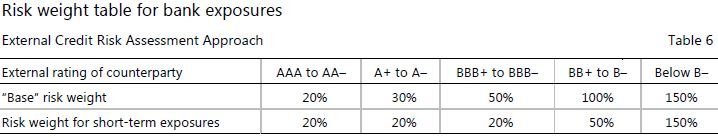

# 話すポイント集

# Introduction
## 前置き
- 今回の発表では、この文章で記載されている内容のうち、Standardised approach for credit riskの内容について紹介する。
- この文章では、Standardised approach for credit riskのほかに以下の内容が記載されている。
  - Internal ratings-based approach for credit risk
  - Minimum capital requirements for CVA risk
  - Minimum capital requirements for operational risk
  - Output floor(p137～)
  - Leverage ratio(p140～)
  - Annex: Leverage ratio(p155～)

# Standardized approach for credit risk
## Standardized approach for credit riskとは
- Basel規制第1の柱（Pillar 1）のうち、RWAの分母の部分の一部、信用リスクから発生するRisk-Weighted Asset(以下、RWA)の計算の方法の１つ。
- 最低所要自己資本比率規制の式
$\frac{\mathrm{(CET1 + AT1 + Tier2)}}{\mathrm{RWAs}(\mathrm{credit, operational,liquidity risks})} \ge 8\%$
- この式を構成する信用リスクから発生するRWAの計算方法は大きく以下の2つ
  - Standardized approach for credit risk
  カウンターパーティーや対象証券の外部格付けを用いてRWAを計算。外部格付けとRisk Weight(以下、$RW$)をマッピング。
  $RWA_c = \Sigma Exposure_i \times \mathrm{RW}_i$
  $RWA_c$: 信用リスクから発生するRWA
  $Exposure_i$: 商品$i$のエクスポージャー
  $\mathrm{RW}_i$: 商品$i$にかかるリスクウェイト。カウンターパーティーの外部格付け、当該商品$i$の外部格付けにより決定。 
  - Internal ratings-based approach for credit risk
  ...

## ポイント
- RWAの過度な変化を防ぐ
  - Due diligence requirements
  - RWの見直し

## RWの決め方詳細
### 1. Exposures to sovereigns
- ソブリン、中央銀行へのエクスポージャー
- 各国当局の裁量で外部格付けで決まるRWよりも低い値を適用可能。

### 2. Exposures to non-central government public sector entities(PSEs)
- 政府関係機関向け円建てエクスポージャー: 10%
- 地方3公社向け円建てエクスポージャー: 20%
- 外貨建てエクスポージャー: 国の格付けによって、金融機関向けエクスポージャーに従って決まる

### 3. Exposures to multilateral development banks(MDBs)
- 以下の0%要件を満たすか？
  1. #TODO
  2. 
- 満たさない場合&&規制目的で外部格付け使用可能な法域に自銀行が存在する場合、以下で判定↓

- 上記いずれも満たさない場合、50%のリスクウェイト

### 4. Exposures to banks
Risk weight determination
(a). External Credit Risk Assessment Approach(ECRA)

(b). Standardised CreditRisk Assessment Approach(SCRA)
- 銀行のグレードを3つに分けて、リスクウェイトを決定。

### 5. Exposures to covered bond
Eligible assets
Disclosure requirements
- カバードボンドについて説明
- 裏付け資産のついた社債のこと。資産の価値が下がると元利払いが滞る。

- そのため名指しでリスクウェイト決められるくらい規制が厳しくなった？

### 6. Exposures to securities firms and other financial institutions
- 金融機関向けエクスポージャー

### 7. Exposures to corporates
7.1 General corporate exposures
Risk weight determination
#### 規制目的で外部格付けを利用できる法域の銀行の場合
- 以下のマップをベースに決まる

- 外部格付けのRWを使用。銀行がデューデリジェンスによって当該企業の評価を行い、もし外部格付けより低いと判定した場合、1つ上のRWバケットを割り当てる。

#### 規制目的で外部格付けを利用できる法域の銀行の場合
- 

7.2 Special lending
### 8. Subordinated debt, equity and other capital instruments
### 9. Retail exposures
### 10. Real estate exposure class
10.1 Exposures secured by residential real estate
10.2 Exposures secured by commercial real estate
10.3 Land acquisition, development and construction exposures
### 11. Risk weight multiplier to certain exposures with currency mismatch
### 12. Off-balance sheet items

### 13. Defaulted exposures
### 14. Other assets

# Introduction

# A. Individual exposure
- 

# B. Recognition of external ratings by national supervisors 
規制目的で外部格付けを使用できる管轄区域において、銀行は、スタート地点として、98〜116項に従って、国家監督当局によって資本目的の適格であると認められる外部の信用評価機関による評価を使用する
1. The recognition process
2. Eligibility criteria

# C. Implementation considerations in jurisdictions that allow use of external ratings for regulatory purpose
C.Implementation considerations in jurisdictions that allow use of external ratings for regulatory purposes
1. The mapping process
2. Multiple external ratings
3. Determination off whether an exposure is rated: Issue-specific and issuer ratings
4. Domestic Currency and foreign currency
5. Short-term/long-term ratings
6. Level of application of the rating
7. Use of unsolicited ratings

# D. Credit risk mitigation technique for exposures risk-weighted under the standardised approach

D. Credit risk mitigation techniques for exposures risk-weighted under the standardised approach
1. Overarching issues
(1) Introduction
(2) General requirements
(3) Legal requirements
(4) General treatment of maturity mismatches
(5) Currency mismatches
2. Overview of credit risk mitigation techniques
(1) Collateralised transactions
(2) On-balance sheet netting
(3) Guarantees and credit derivatives
3. Collateralised transactions
(1) General requirements
(2) The simple approach
Eligible financial collateral under the simple approach
Exemptions under the simple approach to the risk-weight floor
(3) The comprehensive approach
(a) General requirements for the comprehensive approach
(b) Eligible financial collateral under the comprehensive approach
(c) Calculation of capital requirement for transactions secured by financial collateral
(d) Adjustment for different holding periods and non-daily mark-to-market or remargining
(e) Exemptions under the comprehensive approach for qualifying repo-style transactions involving core market participants
(f)Treatment under the comprehensive approach of SFTs covered by master netting agreements
(4) Minimum haircut floors for SFTs
(5) Collateralised OTC derivatives transactions
4. On-balance sheet netting
5. Guarantees and credit derivatives
(1) Operational requirements for guarantees and credit derivatives
(2) Specific operational requirements for gurantees
(3) Specific operational requirements for credit derivatives
(4) Range of eligible guarantors(counter-guarantors)/protection providers and credit derivatives
(5) Risk-weight treatment of transactions in which eligible credit protection is provided
General risk-weight treatment
Proportional cover
Tranched cover
(6) Currency mismatches
(7) Sovereign guarantees and counter-guarantees

@import "./d424/TechnicalGlossary.md"

# そもそも
Basel 3の目的はRWAの過度な変動を減らすことである。
Basel1→Basel2

Basel 2の施行直後の2008のリーマンショック時、金融機関の損失はCVAの過度な損失から発生した。
モノラインへの信用集中→これをどう防ぐか？

Basel規制では、このRWAの過度な変動を減らすために、資本規制がかかってくる。
(普通株等Tier1 + その他Tier1 + Tier2) / RWAs(信用リスク+オペレーショナルリスク+流動性リスク) >= 8%

## [捕捉] 信用リスクの

## Basel規制3つの柱
### 第1の柱：最低自己資本比率
- 
### 第2の柱：銀行勘定の市場リスク、リスク計測体制・手続き
### 第3の柱：情報開示

■Standardised approach for credit riskとは
Standardised approach for credit riskと
Internal ratings-based approach for credit riskは、銀行が信用リスクのリスクベース資本要件を計算する方法である。（最低限の）
Standardised approachとInternal ratings-based approachの違いは、△△     である。

