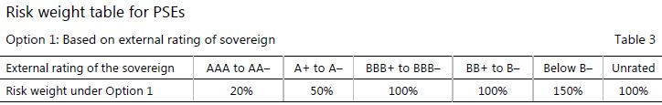
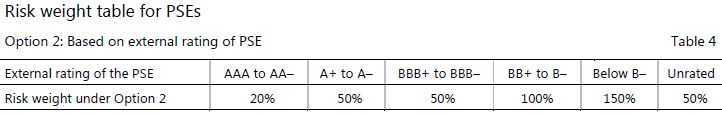
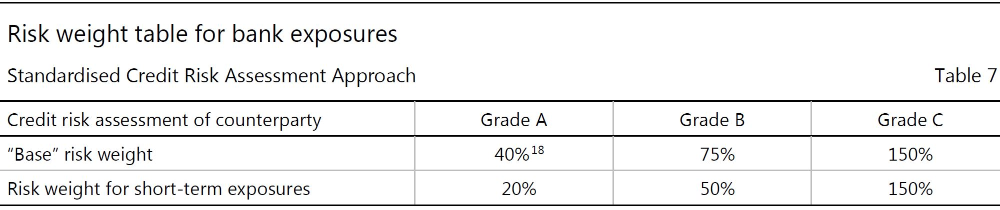
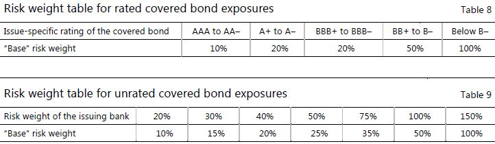
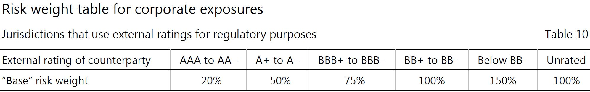
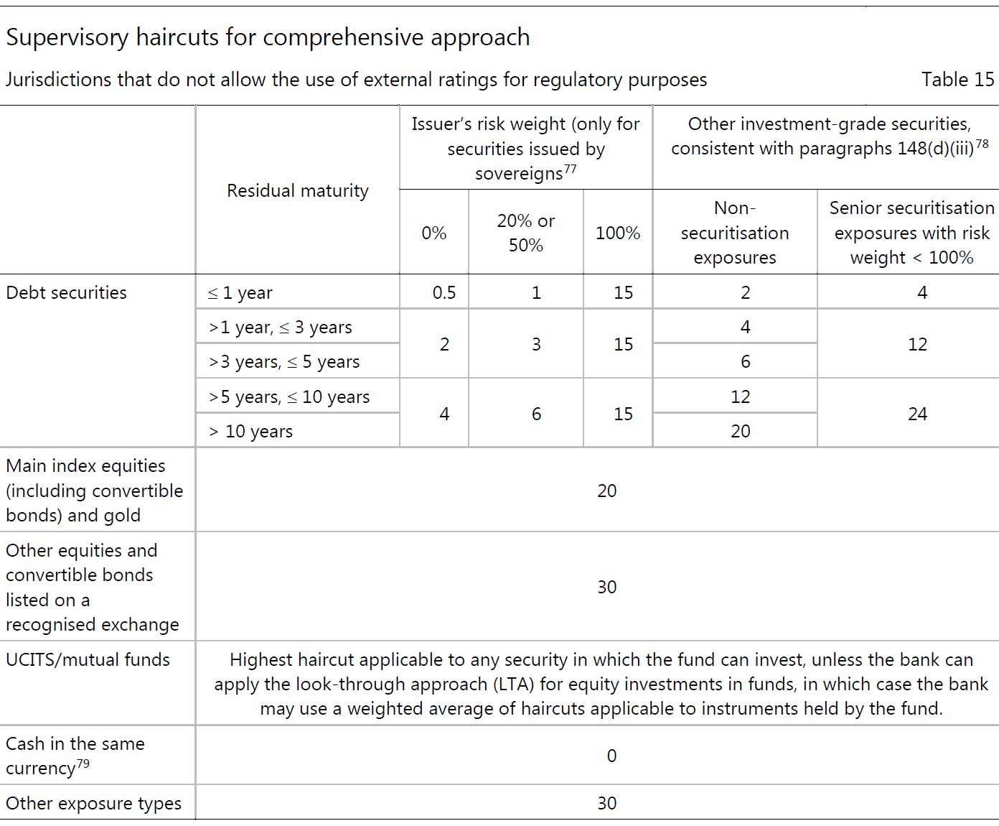
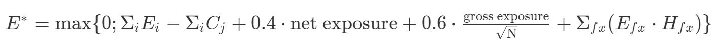

<!-- TOC -->

- [Standardized Approach for credit risk](#standardized-approach-for-credit-risk)
    - [Introduction](#introduction)
    - [A. Individual exposures](#a-individual-exposures)
        - [Due diligence requirements](#due-diligence-requirements)
        - [1. Exposures to sovereigns](#1-exposures-to-sovereigns)
        - [2. Exposures to non-central government public sector entities(PSEs)](#2-exposures-to-non-central-government-public-sector-entitiespses)
        - [3. Exposures to multilateral development banks(MDBs)](#3-exposures-to-multilateral-development-banksmdbs)
        - [4. Exposures to banks](#4-exposures-to-banks)
            - [Risk weight determination](#risk-weight-determination)
                - [(a). ExternalCredit Risk Assessment Approach(ECRA)](#a-externalcredit-risk-assessment-approachecra)
                - [(b). Standardised CreditRisk Assessment Approach(SCRA)](#b-standardised-creditrisk-assessment-approachscra)
        - [5.Exposures to covered bond](#5exposures-to-covered-bond)
            - [Eligible assets](#eligible-assets)
            - [Disclosure requirements](#disclosure-requirements)
        - [6. Exposures to securities firms and other financial institutions](#6-exposures-to-securities-firms-and-other-financial-institutions)
        - [7. Exposures to corporates](#7-exposures-to-corporates)
            - [7.1 General corporate exposures](#71-general-corporate-exposures)
                - [Risk weight determination](#risk-weight-determination-1)
            - [7.2 Special lending](#72-special-lending)
        - [8. Subordinated debt, equity and other capital instruments](#8-subordinated-debt-equity-and-other-capital-instruments)
        - [9. Retail exposures](#9-retail-exposures)
        - [10. Real estate exposure class](#10-real-estate-exposure-class)
            - [10.1 Exposures secured by residential real estate](#101-exposures-secured-by-residential-real-estate)
            - [10.2 Exposures secured by commercial real estate](#102-exposures-secured-by-commercial-real-estate)
            - [10.3 Land acquisition, development and construction exposures](#103-land-acquisition-development-and-construction-exposures)
        - [11. Risk weight multiplier to certain exposures with currency mismatch](#11-risk-weight-multiplier-to-certain-exposures-with-currency-mismatch)
        - [12. Off-balance sheet items](#12-off-balance-sheet-items)
        - [13. Defaulted exposures](#13-defaulted-exposures)
        - [14. Other assets](#14-other-assets)
    - [B. Recognition of external ratings by national supervisors](#b-recognition-of-external-ratings-by-national-supervisors)
        - [1. The recognition process](#1-the-recognition-process)
        - [2. Eligibility criteria](#2-eligibility-criteria)
    - [C.Implementation considerations in jurisdictions that allow use of external ratings for regulatory purposes](#cimplementation-considerations-in-jurisdictions-that-allow-use-of-external-ratings-for-regulatory-purposes)
        - [1. The mapping process](#1-the-mapping-process)
        - [2. Multiple external ratings](#2-multiple-external-ratings)
        - [3. Determination off whether an exposure is rated: Issue-specific and issuer ratings](#3-determination-off-whether-an-exposure-is-rated-issue-specific-and-issuer-ratings)
        - [4. Domestic Currency and foreign currency](#4-domestic-currency-and-foreign-currency)
        - [5. Short-term/long-term ratings](#5-short-termlong-term-ratings)
        - [6. Level of application of the rating](#6-level-of-application-of-the-rating)
        - [7. Use of unsolicited ratings](#7-use-of-unsolicited-ratings)
    - [D. Credit risk mitigation techniques for exposures risk-weighted under the standardised approach](#d-credit-risk-mitigation-techniques-for-exposures-risk-weighted-under-the-standardised-approach)
        - [1. Overarching issues](#1-overarching-issues)
            - [(1) Introduction](#1-introduction)
            - [(2) General requirements](#2-general-requirements)
            - [(3) Legal requirements](#3-legal-requirements)
            - [(4) General treatment of maturity mismatches](#4-general-treatment-of-maturity-mismatches)
            - [(5) Currency mismatches](#5-currency-mismatches)
        - [2. Overview of credit risk mitigation techniques](#2-overview-of-credit-risk-mitigation-techniques)
            - [(1) Collateralised transactions](#1-collateralised-transactions)
            - [(2) On-balance sheet netting](#2-on-balance-sheet-netting)
            - [(3) Guarantees and credit derivatives](#3-guarantees-and-credit-derivatives)
        - [3. Collateralised transactions](#3-collateralised-transactions)
            - [(1) General requirements](#1-general-requirements)
            - [(2) The simple approach](#2-the-simple-approach)
                - [Eligible financial collateral under the simple approach](#eligible-financial-collateral-under-the-simple-approach)
                - [Exemptions under the simple approach to the risk-weight floor](#exemptions-under-the-simple-approach-to-the-risk-weight-floor)
            - [(3) The comprehensive approach](#3-the-comprehensive-approach)
                - [(a) General requirements for the comprehensive approach](#a-general-requirements-for-the-comprehensive-approach)
                - [(b) Eligible financial collateral under the comprehensive approach](#b-eligible-financial-collateral-under-the-comprehensive-approach)
                - [(c) Calculation of capital requirement for transactions secured by financial collateral](#c-calculation-of-capital-requirement-for-transactions-secured-by-financial-collateral)
                - [(d) Adjustment for different holding periods and non-daily mark-to-market or remargining](#d-adjustment-for-different-holding-periods-and-non-daily-mark-to-market-or-remargining)
                - [(e) Exemptions under the comprehensive approach for qualifying repo-style transactions involving core market participants](#e-exemptions-under-the-comprehensive-approach-for-qualifying-repo-style-transactions-involving-core-market-participants)
                - [(f)Treatment under the comprehensive approach of SFTs covered by master netting agreements](#ftreatment-under-the-comprehensive-approach-of-sfts-covered-by-master-netting-agreements)
            - [(4) Minimum haircut floors for SFTs](#4-minimum-haircut-floors-for-sfts)
            - [(5) Collateralised OTC derivatives transactions](#5-collateralised-otc-derivatives-transactions)
        - [4. On-balance sheet netting](#4-on-balance-sheet-netting)
        - [5. Guarantees and credit derivatives](#5-guarantees-and-credit-derivatives)
            - [(1) Operational requirements for guarantees and credit derivatives](#1-operational-requirements-for-guarantees-and-credit-derivatives)
            - [(2) Specific operational requirements for gurantees](#2-specific-operational-requirements-for-gurantees)
            - [(3) Specific operational requirements for credit derivatives](#3-specific-operational-requirements-for-credit-derivatives)
            - [(4) Range of eligible guarantors(counter-guarantors)/protection providers and credit derivatives](#4-range-of-eligible-guarantorscounter-guarantorsprotection-providers-and-credit-derivatives)
            - [(5) Risk-weight treatment of transactions in which eligible credit protection is provided](#5-risk-weight-treatment-of-transactions-in-which-eligible-credit-protection-is-provided)
                - [General risk-weight treatment](#general-risk-weight-treatment)
                - [Proportional cover](#proportional-cover)
                - [Tranched cover](#tranched-cover)
            - [(6) Currency mismatches](#6-currency-mismatches)
            - [(7) Sovereign guarantees and counter-guarantees](#7-sovereign-guarantees-and-counter-guarantees)
- [サンプル取引のRWA計算](#サンプル取引のrwa計算)
- [用語集](#用語集)
- [課題](#課題)
    - [疑問点](#疑問点)

<!-- /TOC -->
# Standardized Approach for credit risk
## Introduction
1-3

## A. Individual exposures
Due deligence:
1年に最低1回、リスクプロファイルと取引相手の特徴を把握しましょう。
金融グループの所属する企業であっても取引企業単体でのデューデリを可能な限り行うべき。
→実際どのくらい監査で見られているのか？

最初のThe standardised approachは、第4項から第97項に記載されているように、標準化されたリスクウエイトをエクスポージャーに割り当てるもの

4. バーゼルⅡの枠組み（2006年6月）の信用リスク評価5および733〜735項の委員会のガイダンスと一致して、銀行は十分な理解を確実にするためにデューデリジェンスを実施しなければならず、 （少なくとも年に一度）、リスクプロファイルと取引相手の特徴を把握する必要があります。格付けが使用される場合、リスク管理目的のエクスポージャーのリスクと、適用されるリスクウェートが適切かつ慎重であるかどうかを評価するためには、デューデリジェンスが必要です6デューディリジェンスの洗練は、銀行の規模と複雑さ'活動。銀行は、取引相手ごとに適切な第三者に委託された内部信用分析および/またはその他の分析を通じて、営業および財務業績の水準および動向を評価するための妥当かつ適切な措置を講じる必要があります。銀行は、デューデリジェンス分析を完了するために、定期的に取引相手に関する情報にアクセスできる必要があります。
5. 連結グループに属する事業体へのエクスポージャーについては、信用エクスポージャーがあるソロエンティティレベルでデューデリジェンスを可能な限り実施すべきである。ソロ・エンティティの返済能力を評価する際に、銀行はグループの支援とグループの問題によって悪影響を受ける可能性を考慮に入れることが期待される。
6. 銀行は、適切なリスクウェートがカウンターパーティーに確実に配分されるように、有効な内部方針、プロセス、システムおよびコントロールを実施すべきである。銀行は、デューデリジェンス分析が適切であることを監督当局に示すことができなければならない。監督当局は、監督当局のレビューの一環として、銀行がデュー・ディリジェンス分析を適切に実施したことを保証し、これが行われていない場合には監督上の措置を講じるべきである。

### Due diligence requirements
### 1. Exposures to sovereigns
7. ソブリンおよび中央銀行に対するエクスポージャーは、以下のようにリスク加重される

8. 国の裁量で、国内通貨建てのソブリン（または中央銀行）への銀行のエクスポージャーには、リスクの軽重が適用され、その通貨で資金提供される7）。この裁量が行なわれる場合、他の国家監督当局も許可するその銀行は、その通貨で資金提供されたこのソブリン（または中央銀行）に対する国内通貨エクスポージャーに同じリスクウェートを適用する。
9. 主権者へのリスク加重エクスポージャーの目的で、監督当局は、輸出信用機関Exprot Credit Agency（ECA）によって割り当てられたカントリーリスクスコアを認識することがある。資格を得るためには、ECAはリスクスコアを公表し、OECDが合意した方法論に加入しなければならない。銀行は、監督当局が認める個々のECAが発行するリスクスコア、または「公式にサポートされている輸出クレジットの手配」に参加しているECAのコンセンサスリスクスコアを使用することを選択することができる9 OECDが合意した方法論は、最低限の輸出保険料で。これらのECAリスクスコアは、以下に詳述するようにリスク加重カテゴリーに対応する。

10. 国際収支、国際通貨基金、欧州中央銀行、欧州連合、欧州安定性メカニズム（ESM）および欧州金融安定化機構（EFSF）のための当行に対するエクスポージャーは、リスクウェイト0％を受ける可能性がある。

7-10
- ポイント
### 2. Exposures to non-central government public sector entities(PSEs)
（バーゼルⅡの枠組み（2006年6月）から変更されていない処理については、現在の銀行オプションの参照を削除するためにわずかな編集上の変更しか加えられていない。
11. 国内PSEへのエクスポージャーは、以下の2つのオプションのいずれかに従って、国の裁量でリスク加重される。

12. 国内の裁量により、特定の国内PSEsへのエクスポージャーはPSEsが設立された国のソブリンへのエクスポージャーとして扱われることもある。 この裁量が行使された場合、他の国家監督当局は、同様の方法で、その銀行にそのようなPSEへのリスクウェイトエクスポージャーを許可することができる。

11-12
- ポイント
### 3. Exposures to multilateral development banks(MDBs)
13. 資本要件を計算するために、多国間開発銀行（MDB）は、経済社会開発プロジェクトの資金調達および専門的アドバイスを提供する国のグループによって作成された機関です。 MDBsには大規模なソブリンメンバーシップがあり、先進国および/または発展途上国の両方が含まれる可能性がある。各MDBには、独自の法的および運営上のステータスがありますが、同様の権限とかなりの数の共同オーナーがいます。
14. 委員会の満足度を満たすMDBへのエクスポージャーには、以下に示す資格基準を0％のリスクウェートが適用される.11委員会は、ケースバイケースで引き続き適格性を評価する。 0％でリスク加重されるMDBの適格基準は次のとおりです。
（ⅰ）非常に高品質の長期発行体格付、すなわちMDBの外部格付けの大部分はAAAでなければならない
（ii）株主構成が長期発行体の外部格付AA-以上の主権者のかなりの部分を構成するか、またはMDBの資金調達の大半が払込資本/資本の形態であり、またはレバレッジなし。
（ⅲ）株主から寄付された払込資本金の額によって示される強い株主支援。 MDBが必要に応じて債務を返済するために必要とする追加資本の額。継続的な資本拠出とソブリン株主からの新たな約束
（iv）適切な水準の資本と流動性（各MDBの資本と流動性が適切かどうかを評価するために、ケースバイケースのアプローチが必要である）。そして、
（v）構造的承認プロセス、内部信用力およびリスク集中限度額（国、部門、個人エクスポージャーおよび信用カテゴリーごと）、取締役会による大規模なエクスポージャー承認、またはその他の条件を含む厳しい法定融資要件および保守的財務方針取締役会の委員会、固定償還スケジュール、収益の有効な監視、状況審査プロセス、およびリスクの厳格な評価および貸倒引当金のプロビジョニングを含む。
15. 他のすべてのMDBへのエクスポージャーについては、規制目的で外部格付けを使用できるようにする法域にある銀行は、表5に従って外部格付けによって決定された対応する「ベース」リスク加重をMDBエクスポージャーに割り当てることになる。規制目的のために外部格付を認めていないものは、そのようなエクスポージャーをリスクウエートで50％リスクウェイトにする。

13-15
- ポイント

### 4. Exposures to banks
- ポイント
16. 資本要件を計算する目的のために、銀行エクスポージャーは、銀行からの預金を引き受けることを認可された金融機関の発行証券（第53項の目的のために劣後債とみなされない限り、 劣後債の借入金および株式に関連する処遇は、パラグラフ49から53に記載されている。

#### Risk weight determination
- ポイント
17. 銀行エクスポージャーは、以下の階層に基づいてリスク加重される
（a）外部信用リスクアセスメントアプローチ（ECRA）：このアプローチは、規制目的で外部格付けを使用できるようにする法域にある銀行向けである。 これは、格付けされた銀行へのエクスポージャーすべてに適用されます。 銀行は、98〜116項を適用して、どの格付けを使用できるか、どのエクスポージャーを使用するかを決定する。
（b）標準化された信用リスクアセスメントアプローチ（SCRA）：このアプローチは、規制目的で外部格付の使用を認めない法域にある銀行のすべてのエクスポージャーに関するものである。 格付けされていない銀行へのエクスポージャーについては、このアプローチは規制目的で外部格付けを使用できるような法域にある銀行にも適用される。

##### (a). ExternalCredit Risk Assessment Approach(ECRA)
- ポイント
- 外部格付の使用が許されている法域向け
- 外部格付リスクウェイトの割り当てとデューデリジェンスによる適用格付けの適切な判定

18. 規制目的のために外部格付けを利用できるようにする法域に組み込まれた銀行は、外部格付けによって決定された対応する「ベース」リスク加重を表6に従って格付銀行エクスポージャー15に割り当てる。この格付けは、暗黙の政府支援の仮定格付けが政府の公的銀行を参照している場合を除きます。16規制目的のために外部格付けを使用できるようにする法域にある銀行は、第21項に従い、格付なしの銀行エクスポージャーに対してのみSCRAを適用しなければなりません。

19. 当初の満期が3ヶ月以下の銀行へのエクスポージャー、および元の満期6か月以内の国境を越えた物品の移動に起因する銀行へのエクスポージャー17には、短期エクスポージャーのリスクウエイトを表6に示す。

20. 銀行は、外部格付けが銀行の取引相手の信用度を適切かつ慎重に反映するように、デュー・ディリジェンスを実施する必要があります。デューデリジェンス分析がエクスポージャーの外部格付けバケット（すなわちAAAからAA-; A +からA-など）によって示唆されたものよりも高いリスク特性を反映する場合、銀行は「ベース」よりも少なくとも1つのバケット"外部格付けによって決定されるリスクウェイト。デューデリジェンス分析は、決して外部レーティングによって決定されるリスクウェイトよりも低いリスクウェイトを適用してはなりません。

##### (b). Standardised CreditRisk Assessment Approach(SCRA)
21. 規制目的で外部格付を使用することを認めていない法域にある銀行は、すべての銀行エクスポージャーにSCRAを適用する。 SCRAは、規制目的で外部格付けを使用することができる法域にある銀行に対する未評価の銀行エクスポージャーにも適用される。 SCRAは、銀行に3つのリスクウェイトバケット（すなわち、グレードA、BおよびC）のいずれかに銀行エクスポージャーを分類させ、表7に対応するリスクウェートを割り当てることを銀行に要求する.SCRAのみを目的として、 第22項から第29項にある"published minimum regulatory requrements"は流動性基準を除外している。

22. 格付Aは、取引先銀行が資産またはエクスポージャーの予測期間および経済サイクルにかかわらず、適時に資金拠出（元本および利息の返済を含む）を満たすのに十分な能力を有する銀行へのエクスポージャーを指すビジネスの条件。
23. グレードAに分類されるカウンターパーティー・バンクは、銀行特有の最小規制要件またはバッファーを除き、組み込まれている法域で実施される国家監督当局によって確立された公表された最小規制要件およびバッファーを満たさなければならない（例えばPillar 2を介して）監督行為を行い、公開されていない。そのような最小規制要件およびバッファ（銀行固有の最小要件またはバッファを除く）が公開されていない場合、またはカウンターパーティーの銀行が利用可能にした場合、カウンターパーティーの銀行はB級またはそれ未満の評価を受けなければなりません。
24. デュー・デリジェンスの一環として、取引銀行が第22項および第23項の格付けAの定義を満たしていないと評価した場合、カウンターパーティ・バンクへのエクスポージャーは、格付Bまたは格付Cに分類されなければならない。

25. 格付Bとは、銀行へのエクスポージャーのことであり、カウンターパーティーの銀行は、安定した好景気や好景気に依存する返済能力など、大きな信用リスクを伴う。
26. グレードBに分類されるカウンターパーティー・バンクは、それが組み込まれている法域で実施される国家監督当局によって確立された公表された最小規制要件（バッファーを除く）を満たさなければならない （例えばバーゼル規制第二の柱を介して）監督行為を行い、公開されていない。 そのような最小限の規制要件が公開されていない場合、またはカウンターパーティーの銀行が利用できるようにした場合、カウンターパーティーの銀行はグレードCとして評価されなければなりません。
27. 銀行は、第22項および第23項に記載された要件を満たさないすべてのエクスポージャーが、第28項および第29項に基づく格付けCに該当しない限り、格付Bに分類する。

28. 格付Cとは、カウンターパーティー銀行が重大なデフォルトリスクを有し、安全マージンが限られている銀行に対する信用リスクエクスポージャーが高いことを指す。これらのカウンターパーティーにとって、不利なビジネス、財務、または経済状況は、財務的コミットメントを達成できない可能性が高い、またはその可能性が高い。
29. 少なくとも、以下のトリガーのいずれかが違反した場合、銀行はエクスポージャーをグレードCに分類する必要があります。
- 取引先銀行は、パラグラフ25および26に規定されているように、公表された最低規制要件に関してグレードBとして分類される基準を満たしていない。または
- 監査された財務諸表が必要な場合、外部監査人は、不適切な監査意見を出しているか、または過去12ヶ月以内に財務諸表または監査報告書の中で継続的な懸念事項として継続するカウンターパーティーの銀行の能力について、
これらの引き金が破られていなくても、銀行は取引先銀行が第28項の定義を満たしていると評価することができる。その場合、そのような取引相手銀行へのエクスポージャーは、グレードCに分類されなければならない
30. 元来の満期が3ヶ月以下の銀行へのエクスポージャー、ならびに元の満期6ヶ月以内の国境を越えた商品の移動に起因する銀行へのエクスポージャー(注釈19)には、表7の短期エクスポージャーのリスクウエートに変更する。
31. SCRAに基づく譲渡性および転換性リスクを反映するために、銀行取引相手が組み込まれている国のソブリンへのエクスポージャーに適用されるリスクウェイトに基づくリスクウェイトフロアは、銀行エクスポージャーに割り当てられたリスクウェートに適用される。ソブリンフロアは、エクスポージャーが債務者銀行の設立の管轄地の現地通貨ではなく、外国の管轄地域の債務者銀行の支店で借り入れられている場合に適用されます。支店が運営されている法域。ソブリンフロアは、商品の移動から生じる自己清算、貿易関連の偶発的な短期（すなわち、1年未満の満期）には適用されない。

- エクスポージャーを3つのバケットに分類
- Grade A(最低リスクウェイト)
  - 分類基準

- Grade B
  - 分類基準
- Grade C(最高リスクウェイト)
  - 分類基準

### 5.Exposures to covered bond
32. カバードボンドは、債券保有者を保護するために特別に監督される法律の対象となる銀行または抵当機関によって発行された債券である。 これらの債券の発行に起因する収入は、債券の有効期間の全期間中、債券に付随する債権をカバーすることができる資産において、法律に準拠して投資されなければならず、 発行者は、元本の返済および未払利息の支払いのために優先的に使用される。
(#TODO ここの記述見直す)

#### Eligible assets
33. パラグラフ35に記載されているリスクウェートの適格性を得るためには、パラグラフ32で定義されたカバードボンドの原資産（カバープール）は、パラグラフ34に規定された要件を満たし、
- ソブリン、その中央銀行、公共部門機関、多国間開発銀行の請求または保証。
- 第60項に規定された基準を満たし、80％以下のローン・バリュー・レシオを有する居住用不動産によって担保された請求。
- 第60項に規定された基準を満たし、60％以下のローン・バリュー・レシオを有する商業用不動産によって担保された請求。または
- 30％またはそれ以下のリスクウェイトの資格を有する銀行の請求または保証。しかし、そのような資産はカバードボンド発行の15％を超えることはできません。
カバードボンド商品に割り当てられた発行者の資産プールの名目価値は、その名目残高を少なくとも10％超えなければならない。この目的のための資産プールの価値は、法的枠組みによって要求されるものである必要はありません。しかし、法的枠組みが少なくとも10％の要件を規定していない場合、発行銀行は、実際にカバープールが10％の要件を満たすことを公的に公表する必要がある。このパラグラフに記載されている主要な資産に加えて、追加の担保には、代替資産（管理目的のためにカバープールを上回るために主資産に代わる現金または短期の流動性および担保付資産）および目的カバード・ボンド・プログラムで生じるリスクをヘッジしている。
このパラグラフで述べられた条件は、カバードボンドの開始時および残りの満期を通じて満たされなければならない。

- ポイント
- 株式:リスクウェイト250%
- その他:リスクウェイト100%もしくは400%
#### Disclosure requirements

34. カバード・ボンドの形態のエクスポージャーは、カバード・ボンドに投資する銀行が以下のことを国家監督当局に示すことができれば、パラグラフ35に記載されている処遇の対象となる。
- （a）少なくとも以下の事項に関するポートフォリオ情報を受け取る：
  - （i）カバープールの価値と未処理のカバードボンド
  - （ii）カバー資産、ローン・サイズ、金利および通貨リスクの地理的分布およびタイプ。
  - （iii）カバー資産およびカバード・ボンドの満期構成。
  - （iv）期日が90日を超えた貸付の割合
- （b）発行者は、ポイント（a）で言及された情報を少なくとも半年毎に銀行に提供する。

35. 第33項および第34項に記載された基準を満たす対象債券は、第98項から第116項に規定された規則に従って、発行特別格付または発行体のリスク加重に基づいてリスク加重されるものとする。リスクウェートは表8に従って決定される。格付けされていないカバードボンドについては、表9に従って発行者のECRAまたはSCRAリスクウェートから推計される。

36. 銀行は、外部格付けが適切にかつ保障的にカバードボンドと発行銀行の信用力を反映するように、デューデリジェンスを実施しなければならない。デューデリジェンス分析がエクスポージャーの外部格付けバケット（すなわちAAAからAA-; A +からA-など）によって示唆されたものよりも高いリスク特性を反映する場合、銀行は「ベース」よりも少なくとも1つのバケット"外部格付けによって決定されるリスクウェイト。デューデリジェンス分析は、決して外部レーティングによって決定されるリスクウェイトよりも低いリスクウェイトを適用してはなりません。

34-36
- ポイント
### 6. Exposures to securities firms and other financial institutions
38. 資本要件を計算する目的で、会社へのエクスポージャーには、エンティティ、団体、パートナーシップ、所有権、信託、ファンド、その他同様の特性を有するエンティティへのエクスポージャー（ローン、債券、債権など）が含まれる 他の暴露クラスの これらの取引相手の劣後債および株式に関連する処遇は、49〜53項で取り扱っている。企業エクスポージャー・クラスには、銀行、証券会社およびその他の金融機関へのエクスポージャーの定義を満たさない保険会社およびその他の金融会社へのエクスポージャーが含まれる それぞれ第16項および第37項に定められている。 企業エクスポージャークラスには、個人へのエクスポージャーは含まれていません。 企業の露出クラスは、以下のサブカテゴリで区別されます。
（i）一般的な企業エクスポージャー。
（ⅱ）第44項に規定される特別貸出エクスポージャー。

- ポイント

### 7. Exposures to corporates
#### 7.1 General corporate exposures
- ポイント
##### Risk weight determination
39. 規制目的のために外部格付けを利用できるようにする法域にある銀行の企業エクスポージャーについては、銀行は表10.22に従って「ベース」のリスク加重を割り当てる。銀行は、外部格付が適切かつ慎重に信用力カウンターパーティーのデリジェンス分析がエクスポージャーの外部格付けバケットに示唆されているリスク特性よりも高いリスク特性を反映している場合には、（表10を参照のこと）すなわちAAAからAA-; A +からA-等）、銀行は、外部格付けによって決定される「ベース」リスクウェートよりも少なくとも1バケット高いリスクウェートを割り当てる必要があります。デューデリジェンス分析は、決して外部レーティングによって決定されるリスクウェイトよりも低いリスクウェイトを適用してはなりません。
40. 規制目的で外部格付けを使用できるようにする法域に設立された銀行の非適格企業エクスポージャーは、43項に記載されている中小企業（SME）への格付けのないエクスポージャーを除いて、100％

41. 規制目的で外部格付けを使用できない法域にある銀行の企業エクスポージャーについては、銀行は以下を除くすべての企業エクスポージャーに100％リスクウェイトを割り当てる。
- 第42項の「投資適格」と特定された法人へのエクスポージャー。そして
- 第43項の中小企業(SME)へのエクスポージャー。
銀行は、第21項に基づいて格付銀行のエクスポージャーにリスクウエイトを割り当てた場合、本項に記載された処遇を企業エクスポージャーに適用しなければならない。
42. 規制目的で外部格付を使用することを認めていない法域の銀行は、「投資適格」法人へのエクスポージャーに65％のリスクウェイトを割り当てることがある。 「投資適格」企業とは、財務上のコミットメントを適時に満たす十分な能力を備えた企業であり、その能力は経済サイクルやビジネス条件の不利な変化に対して堅牢であると評価される。この決定を行う際、銀行はビジネスモデルの複雑さ、業界および同業他社に対する業績、企業の営業環境によってもたらされるリスクを考慮して、投資適格の定義に対して企業を評価すべきである。さらに、法人（またはその親会社）は、有価証券取引所に未行使の有価証券を保有していなければならない。
43. 企業の中小企業に対する非適格エクスポージャー（企業の取引相手が属する連結グループの報告された年間売上高が直近の会計年度において5,000万ユーロ以下である企業エクスポージャーとして定義）の場合、85％リスクウェイトが適用されます。第55項の基準を満たす中小企業へのエクスポージャーは、規制上の小売SMEエクスポージャーとして扱われ、リスクは75％で加重される。

39-43
- ポイント

#### 7.2 Special lending
44. 企業のエクスポージャーは、そのような貸付が法的形式または経済的実体のいずれかで以下の特性の一部または全部を有する場合、専門的貸出エクスポージャーとして扱われる。
- エクスポージャーは不動産に関連しておらず、パラグラフ45に基づくオブジェクトファイナンス、プロジェクトファイナンスまたはコモディティファイナンスの定義の範囲内にある。アクティビティが不動産に関連する場合、処理はパラグラフ59から75に従って決定される。
- エクスポージャーは、通常、物的資産の資金調達および/または運営のために特別に作成されたエンティティ（多くの場合、特殊目的会社（SPV））に適用されます。
- 借入企業は、その他の重要な資産または活動をほとんどまたは全く持たないため、借入金から返済する独立した能力はほとんどありません。債務の返済の主な源泉は、借入企業の独立した能力ではなく、資産によって生み出される収益である。そして
- 義務の条件により、貸し手は、資産とそれが生み出す収入を実質的に支配することができます。
45. 第44項に記載されているエクスポージャーは、以下の3つの専門融資のサブカテゴリのうちの1つに分類される。
- （ⅰ）プロジェクト・ファイナンスとは、貸し手が、返済源と融資の担保の両方として、単一のプロジェクトによって生み出された収益を主に検討する資金調達の方法をいう。この種の資金調達は、通常、発電所、化学プラント、鉱山、輸送インフラストラクチャー、環境、メディア、テレコムなどの大規模で複雑で高価な設備に適用されます。プロジェクトファイナンスは、改善の有無にかかわらず、新規資本設備の建設、または既存設備のリファイナンスの資金調達の形をとることができる。
- （ⅱ）目的金融とは、融資の返済が資金調達された特定の資産によって生み出されたキャッシュフローに依存する設備（船舶、航空機、衛星、鉄道車両など）の取得資金を調達する方法をいう。約束されているか貸し手に割り当てられています。
- （iii）商品金融とは、商品の売却代金から返済される為替商品（原油、金属、または作物など）の準備金、棚卸資産、または受取債権を調達するための短期貸付を指す借り手は、ローンを返済する独立した能力を持っていません。
46. 規制目的のために外部格付を利用できるようにする法域にある銀行は、表10に従って、特定の外部格付けによって決定されたリスクウェートを特化した貸出エクスポージャーに割り当てる（もしあれば利用可能である場合）。 （すなわち、特別な貸出エクスポージャーの場合、パラグラフ107は適用されない）。
47. 特定の外部格付けが利用できない特別な貸出エクスポージャーおよび規制目的で外部格付けを使用できない法域にある銀行のすべての専門的な貸出エクスポージャーについては、以下のリスクウェイトが適用される。
- 対象と商品のファイナンスエクスポージャーは100％リスク加重される。
- プロジェクトファイナンスエクスポージャーは、運用前フェーズでは130％、運用フェーズでは100％のリスク加重を受ける。 48項に記載されているように、高品質であるとみなされる運用段階のプロジェクト・ファイナンス・エクスポージャーは、リスク加重80％となる。この目的のために、運用段階とは、プロジェクトの資金調達のために具体的に作成された企業が、（i）残りの契約上の義務をカバーするのに十分な正味正味キャッシュフローと、（ii）長期債務の減少。

48. プロジェクト・ファイナンスの質の高いexposureとは、財務的コミットメントをタイムリーに満たすことができるプロジェクト・ファイナンス事業体へのエクスポージャーを指し、その能力は、経済サイクルおよびビジネス条件の不利な変化に対して堅固であると評価される。次の条件も満たさなければなりません。
- プロジェクトファイナンス事業体は、債権者の利益を害するような行為（例えば、既存の債権者の同意なしに追加の債務を発行することができないこと）に制限されている。
- プロジェクトファイナンス事業体は、プロジェクトのコンティンジェンシー資金と運転資本要件をカバーするための十分な準備資金またはその他の資金調達を有している。
- 収益は、可用性ベースであるか、または収益率規制または引受/支払契約に従う。
- プロジェクトファイナンス事業体の収益は1つの主要カウンターパーティーに依存し、この主要カウンターパーティーは中央政府、PSE、またはリスクウェイトが80％以下の法人でなければならない。
- プロジェクトファイナンス事業体へのエクスポージャーを規定する契約条項は、プロジェクトファイナンス事業体の不履行が生じた場合の債権者に対する高度の保護を提供する。
- 主要カウンターパーティーまたは主要カウンターパーティーの適格基準に準拠している他のカウンターパーティー

44-48
- ポイント

### 8. Subordinated debt, equity and other capital instruments
49. 第50項から第53項に記載されている処遇は、企業または銀行が発行した劣後債、株式およびその他の規制資本金融商品に適用される。但し、これらの金融商品は規制上の資本から控除されないか、バーゼルIIIの枠組みの90（2011年6月）。株式エクスポージャーは、本商品の経済的実体に基づいて定義されています。これには、直接または間接所有権（投票権を有するか否かに関わらず）を、営利企業または連結または控除されていない金融機関の資産および収益に含める。以下のすべての要件を満たしている場合、商品は株式エクスポージャー（自己資金投資）とみなされます。
- 投資資金の返済は、投資の売却または投資の権利の売却または発行体の流動化によってのみ達成できるという意味では不可能である。
- 発行者の側で義務を具現化していない。そして
- 発行者の資産または所得に関する残存クレームを伝える。
さらに、以下のいずれの商品もエクイティエクスポージャーに分類されなければならない
- 銀行組織のTier 1資本として認められているものと同じ構造の金融商品。
- 発行者側の義務を具現し、次のいずれかの条件を満たす証書。
1）発行者は、債務の和解を無期限に延期することができる。
2）義務は、一定数の発行者株式を発行することによって決済を要求する（または発行者の裁量で許可する）。
3）義務は、発行者の株式の変動する数を発行することによって義務を要求する（または発行者の裁量で許可する）。義務の価値の変化は、それに匹敵し、同程度であり、同じ方向である発行者の持分株式の一定数の価値の変更、25または、
4）保有者は、（i）取引された商品の場合、監督当局は、当該商品が当該商品の借入金に似ていることを証明していることを証明した内容に該当する場合を除き、 （ii）非トレーディング商品の場合、監督当局は、当該金融商品が負債ポジションとして扱われるべきであることを銀行が実証していることに満足している。 （ⅰ）および（ⅱ）の場合、監督当局の同意を得て、規制目的でリスクを分解する可能性があります。
株式所有権の経済的実体を伝達する目的で構成された債務債務その他の有価証券、パートナーシップ、デリバティブまたはその他の媒体は、持分保有とみなされる26.これには、リターンが株式の収益に結びついている負債が含まれる27.逆に、債務保有または証券化エクスポージャーの経済的実体を伝達する意図を持って構成されているものは、持分保有とはみなされない。

50. 銀行は、パラグラフ51に記載されている投機的非上場株式エクスポージャーに400％のリスク加重を、その他の持株には250％のリスク加重を割り当てる。但し、パラグラフ52で言及されているequity holdingsを除く。.29
51. 投機的非上場株式エクスポージャーは、短期再売却目的で投資される非上場企業への持分投資として定義されるか、またはベンチマーク・キャピタルまたは類似の投資とみなされ、将来のキャピタル・ゲインを見越して取得される。
52. 国家監督当局は、銀行への投資に相当な補助金を提供し、政府の監督と株式投資の制限を伴う国内法制定プログラムに基づいて行われた株式保有に対して、銀行が100％のリスクウェートを割り当てることを認めている。このような扱いは、銀行のTier1資本とTier2資本の合計資本の10％を上限とする持分保有にのみ付与することができます。制限の例は、銀行が投資している事業の規模と種類、許容可能な持分金額、地理的位置、および銀行への潜在的な投資のリスクを制限するその他の関連要因に対する制限です。
53. 銀行は、株式以外の劣後債および資本証券に対して150％のリスク加重を割り当てる。 TLAC保有基準（2016年10月）に示され、規制資本から控除されないバーゼルⅢの改訂版パラグラフ66bおよび66cの「その他のTLAC負債」の定義を満たす負債は、この段落の目的。

-53
- ポイント
- 劣後債務:リスクウェイト150%

### 9. Retail exposures
54. リテール・エクスポージャーは、個人または規制小売SMEsへのエクスポージャーである.31不動産担保リテール・エクスポージャーは、パラグラフ59から75に従って処理される。その他のリテール・エクスポージャーは、パラグラフ55から58 。
55. 下記の基準のすべてを満たすリテール・エクスポージャーは、「規制上の小売」エクスポージャーに分類され、75％でリスク加重される。デフォルトの小売エクスポージャーは、小規模基準を評価する際に、規制上の小売ポートフォリオ全体から除外される。
- 商品の基準：エクスポージャーは、回転クレジットと信用枠（クレジットカード、チャージカード、当座貸越を含む）、個人向け長期貸出金（例えば、割賦ローン、オートローンとリース、学生および教育機関ローン、個人金融）と
中小企業の施設と約束。上場の有無にかかわらず、住宅ローン、デリバティブおよびその他の有価証券（債券および株式など）は、このカテゴリーから特に除外されています。
- 個々のエクスポージャーの価値が低い：1つのカウンターパーティに対するエクスポージャーの最大エクスポージャーは、100万ユーロの絶対的な閾値を超えることはできません。
・細分性基準：規制当局の小売ポートフォリオの十分な多様化を確実にする別の方法を国家監督者が決定していない限り、1つの取引先へのエクスポージャーは合計で0.2％33を超えることはできません。
56. 取引者として適格である債務者から生じる第55項の基準を満たす「規制上の小売」エクスポージャーは、リスク加重45％となる。トランスアクタは、クレジットカードやチャージカードなどの施設に関連する債務者であり、過去12ヶ月間の予定返済日に残高が全額返済されます。過去12ヶ月間の貸倒引当金がなかった場合、当座貸越ファシリティに関連する債務者もまた取引手数料とみなされる。
57. 「その他の小売」：第55項のすべての基準を満たさない個人または個人へのエクスポージャーは、100％リスク加重される。
58. パラグラフ55のすべての基準を満たさない中小企業へのエクスポージャーは、不動産によって担保されていない限り、パラグラフ43に基づく企業SMEエクスポージャーとして扱われる。

-58
- ポイント
- 不動産担保以外:取引種類に応じたリスクウェイト:
45%～100%

### 10. Real estate exposure class
59. 表11,12,13および14のリスクウェイト、およびパラグラフ65および71に記載されたアプローチは、構造的要因が不動産市場へのエクスポージャーに関連して持続的に低い信用損失をもたらす法域に適用される。国家監督当局は、デフォルトの経験および市場価格の安定性などの他の要因に基づいて、対応するリスクウェイトテーブルのリスクウェイトが低すぎるかどうかを評価すべきである。監督当局は、法域の銀行にこれらのリスクウェイトを適切に増やすよう要求することがあります。
60. 表11,12,13および14のリスクウェイト、ならびにパラグラフ65および71に記載されているアプローチを適用するには、ローンは以下の要件を満たさなければならない。
•最終財産：エクスポージャーを確保する財産は、完全に完了している必要があります。この要件は、森林および農地には適用されない。国家の裁量により、監督当局は、建設中の居住用不動産または居住用不動産が建設される土地によって担保されている個人への貸付に対してパラグラフ64および65で説明したリスクウェイト処理を適用することができます。実際には、第74項に記載されている土地の取得、開発および建設のエクスポージャーに間接的に融資するものではなく、借り手の主たる住居となる個人向け住宅ユニットの1対4の住宅である。 （ii）関連するソブリンまたはPSEが、施工中の不動産の完成を保証する法的権限と能力を有する場合。
- 法的執行力：取得した不動産に関するすべてのクレームは、関連するすべての法域において法的に強制可能でなければなりません。担保契約およびそれを支える法的手続きは、銀行が合理的な時間枠内で財産の価値を実現できるようにするものでなければならない。
- 不動産に対するクレーム：ローンは、貸し手の銀行が不動産に対する最初の担保権を保持している不動産に対する債権であるか、または単一の銀行が最初の不動産とそれに続くより低い順位の不動産を保有している（すなわち、別の銀行から）しかし、中位の担保が保有者に法的強制力を有し、効果的な信用リスク緩和手段を担保とする担保権を主張する法域では、先取特権を保有する銀行とは異なる銀行が保有する中位担保権も認められる可能性がある34。 （i）不動産に抵当権を保有する各銀行は、不動産の担保権を保有する他の不動産から独立して当該不動産の売却を開始することができる。 （ii）不動産の売却が公売によって行われていない場合には、先取特権を保有する事業体は、公正な市場価値を得るための妥当な措置を取るか、または任意の権限を行使する場合に得られる最高の価格（すなわち、先取特権を保有している事業体が、劣後担保権を損なう値段で自ら財産を売却することは不可能である）.35
- 借り手の返済能力：借り手は、第61項に従って設定された要件を満たさなければなりません。
- 財産の慎重な価値：LTV（ローン・ト・バリュー）比率の値を決定するためのパラグラフ62の基準に従って、不動産を評価しなければならない。さらに、不動産の価値は、借り手の業績に大きく依存してはならない。
- 必要書類：借り手の返済能力および資産の評価に関する情報を含む、貸出元および監視目的で必要なすべての情報を適切に文書化する必要があります。

61. 国家監督当局は、借り手の返済能力の評価を含む抵当貸付の付与に関して、銀行が引受政策を履行することを確保すべきである。引き受け方針は、貸出金の債務返済率などのメトリックを定義し、そのような評価を行うための対応する関連レベルを指定する必要があります.36引受ポリシーは、抵当貸付の返済関連するメトリクス（財産の占有率など）を含む、財産によって生成されたキャッシュフローに実質的に依存します。各国の監督当局は、それぞれの法域におけるこれらの測定基準の適切な定義とレベルに関するガイダンスを提供することができる。

62. LTV比率は、ローンの金額を財産の価値で割ったものです。国家監督者が銀行に不動産価値を下方修正することを要求しない限り、不動産の価値はオリジネーション時に測定された値に維持される37.異常な特異な事象が発生した場合、価値を調整して不動産価値を永久に下げる必要がある。明示的にその価値を上げるために行われた変更は、LTVでも考慮することができます。 LTV比率を計算するとき、ローン額はローンが償却されるにつれて減少します。
LTV比率は、以下の要件に従って慎重に計算する必要があります。
- ローン金額：未払ローン金額と未払ローンの約定金額が含まれます.38ローン金額は、すべての要件を満たしている貸出銀行の担保付預金口座を除くすべての引当金およびその他のリスク緩和金の総額で計算しなければなりませんオンバランスシート・ネッティングのためのものであり、抵当貸付の償還の唯一の目的のために無条件かつ取消不能に約束されている。
- 財産価値：慎重に保守的な評価基準を使用して独立に評価する必要があります。不動産の価値が慎重に保守的な方法で評価されるようにするには、価格の上昇に対する期待を除外し、現在の市場価格が持続可能な価値を大幅に上回る可能性を考慮して調整する必要がありますローンの人生。国家監督当局は、そのような指針が国内法の下にまだ存在しない場合には、慎重な評価基準を設定する指針を提供すべきである。市場価値が決定できれば、その価値は市場価値より高くすべきではない。
保証または金融担保は、信用リスク緩和の枠組みのもとで適格担保として適格である場合、不動産が担保とするエクスポージャーに関して信用リスク緩和手段として認識される可能性がある。これには、保証のための信用リスク軽減枠組みの運用上の要件を満たしていれば、住宅ローン保険42が含まれる可能性がある。銀行は、エクスポージャー金額の算定において、これらのリスク軽減策を認識することがあります。しかし、適切な信用リスク軽減手法を適用する前に、exposure量に適用されるLTVバケットおよびリスクウェイトを決定する必要があります。

-62
- ポイント

#### 10.1 Exposures secured by residential real estate
63. 居住用不動産エクスポージャーは、住居の性質を有し、住宅目的で占有されることを可能にするすべての適用される法律および規制（すなわち居住用地）を満たす不動産によって保証されるエクスポージャーである。
64. 第60項の要件が満たされ、第67項、第74項および第75項が適用されない場合、総エクスポージャー金額に割り当てるリスクウェイトは、表11のエクスポージャーのLTV比率に基づいて決定される。

65. 第64項のアプローチの代わりに、第60項の要件が満たされ、第67項、第74項および第75項が適用されないことを条件として、法域では最大20％のリスクウェイトを適用することができる残存エクスポージャーに対する脚注45に規定されているように、不動産価値の55％および取引相手のリスクウェート。 44銀行が保有していない不動産上の担保権がある場合、その取扱いは次のとおりです。
- ケース1：銀行は劣後担保を保有しており、銀行が保有していないシニアライテンシーが存在する。すべてのリエンスンの価値が不動産価値の55％を超える場合、リスク・ウェイトの20％に適格である銀行のリエンションの金額は、（ⅰ）不動産価値の55％から上級担保（ii）ゼロ。例えば、€100,000相当の不動産に保有されている個人に70,000ユーロのローンを貸している場合、他の機関が保有する上位10,000,000ユーロの担保権がある場合、銀行は20％のリスクウェイトを45,000ユーロ脚注45によれば、残存曝露25,000ユーロに対するリスクウェイトは75％である（=最大（55,000ユーロ - 10,000ユーロ））。すべてのリエンスンの価値が不動産価値の55％を超えない場合、銀行のエクスポージャーに20％のリスクウェートが適用されます。
- ケース2：銀行が保有していない担保権があり、銀行の先取特権を有しており、他の上級または中等証券は存在しない。すべてのリエンスンの価値が不動産価値の55％を超える場合、20％リスクウェイトの資格を有する銀行のエクスポージャーの部分は、（i）不動産価値の55％、 （ⅱ）銀行のエクスポージャーをすべてのパリ・パスの合計で割ったもの。例えば、€100,000と評価された不動産に保有されている個人に対する€70,000のローンについては、他の機関が保有する10,000ユーロのプライオリティーランクの担保権があります。この銀行は、20％のリスクウェイトを€暴露量は48,125（=€55,000 *€70,000 /€80,000）であり、脚注45によれば残りの暴露量は75％で、21,875ユーロです。すべてのリエンスンの価値が不動産価値の55％を超えない場合、銀行のエクスポージャーに20％のリスクウェートが適用されます。
66. パラグラフ60の要件のいずれかが満たされず、パラグラフ67,74および75が適用されないエクスポージャーについては、適用可能なリスク加重はカウンターパーティのリスク加重となる。
67. 融資サービスの見通しが、他の源泉からの債務を担う借り手の基本的な能力ではなく、融資を保証している財産によって生み出されたキャッシュフローに大きく左右され、第74項および第75項が適用されない場合、リスクエクスポージャーは以下のようにリスク加重される。
- 第60段落の要件が、以下の表12に示されているLTV比に応じて満たされている場合。そして
- パラグラフ60の要件のいずれかが満たされない場合、150％。
これらのキャッシュ・フローの主要な源泉は、通常、リースまたは賃料支払い、または住宅用不動産の売却である。これらのエクスポージャーの特徴は、他の居住用不動産エクスポージャーと比較して、エクスポージャーを確保する財産によって生み出されるキャッシュ・フローに大きく依存することです。

68. 下記の種類のエクスポージャーは、パラグラフ67に記載されている取り扱いから除外され、代わりにパラグラフ64から66に記載されている取り扱いの対象となる。
- 借り手のプライマリ・レジデンスである財産によって保証されたエクスポージャー。
- 収入を生み出す居住住宅ユニットが、一定数以上の不動産または住宅ユニットを住宅ローンに預けている個人に、国家監督当局が指定するように保証するエクスポージャー。
- 居住用不動産が、国内法に基づいて規制されている個人の団体または協同組合に保証されており、そのメンバーに貸付金を担保する物件の一次住居の使用を許可する唯一の目的のもとに存在する暴露。 そして
- 居住用不動産が公営住宅会社および社会目的に役立ち、長期住宅を提供するために存在する国内法の下で規制される非営利団体に暴露されていること。

63-68
- ポイント

#### 10.2 Exposures secured by commercial real estate
69. 商業用不動産エクスポージャーは、パラグラフ63で定義されている居住用不動産ではない不動産によって保証されたエクスポージャーです。
70. 第60項の要件が満たされ、第73項、第74項および第75項が適用されない場合、総エクスポージャー金額に割り当てるリスクウェイトは、表13のエクスポージャーのLTV比率に基づいて決定される。 「カウンターパーティーのリスクウェート」とは、個人へのエクスポージャー75％、中小企業へのエクスポージャー85％、他のカウンターパーティーへのエクスポージャー85％を指し、適用されるリスクウェートは、無担保そのカウンターパーティへのエクスポージャー。

71. 第70項のアプローチの代わりに、第60項の要件が満たされ、第73項、第74項および第75項が適用されない場合、法域は、60％のリスク加重またはカウンターパーティーのリスク加重を適用することができ、いずれか低い方、暴露部分に対しては不動産価値の55％まで、および残余暴露に対するカウンターパーティのリスクウェイトが含まれる。
72. パラグラフ60の要件のいずれかが満たされず、パラグラフ73,74および75が適用されない場合、適用されるリスクウェイトは、カウンターパーティーのリスクウェートとなる。
73. 融資サービスの見通しが、債務返済の基礎となる借り手の能力ではなく、ローンを確保している財産によって生み出されたキャッシュフローに大きく左右される場合
他の情報源から49、パラグラフ74とパラグラフ75が適用されない場合には、以下のようにリスク加重される。
- 第60項の要件が、以下のリスク・ウェイト表14に示されているLTV比率に従って満たされている場合。そして
- パラグラフ60の要件のいずれかが満たされない場合、150％。
これらのキャッシュフローの主要な源泉は、通常、商業用不動産のリースまたはレンタル支払い、または売却である。これらのエクスポージャーの特徴は、他の商業不動産エクスポージャーと比較して、エクスポージャーを確保する財産によって生み出されるキャッシュ・フローに大きく依存することです。

69-73
- ポイント

#### 10.3 Land acquisition, development and construction exposures
74. 土地取得、開発および建設（ADC）エクスポージャー51は、開発および建設目的の土地取得、または住宅または商業用不動産の開発および建設に資金を提供する企業またはSPVへの貸付金を指す。第75項の基準を満たさない限り、ADCエクスポージャーは150％でリスク加重される。
75. 居住用不動産へのADCエクスポージャーは、以下の基準が満たされていれば、リスク加重100％である可能性があります。
- 健全な引受基準は、該当する場合、第60項の要件を満たしている。
- 売却前または賃貸借契約は、総契約額または実質的な持分リスクに相当する額に相当する52。売却前または契約前契約は、法的拘束力のある書面契約でなければならず、購入者/借り手は、契約が終了した場合には没収の対象となります。持分リスクは、借り手が提供した持分の適切な金額が不動産の評価済みの評価額に決定されるべきである。

- ポイント

### 11. Risk weight multiplier to certain exposures with currency mismatch
76. 銀行は、貸出通貨が借り手の収入源の通貨と異なる個人への不動小売り不動産および住宅不動産エクスポージャーの場合、パラグラフ54から58および63から68に従って適用可能なリスクウェイトに1.5倍の乗数を適用し、 150％の最大リスクウェイトを条件とします。
77. 第76項の目的上、未ヘッジ対象エクスポージャーとは、借り手の所得の通貨とローンの通貨との間の通貨の不一致に起因する為替リスクに対する自然または金融ヘッジを有しない借り手へのエクスポージャーを指す。通常の業務手順において、借り手が特定のローンの通貨（例えば、送金、賃貸収入、給与）と一致する外貨収入を受け取る場合、自然なヘッジが存在します。金融ヘッジには、通常、金融機関との法的契約（例えば、先物契約）が含まれる。乗数の適用のために、ヘッジの数にかかわらず、これらの自然または金融ヘッジのみがローン分割の少なくとも90％をカバーする場合に十分であるとみなされる。

- 異なる通貨間のとあるエクスポージャーに対するリスクウェイトの調整項
- ポイント
- ローンの借り入れ通貨と借入人の主要な収入源の通貨が異なる未ヘッジのリテール:リスクウェイトテーブルの1.5倍
- ローンの借り入れ通貨と借入人の主要な収入源の通貨が異なる居住用不動産向けエクスポージャー:リスクウェイトテーブルの1.5倍

### 12. Off-balance sheet items
78. オフバランスシート項目は、クレジット換算係数（CCF）を使用して、信用エクスポージャー相当額に換算される。コミットメントの場合には、コミットされているが未処理のエクスポージャーの額にCCFが掛けられる。これらの目的のために、コミットメントとは、銀行が提供し、クレジットを引き継ぎ、資産を購入したり、代用代金を発行するために顧客が受諾した契約上の取り決めを意味する.53これには、いつでも銀行が無条件に取り消すことができる債務者への事前通知。また、債務者が施設文書に記載された条件に合致しなかった場合には、銀行が取り消すことのできる手配を含みます。店頭デリバティブ取引のカウンターパーティーリスクの加重は、特定の上限を伴わない。
79. 100％CCFが以下の項目に適用されます。
- 貸倒引当金（貸出金および有価証券の財務保証としてのスタンバイ信用状を含む）および受諾（受け入れの性質を伴う裏書を含む）の直接保証。
- 信用リスクが銀行に残っている場合には、売却および買戻契約および資産売却。
- 銀行の証券の貸付または銀行による担保としての有価証券の転記（レポ・スタイルの取引（すなわち、買戻し/リバース・レポ取引および証券貸借/証券借入取引）から生じる場合を含む。担保信用リスクに対するリスク加重処理は、有価証券の貸倒リスクに加えて、または担保として貸付または掲示された有価証券の信用リスクが銀行に残っている担保付担保に加えて適用されなければならない。本項は、取引先の信用リスク基準に従って取り扱われるデリバティブ取引に関連する担保付の担保には適用されない。
- 繰越資産購入、先渡預金及び一部払込株式及び有価証券。これは一定の引落を伴うコミットメントを表す。
- 他のカテゴリーに明示的に含まれていない貸方代替品であるオフバランスシート項目。
80. 基準施設の成熟度にかかわらず、50％のCCFがノート発行施設（NIF）およびリボルビング引受施設（RUF）に適用される。
81. 特定の取引関係の偶発的項目（特定の取引に関連するパフォーマンス債券、ビッド債券、保証およびスタンバイ信用状など）に50％のCCFが適用される。
82. 下位のCCFに適格でない限り、基盤施設の成熟度にかかわらず、コミットメントに40％のCCFが適用される。
83. 商品の移動に起因する短期自己清算取引信用状（例えば、基本的な貨物によって担保されたドキュメンタリ・クレジット）の発行銀行と確認銀行の両方に20％のCCFが適用される。
84. 10％CCFは、銀行がいつでも予告なしに無期限に取り消すことができるコミットメントに適用されるか、または借り手の信用力の低下により自動的にキャンセルされる契約に適用されます。国の監督当局は、実際のコミットメントを取り消す銀行の能力を制約する可能性のある様々な要因を評価し、必要に応じて一定のコミットメントに高いCCFを適用することを検討すべきである。
85. 貸借対照表項目にコミットメントを提供する約束がある場合、銀行は適用可能な2つのCCFのうちの低い方を適用するものとする57.
86. 取引相手の信用リスクに銀行をさらすSFTの信用相当額は、パラグラフ155から178の包括的なアプローチの下で計算される。取引相手の信用リスクに銀行をさらすOTCデリバティブの信用相当額は、銀行は、SFTsとOTCデリバティブの代替案として、監督上の承認を条件として、信用相当額を算定するためのカウンターパーティーの信用リスク基準を定めた内部モデル法を用いることができる。

87. 銀行は、失敗した証券、商品、外国為替取引を最初の日から綿密に監視しなければならない。失敗した取引に関する資本費用は、バーゼルⅡの枠組みの附属書3（2006年6月）に従って計算されなければならない。
88. 銀行は取引されていない有価証券、商品および外国為替取引に関連するリスクに晒されている。取引の予約または会計とは無関係に、規制上の資本要件の目的には、未解決の取引を考慮する必要があります。貸借対照表に表示されない場合（決済日の会計処理）、未確定のエクスポージャー金額には100％CCFが適用されます。銀行は、不安定な取引から生じる信用リスクエクスポージャーを適切に追跡し監視するためのシステムを開発、導入、改善し、適時の行動を促す管理情報を生成することが奨励されている。さらに、そのような取引が配送対支払（DvP）または支払対支払（PvP）の仕組みで処理されない場合、銀行はバーゼルⅡの枠組みの附属書3（2006年6月） 。
89. first-to-default債務またはデフォルト・クレジット・デリバティブを通じた信用保護を提供する銀行は、そのような金融商品の資本要件に従う。最初からデフォルトのクレジット・デリバティブの場合、バスケットに含まれる資産のリスク加重は最大1250％まで集計され、リスク加重資産を得るためにクレジット・デリバティブが提供する保護の名目金額を掛けなければならない量。セカンド・トゥ・デフォルトのクレジット・デリバティブについても同様の扱いとなります。リスクウェイトを集計する際には、リスク加重額が最も低い資産を計算から除外することができます。この処理は、リスク加重額が最も低いn-1資産を計算から除外することができるn番目からデフォルトのクレジット・デリバティブにそれぞれ適用されます。

- ここ大事
- どういう項目がある？
- これらの項目に対してどのように対応される？
- ポイント

### 13. Defaulted exposures
90. 標準的手法によるリスク加重の目的で、デフォルト不履行は、90日を超えて期日を過ぎたもの、またはデフォルト債務者へのエクスポージャーと定義される。デフォルト債務者は、以下の事象のいずれかが発生した借手である。
- 90日以上延滞している重要な与信債務。当座貸越は、顧客が勧告された限度を破るか、または現在の残高よりも小さい限度額についてアドバイスされた時点で期限切れとみなされる。
- 重要な与信債務は未払残高である（例えば、貸出銀行は未払利息を所得として認識しない、または認識されれば同等の金額の引当金を計上する）。
- 償却または勘定別の引当金は、銀行が借り手への信用エクスポージャーを引き受けた後に、信用の質が著しく認識された結果として行われる。
- 信用義務は、重要な信用関連の経済的損失によって売却される。
- 信用義務の悩ましい再編（すなわち、重要な許諾、延期、元本、利息、（関連する場合）手数料による）財務上の義務の低下をもたらす再編は、銀行によって合意されている。
- 借り手の破産または銀行グループに対する借り手の信用義務に関する類似の命令が提出された。
- 借り手は、銀行グループに対する与信債務の返済を回避または遅延させるような破産または類似の保護を求めていたか、または預けられていた。または
- 銀行が、担保の実現などの措置に頼らずに、借り手が与信債務を全額支払う可能性が低いとみなすその他の状況。
91. 小売エクスポージャーについては、債務不履行の定義は、借り手のレベルではなく、特定の与信債務レベルで適用することができます。そのため、借り手による債務不履行は、債務不履行となった銀行グループに対するその他すべての義務を処理するために銀行を必要としません。
92. パラグラフ93に基づいて取り扱われる居住用不動産エクスポージャーを除き、不履行エクスポージャーの無担保または無保証部分は、以下のとおり、特定の引当金および部分償却額を控除したリスク加重額とする。
- 特定の引当金が貸出残高の20％未満である場合、150％のリスクウェート。そして
- 特定の引当金が融資残高の20％以上の場合は100％リスクウェイト。58
93. 借入金を確保している財産によって生み出されたキャッシュ・フローに返済が実質的に依存しない不動産暴露の既定の不動産エクスポージャーは、特定引当金控除後および100％の部分償却控除後にリスク加重される。クレジット・リスク軽減枠組みに従って適格である保証または金融担保は、パラグラフ62に従ってエクスポージャーを計算する際に考慮されることがあります。
94. デフォルトのエクスポージャーの担保部分または保証部分を定義する目的で、適格担保および保証は信用リスク軽減目的と同じである（セクションDを参照）。

- ポイント

### 14. Other assets
95. 他のすべての資産の標準リスクウェイトは、パラグラフ96と97で述べたエクスポージャーを除き、100％となる。
96. リスクウェイト0％は、（i）銀行または輸送中に所有および保有されている現金、 （ii）金地金資産が金金債務に裏付けされている限り、銀行で保有されているか、または割り当てられた基準で別の銀行に保有されている金地金。
97. 収集中の現金品目には、20％のリスクウェートが適用されます。

- ポイント

## B. Recognition of external ratings by national supervisors
### 1. The recognition process
98. 規制目的のために外部格付けを使用することができる法域では、外部信用評価機関(ECAI)として認定された信用格付機関からの信用評価のみが許可される。 国家監督当局は、ECAIがパラグラフ99に列挙された基準を満たしているかどうかを継続的に判断する責任を負い、すべての基準および条件が満たされている請求の種類についてECAI格付けに関してのみ認識を提供すべきである。 国家監督当局は、ECAIの適格性を決定する際に、信用格付け機関のためのIOSCO行動規範の項目59で提供される基準および条件も考慮する必要がある。 ECAIを認定するための監督プロセスは、不必要な参入障壁を避けるために公表されるべきである。
- ポイント
### 2. Eligibility criteria
99. ECAIは、以下の8つの基準のそれぞれを満たさなければならない。
- 客観性:外部評価を割り当てるための方法論は、厳密かつ系統的であり、過去の経験に基づいて何らかの形で検証されなければならない。さらに、外部格付けは、継続的な見直しと財政状態の変化に対応する必要があります。監督当局に認識される前に、厳密なバックテスティングを含む各市場区分の格付手法が少なくとも1年間、好ましくは3年間確立されていなければならない。
- 独立性:ECAIは独立しているべきであり、格付けに影響を与える政治的または経済的圧力を受けてはならない。特に、ECAIは、その潜在的な効果(経済的、政治的またはその他のもの)に基づいて格付け措置を取ることを遅らせたり、控えるべきではない。格付プロセスは、取締役会の構成またはCRAの株主構成が利益相反を生み出すように見える状況において生じる可能性のあるいかなる制約からも、できるだけ自由でなければならない。さらに、ECAIは、法的にも、法的にも、実行可能であれば、他の事業者やアナリストと物理的に格付け業務を分離すべきである。
- 国際的なアクセス/透明性:個々の格付、評価を下支えする重要な要素、格付プロセスに参加した発行者が非選択的に公表されるべきかどうかは、プライベート格付けでない限り、少なくとも両者正当な利子を有し、同等の条件で国内外の居住者を保護する。さらに、ECAIの一般的な手続き、方法論および格付けに達する前提は公に利用可能でなければならない。
- 開示:ECAIは、以下の情報を開示する必要があります。査定された事業体との報酬契約の一般的性質。利益相反、60 ECAIの報酬制度、61不履行の定義、期間、各格付の意味を含む評価方法論。各評価カテゴリで経験された実際のデフォルト率。格付の推移、例えばAA格付けがA期になる可能性などがある。レーティングは、発行後に可能な限り速やかに開示されるべきである。レーティングを開示する際、情報は平等な言葉で提供されるべきであり、信用格付の性質と限界、および投資に不当に頼るリスクを示す。
- リソース:ECAIには、質の高い与信評価を実施するのに十分なリソースが必要です。これらのリソースは、信用評価に価値を付加するために評価された事業体内のシニアおよびオペレーショナル・レベルとの実質的な継続的な接触を可能にすべきである。特に、ECAIは、アナリストに適切な知識と経験を割り当てて、格付け対象の企業または債務のタイプの信用力を評価すべきである。そのような評価は、定性的アプローチと定量的アプローチを組み合わせた方法論に基づいて行われるべきである。
- 信頼性:ある程度、信頼性は上記の基準から導かれる。さらに、独立した当事者(投資家、保険会社、取引パートナー)によるECAIの外部格付けへの依存は、ECAIの格付けの信頼性の証拠である。 ECAIの信頼性は、機密情報の誤用を防止するための内部手続きの存在によっても支えられています。認定資格を得るために、ECAIは複数の国の企業を評価する必要はありません。
- 迷惑な格付けの乱用を行わない:ECAIは、要請された格付けを取得するために企業に圧力をかけるために、非請求格付けを使用してはなりません。監督当局は、そのような行動が特定されていれば、資本充足のために適格であると認めるECAIを継続して認めるべきかどうかを検討すべきである。
- 監督者との協力:ECAIは、方法論への重大な変更を監督当局に通知し、適格性についての初めから継続的な決定を支持するために外部格付およびその他の関連データへのアクセスを提供すべきである。
- ポイント

## C.Implementation considerations in jurisdictions that allow use of external ratings for regulatory purposes
- 規制目的で外部評価を使用できるようにする法域における実施上の考慮事項
### 1. The mapping process
- ポイント
- 具体的にどのように外部評価とリスクウェイトのマッピングを行うか？
- ここでいうmapping processの対象は、外部評価とリスクウェイトであっているか？

100. 監督者は、標準化されたリスク加重の枠組みのもとで利用可能なリスク加重に適格なECAIの格付を割り当てること、すなわち、どの格付けカテゴリーがどのリスクウェートに対応するかを決定する責任がある。マッピングプロセスは客観的でなければならず、上記の表に反映されている信用リスクの水準と一致するリスクウェートの割り当てをもたらすはずです。リスクウェイトの全範囲をカバーする必要があります。
101. このようなマッピングプロセスを実施する場合、監督者が評価すべき要素には、とりわけ、各ECAIが対象とする発行体プールの規模と範囲、それが割り当てる格付けの範囲と意味、使用されるデフォルトの定義ECAIによる。
102. バーゼルⅡフレームワーク(2006年6月)の附属書2は、利用可能なリスクウェイトへの格付けのより一貫したマッピングを促進し、監督者がそのようなプロセスを実施するのを助けるために、そのようなマッピングプロセスをどのように実施するかについて指針を提供する。
103. 銀行は、選択したECAIとその格付を、リスク加重とリスク管理目的の両方で、適格なECAIとして監督者が認識したすべての種類の債権に対して一貫して使用しなければならない。銀行は、異なるECAIによって提供された格付けを「チェリーピック」し、ECAIの使用を任意に変更することはできません。
→その時々で有利なECAIを任意に使用するよう 変更できない。では、銀行はどのタイミングであればECAIを選択することができるのか？

### 2. Multiple external ratings
- 複数の外部格付が存在する場合の対処方法はどのようにしたらよいか？
104. 特定の債権について銀行が選択したECAIによる格付けが1つしかない場合、その格付を用いてエクスポージャーのリスクウェイトを決定すべきである。
105. 特定の債権について銀行が選択した複数のECAIによる格付けが異なるリスクウェートにマッピングされている場合、高いほうのリスクウェイトが適用されます。
106. 特定の債権について銀行が選択した複数のECAIによる格付けがリスクウェイトの異なる3つ以上のレーティングがある場合、最も低いリスクウェートに対応する2つのレーティングを参照する必要があります。 これらが同じリスクウェートを生じさせる場合、そのリスクウェイトを適用する必要があります。 異なる場合、より高いリスクの体重が適用されるべきである。
→ここについて具体的な例を考える。銀行は複数の適格ECAIを選択できるのか？それとも1つだけなのか？
→１つだけなのであれば、その格付け機関の中で特定の債権についた格付けに、複数のリスクウェイトがマッピングされうるのか？
→特定の債権に対するECAI、格付け、リスクウェイトの関係性はどうなっている？(特定の債権:ECAI→1:多)

### 3. Determination off whether an exposure is rated: Issue-specific and issuer ratings
107. 銀行が特定の格付けを有する特定の発行物に投資する場合、その発行物の格付けに基づいてエクスポージャーのリスクウェートが決定される。当行のエクスポージャーが特定の格付けのついた発行物への投資でない場合、以下の一般原則が適用される。
- 借り手が発行された債務に対して特定の格付を有するが、銀行のエクスポージャーがこの特定の債務への投資ではない状況では、高格付けの信用格付け(格付けの低い格付機関クレーム)は、このクレームがすべての点で優先順位付けされているか、または格付対象クレームの上位である場合にのみ、特定の債務が銀行の非評価エクスポージャーにのみ適用される可能性があります。そうでない場合は、外部格付けを使用することはできず、未評価請求はリスクのないエクスポージャーのリスクウェイトを受け取ることになる。
- 借り手が発行体格付を有する状況では、この格付けは、通常、発行体の優先無担保債権に適用されます。したがって、その発行体に対する優先権主張のみが、高品質の発行体格付けの恩恵を受ける。格付けの高い発行体のその他の未評価のエクスポージャーは未評価として扱われる。発行者または単一の発行体のいずれかが低格付け(格付けのないエクスポージャーに適用されるリスクウェイト以上のリスクウェイトにマッピングされている)の場合、パリパスを争う同じカウンターパーティへの未査定のエクスポージャー、シニアの無担保発行体格付けまたは低格付け格付けのエクスポージャーには、低格付けアセスメントに適用されるのと同じリスクウェイトが割り当てられます。     
- 発行体が限られた種類の負債(預金評価やカウンターパーティーのリスクアセスメントなど)にのみ適用される特定の高格付け(低リスクウェイトにマッピングされる格付け)を有する場合、これはそのクラスに属する曝露に関しては、

- 発行物固有の格付を使用するか、発行体の格付を使用するかの判断
107-109
- ポイント

- 発行物固有の格付を有する
- YES:その発行物固有の格付を使用
- NO:以下の原則に従って決定

108. 対象商品への支払いについて、全額同じ格付を使用(不動産担保の入っているリテール向けExposureのように特定の額まで別の格付を適用するといったことはできない)
  - 121でCRM手法ではPO格付

109. 信用補完要因の重複を回避するために、信用補完が既に特定格付に反映されている場合には、信用リスク軽減手法の監督上の認識は考慮されない(121項参照)。

→どういうこと？

### 4. Domestic Currency and foreign currency
110. エクスポージャーがその借り手に対するものと同等のエクスポージャーの格付けに基づいてリスク加重されている場合、**一般的な規則は外貨のエクスポージャーに外貨建て格付けが使用される**ことである。 個別の場合、国内通貨建て格付は、国内通貨建てのリスク加重エクスポージャーにのみ使用される
<!-- →借り手の格付けでのリスクウェイトに、その通貨ごとに存在するリスクウェイトがかけられるということ？ -->

### 5. Short-term/long-term ratings
111-114
111. リスク加重の目的では、短期格付は発行特有のものとみなされる。これらは、格付け施設から生じるエクスポージャーのリスクウエートを導出するためにのみ使用することができます。 第113項の条件を除き、他の短期エクスポージャーには一般化することはできません。長期エクスポージャーの未評価のリスクウェートをサポートするために、短期格付けを使用することはできません。 短期格付は、銀行および法人に対する短期エクスポージャーにのみ使用することができる。 以下の表は、コマーシャル・ペーパーの特定の発行など、特定の短期的なファシリティに対する銀行のエクスポージャーの枠組みを提供している。

112. 短期格付ファシリティが50％リスクウェイトを引きつける場合、格付けなし短期エクスポージャーは100％未満のリスクウェイトを引き付けることはできない。発行体が150％のリスクウェイトを保証する外部格付けを有する短期ファシリティを有する場合、長期または短期のエクスポージャーは、銀行が認識されたクレジットを使用しない限り、150％そのようなエクスポージャーのためのリスク軽減手法。
113. 短期格付が利用可能な場合、第19項に記載されている銀行への短期エクスポージャーの一般優遇措置との以下の相互作用が適用される。
- 短期エクスポージャーの一般的優遇措置は、特定の短期クレーム評価がない場合に、元本満期まで3ヵ月までの銀行に対するすべてのエクスポージャーに適用される。
- 短期格付があり、そのような格付が一般優遇措置から導かれた格付けよりも有利な(すなわち低い)または同一のリスクウェイトにマッピングされる場合、短期格付は特定のエクスポージャーのみに使用されるべきである。その他の短期エクスポージャーは一般優遇措置の恩恵を受けるであろう。
- 銀行への短期エクスポージャーの特定の短期格付がリスクウェイトの不利(高い)に対応する場合、銀行間エクスポージャーの一般的な短期間優遇措置は使用できません。全ての未評価の短期エクスポージャーは、特定の短期格付けが意味するものと同じリスク加重を受け取るべきである。
114. 短期格付が使用される場合、評価を行う機関は、パラグラフ99に記載されているように、短期格付けの点でECAIを認定するための適格基準のすべてを満たす必要がある。

### 6. Level of application of the rating
115. 企業グループ内の1つの事業体の外部格付けは、同じグループ内の他の事業体のリスクウェートとして使用することはできない。

### 7. Use of unsolicited ratings
116. 一般的な規則として、銀行は適格なECAIからの勧誘格付けを用いるべきである。 国の監督当局は、非請求格付けの信用評価が一般的な勧誘格付けの質に劣らないと認められる場合、銀行が勧誘格付けと同じ方法で非黙示格付けを使用することを許可することができる。

## D. Credit risk mitigation techniques for exposures risk-weighted under the standardised approach
### 1. Overarching issues
#### (1) Introduction
117. 銀行は、エクスポージャーにさらされている信用リスクを緩和するためにいくつかの手法を利用している。 例えば、エクスポージャーは、最もシニアな債権や現金または有価証券によって、その全部または一部が担保されていたり、第三者による貸出のエクスポージャーの保証が入っていたり、または様々な形の信用リスクを相殺するためのクレジット・デリバティブの購入が可能です。 さらに、銀行は、同じ取引相手からの預金に対し、それらに支払われている貸出金との相殺に同意しているかもしれない。
118. このセクションに記載された枠組みは、標準的手法の下でリスク加重された**銀行勘定のエクスポージャー**に適用可能である

#### (2) General requirements
119. CRM手法を取引に適用することで必要自己資本軽減効果がある
120. 自己資本軽減効果のためにはバーゼル規制第3の柱(Pillar 3)を満たす必要
  - 第3の柱:情報開示(自己資本比率とその内訳などを開示)
121. CRM効果はダブルカウントしてはならない
122. CRM手法によって、別の残存リスク(法的、経営的、流動性、市場リスク)が増える可能性がある→銀行はこれらのリスクをコントロールする堅牢な手続きを採用しなければならない。
123. CRM効果を得るためには、カウンターパーティーの信用度が採用されたCRM手法や残存リスクと正の相関を持っていてはならない。
124. 1つのエクスポージャーに対して複数のCRM手法を適用している場合、各CRM手法にカバーされる部分にエクスポージャーを分割し、それぞれRWAを計算する。1つの保障提供機関から異なる満期のクレジットプロテクションを提供されている場合、満期ごとに別のプロテクションとして分割する。

#### (3) Legal requirements
125. 銀行がCRM手法を使用するための自己資本軽減効果を得るためには、担保付取引、貸借対照表上の貸借対照表、保証および信用デリバティブに使用されるすべての文書は、すべての当事者を拘束し、関連するすべての法域において法的に執行可能でなければなりません。 銀行は、これを確認し、この結論に達するための十分に確立された法的基盤を有する十分な法的審査を実施し、継続的な強制力を確保するために必要に応じて更なる検討を行わなければならない。
#### (4) General treatment of maturity mismatches
126-130
126. maturity mismatch: クレジットプロテクションの残存期間 $<$ 対象となる取引の残存期間
127. 金融担保の場合、簡便法では満期のミスマッチは許されない(パラグラフ147参照)。
128. その他のアプローチでは、満期の不一致がある場合、クレジットプロテクション契約は、契約の当初の満期が1年以上であり、残存満期が3ヶ月以上である場合にのみ認識される。 そのような場合、信用リスクの緩和は、以下の129項に詳述されているように、部分的に認識される可能性がある。
129. maturity mismatchがある場合、以下の調整が適用。
$P_a = P \cdot \frac{t-0.25}{T-0.25}$
ここで:
- $P_a$ =満期の不一致のために調整されたクレジットプロテクションの価値
- $P$ =任意のヘアカットに対して調整されたクレジットプロテクション額(担保額、保証額など)
- $t$ = min {$T$、クレジット・プロテクション契約の残存期間(年数)}
- $T$ = min{5年、年のエクスポージャーの残存期間}

130. 基礎となるエクスポージャーの満期およびヘッジの満期は、共に保守的に定義されなければならない。
- 対象取引:カウンターパーティーが債務を履行する予定の最長残存期間を実効満期を使用
- ヘッジについては、ヘッジの期間を短縮する可能性のある(組み込み)オプションを考慮して、最短の有効な満期を使用

#### (5) Currency mismatches
131. CRM手法の通貨と対象取引の通貨の差異は、簡便法でも包括的手法でも許容
- 簡便法では特段特別な対応なし
- 包括的手法では保証(165)やクレジットデリバティブ(204)の場合、それぞれ特定の調整を行う。

### 2. Overview of credit risk mitigation techniques
#### (1) Collateralised transactions
132. 適格金融資産担保(有担保)取引とは
銀行が信用エクスポージャーまたは潜在的信用エクスポージャーの全部または一部がヘッジするためにカウンターパーティーまたは第三者によって差しいれられた担保取引。
銀行が適格金融担保を取得する場合、CRM技術の適用を通じて必要規制資本を削減する可能性がある。

133. 銀行が以下のどちらかの信用リスク削減効果の反映方法を選ぶ
  - The simple approach(簡便法)
    - カウンターパーティーのリスクウェイトを、担保対象部分の担保のリスクウエイト(一般的には20％フロア)に置き換える
  - The comprehensive approach(包括的手法)
    - 担保に帰属するボラティリティ調整額でエクスポージャー額を効果的に削減することにより、エクスポージャーに対する担保の相殺をより正確にする
134. 担保付OTC取引、取引所デリバティブおよび長期決済取引については、銀行はパラグラフ189に従って、エクスポージャー金額を計算するためにカウンターパーティー信用リスク計測の標準的手法(SA-CCR)または内部モデル手法を使用することができる。

#### (2) On-balance sheet netting
135. 銀行は、第190項の条件を満たす貸出金および預金について法的強制力のあるネッティング契約を有している場合、その段落に記載されたnetの信用エクスポージャーに基づいて資本要件を計算することができる。

#### (3) Guarantees and credit derivatives

136. 保証やクレジットデリバティブは191, 192, 193に記載の最低限の条件を満たしている場合、CRM効果を勘案できる。
137. 保証人および保護プロバイダーの範囲が認識され、資本要件計算に代入アプローチが適用される。 カウンターパーティよりもリスクウェイトの低いエンティティによって提供された保証または保証のみが、カウンターパーティエクスポージャーの保護された部分に保証人またはプロテクションプロバイダーのリスクウェイトが割り当てられているため、 その部分は、潜在的な取引相手のリスクウェートを保持する。
138. 保証およびクレジット・デリバティブの詳細な条件および運用要件は、パラグラフ191から205に記載されている。

### 3. Collateralised transactions
#### (1) General requirements
139. いかなる形態の担保に関しても資本救済が認められる前に、単純または包括的アプローチが使用されているかどうかに関わらず、パラグラフ140から145までに記載されている基準を満たさなければならない。有価証券を貸し付けている、または担保を差し入れている銀行は、以下の両方のための資本要件を計算しなければなりません：
証券の信用リスクまたは市場リスク。 (ⅱ)有価証券の借入人が債務不履行を起こすリスクから生じるカウンターパーティの信用リスク。
140. 担保が誓約または譲渡される法的仕組みは、債務不履行、破産または倒産の場合には、銀行が適時にそれを清算または法的に所有する権利を有することを保証しなければならない(または、カウンターパーティー(該当する場合は、担保を保有するカストディアンの)の取引証拠資料に記載されている定義された信用事象。さらに、銀行は、執行可能な担保権を取得し、維持するための担保に関する銀行の利息に適用される法律(例えば、レジストラに登録すること、またはネット上に置く権利または行使する権利を行使するための法律)担保の譲渡に関連して
141. 銀行は、取引先の不履行を宣言し、担保を清算するのに必要な法的条件が満たされ、担保が速やかに清算されることを保証するために、担保の適時の清算のための明確で堅牢な手続きを持たなければならない。
142. 銀行は、発行マージンコールの適時性および正確さ、および到着証拠金への応答時間によって測定されるように、OTCデリバティブおよび証券金融カウンターパーティーとのマージン契約の整然とした運用に十分なリソースが充当されていることを保証しなければならない。銀行は、管理、監視、および報告するための担保リスク管理方針を定める必要があります。
- マージン契約がそれらを公開するリスク(担保として交換される証券のボラティリティおよび流動性など)。
- 担保の特定の種類に対する集中リスク。
- 取引先から受け取った担保の再利用に起因する潜在的な流動性不足を含む担保の再利用(現金と非現金の両方)
- カウンターパーティーに掲示される担保権の放棄。
143. 担保が保管機関によって保有されている場合、銀行は、保管機関が担保を自らの資産から分離するための合理的な措置を講じる必要があります。
144. 資本要件は、取引の両側に適用されなければならない。たとえば、レポとリバースレポの両方が資本要件の対象となります。同様に、有価証券貸借および借入取引の両面は、デリバティブのエクスポージャーまたはその他の借入取引と関連した有価証券の転記と同様に、明示的な資本費用の対象となる。
145. 顧客と第三者との間でレポ形式の取引(すなわち、買戻し/リバース・レポ取引および有価証券貸借/借入取引)を手配し、第三者が行うことを顧客に保証するその義務については、銀行へのリスクは、銀行が元本として取引に入った場合と同じです。このような状況では、銀行はそれ自体が元本であるかのように資本要件を計算しなければならない。

#### (2) The simple approach
146. 単純なアプローチの下では、カウンターパーティーのリスクウェートは、エクスポージャーを担保または部分的に担保にしている担保商品のリスクウェイトに置き換えられる。
147. 担保は、単純なアプローチで認識されるためには、少なくともエクスポージャーの存続期間にわたって約束されなければならず、最低6ヶ月の頻度で市場に再評価されなければならない。認識された担保の市場価値により担保されているエクスポージャーの部分は、担保証券に適用されるリスク加重を受け取る。 担保付部分のリスクウェイトは、パラグラフ150〜154で指定された条件を除き、20％のフロアに従います。残存するエクスポージャーには、カウンターパーティに適切なリスクウェイトを割り当てる必要があります。 満期のミスマッチは簡便法では許されない（パラグラフ126と127参照）。
##### Eligible financial collateral under the simple approach
148. 簡便法の対象となる担保商品の一覧。
（a）カウンターパーティのエクスポージャーを被る銀行への預託金の現金（貸出銀行が発行した譲渡性預金証書または同等の証書と同様）。
（b）ゴールド。
（c）規制目的のために外部格付けを使用することができる法域にて
1. 広く認識されたECAIによって評価された債券のうち以下のもの：
  - 国家監督当局によってソブリンとして扱われるソブリンまたはPSEによって発行された場合、少なくともBB-または
  - 他の事業体（銀行その他の慎重に規制されている金融機関を含む）によって発行された場合、少なくともBBB。または
  - 短期債務商品については、少なくともA-3 / P-3。
2. 認定されたECAIによって評価されていない債券：
- 銀行発行
- 認定交換所に記載されるもの
- 優先債務に分類されるもの
- 発行銀行の同じ優先年齢のすべての格付け問題は、認定されたECAIによって少なくともBBB-またはA-3 / P-3と評価されている。
- 有価証券を担保として保有する銀行は、BBBまたはA-3 / P-3（該当する場合）以下の格付を正当化すると示唆する情報はない。
- 監督当局は、証券の市場流動性が十分であると十分に確信している。
（d）規制目的のために外部格付けを使用できない法域では、証券の市場流動性が十分であると監督者が十分に確信している場合には、
（i）国家監督当局によって主権者として扱われる主権者またはPSEによって発行された債券。
（ⅱ）SCRAに基づきグレードAに割り当てられた銀行により発行された債券。
（ⅲ）197項に定義された「投資適格」企業により発行されたその他の負債証券。
（iv）100％未満のリスクウェイトを有する証券化エクスポージャー。
（e）主要指標に含まれる株式（転換社債を含む）。
（f）譲渡可能証券（UCITS）およびミューチュアルファンドの集合的投資のための取組のうち、以下を満たすもの。
- ユニットの価格は毎日公表されています。そして
- UCITS /ミューチュアルファンドは、本パラグラフに記載された金融商品への投資に限定されている71。
149. 証券化枠組みで定義されている再証券化は、適格金融担保証券ではない。

##### Exemptions under the simple approach to the risk-weight floor

150. 以下の条件のすべてを満たすレポ形式の取引は、簡便法の下でリスクウェイトフロアから免除される。
（a）エクスポージャーおよび担保は、現金またはソブリン証券またはPSE証券であり、標準化されたアプローチの下でリスクウェイト0％の資格を有する。
（b）エクスポージャーと担保は同じ通貨建てである。
（c）取引が一晩であるか、またはエクスポージャーと担保の両方が日々市場に出されており、毎日の差し戻しの対象となる。
（d）カウンターパーティーのリマイングに失敗した後、リマーキングが失敗する前に市場に最後に市場投入された時点から担保の清算までに要する時間は、4営業日以内とみなされます。
（e）取引は、その取引のタイプについて証明された決済システムを介して決済される。
（f）契約書に記載された文書は、関連する有価証券のレポ様取引に関する標準的な市場文書である。
（g）取引は、相手方が現金または有価証券の納入義務を履行しなかった場合、または証拠金その他の債務不履行を納付する義務を履行しなかった場合、取引は直ちに終了することを明記する文書によって管理される。そして
（h）債務不履行が発生した場合、取引相手が破綻しているか破産しているかにかかわらず、銀行はその担保のために担保を即座に押収し、清算する権利を有しています。
151. 主要市場参加者は、国家監督当局の裁量により、以下の事業体を含むことができる。
（a）ソブリン、中央銀行及びPSE。
（b）銀行および証券会社
（c）標準化されたアプローチにおいてリスクウェイトが20％になる他の金融会社（保険会社を含む）。
（d）資本要件またはレバレッジ要件の対象となる規制されたミューチュアルファンド。
（e）規制された年金基金。そして
（f）適格中央カウンターパーティー（QCCP）。
152. 150項の要件を満たすレポ取引では、パラグラフ147に記載されているリスクウェイトフロアの免除として、10％のリスクウェートを受け取る。取引の相手方がコアマーケット参加者である場合、銀行は、 0％をトランザクションに追加します。
153. 毎日の時価評価を受け、現金で担保され、通貨の不一致がない場合の店頭デリバティブ取引は、リスクウェイト0％を受けることがある。標準化されたアプローチでリスク重みが0％になることを条件とするソブリン証券またはPSE証券により担保されたかかる取引は、10％のリスクウェイトを受ける可能性がある。
154. 担保付取引におけるリスクウェイトの20％のフロアは適用されず、エクスポージャーと担保が同じ通貨で表示されている場合は0％のリスクウェイトが適用され、
- 担保は、148項（a）に定義された預金現金である。または
- 担保は、0％のリスクウェートを対象とするソブリン/ PSE証券の形であり、市場価値は20％割り引かれている。

#### (3) The comprehensive approach
##### (a) General requirements for the comprehensive approach
155. 包括的手法では、担保を取る際、銀行は、担保のリスク軽減効果を考慮に入れるために、カウンターパーティに対する調整エクスポージャーを計算しなければならない。銀行は、適切な監督当局を用いて、取引相手に対するエクスポージャーの額と、取引相手の将来の変動の可能性を考慮に入れて、取引相手のサポートで受け取った担保の価値を調整しなければならない。取引のいずれかの側が現金であるか、またはゼロヘアカットが適用されない限り、ボラティリティ調整されたエクスポージャー金額は名目上のエクスポージャーよりも高く、ボラティリティ調整後担保価値は名目上の担保価値よりも低い。
156. 個々のヘアカットのサイズは、段落163および164に記載されているように、器具の種類、取引のタイプ、残存成熟度、マーキングのマーキング頻度および差し迫った差異に依存する。ヘアカットは、時間公式の平方根市場への差し戻しまたはマーキングの頻度によって異なります。この式は第172項に含まれています。
157. さらに、エクスポージャーおよび担保が異なる通貨で保有されている場合、銀行は将来の変動の可能性を考慮に入れて、パラグラフ165および204に従ってボラティリティ調整担保金額に追加のヘアカットを適用しなければならない。
158. レポ・スタイルの取引を対象とするマスター・ネッティング契約の効果は、パラグラフ175から178の条件および要件に従う資本要件の計算のために認識することができる。
##### (b) Eligible financial collateral under the comprehensive approach
159. 以下の担保商品は、包括的なアプローチにおいて認識の対象となる。
（a）第148項に列挙されたすべての証書。
（b）主なインデックスには含まれていないが、認識された証券取引所に上場されている株式および転換社債。
（c）（b）の項目を含むUCITS /ミューチュアルファンド。

##### (c) Calculation of capital requirement for transactions secured by financial collateral
160. (貸出金と預金を使った自己資本比率計算のベース)担保付取引については、リスク軽減後のエクスポージャー額は以下のように計算される。
$E^* = \mathrm{max}(0, E\cdot(1+H_{\mathrm{e}})-C\cdot(1-H_{\mathrm{c}}-H_{\mathrm{fx}}))$
syntax:
$E^*$ =リスク軽減後のエクスポージャー
$E$ =現在のエクスポージャー
$H_{\mathrm{e}}$ = エクスポージャーに対応するヘアカット
$C$ = 受け取った担保の現在価値
$H_{\mathrm{c}}$ = 担保に適した理髪
$H_{\mathrm{fx}}$ = 担保とエクスポージャー間の通貨の不一致に適したヘアカット

161. 満期のミスマッチの場合、受け取った担保（担保金額）の金額はパラグラフ126から130に従って調整する必要があります。

162. リスク軽減後エクスポージャー額（$E^*$）は、担保付取引のリスク加重資産額を得るためにカウンターパーティーのリスク加重値を掛けなければならない。

163. 規制目的のために外部評価を使用することができる法域では、以下の監査用ヘアカット（毎日の時価評価、日々の償還および10営業日の保有期間を想定）をパーセンテージとして表し、担保（$H_c$）とエクスポージャー（$H_e$）に適切なヘアカット：

164. 規制目的のために外部評価を使用できない法域では、パーセンテージとして表された以下の監督用ヘアカット（毎日の時価評価、日々の償還および10営業日の保有期間を前提とする）は、担保（$H_c$）およびエクスポージャー（$H_e$）に適切なヘアカットを決定する：

165. エクスポージャーおよび担保が異なる通貨で表示されている通貨リスク（$H_{fx}$）のヘアカットは8%（または、10営業日の保有期間および毎日の時価ベースにも基づく）。

166. SFTと担保付貸出取引については、パラグラフ169〜172に従って、ヘアカット調整を適用する必要があることもある。

167. 銀行が適格でない商品を貸付または担保として掲示するSFTの場合、エクスポージャーに適用されるヘアカットは30％でなければならない。銀行が非適格商品を借り入れる取引については、信用リスクの軽減が適用されない可能性がある。

168. 担保が資産のバスケットである場合、バスケット上のヘアカットは、

$H = \Sigma_ia_iH_i$

でなければならない。ここで、$a_i$は、バスケット内の資産量（通貨の単位で測定される）であり、$H_i$はその資産に適用可能なヘアカットである。

##### (d) Adjustment for different holding periods and non-daily mark-to-market or remargining
- 異なる保有期間および日次の時価評価または差し戻し(remarging)に対する調整
169. 一部の取引では、再評価引当金の性質および頻度に応じて、異なる保有期間および異なるヘアカットを適用する必要があります。担保ヘッジのフレームワークは、レポ形式の取引(すなわち、レポ/リバース・レポおよび証券貸借/借入)、「その他の資本市場主導の取引」(すなわち、店頭デリバティブ取引および証拠金貸付)および担保付貸付を区別する。資本市場主導取引およびレポ様取引では、文書には償還条項が含まれています。担保付貸出取引では一般的にそうではない。

170. さまざまな製品の最小保有期間を次の表に要約します。

171. カウンターパーティーの信用リスク基準的手法のパラグラフ41(i)または41(ii)に記載されている基準を満たす取引またはネッティングセットがある場合、最低保有期間は、それらのリスク段落。

172. 償却または再評価の頻度が最小値よりも長い場合、償却または再評価の実際の営業日数に応じて最小限のヘアカット数をスケールアップする必要があります。パラグラフ163および164で規定されている10営業日のヘアカットはデフォルトのヘアカットであり、これらのヘアカットは以下の式を使用してスケールアップまたはスケールダウンする必要があります。
$H = H_{10}\cdot \sqrt{\frac{N_R+(T_M-1)}{10}}$

ここで:
$H$ = ヘアカット
$H_{10}$ = 金融商品に対する10営業日ヘアカット
$N_R$ =資本市場取引のための償還や担保付取引の再評価に対する、remarging期間の間の実際の営業日数
$T_M$ =取引のタイプについての最小保持期間。
→remarging期間とは？

##### (e) Exemptions under the comprehensive approach for qualifying repo-style transactions involving core market participants
173. パラグラフ151に定義されているようなコア市場参加者とのレポスタイルの取引については、パラグラフ150の条件を満たす監督当局は、ゼロのヘアカットを適用することができる。
174. 包括的手法の下で、監督当局が国内政府が発行する有価証券のレポスタイルの取引に特定の切り口を適用する場合、他の監督当局は、管轄する銀行が同じ取引に対して同じアプローチを採用することを許可することができる 。

##### (f)Treatment under the comprehensive approach of SFTs covered by master netting agreements
175. レポ型取引を対象とした二国間のネッティング契約の効果は、債務不履行の発生時および取引相手が破産しているか破産しているかどうかにかかわらず、契約が各関連する法域において法的に執行可能である場合、カウンターパーティごとに認識される 。さらに、ネッティング契約は、
(a)ネッティング契約は、債務不履行の当事者に、債務不履行または取引相手の倒産を含む、債務不履行が発生した場合に合意に基づくすべての取引を適時に終了して終了する権利を提供しなければならない
(b)一方の当事者から他方の当事者に単一のネット金額を負担するように、取引終了時に終了しクローズアウトされた取引の損益のネッティングを提供する(担保価値を含む)。
(c)ネッティング契約は、債務不履行の発生時に担保の迅速な清算または相殺を認めなければならない
 (d)ネッティング契約は、債務不履行事由の発生時および取引相手の破産または破産に関わらず、上記(a)〜(c)で要求される規定に起因する権利とともに各関連法域において法的に強制可能でなければならない
176. 銀行勘定及び取引帳簿のポジション間のネットティングは、ネット取引が以下の条件を満たす場合にのみ認識することができる。
- すべての取引は毎日市場に出される; 80および
- 取引に使用された担保商品は、銀行勘定書の適格金融担保として認識される。

177. パラグラフ178の計算式は、ネッティング契約を有する取引のカウンターパーティーの信用リスク資本要件を計算するために使用される。この公式には、現在のエクスポージャー、ネットエクスポージャーに基づく有価証券の体系的エクスポージャーの金額、総エクスポージャーに基づく証券の特有のエクスポージャーの金額、および通貨の不一致の金額が含まれる。第155項から第174項に記載されている包括的アプローチに基づくヘアカットの計算に関する他のすべての規則は、レポ形式取引のための二国間ネッティング契約を使用する銀行に等しく適用される。

178. マスター・ネッティング契約に基づいて行われるレポ形式取引のための標準監督用ヘアカットを使用している銀行は、エクスポージャー金額を計算するために以下の公式を使用しなければならない。

$E^* = \mathrm{max}\{0; \Sigma_iE_i-\Sigma_iC_j+0.4\cdot \mathrm{net\ exposure + 0.6\cdot\frac{\mathrm{gross\ exposure}}{\sqrt{N}}}+\Sigma_{fx}(E_{fx}\cdot H_{fx})\}$

ここで:
$E^*$ = リスク軽減後のnetting setのエクスポージャー値
$E_i$ =貸借対照表上の取引相手方への買戻しまたはその他の方法での売買契約により売却された現金および有価証券の現在価値
$C_j$ =借り入れたすべての現金および有価証券の現在価値、売買契約書に基づいて銀行が再販または他の方法で保有することで合意したもの
net exposure=$|\Sigma_s E_s H_s|$
gross exposure=$\Sigma_s E_s |H_s|$

$E_s$ =ネッティングセットの下の各証券発行の正味現在価値(常に正の値)
$H_s$ =163項または164項の表に記載されているように、$E_s$に適用するヘアカット。下記のように適用できる。

- 証券が貸し借り、買戻しの契約で売却された場合、または有価証券貸付または買戻契約のいずれかと同様の方法で取引された場合、Hsは正の符号を有する
- 証券が借り入れられた場合、再売却契約がある場合に購入された場合、または証券借入契約またはリバースレポ契約のいずれかと同様の方法で取引された場合
$N$はネッティングセットに含まれているセキュリティ問題の数です(ネッティングセットの最大$E_s$の値の10分の1未満の値はカウントに含まれません)
$E_{fx}$ =決済通貨と異なる各通貨$fx$の正味ポジションの絶対値
$H_{fx}$ =通貨$fx$の通貨の不一致に適したヘアカット。

#### (4) Minimum haircut floors for SFTs
179. パラグラフ180から188は、一部の取引相手との非中央清算SFTの取扱いを規定している。下の第184条に規定する最低限の理髪床下でそのような取引を行うことが禁止されている法域の銀行には、要件は適用されない。
180. 下の段落184のヘアカットフロアは、次の取引に適用されます。
- 政府保証以外の担保に対する融資（すなわち現金の貸付）が、国際的規範に沿った慎重な要件を課す規制当局によって監督されていない取引先に提供される非中央清算SFTs。
- これらの取引相手との担保更新取引。担保更新取引は、銀行が取引先に対して担保を貸し、取引先が担保として低品質証券を担保するため、取引相手が質の低い証券を交換してより高い品質の証券にすることです。これらの取引については、階数は第187項に定める公式に従って計算しなければならない。
181. 中央銀行のSFTは、ヘアカットの対象外です。
182. 現金担保付有価証券貸出取引は、以下の場合にはヘアカットフロアから免除される。
- 有価証券は長期借入金で貸し付けられており、有価証券の貸し手は、同じ満期またはより短期間の満期の現金を再投資または雇用するため、満期または流動性の不一致が生じない。
- 証券の貸し手が、再投資ファンドまたは口座に最低限の基準を満たす規制または規制ガイダンスの対象となる現金担保を再投資する場合に限り、コールが短期借入金で（銀行に）貸され、流動性リスクが生じます。証券貸付およびレポのシャドーバンキングリスクに対処するための方針枠組みのセクション3.1に記載されている証券貸付業者による現金担保の再投資.81この目的のために、銀行は証券担保証券の再投資が最低基準を満たす。
183. 有価証券を貸し出している銀行は、再貸し付けができない場合や、貸し付けた有価証券に対して担保として受領した有価証券を再利用しない、または再利用しないという表現を提供した場合、担保更新取引の免税フロアから免除される。

184. これらは、上述のSFT（ここでは「スコープ内SFT」と呼ぶ）のためのヘアカットフロアであり、パーセンテージとして表される。

185. ヘアカットフロアを満たさないスコープ内のSFTは、取引先に対する無担保貸出として扱われなければならない。

186. パラグラフ185の取扱いがスコープ内SFT（またはポートフォリオレベルのヘアカットの場合はSFTのネッティングセット）に適用されるかどうかを判断するためには、付随的なヘアカットH（以下の規則に従って）とヘアカットフロア（上の段落184から、または以下の187、188に従って計算される）。

187. ネットセットに含まれない単一のスコープ内SFTについて、$H$および$f$の値は以下のように計算される。
- 単一の現金担保貸付SFTについては、$H$は単に受領担保の金額で定義され、$f$はパラグラフ184で与えられるため、$H$と$f$は既知である。この計算の目的上、カウンターパーティーは、コールされた瞬間から受け取った担保として扱うことができます（つまり、処理は決済期間とは独立しています）。
  - 例えば、12年満期の企業債務証券101単位に対して100単位の現金が貸し出され、$H$が1％（（101-100）/ 100）であり、$f$が4％（パラグラフ184より決定）。したがって、問題のSFTはパラグラフ185の処理の対象となる。
- 担保SFT、担保Aの貸し付け、および担保Bの受け取りについては、依然として、$H$は受け取った担保の額によって定義されますが、取引の実効フロアは2種類の担保のフロアを統合する必要があります。次のように計算されます。
$f = [(\frac{1}{1+f_A})/(\frac{1}{1+f_B})]-1 = \frac{1+f_B}{1+f_A}-1$
これは取引の有効なヘアカットと比較される、すなわち
$\frac{C_B}{C_A}-1$
と比較される。
例えば、10年満期の企業債務証券102単位を104単位と交換した有効範囲内のSFTを考えてみると、取引の実効的なヘアカット$H$は104/102 - 1 = 1.96％であり、比較する必要があります1.06 / 1.03 - 1 = 2.91％の有効ヘアカット$f$を有する。したがって、問題のSFTはパラグラフ185の処理の対象となる。

188. SFTのネッティングでは、トランザクションの有効な「ポートフォリオ」フロアは次のように計算されなければならない。
$f_{portfolio} = [(\frac{\Sigma_sE_s}{\Sigma_sE_s\times(1+f_s)})/(\frac{\Sigma_tC_t}{\Sigma_tC_t\times(1+f_t)})]-1$
ここで、$E_s$は各証券（または現金）のネットポジションであり、$C_t$はネットの貸借ポジションであり、$f_s$および$f_t$はネット貸出およびネット借入証券のヘアカットフロアです。したがって、この計算はポートフォリオの加重平均フロアです。その後、ポートフォリオはフロアに違反しません。
$\frac{\Sigma C_t-\Sigma E_s}{\Sigma E_s} \geq f_{portfolio} $

ポートフォリオのヘアカットがフロアに違反した場合、SFTのネットセットはパラグラフ185の処理の対象となります。この処理は、受け取った証券が第184章の表に示されている、ネッティングセット内で銀行もまたその証券のネットでの受け手となっているすべての取引に適用されるべきである。 この計算目的のために、いずれかのカウンターパーティからコールされる担保は、コールされた時点から受け取った担保として扱うことができます（つまり、処理は決済期間とは独立しています）。
以下の取引のポートフォリオは、この方法論がどのように機能するかの例を示しています（フロアに違反しないポートフォリオを示しています）。

#### (5) Collateralised OTC derivatives transactions
189. カウンターパーティーの信用リスク（SA-CCR）の標準化されたアプローチでは、個々の取引先のカウンターパーティーの信用リスクの計算は以下のようになります。
$\mathrm{Exposure Amount(EAD)} = \mathrm{alpha} \cdot (\mathrm{RC}+ \mathrm{PFE})$
- $\mathrm{alpha}$= 1.4、
- $\mathrm{RC}$ =カウンターパーティの信用リスク基準のパラグラフ130〜145に従って算出された交換費用、および
- $\mathrm{PFE}$ =カウンターパーティーの信用リスク基準のパラグラフ146から187に従って計算される将来の潜在的エクスポージャーの金額。
銀行は、カウンターパーティーの信用リスク費用の計算のためのSA-CCRの代替案として、監督上の承認を条件として、カウンターパーティーの信用リスク基準に定められた内部モデル方法を使用することもできる。

### 4. On-balance sheet netting
- Credit Risk Mitigation techniqueの4つ目
- 貸借対照上の取引についてのネッティングの、運用条件
190. 銀行が:
(a)相手方が破綻しているか破産しているかにかかわらず、関連する法域において、ネッティング契約または相殺契約が強制可能であると結論付けるための十分に確立された法的根拠を有する場合。
(b)いつでも、ネッティング契約の対象となる同じ取引先との資産および負債を決定することができる場合。
(c)ロールオフリスクを監視し管理する場合。 そして
(d)ネットされた額を基準に関連するエクスポージャーを監視および管理する場合。
資産(貸付金)は、担保としてのエクスポージャーおよび負債(預金)として扱われる。貸出金および預金は、第160項の式に従って自己資本比率計算のベースとして使用される。 ヘアカットは、通貨の不一致が存在する場合を除いてゼロです。 毎日の時価評価を行う場合、10営業日の保有期間が適用されます。 貸借対照表上のネッティングの場合、パラグラフ163（外部格付けを規制目的で使用できる法域での$H_c$と$H_e$に適用されるヘアカット%）および172(再担保、再評価間隔が最小値でない場合の調整)および126〜130(満期のミスマッチによる調整)の要件を適用しなければならない。

### 5. Guarantees and credit derivatives
保証およびクレジット・デリバティブの詳細な条件および運用要件
#### (1) Operational requirements for guarantees and credit derivatives
191. 下記の条件が満たされた場合、銀行はカウンターパーティーのリスクウェイトを保証者(保証期間、クレジットデリバティブ発行機関)のリスクウェイトに置き換えることができる。

192. 保証(カウンター保証)またはクレジット・デリバティブは、以下の要件を満たさなければならない。
(a)プロテクションの提供者に対する直接請求となっている。
(b)特定のエクスポージャーまたはエクスポージャーのプールに明示的に参照されているため、カバー範囲が明確に定義されており、議論の余地がない。
(c)クレジットプロテクション契約のためのプロテクション購入者による未払い以外の金銭の取消しは取消不能である。契約において、プロテクションプロバイダーが一方的に信用保証を取り消すことができないか、またはヘッジ対象のエクスポージャーの信用度が低下した結果、保険証書の実効費用が増加する条項はない。
(d)それは無条件でなければならない。裏付取引相手が支払期日を過ぎた場合にプロテクション業者が適時に払い戻すことを義務づけないような、銀行の直接管理外のプロテクション契約には条項が存在してはならない。

193. 満期のミスマッチの場合、提供されるクレジットプロテクションの額はパラグラフ126から130に従って調整されなければならない。

#### (2) Specific operational requirements for gurantees
194. 125項の法的確実性要件に加えて、保証が認められるためには、以下の要件を満たさなければならない。
（a）取引相手の債務不履行/未払い認定については、銀行は、取引を管理する文書のもとで未払いの金銭について、適時に保証人を追及することができる。保証人は、そのような書類の下にあるすべての金銭を銀行に一括して支払うか、保証人が保証の対象となる取引先の将来の支払義務を引き受けることができる。銀行は、支払いを行うために取引相手を追求するために法的措置を講じることなく、保証人からそのような支払いを受ける権利を持っていなければなりません。
（b）保証は、保証人による明示的に文書化しされた債務です。
（c）次の文に記載されている場合を除き、保証には、取引を管理する文書のもとで想定元本取引相手が想定するすべての種類の支払額、例えば想定元本、証拠金支払額などが含まれます。
- 保証が元本の支払いのみをカバーする場合、利息およびその他のカバーされていない支払いは、第202項に記載されている部分的カバーの規則に従って、無担保の金額(unsecured amount)として扱われなければならない。

#### (3) Specific operational requirements for credit derivatives
195. クレジット・デリバティブ契約が認識されるためには、パラグラフ125の法的確実性要件に加えて、以下の要件が満たされなければならない。
- （a）締約国によって指定された信用事由は、最低限、以下のものをカバーしなければならない：
  - そのような不履行時に有効である根本的な債務の条件に基づく支払額の不足（猶予期間は基本債務の猶予期間とほぼ同じである）。
  - 破産、債務者が債務を支払うことができないこと、債務者が負債を支払うことができないこと、債務不履行に陥ったことを書面で認めないこと、類似事象。そして
  - クレジット・ロス・イベント（すなわち、償却、特定の引当金、または損益計算書への類似の借方）をもたらす、原則、利息または手数料の免除または延期を伴う原債務の再構築。
- （b）クレジット・デリバティブが原債務を含まない債務をカバーする場合、以下のセクション（g）は、アセットミスマッチが許容されるかどうかを決定する。
- （c）クレジット・デリバティブは、支払義務の履行不履行に起因する債務不履行に必要な猶予期間が満了する前に終了してはならない。満期の不一致の場合は、パラグラフ126から130の規定を適用しなければならない。
- （d）現金決済を許容するクレジット・デリバティブは、損失を確実に見積るために堅調な評価プロセスが存在する限り、資本目的で認識される。原債務のクレジット・イベント後の評価を得るための明確な期間が存在しなければならない。現金決済の目的でクレジット・デリバティブに指定されている参照債務が原債務と異なる場合、以下のセクション（g）は資産の不一致が許容されるかどうかを決定する。
- （e）プロテクション購入者の権利義務をプロテクション提供者に移転する権利/能力が決済のために必要な場合、原債務の条件は、かかる移転に必要な同意が不当に保留されないことを規定しなければならない。
- （f）クレジット・イベントが発生したかどうかを決定する責任を負う当事者の識別は、明確に定義されなければならない。この決定は、プロテクションの売り手の唯一の責任であってはなりません。プロテクション購入者は、プロテクション提供者にクレジットイベントの発生を通知する権利/能力を持っていなければならない。
- （g）クレジット・デリバティブに基づく原債務と参照債務（すなわち、現金決済額または引渡可能債務を決定する目的で使用される債務）との間のミスマッチは、以下の場合に許容される。
  1. 参照債務が原資産債務と同順位(pari passu)もしくは劣後する場合、
  2. 原債務および参照債務が同じ債務者（すなわち同じ法人）を共有し、法的に強制可能なクロス・デフォルトまたはクロス・アクセラレーション条項が存在する場合。
- （h）原資産債務とクレジット・イベントの発生の有無を決定する目的で使用される債務との間の不一致は、（1）後者の債務が原資産債務と同等またはそれ以下の場合、および（2）義務および参照債務は、同じ債務者（すなわち、同じ法人）を共有し、法的に強制可能なクロス・デフォルトまたはクロス・アクセラレーション条項が適所にある。

196. 原債務の再構築がクレジット・デリバティブには含まれないが、パラグラフ195のその他の要件が満たされる場合、クレジット・デリバティブの部分的な適用は認められる。クレジット・デリバティブの金額が原債務の金額に等しいかそれ以下である場合、ヘッジの金額の60％がカバーされていると認識することができる。クレジット・デリバティブの金額が原債務の金額よりも大きい場合、適格なヘッジの金額は、原債務の額の60％を上限とする。

#### (4) Range of eligible guarantors(counter-guarantors)/protection providers and credit derivatives
(ここの判定でも企業のリスクウェイトを決めるテーブルが参照される)
197. 以下の企業によって与えられたクレジットプロテクションは、カウンターパーティよりリスクウェイトが低い場合に認識される。
- カウンターパーティーよりもリスクウェイトの低いソブリン(EUROの組織も含む)、PSE、MDB(パラグラフ14, 注釈10で記載)、銀行、証券会社、その他の慎重に規制された金融機関;
- 規制目的で外部格付けを使用することができる法域：
  - 証券化エクスポージャーに与信プロテクションが提供されている場合を除き、外部格付を受けているその他の事業体。これには、親会社、子会社および関連会社が債務者よりもリスクウェイトが低い場合に提供されるクレジットプロテクションが含まれます。
  - 証券化エクスポージャーに与信プロテクションが提供された場合、現在外部格付けBBB以上であり、クレジットプロテクションが提供された時点で外部格付けがA以上であるその他の企業。これには、親会社、子会社および関連会社が債務者よりもリスクウェイトが低い場合に提供されるクレジットプロテクションが含まれます。
- 規制目的で外部格付けを使用できない法域では：
  - 「投資適格」と定義されているその他の事業体は、経済的なサイクルおよびビジネス条件にかかわらず、適時に財務的約束（元本および利息の返済を含む）を満たす十分な能力を有することを意味する。
この決定を行う際、銀行はビジネスモデルの複雑さ、業界および同業他社に対する業績、企業の営業環境によってもたらされるリスクを考慮して、投資適格の定義に対して企業を評価すべきである。
さらに、以下の条件が満たされなければならない。
o法人（または企業の親会社）については、有価証券取引所に未行使の有価証券を保有する必要があります。
これらの「投資適格企業」の信用度は、保証を提供したエクスポージャーの信用リスクと正の相関がない。
  - 債務者の親会社、子会社および関連会社が、信用力が保証を提供したエクスポージャーの信用リスクと正の相関関係にない場合。グループ内企業を適格保証人として認識させるためには、グループ全体の信用リスクを考慮する必要があります。
198. 保証に相当するクレジットプロテクションを提供するクレジット・デフォルト・スワップおよびトータル・リターン・スワップのみが認識の対象となる。
  - [CDS, TRSでも認識対象とならない例外]　銀行がトータル・リターン・スワップを通じてクレジットプロテクションを購入し、プロテクションされている資産（公正価値の減少または積立金の追加による）の価値の相殺を記録していない場合、クレジットプロテクションは認識されない。
199. first-to-defaultやその他のn-th-to-defaultクレジット・デリバティブ（すなわち、銀行が参照名のバスケットに対してクレジットプロテクションを取得し、参照名の中の1番目またはn番目のデフォルトがクレジットをトリガーする場合契約を終了させる）は、信用リスク軽減手法として適格ではないため、規制上の必要資本軽減をもたらさない。銀行がそのような商品を通じてクレジットプロテクションを提供した取引では、第89項に記載されている取扱いを適用するものとする。

#### (5) Risk-weight treatment of transactions in which eligible credit protection is provided
的確なクレジットプロテクションが提供された場合の取引のリスクウェイトの取り扱い

##### General risk-weight treatment
200. プロテクションされた部分にはプロテクション提供者のリスク重みが割り当てられる。 エクスポージャーのカバーされていない部分には、カウンターパーティーのリスクウェイトが割り当てられます。
201. 損害が発生した場合にプロテクション納付が免除される支払額の重要性の判断基準は、保有している最初の損失のポジションと同等である。 重要性の判断基準を下回るエクスポージャーの部分には、クレジットプロテクションを購入する銀行が1250％のリスク加重を割り当てる必要があります。

##### Proportional cover
202. 損失が銀行と保証人の間で比例配分されている場合、資本軽減は比例的に行われる。すなわち、エクスポージャーのプロテクション部分は、適格保証/適格クレジット・デリバティブに適用される取り扱いを受け取り、残りは無担保として扱われる。

##### Tranched cover
203. 銀行が1つまたは複数のトランシェのエクスポージャーのリスクの一部をプロテクション売り手または売り手に移転し、ローンのリスクのあるレベルを保持し、譲渡されたリスクと保持されるリスクが異なる優先度の銀行である場合、銀行 シニアトランシェ（例えば、second-loss部分）またはジュニアトランシェ（例えばfirst-loss部分）のいずれかに対してクレジットプロテクションを得ることができる。 この場合、The securitization standardに定められた規則が適用されます。

#### (6) Currency mismatches
204. クレジット・プロテクションがエクスポージャーが指定されている通貨とは異なる通貨である場合、プロテクションされているとみなされるエクスポージャーの額は、
$G_A = G \cdot(1-H_{\mathrm{fx}})$
$G$ =クレジットプロテクションの名目金額
$H_{\mathrm{fx}}$ = クレジットプロテクションと対象商品の通貨の不一致に適したヘアカット。
10営業日の保有期間(毎日のマーケティングを想定している)の通貨の不一致のヘアカットは8％です。 このヘアカットは、172項で説明したように、クレジットプロテクションの再評価の頻度に応じて、時間公式の平方根を使用してスケールアップする必要があります。

#### (7) Sovereign guarantees and counter-guarantees  
205. 第8項に規定されているように、銀行が設立されたソブリン(または中央銀行)へのエクスポージャー、およびエクスポージャーが国内通貨建てでその通貨で資金調達されている場合、国家の裁量により、国家監督当局は、ソブリン(または中央銀行)によって保証されたエクスポージャーの一部にこの処理を適用することができ、保証は国内通貨建てであり、エクスポージャーはその通貨で資金調達される。エクスポージャーは、ソブリンによって間接的に対抗保証されている保証によってカバーすることができます。そのような曝露は、以下の条件を満たしている場合には、
(a)ソブリン・カウンター保証はエクスポージャーのすべての信用リスク要素をカバーする。
(b)元の保証と対抗保証の両方が、対抗保証が当初のエクスポージャーに直接的で明示的である必要がないことを除いて、保証のためのすべての運用要件を満たしていること。そして
(c)監督当局は、そのカバーが堅牢であり、カウンター保証の対象範囲が直接ソブリン保証の対象範囲と実質的に同等でないことを示唆する歴史的証拠はないとみなしている。

# サンプル取引のRWA計算

# 用語集
@import "./d424/TechnicalGlossary.md"

# 課題
- サンプルを使った対応
- 式の意味の解釈
- 表記ゆれの解消
- 全文和訳はなくす（資料長すぎ）
- 取引例の図を差し入れる（担保の図とか）
- 判定フロー図作成する
- **条件決定表を作成する**

## 疑問点
- 163の図をどのように使用するか？(計算例考える)
- 165両方考慮して決める？（時価のほうがより保守的なら時価とか？）
- 169の文章が日本語的に意味不明
- 170最小保有期間とは何か？最小保有期間以下の期間しか保有しない場合、何か問題が発生するか？
- 171、41の段落に(i)とか(ii)とか存在しないが、どこを参照しているのか？
- 188各証券ごとというのは、ネッティング可能なプロダクトごとということ？
- 179～188精査未実施
- 201重要性の判断基準(materiality threshold)とは？
- 203の記述を図に書く
- Aのカテゴリの精査